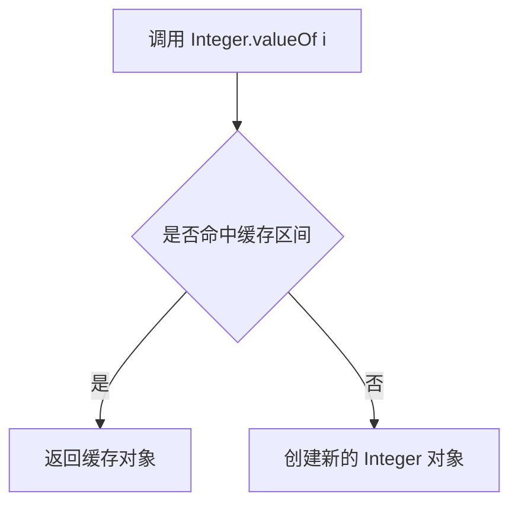
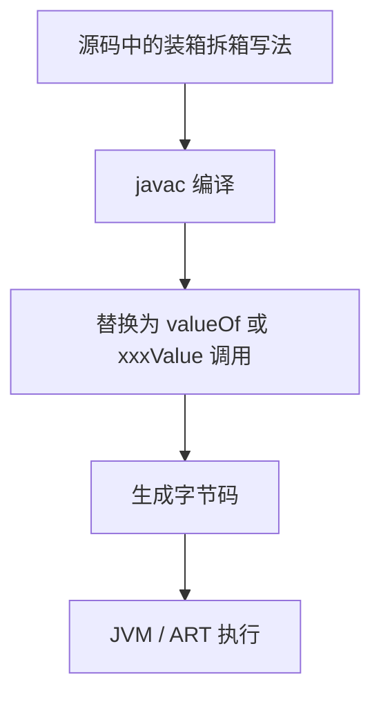
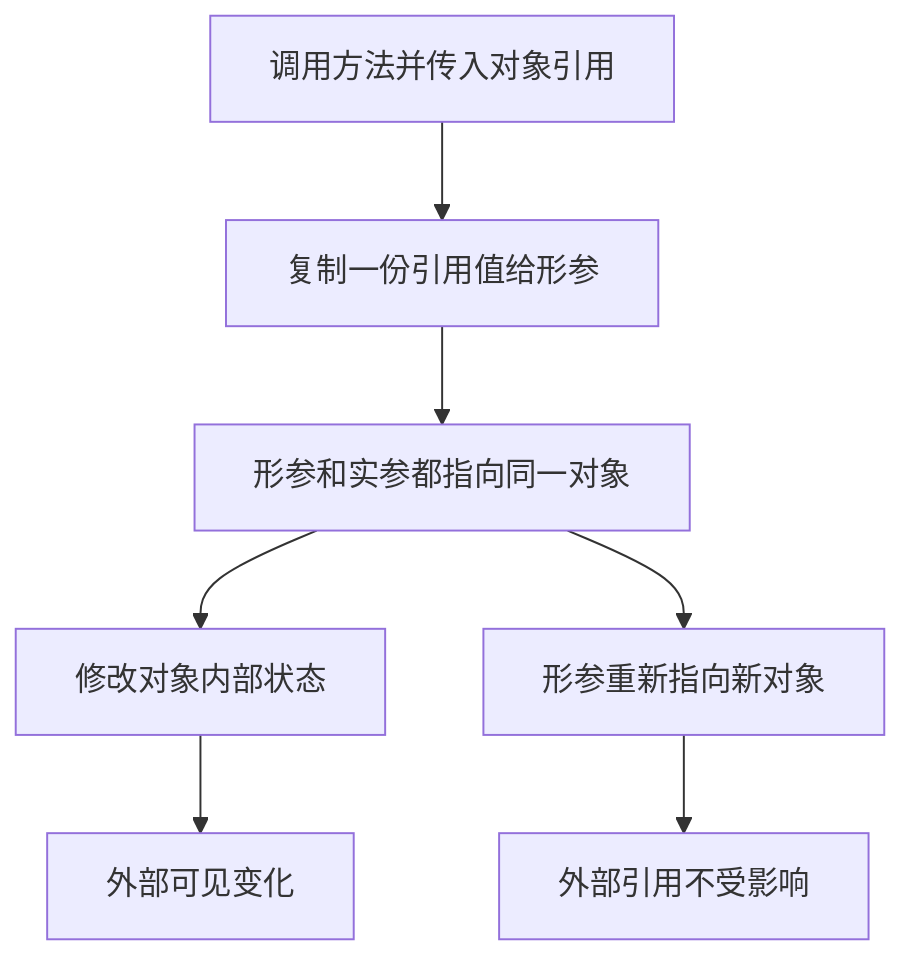

# Java 数据类型源码篇（Android 视角）

> 基础篇解决“是什么”，进阶篇解决“怎么选”，源码篇解决“为什么 Java 要这么设计”。真正理解了这里面的设计取舍，你看 Android 源码、JDK 源码、框架源码时会更通透。

## 一、一句话先说透：Java 数据类型的设计哲学

Java 在数据类型设计上，一直在做三件事的平衡：

1. **执行效率**：基本类型要轻量、直接、适合 CPU 计算
2. **面向对象统一性**：包装类型要让基本值能进入对象体系
3. **工程可用性**：字符串、缓存、自动装箱这些机制要提高开发效率

所以你会看到一个很“拧巴”但也很现实的世界：

- 既有 `int`，又有 `Integer`
- 既强调对象统一，又保留基本类型
- 既提供自动装箱便利，又留下性能代价

这不是设计不干净，而是工程上的折中。

## 二、包装类型为什么不是“语法糖类”，而是完整对象？

### 2.1 先看 `Integer` 的角色

`Integer` 不是编译器临时拼出来的东西，它是标准类库里的正式类。

它至少承担了这些职责：

- 包裹一个 `int` 值
- 提供转换 API
- 提供比较、哈希、字符串化能力
- 进入泛型、集合、反射等对象体系
- 提供缓存机制减少小对象重复创建

### 2.2 典型源码风格（简化理解）

```java
public final class Integer extends Number implements Comparable<Integer> {
    private final int value;

    public int intValue() {
        return value;
    }

    public static Integer valueOf(int i) {
        // 命中缓存就返回缓存对象
        // 否则 new Integer(i)
    }
}
```

### 2.3 设计哲学

为什么 `value` 要是 `final`？

因为包装类型被设计成**不可变对象**。

不可变的好处有：

- 线程安全
- 可缓存
- 可作为哈希结构元素稳定使用
- 语义更简单

这和 `String` 的设计思路是类似的。

## 三、`Integer.valueOf()` 的缓存机制

这是数据类型源码里最经典的一部分。

### 3.1 结论先说

`Integer.valueOf(int)` 不一定每次都创建新对象。

JDK 会缓存一段范围内的整数对象，默认通常是：

- `-128` 到 `127`

### 3.2 为什么要缓存？

因为小整数在程序里出现太频繁了。

比如：

- 状态码
- 索引
- 计数器
- 布尔标志转换

如果每次都 new，一个项目里会平白产生海量重复小对象。

### 3.3 核心思路（简化版）

```java
public static Integer valueOf(int i) {
    if (i >= -128 && i <= 127) {
        return IntegerCache.cache[i + 128];
    }
    return new Integer(i);
}
```

### 3.4 流程图



### 3.5 Android 视角的意义

这也是为什么在 Android / Java 工程里：

- `Integer a = 127; Integer b = 127; a == b` 可能是 `true`
- `Integer a = 128; Integer b = 128; a == b` 可能是 `false`

**但真正重要的结论不是记住这个面试题，而是：不要用 `==` 比较包装类型内容。**

## 四、自动装箱 / 拆箱在字节码层面发生了什么？

### 4.1 源码看起来很简单

```java
Integer a = 10;
int b = a;
```

### 4.2 编译器不会魔法，它只是替你补代码

可以近似理解成：

```java
Integer a = Integer.valueOf(10);
int b = a.intValue();
```

### 4.3 编译流程图



### 4.4 为什么这很重要？

因为只要你知道它最终会变成方法调用，就能明白：

- 装箱不是零成本
- 拆箱不是零风险
- 包装类型为 `null` 时，拆箱就是 `NullPointerException`

### 4.5 Android 里的直接启发

如果你在主线程高频循环、动画计算、布局测量中使用大量包装类型，编译器不会替你“优化掉一切”，很多成本都是真实存在的。

## 五、`String` 为什么必须不可变？

### 5.1 一句话总结

**`String` 不可变，不是为了“优雅”，而是为了缓存、安全、共享和哈希稳定性。**

### 5.2 如果 `String` 可变，会怎样？

假设：

```java
String key = "token";
map.put(key, value);
```

如果 `key` 后续还能原地变成别的内容，那：

- 它的 `hashCode` 会变化
- `HashMap` 的桶位置就不可信了
- 整个哈希结构可能被破坏

### 5.3 设计收益

`String` 不可变带来四个核心收益：

| 收益 | 说明 |
|---|---|
| **线程安全** | 多线程共享字符串不需要额外同步 |
| **字符串池可行** | 相同字面量可以共享 |
| **哈希可缓存** | `hashCode` 可复用 |
| **安全性更高** | 路径、类名、URL、SQL 片段不易被偷偷改写 |

### 5.4 Android 中的真实应用

- `Bundle` key
- `Intent` extra key
- 路由 path
- SharedPreferences key
- 资源名、包名、类名

这些字符串都要求稳定。

## 六、字符串常量池的设计思想

### 6.1 为什么需要池化？

因为字符串重复率极高。

比如：

- `"home"`
- `"token"`
- `"user_id"`
- `"success"`

如果每次都新建完整对象，会浪费内存。

### 6.2 核心思路

字符串字面量进入常量池，相同内容尽可能复用同一份对象。

```java
String a = "abc";
String b = "abc";
System.out.println(a == b); // true
```

因为它们可能都指向常量池中的同一个对象。

### 6.3 Android 视角

移动端内存敏感，像这种“高复用内容共享对象”的思路非常重要。

你会在 Android 里看到很多类似思想：

- View 复用
- Bitmap 复用
- 线程池复用
- 对象池复用

本质都是：**避免重复创建高频对象。**

## 七、数值类型为什么不统一成一个 `Number`？

很多初学者会想：

“既然 Java 是面向对象语言，为什么不把一切都做成对象？干嘛还保留 `int`、`long` 这些基本类型？”

答案非常朴素：**性能。**

### 7.1 如果一切都是对象，会发生什么？

假设 `int` 也变成对象：

- 每次加减乘除都要经过对象访问
- 大量临时对象会被创建
- GC 压力会非常大
- CPU 计算路径更重

这在 90 年代的硬件条件下尤其不可接受。

### 7.2 Java 的折中方案

Java 选择的是“双轨制”：

- 需要高效计算时，用基本类型
- 需要进入对象体系时，用包装类型

虽然不完美，但非常工程化。

### Android 里的意义

在 Android 这种对：

- 内存
- 启动速度
- 主线程性能
- 电量消耗

都极其敏感的平台上，这种设计就更有价值了。

## 八、`boolean` 为什么看起来简单，实际没你想得那么简单？

### 8.1 语言层面很简单

只有：

- `true`
- `false`

### 8.2 但 JVM / 实现层面不要求固定 1 bit 存储

在 Java 语言规范里，`boolean` 的使用语义很明确，但底层存储大小不是按“1 bit”这么直觉化实现的。

这说明一个非常重要的认知：

**语言层抽象 != 物理层真实布局**

同理：

- 你看到的是 `int`
- 底层可能涉及寄存器、栈槽、对象头、对齐填充

### 8.3 Android 的启发

做性能优化时，不能只看“这个字段类型看起来小”，还要看：

- 对象整体布局
- 对齐填充
- 是否引入额外对象
- 是否影响 GC

所以“把 `int` 改成 `byte` 就一定省很多内存”这类说法，很多时候过于天真。

## 九、Java 只有值传递：从虚拟机视角怎么理解？

### 9.1 本质认知

方法调用时，传递给被调方法的是：

- 基本类型的值副本
- 引用类型的引用副本

总之，传递的始终是“一个值”。

### 9.2 为什么很多人误以为对象是引用传递？

因为：

- 你拿到的是同一个对象的引用副本
- 通过这份副本仍然可以修改对象内部状态

例如：

```java
void update(User user) {
    user.name = "A";
}
```

调用后外部对象确实被改了。

但如果你这么写：

```java
void reset(User user) {
    user = new User();
}
```

外部变量并不会指向新的 `User`。

### 9.3 流程图理解



### 9.4 Android 场景

这对理解以下代码特别重要：

- 列表传参后为何会被改
- `Bundle` 里塞对象和取对象的行为
- Adapter 数据源为何会联动变化

## 十、从 Android 框架设计反推 Java 数据类型的重要性

Android 框架很多地方都体现了对数据类型代价的深刻理解。

### 10.1 `SparseIntArray` / `SparseBooleanArray`

为什么不统一一个泛型结构？

因为泛型在 Java 里不能直接持有基本类型，只能走包装类型；而 Android 为了省内存、少装箱，专门提供了这些优化结构。

### 10.2 `Bundle.putInt()` / `putLong()` / `putBoolean()`

为什么不统一 `put(Object)`？

因为：

- 不同类型有不同序列化成本
- 类型越明确，运行时越安全
- 基本类型传递更直接

### 10.3 `Parcel` 的设计

`Parcel` 也大量区分：

- `writeInt`
- `writeLong`
- `writeString`
- `writeParcelable`

本质上也是为了：

- 类型明确
- 序列化高效
- 避免不必要对象包装

## 十一、如果让你自己设计一套类型系统，你能学到什么？

从 Java 的做法里，可以总结出几条非常工程化的经验：

### 11.1 不要迷信“统一抽象”

统一成全对象，看起来很优雅；但性能代价可能过大。

### 11.2 不要迷信“绝对性能”

如果只有基本类型，没有包装类型、字符串池、自动装箱，那开发体验会很差。

### 11.3 真正优秀的设计，往往是折中

Java 数据类型体系的本质就是：

- 用基本类型守住性能底线
- 用包装类型提供对象能力
- 用缓存、常量池、编译器语法糖提升可用性

这非常像 Android 框架自己的设计风格。

## 十二、本篇小结

源码篇最重要的，不是记住几段源码，而是理解这些设计思想：

1. 包装类型是正式对象，不是临时语法糖
2. `Integer.valueOf()` 的缓存，本质是空间与创建成本优化
3. 自动装箱 / 拆箱最终都会落到方法调用
4. `String` 不可变，是为了共享、缓存、哈希稳定和安全性
5. Java 保留基本类型，是为了性能底线
6. Java 只有值传递，这在框架行为分析里非常关键
7. Android 大量 API 设计，其实都在复用这些底层思想

---

## 面试题（源码篇）

### 1. `Integer.valueOf()` 和 `new Integer()` 有什么区别？
**结论**：`valueOf()` 可能复用缓存对象，`new Integer()` 一定创建新对象。

**原理**：`valueOf()` 会优先检查缓存区间，命中则返回已有对象，减少重复创建。

**Android 例子**：在高频状态值、索引值场景里，复用思想和 Android 的对象池、字符串池理念是一致的。

### 2. 自动装箱底层做了什么？
**结论**：编译器会把装箱替换成类似 `Integer.valueOf()`，把拆箱替换成类似 `intValue()`。

**原理**：这不是 JVM 的“黑魔法”，而是编译期语法糖展开。

**Android 例子**：主线程热路径里大量包装类型运算，会真实增加方法调用和潜在对象成本。

### 3. `String` 为什么设计成不可变？
**结论**：为了线程安全、字符串池复用、哈希稳定和安全性。

**原理**：如果字符串内容可变，就无法稳定地作为 `HashMap` key，也不适合做常量池共享。

**Android 例子**：`Bundle` key、路由 path、SharedPreferences key 都依赖字符串稳定性。

### 4. 为什么 Java 不把所有数值都设计成对象？
**结论**：因为那样性能成本太高。

**原理**：对象会带来额外内存开销、间接访问和 GC 成本，无法满足高频数值计算场景。

**Android 例子**：移动端更在意内存和主线程性能，因此保留基本类型的价值更明显。

### 5. 为什么说 Java 只有值传递？
**结论**：因为方法调用时传递的始终是值，只是对象场景传的是“引用的值”。

**原理**：形参拿到的是实参的一个副本；修改对象内容会影响外部，但让形参重新指向新对象不会影响外部引用。

**Android 例子**：把 `MutableList` 传入方法后做 `clear()` 会影响外部列表，但在方法里给参数重新赋新列表，不会改变外部变量指向。
