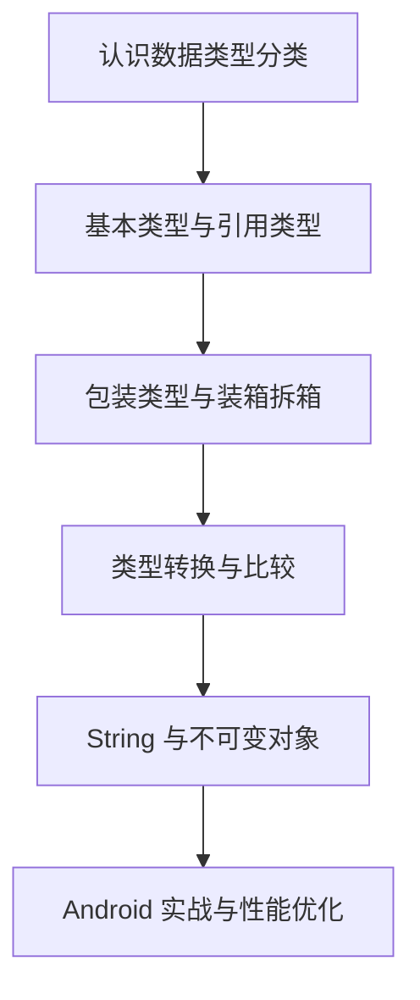

# Java 数据类型（Data Types）

> 从 Android 开发者视角，系统理解 Java 数据类型：为什么要区分基本类型和引用类型、装箱拆箱的代价是什么、它们在 Android 性能优化里到底有什么意义。

## 为什么要学数据类型？

很多人觉得“数据类型很基础，不就是 `int`、`String`、`boolean` 吗？”

但在 Android 开发里，数据类型选得对不对，直接影响：

- **内存占用**：列表、缓存、对象模型会不会膨胀
- **性能开销**：是否频繁触发装箱拆箱、额外对象分配
- **空安全设计**：什么时候可能出现 `NullPointerException`
- **框架理解**：为什么 Android 会提供 `SparseArray`、`Bundle`、`Intent` 这些偏“类型化”的 API

## Android 中的典型应用

| Java 数据类型知识点 | Android 关联场景 | 学了能理解什么 |
|---|---|---|
| **基本类型 vs 引用类型** | RecyclerView 列表数据、状态字段 | 为什么计数、标志位尽量用基本类型 |
| **包装类型** | 泛型、集合、数据库返回值 | 为什么 `List<int>` 不存在，只能用 `List<Integer>` |
| **自动装箱 / 拆箱** | 热路径循环、DiffUtil、统计埋点 | 为什么频繁装箱会带来 GC 压力 |
| **类型转换** | JSON 解析、接口字段映射 | 为什么类型不匹配容易崩溃 |
| **String 与不可变性** | 文案拼接、日志、网络请求参数 | 为什么循环里不要乱拼字符串 |
| **null 与默认值** | Room、Retrofit、Bundle 取值 | 为什么包装类型更适合表示“可能为空” |

## 学习路线

## 核心问题预览

### 基础篇
- Java 有哪些基本数据类型？各自占多少空间？
- 基本类型和引用类型的本质区别是什么？
- `int` 和 `Integer` 到底差在哪？
- 为什么 `==` 比较 `String` 经常出问题？

### 进阶篇
- 自动装箱 / 拆箱会带来什么性能问题？
- 为什么 `Long == Long` 有时 true，有时 false？
- 为什么 Android 里大量场景推荐用 `SparseArray` 而不是 `HashMap<Integer, T>`？
- `StringBuilder`、`StringBuffer`、`String` 该怎么选？

### 源码篇
- 包装类型的缓存机制是怎么做的？
- 自动装箱在字节码层面会变成什么？
- `String` 为什么不可变？这种设计有什么收益？
- Java 的值传递到底是怎么回事？

## 文档导航

| 文档 | 内容 | 适合人群 |
|---|---|---|
| [1-基础篇](./1-基础篇.md) | 基本类型、引用类型、包装类型、类型转换、基础比较规则 | 想把基础概念真正搞懂的开发者 |
| [2-进阶篇](./2-进阶篇.md) | 装箱拆箱、性能开销、字符串、Android 实战经验 | 想避免线上性能坑的开发者 |
| [3-源码篇](./3-源码篇.md) | 包装类缓存、字节码、String 不可变、值传递本质 | 想理解底层设计思路的开发者 |

## 学完后你应该具备的能力

- 能判断什么时候该用基本类型，什么时候该用包装类型
- 能解释自动装箱为何会拖慢热路径代码
- 能看懂 `Bundle`、`Intent`、`SparseArray` 这类 Android API 的设计取舍
- 能在建模、列表、缓存、埋点等场景里做更合理的数据类型选择

---

_开始学习：[1-基础篇](./1-基础篇.md) - 先把“数据类型”这件小事真正学明白 →_
