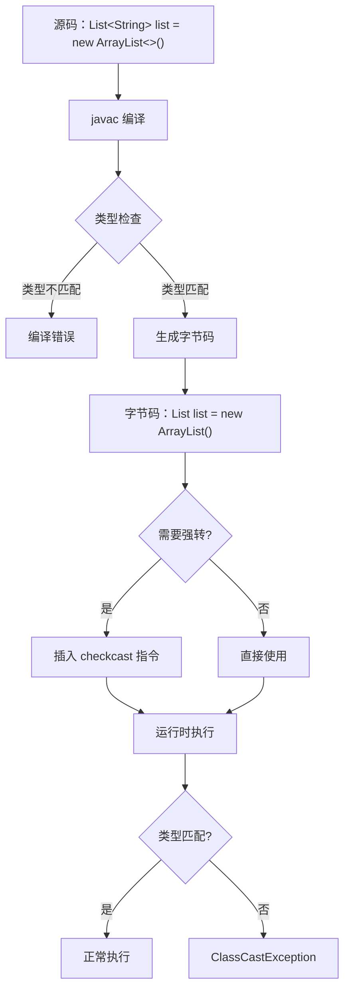
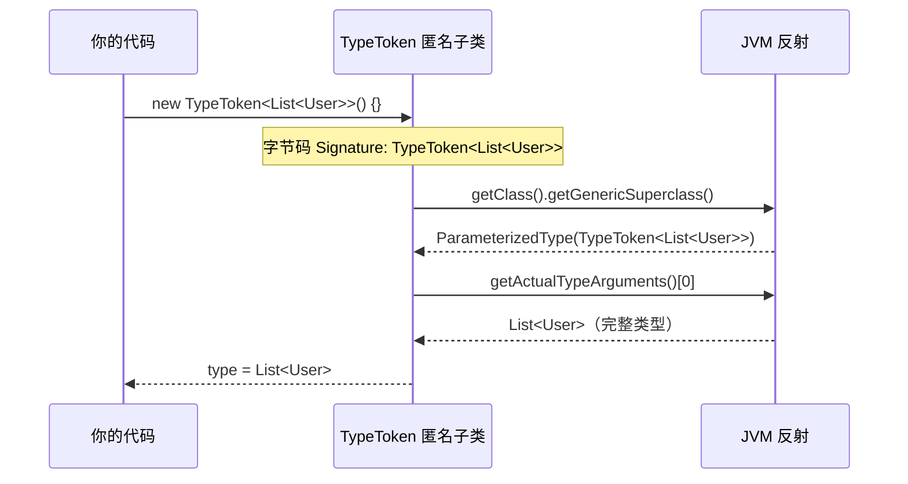
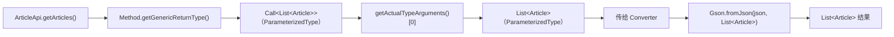

# Java 泛型 — 源码篇

## 一、设计哲学：为什么 Java 选择"假泛型"？

### 历史背景

Java 1.5（2004年）引入泛型时，面临一个两难困境：

> **向后兼容 vs 真正的泛型**

C# 同期引入了"真泛型"（运行时保留类型信息），但 Java 选择了"类型擦除"方案。

**为什么？**

```
Java 1.4 时代已有大量代码：
  List list = new ArrayList();
  list.add("hello");

如果引入真泛型，这些代码全部失效。
Java 的核心价值观：向后兼容，一次编写，到处运行。

所以 Java 选择了"编译期泛型 + 运行时擦除"的折中方案：
  - 新代码：享受编译期类型检查
  - 旧代码：无需修改，照常运行
  - 代价：运行时丢失类型信息
```

**权衡取舍**：

| 方案 | 优点 | 缺点 |
|-----|------|------|
| 类型擦除（Java） | 向后兼容，JVM 无需改动 | 运行时无类型信息，TypeToken 等 hack |
| 真泛型（C#） | 运行时类型安全，性能更好 | 破坏向后兼容 |
| Kotlin reified | 内联函数中可用 | 只限 inline 函数 |

---

## 二、核心流程：类型擦除的完整过程



### 字节码层面的类型擦除

```java
// Java 源码（理解原理用）
public class GenericExample {
    public <T extends View> T findView(int id) {
        return (T) findViewById(id);
    }

    public void use() {
        Button btn = findView(R.id.btn);  // 调用处
    }
}
```

编译后的字节码（伪代码）：

```java
// 擦除后：T extends View → View
public View findView(int id) {
    return (View) findViewById(id);  // 擦除为上界 View
}

public void use() {
    // 编译器在调用处自动插入强转
    Button btn = (Button) findView(R.id.btn);  // checkcast Button
}
```

---

## 三、Gson TypeToken 源码分析

### 一句话总结

TypeToken 利用"匿名内部类的父类泛型信息不会被擦除"这一特性，在运行时保留完整的泛型类型信息。

### 核心源码

```java
// Gson TypeToken.java 核心代码（简化版，约30行）
public class TypeToken<T> {
    private final Type type;

    // protected 构造函数，强制使用匿名内部类
    protected TypeToken() {
        // getClass() 返回匿名子类的 Class 对象
        // getGenericSuperclass() 返回 TypeToken<List<User>>（ParameterizedType）
        this.type = getSuperclassTypeParameter(getClass());
    }

    static Type getSuperclassTypeParameter(Class<?> subclass) {
        // 获取父类的泛型类型：TypeToken<List<User>>
        Type superclass = subclass.getGenericSuperclass();

        if (superclass instanceof Class) {
            // 如果父类不是泛型类（直接 new TypeToken()），报错
            throw new RuntimeException("Missing type parameter.");
        }

        // 强转为 ParameterizedType，获取泛型参数
        ParameterizedType parameterized = (ParameterizedType) superclass;
        // getActualTypeArguments()[0] = List<User>
        return canonicalize(parameterized.getActualTypeArguments()[0]);
    }

    public Type getType() {
        return type;
    }
}
```

### 为什么必须用匿名内部类？

```
// 直接实例化（错误用法）
TypeToken<List<User>> token = new TypeToken<List<User>>();
// token.getClass() = TypeToken.class
// getGenericSuperclass() = Object（TypeToken 的父类）
// 无法获取 List<User>！

// 匿名内部类（正确用法）
TypeToken<List<User>> token = new TypeToken<List<User>>() {};
// token.getClass() = $1.class（匿名子类）
// getGenericSuperclass() = TypeToken<List<User>>（ParameterizedType）
// 可以获取 List<User>！
```

关键在于：**匿名内部类的父类泛型信息被记录在字节码的 `Signature` 属性中，不会被擦除**。



---

## 四、Retrofit 泛型解析源码分析

### 一句话总结

Retrofit 通过 `Method.getGenericReturnType()` 读取接口方法的泛型返回类型，方法签名中的泛型信息不会被擦除。

### 核心流程



### 关键源码

```java
// Retrofit ServiceMethod.java 核心逻辑（简化版）
abstract class ServiceMethod<T> {

    static <T> ServiceMethod<T> parseAnnotations(Retrofit retrofit, Method method) {
        // 1. 获取方法的泛型返回类型（不会擦除！）
        Type returnType = method.getGenericReturnType();
        // returnType = Call<List<Article>>

        // 2. 检查是否有无法解析的类型变量
        if (Utils.hasUnresolvableType(returnType)) {
            throw new IllegalArgumentException("方法返回类型包含无法解析的类型变量");
        }

        // 3. 解析注解，构建 ServiceMethod
        return HttpServiceMethod.parseAnnotations(retrofit, method, returnType);
    }
}

// HttpServiceMethod.java
static <ResponseT, ReturnT> HttpServiceMethod<ResponseT, ReturnT> parseAnnotations(
    Retrofit retrofit, Method method, Type returnType) {

    // 4. 从 Call<List<Article>> 中提取 List<Article>
    // returnType = Call<List<Article>>（ParameterizedType）
    Type responseType = Utils.getParameterUpperBound(0,
        (ParameterizedType) returnType);
    // responseType = List<Article>

    // 5. 找到能处理 List<Article> 的 Converter
    Converter<ResponseBody, ResponseT> responseConverter =
        retrofit.responseBodyConverter(responseType, annotations);
    // Gson Converter 会用 List<Article> 这个完整类型来解析 JSON
}
```

### Android 对照：OkHttp 的类型处理

```kotlin
// OkHttp 不涉及泛型解析，它只处理字节流
// Retrofit 在 OkHttp 之上增加了泛型类型解析层

// 完整调用链
// 你的代码 → Retrofit 动态代理 → 解析泛型返回类型
//          → 创建 OkHttp 请求 → 执行网络请求
//          → 用 Gson Converter 解析响应（传入完整泛型类型）
//          → 返回类型安全的结果
```

---

## 五、Android 框架中的泛型设计

### LiveData 的类型安全设计

```java
// LiveData.java 核心源码（简化版）
public abstract class LiveData<T> {
    private volatile Object mData;

    // 设置值：只接受 T 类型
    @MainThread
    protected void setValue(T value) {
        assertMainThread("setValue");
        mVersion++;
        mData = value;  // 内部存储为 Object（类型擦除）
        dispatchingValue(null);
    }

    // 获取值：强转为 T（编译器插入的 checkcast）
    @Nullable
    public T getValue() {
        Object data = mData;
        if (data != NOT_SET) {
            return (T) data;  // 安全：setValue 保证了类型正确
        }
        return null;
    }

    // 观察：Observer<? super T> 支持逆变
    @MainThread
    public void observe(@NonNull LifecycleOwner owner,
                        @NonNull Observer<? super T> observer) {
        // Observer<? super T>：观察者可以处理 T 或 T 的父类
        // 这样 Observer<Any> 可以观察 LiveData<User>
    }
}
```

**设计亮点**：`Observer<? super T>` 使用下界通配符，让观察者更灵活：

```kotlin
val userLiveData: LiveData<User> = viewModel.user

// Observer<User>：只处理 User
userLiveData.observe(this) { user: User -> showUser(user) }

// Observer<Any>：处理任何类型（更通用的观察者）
userLiveData.observe(this) { any: Any -> log(any.toString()) }
```

### Flow 的协变设计

```kotlin
// Kotlin Flow 源码（简化）
// Flow<out T> 使用 out（协变），Flow<String> 是 Flow<Any> 的子类型
public interface Flow<out T> {
    public suspend fun collect(collector: FlowCollector<T>)
}

// 这样可以：
val stringFlow: Flow<String> = flowOf("a", "b")
val anyFlow: Flow<Any> = stringFlow  // OK，因为 Flow 是协变的

// 实际应用
fun processFlow(flow: Flow<Any>) { /* 处理任何类型的 Flow */ }
processFlow(stringFlow)  // OK
```

---

## 六、延伸思考

**如果让你设计 Gson，你会怎么解决类型擦除问题？**

方案一（现有方案）：TypeToken 匿名内部类
- 优点：纯 Java，无需语言支持
- 缺点：写法繁琐，`new TypeToken<List<User>>() {}.type`

方案二：Kotlin reified + inline
- 优点：写法简洁，`fromJson<List<User>>(json)`
- 缺点：只能在 Kotlin inline 函数中使用

方案三：Moshi 的 KotlinJsonAdapterFactory
- 利用 Kotlin 反射（`KType`）获取更完整的类型信息
- 比 Gson 更好地支持 Kotlin 数据类和 null 安全

```kotlin
// Moshi 的 Kotlin 友好写法
val moshi = Moshi.Builder()
    .addLast(KotlinJsonAdapterFactory())
    .build()

// 使用 reified 扩展函数，无需 TypeToken
inline fun <reified T> Moshi.adapter(): JsonAdapter<T> {
    return adapter(T::class.java)
}

val adapter: JsonAdapter<List<User>> = moshi.adapter()
val users: List<User>? = adapter.fromJson(json)
```

---

## 七、面试检验

**Q1：Java 为什么选择类型擦除而不是真泛型？**

结论：向后兼容。Java 1.5 引入泛型时，已有大量 Java 1.4 代码，类型擦除方案让旧代码无需修改即可与新代码共存。

代价：运行时无法获取泛型类型信息，导致 Gson 需要 TypeToken 这样的 hack。

---

**Q2：TypeToken 的实现原理是什么？**

结论：利用匿名内部类的父类泛型信息不会被擦除，通过 `getGenericSuperclass()` 在运行时获取完整的泛型类型。

关键：`class $1 extends TypeToken<List<User>>` 这个匿名类的父类类型信息被保存在字节码的 `Signature` 属性中，反射可以读取。

---

**Q3：Retrofit 为什么能在运行时知道 `Call<User>` 中的 `User` 类型？**

结论：方法签名中的泛型信息不会被擦除，通过 `Method.getGenericReturnType()` 可以获取完整的泛型返回类型。

原理：类型擦除只擦除"使用处"的泛型，方法签名（声明处）的泛型信息保存在字节码中，反射可以读取。

---

**Q4：LiveData 为什么用 `Observer<? super T>` 而不是 `Observer<T>`？**

结论：使用下界通配符（逆变），让观察者更灵活——`Observer<Any>` 可以观察 `LiveData<User>`。

设计哲学：观察者是"消费者"（消费数据），消费者用 `super`（PECS 原则），这样更通用的观察者也能复用。

---

**Q5：Kotlin 的 `Flow<out T>` 为什么用 `out`？**

结论：Flow 是数据生产者，只产出数据不消费数据，所以用 `out`（协变）。

好处：`Flow<String>` 可以赋值给 `Flow<Any>`，更灵活地组合不同类型的 Flow。

如果用 `in`（逆变），则 `Flow<Any>` 可以赋值给 `Flow<String>`，语义上不合理（一个产出任意类型的流，不应该被当作只产出 String 的流）。
