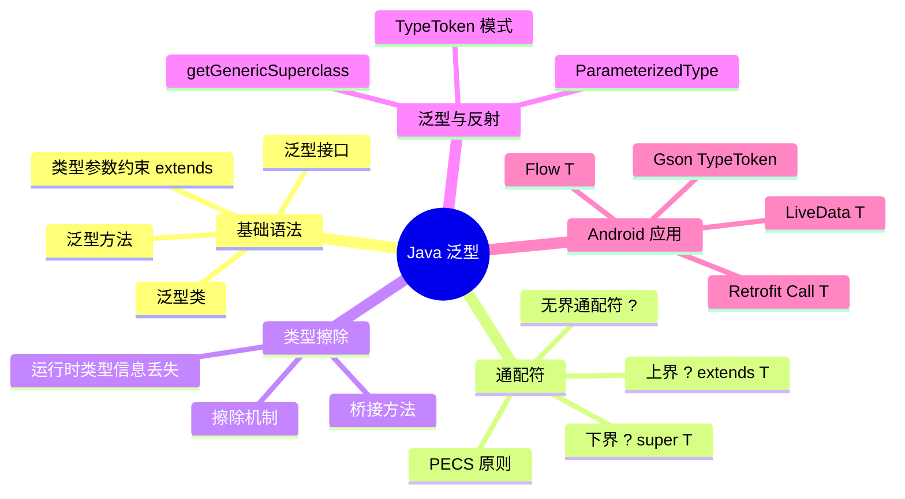

# Java 泛型 — 学习导航

## 为什么 Android 开发者必须懂泛型？

```
学 Java 泛型 → 理解 Gson/Moshi 为什么需要 TypeToken
             → 理解 Retrofit 如何解析 Call<List<User>>
             → 理解 LiveData<T>、Flow<T> 的类型安全设计
             → 避免序列化框架中的类型擦除陷阱
```

## Android 中泛型无处不在

| Android 场景 | 泛型的作用 |
|-------------|-----------|
| `LiveData<User>` | 类型安全的数据持有者 |
| `Flow<List<Article>>` | 类型安全的数据流 |
| `Call<ResponseBody>` | Retrofit 网络请求返回类型 |
| `ListAdapter<T, VH>` | RecyclerView 适配器泛型化 |
| `Gson.fromJson(json, TypeToken<List<User>>(){}.type)` | 绕过类型擦除的经典方案 |
| `MutableStateFlow<UiState>` | ViewModel 状态管理 |

## 核心问题预览

学完本系列，你能回答这些问题：

**基础**
- 泛型是什么？为什么 Java 要在 1.5 才引入泛型？
- 泛型类、泛型方法、泛型接口怎么写？
- 通配符 `?`、`extends`、`super` 分别什么意思？

**进阶**
- 什么是类型擦除？为什么 Gson 需要 `TypeToken`？
- `PECS` 原则是什么？`List<? extends T>` 和 `List<? super T>` 怎么选？
- 泛型与反射如何配合？`ParameterizedType` 怎么用？

**源码**
- Retrofit 如何通过反射获取泛型参数 `Call<User>` 中的 `User`？
- Gson 的 `TypeToken` 为什么要用匿名内部类？
- Android 的 `LiveData<T>` 如何保证类型安全？

## 学习路线

```
README（本文）
  ↓
1-基础篇：泛型语法 + 通配符 + Android 基础应用
  ↓
2-进阶篇：类型擦除 + PECS + 泛型与反射 + Gson/Retrofit 实战
  ↓
3-源码篇：TypeToken 原理 + Retrofit 泛型解析 + 设计哲学
```

## 知识图谱


