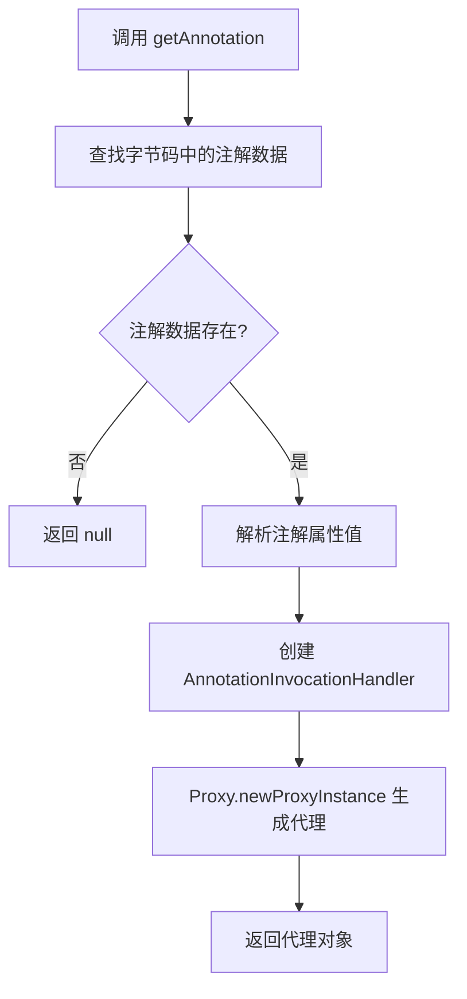

# Java 注解源码篇

> 注解看起来像接口，运行起来是代理——理解这一点，就理解了注解的本质。

## 一、注解的本质：特殊的接口

### 1.1 一句话总结

**注解本质上是继承了 `java.lang.annotation.Annotation` 接口的特殊接口**，运行时通过动态代理生成实现类。

### 1.2 编译后的真相

```java
// 源码
public @interface MyAnnotation {
    String value() default "hello";
}
```

编译后（用 `javap -v MyAnnotation.class` 查看）：

```
public interface MyAnnotation extends java.lang.annotation.Annotation
  minor version: 0
  major version: 61
  flags: (0x2601) ACC_PUBLIC, ACC_INTERFACE, ACC_ABSTRACT, ACC_ANNOTATION
```

**关键发现**：
- `@interface` 被编译成 `interface`
- 自动继承 `java.lang.annotation.Annotation`
- 有特殊标志位 `ACC_ANNOTATION`（0x2000）

```
┌──────────────────────────────────────────────────────────────┐
│                    注解的继承体系                             │
│                                                              │
│                   java.lang.annotation.Annotation            │
│                              △                               │
│                              │ extends                       │
│                              │                               │
│                        @interface MyAnno                     │
│                              △                               │
│                              │ implements (动态代理)          │
│                              │                               │
│                      $Proxy (运行时生成)                      │
└──────────────────────────────────────────────────────────────┘
```

### 1.3 Annotation 接口

```java
package java.lang.annotation;

public interface Annotation {
    // 判断两个注解是否相等（所有属性值都相等）
    boolean equals(Object obj);
    
    // 返回注解的哈希码
    int hashCode();
    
    // 返回注解的字符串表示
    String toString();
    
    // 返回注解的类型（即注解接口的 Class 对象）
    Class<? extends Annotation> annotationType();
}
```

## 二、注解在字节码中的存储

### 2.1 字节码结构概览

```
┌─────────────────────────────────────────────────────────────┐
│                    ClassFile 结构                            │
│                                                             │
│   magic: 0xCAFEBABE                                         │
│   version                                                   │
│   constant_pool                 ◀── 注解信息存储在这里        │
│   access_flags                                              │
│   this_class                                                │
│   super_class                                               │
│   interfaces                                                │
│   fields                        ◀── 字段的注解属性           │
│   methods                       ◀── 方法的注解属性           │
│   attributes                    ◀── 类的注解属性             │
│     └─ RuntimeVisibleAnnotations                            │
│     └─ RuntimeInvisibleAnnotations                          │
└─────────────────────────────────────────────────────────────┘
```

### 2.2 RuntimeVisibleAnnotations 属性

对于 `@Retention(RetentionPolicy.RUNTIME)` 的注解，存储在 `RuntimeVisibleAnnotations` 属性中：

```java
@Info(author = "张三", version = "1.0")
public class Demo {}
```

字节码中的存储结构：

```
RuntimeVisibleAnnotations:
  0: #7()                              // @Info
    author = "张三"                    // element_value
    version = "1.0"                    // element_value
```

**三种注解属性的字节码属性名**：

| RetentionPolicy | 字节码属性 | 运行时可见 |
|-----------------|-----------|-----------|
| RUNTIME | RuntimeVisibleAnnotations | ✅ 是 |
| CLASS | RuntimeInvisibleAnnotations | ❌ 否 |
| SOURCE | 不存储 | ❌ 否 |

### 2.3 使用 javap 查看注解字节码

```bash
# 编译
javac Demo.java

# 查看字节码
javap -v Demo.class
```

输出示例：

```
RuntimeVisibleAnnotations:
  0: #14(#15=s#16,#17=s#18)
    com.example.Info(
      author="张三"
      version="1.0"
    )
```

### 2.4 类型注解的存储（JDK 8+）

JDK 8 引入的类型注解（`TYPE_USE`）存储在特殊的属性中：

| 属性名 | 用途 |
|-------|------|
| `RuntimeVisibleTypeAnnotations` | 运行时可见的类型注解 |
| `RuntimeInvisibleTypeAnnotations` | 运行时不可见的类型注解 |

```java
// 类型注解
List<@NonNull String> list;
```

字节码：
```
RuntimeVisibleTypeAnnotations:
  0: #20(): FIELD, location=[TYPE_ARGUMENT(0)]
    @NonNull
```

## 三、注解的动态代理实现

### 3.1 核心原理

当通过反射获取注解实例时，JVM 返回的是一个**动态代理对象**：

```java
@Info(author = "test")
class Demo {}

// 获取注解
Info info = Demo.class.getAnnotation(Info.class);

// info 不是 Info 接口的普通实现，而是动态代理
System.out.println(info.getClass().getName());
// 输出: com.sun.proxy.$Proxy1
```

### 3.2 代理生成流程



### 3.3 AnnotationInvocationHandler 源码分析

这是注解代理的核心处理器（JDK 内部类）：

```java
// 简化版，展示核心逻辑
class AnnotationInvocationHandler implements InvocationHandler {
    
    private final Class<? extends Annotation> type;  // 注解类型
    private final Map<String, Object> memberValues;  // 属性名 -> 属性值
    
    AnnotationInvocationHandler(Class<? extends Annotation> type,
                               Map<String, Object> memberValues) {
        this.type = type;
        this.memberValues = memberValues;
    }
    
    @Override
    public Object invoke(Object proxy, Method method, Object[] args) {
        String methodName = method.getName();
        
        // 处理 Annotation 接口的方法
        switch (methodName) {
            case "toString":
                return toStringImpl();
            case "hashCode":
                return hashCodeImpl();
            case "equals":
                return equalsImpl(args[0]);
            case "annotationType":
                return type;
        }
        
        // 处理注解属性方法：直接从 map 中取值
        Object result = memberValues.get(methodName);
        
        // 如果是数组，返回克隆（防止修改）
        if (result.getClass().isArray()) {
            return cloneArray(result);
        }
        
        return result;
    }
    
    // equals: 所有属性值都相等
    private boolean equalsImpl(Object other) {
        if (other == this) return true;
        if (!type.isInstance(other)) return false;
        
        for (Method method : type.getDeclaredMethods()) {
            String name = method.getName();
            Object thisValue = memberValues.get(name);
            Object thatValue = method.invoke(other);
            if (!Objects.deepEquals(thisValue, thatValue)) {
                return false;
            }
        }
        return true;
    }
    
    // hashCode: 属性名的hash + 属性值的hash（特殊算法）
    private int hashCodeImpl() {
        int result = 0;
        for (Map.Entry<String, Object> entry : memberValues.entrySet()) {
            result += (127 * entry.getKey().hashCode()) ^ 
                      memberValueHashCode(entry.getValue());
        }
        return result;
    }
}
```

**设计亮点**：

1. **延迟创建**：代理对象在首次 `getAnnotation()` 时才创建
2. **数组防护**：返回数组属性时返回克隆，防止外部修改影响注解
3. **标准化比较**：equals/hashCode 有严格规范，保证同值注解相等

### 3.4 验证代理机制

```java
@Target(ElementType.TYPE)
@Retention(RetentionPolicy.RUNTIME)
@interface Demo {
    String value();
}

@Demo("test")
public class ProxyDemo {
    public static void main(String[] args) {
        Demo annotation = ProxyDemo.class.getAnnotation(Demo.class);
        
        // 1. 查看真实类型
        System.out.println("类型: " + annotation.getClass().getName());
        // 输出: com.sun.proxy.$Proxy1
        
        // 2. 查看实现的接口
        for (Class<?> iface : annotation.getClass().getInterfaces()) {
            System.out.println("实现接口: " + iface.getName());
        }
        // 输出: Demo, java.lang.annotation.Annotation
        
        // 3. 获取 InvocationHandler
        if (Proxy.isProxyClass(annotation.getClass())) {
            InvocationHandler handler = Proxy.getInvocationHandler(annotation);
            System.out.println("Handler: " + handler.getClass().getName());
            // 输出: sun.reflect.annotation.AnnotationInvocationHandler
        }
    }
}
```

## 四、AnnotatedElement 接口设计

### 4.1 接口层次结构

```
                    AnnotatedElement
                          △
        ┌────────────────┼────────────────┐
        │                │                │
     Class          AccessibleObject    Package
        │                │
        │        ┌───────┼───────┐
        │        │       │       │
        │     Field   Method  Constructor
        │
   AnnotatedType (JDK 8+)
```

### 4.2 核心方法的实现原理

```java
// Class.getAnnotation 简化实现
public <A extends Annotation> A getAnnotation(Class<A> annotationClass) {
    // 1. 从缓存中查找
    Map<Class<? extends Annotation>, Annotation> annotations = 
        annotationData().annotations;
    
    // 2. 如果没有，尝试从字节码解析
    if (annotations == null) {
        annotations = parseAnnotations();
    }
    
    // 3. 返回对应注解（已经是代理对象）
    return (A) annotations.get(annotationClass);
}

// 注解缓存结构
private static class AnnotationData {
    final Map<Class<? extends Annotation>, Annotation> annotations;
    final Map<Class<? extends Annotation>, Annotation> declaredAnnotations;
    // ...
}
```

**设计要点**：
- **懒加载**：注解数据在首次访问时才解析
- **缓存**：解析后的注解对象被缓存
- **继承处理**：`getAnnotation()` 包含继承的注解，`getDeclaredAnnotation()` 只包含直接声明的

### 4.3 JDK 8 新增方法

```java
// JDK 8 新增：获取可重复注解的所有实例
<T extends Annotation> T[] getAnnotationsByType(Class<T> annotationClass);

// JDK 8 新增：获取直接声明的指定注解
<T extends Annotation> T getDeclaredAnnotation(Class<T> annotationClass);

// JDK 8 新增：获取直接声明的可重复注解
<T extends Annotation> T[] getDeclaredAnnotationsByType(Class<T> annotationClass);
```

**getAnnotationsByType 的特殊处理**：

```java
// 内部实现逻辑（简化）
public <T extends Annotation> T[] getAnnotationsByType(Class<T> annotationClass) {
    // 1. 先尝试直接获取
    T[] result = getDeclaredAnnotationsByType(annotationClass);
    if (result.length > 0) {
        return result;
    }
    
    // 2. 检查是否是可重复注解
    Repeatable repeatable = annotationClass.getAnnotation(Repeatable.class);
    if (repeatable != null) {
        // 3. 获取容器注解
        Class<? extends Annotation> container = repeatable.value();
        Annotation containerAnno = getAnnotation(container);
        
        if (containerAnno != null) {
            // 4. 从容器中提取
            return (T[]) containerAnno.getClass()
                .getMethod("value").invoke(containerAnno);
        }
    }
    
    return emptyArray();
}
```

## 五、注解属性类型限制的底层原因

### 5.1 常量池的限制

注解属性值存储在 class 文件的常量池中，常量池支持的类型：

| 常量类型 | 对应注解属性类型 |
|---------|----------------|
| CONSTANT_Integer | int, short, byte, char, boolean |
| CONSTANT_Long | long |
| CONSTANT_Float | float |
| CONSTANT_Double | double |
| CONSTANT_Utf8 | String |
| CONSTANT_Class | Class<?> |
| CONSTANT_Enum | 枚举类型 |

### 5.2 为什么不能是任意类型？

```java
// 假设允许任意类型
@interface Config {
    Object value();              // ❌ 无法确定如何序列化
    List<String> items();        // ❌ 集合无法存储在常量池
    User user();                 // ❌ 自定义对象无法序列化为常量
}

// 实际限制
@interface Config {
    String value();              // ✅ 常量池支持
    String[] items();            // ✅ 数组也支持
    Class<? extends User> type(); // ✅ Class 引用支持
}
```

**根本原因**：注解是**编译期元数据**，必须在编译时完全确定，不能依赖运行时对象。

### 5.3 default 值不能是 null 的原因

```java
@interface Config {
    String value() default null;  // ❌ 编译错误
}
```

**原因**：
1. null 不是常量池的合法值
2. 设计上避免歧义："没有设置值" vs "设置为 null"
3. 简化处理逻辑，不需要处理 NullPointerException

**替代方案**：

```java
@interface Config {
    String value() default "";           // 用空字符串代替 null
    String[] tags() default {};          // 用空数组代替 null
    int count() default -1;              // 用特殊值表示"未设置"
}
```

## 六、注解与反射的性能深度分析

### 6.1 首次访问 vs 后续访问

```java
public class PerformanceAnalysis {
    public static void main(String[] args) throws Exception {
        Class<Demo> clazz = Demo.class;
        
        // 首次访问：解析字节码 + 创建代理
        long start1 = System.nanoTime();
        Info info1 = clazz.getAnnotation(Info.class);
        long time1 = System.nanoTime() - start1;
        
        // 后续访问：直接从缓存获取
        long start2 = System.nanoTime();
        Info info2 = clazz.getAnnotation(Info.class);
        long time2 = System.nanoTime() - start2;
        
        System.out.printf("首次访问: %d ns%n", time1);  // 通常 > 100,000 ns
        System.out.printf("后续访问: %d ns%n", time2);  // 通常 < 1,000 ns
        System.out.println("同一对象: " + (info1 == info2));  // true
    }
}
```

### 6.2 性能优化建议

```java
// ❌ 不好：每次都调用 getAnnotation
public void process(Method method) {
    if (method.getAnnotation(Cached.class) != null) {  // 每次都查询
        // ...
    }
}

// ✅ 好：使用 isAnnotationPresent（内部有优化）
public void process(Method method) {
    if (method.isAnnotationPresent(Cached.class)) {  // 只检查是否存在
        Cached cached = method.getAnnotation(Cached.class);
        // ...
    }
}

// ✅ 更好：启动时预扫描并缓存
private final Map<Method, Cached> cachedMethods = new ConcurrentHashMap<>();

@PostConstruct
public void init() {
    for (Method method : targetClass.getDeclaredMethods()) {
        Cached cached = method.getAnnotation(Cached.class);
        if (cached != null) {
            cachedMethods.put(method, cached);
        }
    }
}

public void process(Method method) {
    Cached cached = cachedMethods.get(method);  // O(1) 查找
    if (cached != null) {
        // ...
    }
}
```

## 七、设计哲学与思考

### 7.1 为什么注解是接口而不是类？

| 如果是类 | 如果是接口（实际设计） |
|---------|---------------------|
| 可以有状态 | 无状态，天然不可变 |
| 可以被实例化 | 不能直接实例化 |
| 可以继承 | 不能继承（简化设计） |
| 可能有副作用 | 纯粹的元数据描述 |

**设计意图**：注解只是"描述"，不应该有行为和状态，接口恰好满足这个需求。

### 7.2 为什么选择动态代理？

**替代方案对比**：

| 方案 | 优点 | 缺点 |
|-----|------|------|
| 编译时生成实现类 | 无运行时开销 | 增加 class 文件数量 |
| 直接返回 Map | 简单 | 无类型安全 |
| **动态代理**（实际） | 类型安全、按需创建 | 首次有创建开销 |

### 7.3 注解的限制是设计缺陷吗？

注解的种种限制（不能继承、属性类型受限、不能为 null）实际上是**有意为之**的设计约束：

```
限制带来的好处：
┌─────────────────────────────────────────────────────────┐
│  1. 可预测性：编译期完全确定，无运行时意外                │
│  2. 可序列化：能存储在字节码中，跨 JVM 传递              │
│  3. 简单性：处理逻辑简单，不用考虑复杂情况              │
│  4. 工具友好：IDE、编译器可以完全理解注解              │
└─────────────────────────────────────────────────────────┘
```

### 7.4 如果让你设计，你会怎么做？

**现有设计的权衡**：

```
简单性 ◄──────────────────────► 灵活性
  │                              │
  └──── 注解选择了这边 ─────────┘
```

**一些可能的改进思考**：
1. 支持注解继承？→ 会增加复杂性，现在用组合注解解决
2. 支持更多类型？→ 会打破"编译期确定"的原则
3. 允许修改？→ 违背"元数据不可变"的设计意图

## 八、JDK 版本演进

### 8.1 模块化对注解的影响（JDK 9+）

```java
// JDK 9+ 模块化后，跨模块反射受限
module my.module {
    exports com.example;  // 只导出公开 API
    // 私有类的注解无法被外部读取
}

// 需要显式开放反射访问
module my.module {
    opens com.example to spring.core;  // 允许 spring 反射访问
}
```

### 8.2 记录类与注解（JDK 16+）

```java
// Record 组件可以使用注解
public record User(
    @NotNull String name,       // 注解会传播到字段、getter、构造器参数
    @Min(0) int age
) {}

// 可以用 @Target 控制传播目标
@Target(ElementType.RECORD_COMPONENT)  // 只在 Record 组件上
@interface RecordOnly {}
```

### 8.3 密封类与注解（JDK 17+）

```java
// 密封类可以正常使用注解
@Sealed
public sealed class Shape permits Circle, Rectangle {}

@Final
public final class Circle extends Shape {}
```

## 九、面试检验

### Q1：注解的本质是什么？运行时注解对象是如何创建的？

**答案**：
- **本质**：注解是继承了 `Annotation` 接口的特殊接口
- **创建方式**：通过 **JDK 动态代理** 创建
  - 调用 `getAnnotation()` 时，JVM 解析字节码中的注解数据
  - 创建 `AnnotationInvocationHandler`，其中 Map 存储属性名→值
  - 使用 `Proxy.newProxyInstance()` 生成代理对象
  - 代理对象实现了注解接口，调用属性方法时从 Map 中取值

### Q2：注解信息存储在字节码的什么位置？

**答案**：
存储在 ClassFile 的 `attributes` 属性表中：
- `RuntimeVisibleAnnotations`：RUNTIME 保留策略的注解
- `RuntimeInvisibleAnnotations`：CLASS 保留策略的注解
- `RuntimeVisibleTypeAnnotations`：JDK 8 类型注解
- 字段、方法也有各自的 `RuntimeVisibleAnnotations` 属性

SOURCE 保留策略的注解**不会**存储在字节码中。

### Q3：为什么注解的属性不能是任意类型？

**答案**：
因为注解属性值必须存储在 class 文件的**常量池**中，常量池只支持：
- 基本类型字面量
- String
- Class 引用
- 枚举常量
- 其他注解
- 以上类型的数组

这些都是**编译期可确定的常量值**。自定义对象、集合等无法表示为常量。

### Q4：getAnnotation 的性能如何？如何优化？

**答案**：
- **首次调用**：需要解析字节码 + 创建代理，相对较慢（微秒级）
- **后续调用**：直接返回缓存的代理对象，非常快（纳秒级）

**优化策略**：
1. 使用 `isAnnotationPresent()` 先判断是否存在
2. 启动时预扫描，将注解信息缓存到 Map
3. 对于极端性能要求，用 APT 在编译时处理

### Q5：为什么注解不能继承？如何实现类似继承的效果？

**答案**：

**不能继承的原因**：
- 简化设计：避免注解层次结构带来的复杂性
- 保持一致性：每个注解独立，语义清晰

**替代方案——组合注解**：
```java
@Target(ElementType.TYPE)
@Retention(RetentionPolicy.RUNTIME)
@Component           // 包含 @Component 的语义
@Transactional       // 包含 @Transactional 的语义
public @interface TransactionalComponent {
    // 组合多个注解的功能
}
```

Spring 大量使用这种模式（`@RestController` = `@Controller` + `@ResponseBody`）。

---
_至此，Java 注解三篇完结。建议结合 [反射](../反射/README.md) 一起学习，加深理解。_
