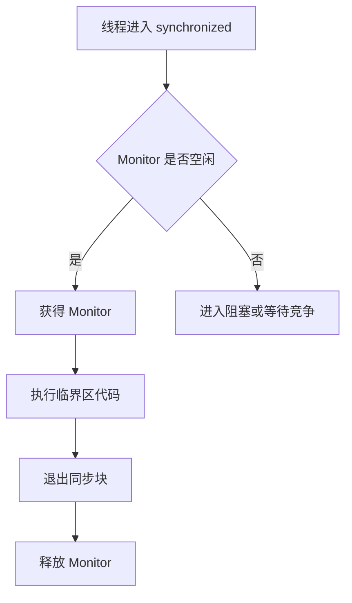

# 锁（Lock）

> **目标**：用 Android 开发者视角，一次性讲清楚 Java 里的锁到底是什么、为什么需要锁、有哪些常见类型、Android 里会遇到哪些锁，以及最佳使用方式。

## 一、为什么要有锁？

### 1.1 先说结论

**只要多个线程会同时读写同一份可变数据，就可能出问题。锁的本质，就是给共享资源立规矩。**

你可以把锁理解成“会议室钥匙”：

```text
没有锁：
两个人同时进会议室改白板
你改一句，我改一句
最后白板内容乱了

有锁：
先拿到钥匙的人进去改
另一个人先在门口等
改完还钥匙，下一个再进
```

在 Android 里，这个问题特别常见：

- 图片缓存同时被多个线程读写
- 本地缓存、内存缓存、数据库缓存并发更新
- Retrofit 回调、Room、协程、线程池同时操作同一份状态
- 启动阶段多个任务并发初始化同一个单例

### 1.2 不加锁会发生什么？

最经典的问题叫：**竞态条件（Race Condition）**。

```kotlin
class Counter {
    var count = 0

    fun increment() {
        count++
    }
}
```

`count++` 看起来只有一行，但底层不是“原子操作”，它大致分三步：

1. 读取 `count`
2. 加 `1`
3. 写回 `count`

如果两个线程同时执行，可能出现这种情况：

```text
线程A 读取 count = 0
线程B 读取 count = 0
线程A 写回 1
线程B 写回 1

结果本来应该是 2，最后却变成了 1
```

这就是并发里的“数据被覆盖”问题。

### 1.3 锁到底解决了什么问题？

锁主要解决三件事：

| 问题 | 大白话解释 | 锁能做什么 |
|-----|-----------|-----------|
| **原子性** | 一组操作不能只做一半 | 保证临界区代码一次只让一个线程执行 |
| **可见性** | 一个线程改了值，另一个线程看不见 | 解锁前的修改，对后续拿到锁的线程可见 |
| **有序性** | 多线程下执行顺序可能和你想的不一样 | 通过同步规则限制重排序 |

这里的关键词是 **临界区（Critical Section）**，也就是“访问共享资源的那段代码”。

## 二、什么是锁？

### 2.1 专业定义

锁是并发编程中的一种**同步机制**，用于控制多个线程对共享资源的访问顺序，避免数据竞争、状态不一致和可见性问题。

### 2.2 通俗理解

锁不是“让程序变快”的工具，而是“让程序别乱”的工具。

很多人一开始以为锁是性能优化手段，其实恰好相反：

- **加锁通常会让并发度下降**
- 但它能换来**正确性**

所以锁的设计哲学一直都是一句话：

> **先保证正确，再谈性能。**

### 2.3 锁的副作用

锁不是免费的，它会带来成本：

- 线程等待，降低吞吐量
- 可能发生死锁
- 可能发生锁竞争
- 可能导致主线程卡顿，严重时引发 ANR

所以真正成熟的并发思维不是“哪里都加锁”，而是：

**能不共享就不共享，必须共享时才加锁。**

## 三、Java 里有哪些锁？

Java 的锁很多，最容易乱的地方就是“分类维度混在一起”。你可以按下面几个维度理解。

### 3.1 按实现方式分

| 类型 | 代表 | 说明 | Android 场景 |
|-----|------|------|-------------|
| **内置锁** | `synchronized` | JVM 原生支持，语法简单 | 保护单例、缓存、状态对象 |
| **显式锁** | `ReentrantLock` | JUC 提供，能力更强 | 需要可中断、超时、公平策略时 |
| **读写锁** | `ReentrantReadWriteLock` | 读共享、写互斥 | 配置中心、内存缓存 |
| **戳锁** | `StampedLock` | 支持乐观读 | 读多写少的数据结构 |

### 3.2 按竞争策略分

| 类型 | 核心思想 | 代表 |
|-----|---------|------|
| **悲观锁** | 先假设别人会抢，先锁住再操作 | `synchronized`、`ReentrantLock` |
| **乐观锁** | 先假设冲突少，提交时再检查 | CAS、`AtomicInteger`、`StampedLock` 乐观读 |

### 3.3 按是否能重复进入分

| 类型 | 说明 | 代表 |
|-----|------|------|
| **可重入锁** | 同一个线程拿到锁后还能再次进入 | `synchronized`、`ReentrantLock` |
| **不可重入锁** | 同一个线程再次进入会把自己卡住 | 自定义错误锁实现常见 |

**为什么可重入很重要？**

```kotlin
class UserManager {
    @Synchronized
    fun updateProfile() {
        saveToMemory()
    }

    @Synchronized
    fun saveToMemory() {
        // 如果锁不可重入，这里会把自己锁死
    }
}
```

### 3.4 按是否公平分

| 类型 | 说明 | 代表 |
|-----|------|------|
| **公平锁** | 先来先服务，排队拿锁 | `ReentrantLock(true)` |
| **非公平锁** | 允许插队，吞吐量通常更高 | `synchronized`、默认 `ReentrantLock` |

**经验上：默认优先非公平锁。**

原因很简单：公平更“讲秩序”，但通常更慢。

### 3.5 按线程状态分

| 类型 | 说明 | 代表 |
|-----|------|------|
| **阻塞锁** | 拿不到锁就挂起线程 | `synchronized`、`ReentrantLock` |
| **自旋锁** | 拿不到锁先空转尝试 | CAS、自旋优化后的轻量级锁 |

自旋适合“锁持有时间非常短”的场景。  
如果持锁时间长，自旋就像原地空跑，CPU 会白白浪费。

### 3.6 按访问模式分

| 类型 | 说明 | 代表 |
|-----|------|------|
| **独占锁** | 同一时刻只允许一个线程访问 | `synchronized`、写锁 |
| **共享锁** | 同一时刻允许多个线程一起读 | 读锁 |

## 四、最常用的几把锁

### 4.1 `synchronized`

这是 Java 最经典的锁，也是 Android 源码里大量存在的锁。

### 它有什么特点？

- 写法简单，语法级支持
- 自动加锁、自动释放锁
- 可重入
- 既能锁代码块，也能锁方法
- 拿不到锁时线程会阻塞

### Android 场景示例

```kotlin
class MemoryCache {
    private val cache = mutableMapOf<String, Bitmap>()

    fun put(key: String, bitmap: Bitmap) {
        synchronized(cache) {
            cache[key] = bitmap
        }
    }

    fun get(key: String): Bitmap? {
        synchronized(cache) {
            return cache[key]
        }
    }
}
```

### 它适合什么场景？

- 逻辑简单
- 锁范围明确
- 不需要超时、中断、公平队列
- 团队更看重可读性

### 常见坑

```kotlin
class BadLock {
    private val lock = "LOCK"

    fun doWork() {
        synchronized(lock) {
            // 不要锁 String 常量
            // 常量池可能导致意外共享同一把锁
        }
    }
}
```

**不要锁这些对象：**

- `String` 常量
- `Integer`、`Boolean` 这类装箱对象
- `this`（除非你非常确定外部不会也拿它做锁）
- 暴露给外部的 public 对象

更稳妥的写法是：

```kotlin
class SafeLock {
    private val lock = Any()

    fun doWork() {
        synchronized(lock) {
            // 只在类内部使用的私有锁对象
        }
    }
}
```

### 4.2 `ReentrantLock`

如果说 `synchronized` 是“自动挡”，那 `ReentrantLock` 就是“手动挡”。

它更灵活，但也更容易出错。

### 它比 `synchronized` 强在哪？

- 可以 `tryLock()`，拿不到就放弃
- 可以 `lockInterruptibly()`，支持中断等待
- 可以指定公平锁
- 可以配合 `Condition` 做更灵活的等待/唤醒

### Android 场景示例

```kotlin
class DownloadQueue {
    private val lock = ReentrantLock()
    private val tasks = ArrayDeque<String>()

    fun addTask(taskId: String) {
        lock.lock()
        try {
            tasks.addLast(taskId)
        } finally {
            lock.unlock()
        }
    }

    fun pollTask(): String? {
        return if (lock.tryLock()) {
            try {
                tasks.removeFirstOrNull()
            } finally {
                lock.unlock()
            }
        } else {
            null
        }
    }
}
```

### 最大的坑：忘记释放锁

```kotlin
val lock = ReentrantLock()

lock.lock()
try {
    // 临界区代码
} finally {
    lock.unlock()
}
```

**无论多简单，`unlock()` 都要放 `finally`。**

### 4.3 `ReentrantReadWriteLock`

这把锁适合 **读多写少** 的场景。

思路很像图书馆：

- 读书的人可以同时进来
- 但有人要改书时，必须独占

### 什么时候值得用？

- 大量读操作
- 少量写操作
- 数据结构在内存中长期存在

### Android 场景示例

```kotlin
class ArticleCache {
    private val cache = mutableMapOf<String, Article>()
    private val lock = ReentrantReadWriteLock()

    fun get(id: String): Article? {
        lock.readLock().lock()
        return try {
            cache[id]
        } finally {
            lock.readLock().unlock()
        }
    }

    fun put(article: Article) {
        lock.writeLock().lock()
        try {
            cache[article.id] = article
        } finally {
            lock.writeLock().unlock()
        }
    }
}
```

### 什么时候别用？

- 写操作很多
- 数据量很小
- 锁竞争本身并不明显

因为读写锁不是“高级就一定更快”，它本身也有维护成本。

### 4.4 `StampedLock`

这是更偏“性能工程”的锁，适合读特别多、写特别少的场景。

它最有名的是 **乐观读**：

1. 先不真正加读锁
2. 先读数据
3. 再检查读期间有没有写发生
4. 如果数据可能被改过，再回退到悲观读

它的思路很聪明，但复杂度也更高。

### 结论

- 会用就很好，不会用也完全正常
- 普通 Android 业务开发里出现频率不高
- 更适合底层组件、缓存框架、性能敏感模块

## 五、`synchronized` 和 `ReentrantLock` 怎么选？

| 维度 | `synchronized` | `ReentrantLock` |
|-----|----------------|-----------------|
| 易用性 | 高 | 中 |
| 出错概率 | 低 | 较高，容易忘记释放 |
| 超时尝试 | 不支持 | 支持 `tryLock()` |
| 可中断等待 | 不支持 | 支持 |
| 公平策略 | 不支持 | 支持 |
| 条件变量 | `wait/notify` | `Condition` |
| 推荐场景 | 简单同步 | 复杂同步控制 |

**我的建议很直接：**

- 能用 `synchronized` 解决，就先别上 `ReentrantLock`
- 只有当你明确需要“超时、中断、公平、多个条件队列”时，再考虑 `ReentrantLock`

## 六、锁在 Android 中到底有什么用？

很多人学锁时，脑子里只有面试题，但真正写 Android 时，锁通常出现在下面这些地方。

### 6.1 内存缓存保护

- LruCache 外层并发保护
- 图片加载框架的内存索引
- 内存中的用户信息、配置、会话状态

### 6.2 单例初始化

```kotlin
class Repository private constructor() {
    companion object {
        @Volatile
        private var instance: Repository? = null

        fun get(): Repository {
            return instance ?: synchronized(this) {
                instance ?: Repository().also { instance = it }
            }
        }
    }
}
```

这里就是经典的 **DCL（Double Check Locking）双重检查锁**。

重点有两个：

- `synchronized` 保证初始化过程互斥
- `@Volatile` 防止指令重排

### 6.3 启动阶段并发初始化

App 冷启动时，多个初始化任务一起跑很常见：

- 日志系统初始化
- 网络模块初始化
- 数据库预热
- 配置拉取

如果多个任务会改同一份状态，没有同步保护，就可能出现“初始化两次”或者“状态覆盖”。

### 6.4 主线程与后台线程共享状态

比如：

- 主线程展示列表
- 后台线程刷新列表数据
- 回调一回来就改同一个集合

这时如果同步没做好，就可能出现：

- `ConcurrentModificationException`
- UI 展示错乱
- 数据时新时旧

### 6.5 Android 框架和系统里的“锁”

这里要特别区分两类概念。

#### 第一类：并发锁

它们解决的是**线程安全问题**：

- `synchronized`
- `ReentrantLock`
- `ReadWriteLock`
- `Semaphore`
- `Atomic*` / CAS
- 协程里的 `Mutex`

#### 第二类：系统资源锁

它们不一定是并发意义上的“互斥锁”，但 Android 里也经常叫“锁”：

| 名称 | 作用 | 是否是线程互斥锁 |
|-----|------|----------------|
| `WakeLock` | 让 CPU/屏幕保持唤醒 | 否 |
| `FileLock` | 锁文件，避免多进程/多线程同时写文件 | 部分算 |
| SQLite 事务锁 | 保证数据库一致性 | 更偏数据层锁 |

最典型的是 `WakeLock`。

```kotlin
class SyncWorker(
    context: Context,
    params: WorkerParameters
) : CoroutineWorker(context, params) {

    override suspend fun doWork(): Result {
        val powerManager = applicationContext
            .getSystemService(Context.POWER_SERVICE) as PowerManager
        val wakeLock = powerManager.newWakeLock(
            PowerManager.PARTIAL_WAKE_LOCK,
            "app:sync"
        )

        wakeLock.acquire(10 * 60 * 1000L)
        return try {
            syncData()
            Result.success()
        } finally {
            if (wakeLock.isHeld) wakeLock.release()
        }
    }
}
```

注意：`WakeLock` 的“锁”，锁住的是 **设备休眠状态**，不是线程临界区。

## 七、现代 Android 开发，锁还重要吗？

重要，但你要知道它已经不是第一选择了。

现在 Android 更推荐这些思路：

### 7.1 优先减少共享状态

比起“给共享变量加锁”，更推荐：

- 不可变对象
- 单线程串行处理
- 状态收敛到 `ViewModel`
- Repository 内部封装并发细节

### 7.2 优先使用协程语义

在协程世界里，很多场景更适合用 `Mutex`：

```kotlin
class TokenRepository {
    private val mutex = Mutex()
    private var token: String? = null

    suspend fun refreshTokenIfNeeded(): String {
        mutex.withLock {
            if (token == null) {
                token = requestNewToken()
            }
            return token!!
        }
    }
}
```

为什么这里不用 `ReentrantLock`？

- 这是挂起函数场景
- `Mutex` 更符合协程调度模型
- 不会像阻塞锁那样直接卡线程

### 7.3 有些场景根本不该用锁

比如 UI 层：

- 主线程上的状态，天然是单线程模型
- 能切回主线程更新，就别让多个线程一起改 UI 数据

所以很多时候，**调度线程** 比 **给代码加锁** 更重要。

## 八、锁的最佳实践

### 8.1 先选策略，再选锁

推荐优先级：

1. 不共享数据
2. 不可变对象
3. 单线程串行化
4. 原子类 / CAS
5. `synchronized`
6. `ReentrantLock` / 读写锁

也就是说，**锁应该是中后位方案，不是第一反应。**

### 8.2 缩小锁范围

```kotlin
class BadRepository {
    private val lock = Any()

    fun refresh() {
        synchronized(lock) {
            val remote = api.fetchArticles() // 不要在锁里做耗时 IO
            cache.clear()
            cache.putAll(remote.associateBy { it.id })
        }
    }
}
```

上面这段很危险，因为网络请求期间别人全都得等。

更合理的是：

```kotlin
class GoodRepository {
    private val lock = Any()
    private val cache = mutableMapOf<String, Article>()

    suspend fun refresh() {
        val remote = api.fetchArticles()
        synchronized(lock) {
            cache.clear()
            cache.putAll(remote.associateBy { it.id })
        }
    }
}
```

**耗时操作放锁外，状态修改放锁内。**

### 8.3 永远固定加锁顺序

如果两个线程拿锁顺序相反，就可能死锁：

```text
线程A：先拿锁1，再等锁2
线程B：先拿锁2，再等锁1
结果：两边永远互相等
```

解决思路只有一个：

**团队内统一约定锁顺序。**

### 8.4 不要在主线程持有重锁

Android 最大的现实问题不是“锁理论不优雅”，而是：

**主线程一旦因为锁等待太久，用户就会看到卡顿，严重时直接 ANR。**

尤其不要在主线程里做这些事：

- 等待后台线程释放锁
- 在锁里做数据库操作
- 在锁里做网络请求
- 在锁里做大对象解析

### 8.5 `ReentrantLock` 必须配 `try/finally`

这是规矩，不是建议。

```kotlin
lock.lock()
try {
    updateState()
} finally {
    lock.unlock()
}
```

### 8.6 能用原子类时，不要硬上重锁

比如计数器、状态位、开关量：

```kotlin
class UploadTracker {
    private val count = AtomicInteger(0)

    fun onUploadStart() {
        count.incrementAndGet()
    }

    fun onUploadEnd() {
        count.decrementAndGet()
    }
}
```

这类场景用 `AtomicInteger` 往往比整段加锁更轻。

## 九、常见错误

### 9.1 把锁当银弹

一看到线程安全问题，就先疯狂加锁。  
结果往往是：

- 性能下降
- 代码复杂度上升
- 死锁风险上升

### 9.2 锁住了不该锁的对象

比如：

- `this`
- 字符串常量
- 对外暴露的集合对象

### 9.3 锁里做耗时操作

这是 Android 项目里最常见的卡顿来源之一。

### 9.4 忘记区分“线程锁”和“资源锁”

`WakeLock`、数据库锁、文件锁，和 `synchronized` 根本不是一回事。  
一个锁的是执行顺序，一个锁的是系统资源。

### 9.5 误以为 `volatile` 可以替代锁

`volatile` 只能保证：

- 可见性
- 一定程度的有序性

但**不能保证复合操作的原子性**，所以它不能替代真正的互斥锁。

## 十、源码视角：锁底层大概怎么工作？

### 10.1 `synchronized`

底层依赖 JVM 的 **Monitor（监视器）** 机制。

你可以把它理解成：

- 每个对象都可能关联一把监视器锁
- 进入同步块时尝试拿锁
- 退出同步块时释放锁



### 10.2 `ReentrantLock`

底层核心是 **AQS（AbstractQueuedSynchronizer）**。

AQS 可以理解成一个“排队等锁”的框架：

- 抢到锁的线程继续执行
- 抢不到的线程进入队列
- 前一个线程释放锁时，唤醒后继线程

这也是为什么很多 JUC 并发工具都建立在 AQS 上：

- `ReentrantLock`
- `CountDownLatch`
- `Semaphore`
- `ReentrantReadWriteLock`

## 十一、选型建议

| 场景 | 推荐方案 | 原因 |
|-----|----------|------|
| 简单互斥 | `synchronized` | 简单可靠 |
| 需要超时/中断 | `ReentrantLock` | 能 `tryLock()`、可中断 |
| 读多写少缓存 | `ReentrantReadWriteLock` | 提升并发读能力 |
| 简单计数/状态位 | `Atomic*` | 更轻量 |
| 协程共享状态 | `Mutex` | 更符合挂起模型 |
| 防止设备休眠 | `WakeLock` | 锁的是系统电源状态 |

## 十二、面试检验

### 1. 为什么需要锁？

**结论**：因为多线程访问共享可变数据时会产生竞态条件。  
**原理**：锁通过互斥访问临界区，保证原子性、可见性和一定的有序性。  
**Android 例子**：图片缓存、单例初始化、启动任务并发更新状态，都需要同步保护。

### 2. `synchronized` 和 `ReentrantLock` 有什么区别？

**结论**：`synchronized` 更简单，`ReentrantLock` 更灵活。  
**原理**：后者支持超时获取、可中断、公平锁、多个条件队列；前者是 JVM 原生监视器锁。  
**Android 例子**：普通缓存保护用 `synchronized` 就够了；下载调度、复杂队列控制更适合 `ReentrantLock`。

### 3. 什么是可重入锁？

**结论**：同一线程拿到锁后可以再次进入同一把锁。  
**原理**：锁内部会记录持有线程和重入次数。  
**Android 例子**：一个同步方法内部再调用另一个同步方法时，如果不可重入，就可能把自己锁死。

### 4. `volatile` 能替代锁吗？

**结论**：不能。  
**原理**：`volatile` 只能保证可见性，不能保证 `count++` 这类复合操作的原子性。  
**Android 例子**：双重检查单例里，`volatile` 负责禁止重排序，但初始化过程仍需要 `synchronized`。

### 5. Android 中的 `WakeLock` 和 Java 锁是一回事吗？

**结论**：不是一回事。  
**原理**：Java 锁控制的是线程访问顺序，`WakeLock` 控制的是设备电源状态。  
**Android 例子**：前台同步任务为了防止 CPU 休眠可以申请 `WakeLock`，但这并不能解决缓存并发读写问题。

## 十三、总结

记住三句话就够了：

1. **锁是为了解决共享可变状态的并发正确性问题。**
2. **先减少共享，再谈加锁；能简单就别复杂。**
3. **在 Android 里，最危险的不是不会加锁，而是在主线程上乱加锁。**

如果你把这篇内容真正吃透，后面再去看这些知识点会顺很多：

- AQS
- CAS 与原子类
- 线程池拒绝策略
- Handler/Looper 的线程模型
- Kotlin 协程里的 `Mutex`

---

_本文档将持续更新，后续可以继续扩展为：基础篇 / 进阶篇 / 源码篇_
