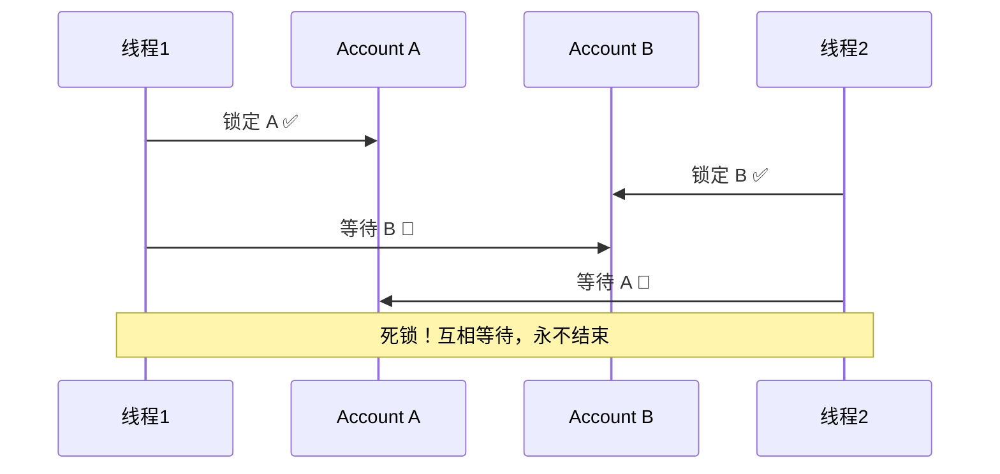

# 锁进阶篇

> **目标**：掌握读写锁、死锁、并发工具类等进阶场景，理解现代 Android 开发中锁与协程的配合方式，能在复杂并发场景中做出正确决策。

## 一、ReentrantReadWriteLock 深度解析

### 1.1 为什么读写锁值得单独讲？

基础篇里的锁有一个共同点：**无论读还是写，同一时刻只有一个线程能进入临界区**。

但现实中有很多场景是：**读操作远多于写操作**。比如：

- 内存里的文章缓存：每秒被读取上百次，偶尔才刷新一次
- 用户配置信息：启动时写一次，之后一直读
- 路由表、策略配置：几乎只读，偶尔热更新

对这类场景用 `synchronized` 全锁住，相当于：

```text
图书馆里所有人都得排队
不管你是去读书（不影响别人）
还是去改书（真的需要独占）

读书的人完全可以同时进去！
```

读写锁的核心思路：

- **读-读**：可以并发，互不干扰
- **读-写**：互斥，写的时候不允许读
- **写-写**：互斥，同一时刻只有一个写

### 1.2 基本用法

```kotlin
// Android 场景：内存文章缓存，读多写少
class ArticleMemoryCache {
    private val cache = mutableMapOf<String, Article>()
    private val lock = ReentrantReadWriteLock()
    // 读锁：多个线程可以同时持有
    private val readLock = lock.readLock()
    // 写锁：独占，持有时读锁全部阻塞
    private val writeLock = lock.writeLock()

    fun get(id: String): Article? {
        readLock.lock()
        return try {
            cache[id]
        } finally {
            readLock.unlock()
        }
    }

    fun put(article: Article) {
        writeLock.lock()
        try {
            cache[article.id] = article
        } finally {
            writeLock.unlock()
        }
    }

    fun putAll(articles: List<Article>) {
        writeLock.lock()
        try {
            // 批量写：只需要一次写锁，比循环调用 put 开销小
            articles.forEach { cache[it.id] = it }
        } finally {
            writeLock.unlock()
        }
    }

    fun invalidate(id: String) {
        writeLock.lock()
        try {
            cache.remove(id)
        } finally {
            writeLock.unlock()
        }
    }
}

data class Article(val id: String, val title: String, val content: String)
```

### 1.3 锁升级与降级

读写锁有一个很多人不知道的规则：

**允许锁降级（写锁 → 读锁），不允许锁升级（读锁 → 写锁）。**

```kotlin
class CacheWithRefresh {
    private val cache = mutableMapOf<String, Article>()
    private val lock = ReentrantReadWriteLock()

    // ✅ 锁降级：先拿写锁写数据，降级到读锁再读，保证读到自己刚写的值
    fun refreshAndGet(id: String, fetcher: () -> Article): Article {
        val writeLock = lock.writeLock()
        val readLock = lock.readLock()

        writeLock.lock()
        try {
            val article = fetcher()
            cache[id] = article

            // 在释放写锁之前，先拿读锁（锁降级的关键步骤）
            readLock.lock()
        } finally {
            // 释放写锁，此时仍持有读锁
            writeLock.unlock()
        }

        // 现在持有读锁：可以安全地读，且保证读到自己刚写的值
        return try {
            cache[id]!!
        } finally {
            readLock.unlock()
        }
    }

    // ❌ 锁升级：持有读锁时尝试拿写锁 → 死锁！
    fun badUpgrade(id: String) {
        val readLock = lock.readLock()
        val writeLock = lock.writeLock()

        readLock.lock()
        try {
            writeLock.lock()  // 💥 死锁！读锁持有者等写锁，写锁等所有读锁释放
        } finally {
            readLock.unlock()
            writeLock.unlock()
        }
    }
}
```

### 1.4 什么时候别用读写锁？

读写锁不是万能的，以下场景可能适得其反：

| 情况 | 原因 | 建议 |
|-----|------|------|
| 读写比例接近 1:1 | 锁开销大，没有并发读收益 | 用 `synchronized` |
| 数据量很小 | 锁本身开销可能比操作本身还大 | 用 `synchronized` |
| 读操作本身很耗时 | 写操作等待时间很长 | 考虑 Copy-on-Write |
| 需要高并发写 | 写锁仍然是独占的 | 考虑分段锁或无锁方案 |

---

## 二、StampedLock：更激进的读优化

### 2.1 读写锁的问题

`ReentrantReadWriteLock` 有一个问题：**写锁饥饿**。

如果一直有读线程进来，写锁可能永远拿不到（特别是公平模式下读锁优先时）。

`StampedLock` 提供了第三种模式：**乐观读**。

```text
乐观读的思路：
1. 先不加锁，直接读
2. 读完后检查：读期间有没有写操作？
3. 如果没有 → 数据有效，直接用
4. 如果有   → 回退到悲观读锁，重新读

就像超市购物：
先不拿票直接去货架看看有没有货
结算时才检查刚才看的是不是真实库存
大部分情况下货还在，省了一次排队
```

### 2.2 典型用法

```kotlin
// 适合场景：读操作极其频繁，写操作极其稀少
class PointCache {
    private val stampedLock = StampedLock()
    private var x: Double = 0.0
    private var y: Double = 0.0

    // 写操作：独占锁
    fun update(newX: Double, newY: Double) {
        val stamp = stampedLock.writeLock()
        try {
            x = newX
            y = newY
        } finally {
            stampedLock.unlockWrite(stamp)
        }
    }

    // 读操作：先尝试乐观读
    fun distanceFromOrigin(): Double {
        // 1. 尝试乐观读，获取 stamp（版本号）
        var stamp = stampedLock.tryOptimisticRead()

        // 2. 不加锁直接读数据（可能读到不一致的中间状态！）
        var curX = x
        var curY = y

        // 3. 验证：读期间有没有写操作发生？
        if (!stampedLock.validate(stamp)) {
            // 乐观读失败，有写操作干扰 → 回退到悲观读锁
            stamp = stampedLock.readLock()
            try {
                curX = x
                curY = y
            } finally {
                stampedLock.unlockRead(stamp)
            }
        }

        // 4. 数据有效，进行计算
        return Math.sqrt(curX * curX + curY * curY)
    }
}
```

### 2.3 注意事项

`StampedLock` 有几个重要限制，用之前必须知道：

- **不可重入**：同一线程不能重复加锁，会死锁
- **不支持条件变量**：没有 `Condition`
- **线程中断有坑**：持有锁的线程被中断可能导致其他线程永久阻塞

**结论**：在 Android 普通业务开发中，`StampedLock` 出现频率不高。更适合底层组件或性能极度敏感的模块。知道它的存在和原理，实际用到时再深入。

---

## 三、死锁：最危险的并发问题

### 3.1 死锁是怎么产生的？

死锁需要同时满足四个条件（缺一不可）：

| 条件 | 说明 |
|-----|------|
| **互斥** | 资源同一时间只能被一个线程持有 |
| **持有并等待** | 线程持有资源同时等待其他资源 |
| **不可剥夺** | 资源只能由持有者主动释放 |
| **循环等待** | 线程间形成资源等待的环 |

最经典的案例：

```kotlin
// 转账场景：A 给 B 转账 100 元
class BankAccount(val id: String, var balance: Double)

fun transfer(from: BankAccount, to: BankAccount, amount: Double) {
    synchronized(from) {          // 线程1 拿到 from 锁
        synchronized(to) {        // 线程1 等待 to 锁
            from.balance -= amount
            to.balance += amount
        }
    }
}

// 线程1：transfer(accountA, accountB, 100)  → 先锁 A，再等 B
// 线程2：transfer(accountB, accountA, 50)   → 先锁 B，再等 A
// 结果：两个线程互相等待 → 死锁
```



### 3.2 破解死锁的方法

**方法1：固定加锁顺序（最推荐）**

```kotlin
// ✅ 破坏「循环等待」条件：永远按固定顺序加锁
fun transferSafe(from: BankAccount, to: BankAccount, amount: Double) {
    // 按 id 排序，保证全局加锁顺序一致
    val (first, second) = if (from.id < to.id) {
        from to to
    } else {
        to to from
    }

    synchronized(first) {
        synchronized(second) {
            from.balance -= amount
            to.balance += amount
        }
    }
}
// 无论 transfer(A→B) 还是 transfer(B→A)，都先锁 id 小的
// 不可能形成循环等待
```

**方法2：使用 `tryLock` 超时放弃（破坏「持有并等待」）**

```kotlin
// ✅ 拿不到锁就放弃，避免无限等待
fun transferWithTimeout(
    from: BankAccount,
    to: BankAccount,
    amount: Double
): Boolean {
    val fromLock = ReentrantLock()
    val toLock = ReentrantLock()

    if (!fromLock.tryLock(100, TimeUnit.MILLISECONDS)) {
        return false  // 拿不到，放弃本次转账，稍后重试
    }
    try {
        if (!toLock.tryLock(100, TimeUnit.MILLISECONDS)) {
            return false  // 拿不到第二把锁，释放第一把，放弃
        }
        try {
            from.balance -= amount
            to.balance += amount
            return true
        } finally {
            toLock.unlock()
        }
    } finally {
        fromLock.unlock()
    }
}
```

### 3.3 Android 中死锁的常见来源

| 场景 | 原因 | 解决 |
|-----|------|------|
| 主线程等待后台线程释放锁 | 后台线程还没执行到释放点 | 异步化，不要在主线程持有锁等待 |
| A 锁里调用 B 方法，B 方法再拿 A 锁 | 锁被自己重入，但设计混乱 | 用可重入锁 + 理清调用链 |
| synchronized + postDelayed 嵌套 | Handler 投递的任务等锁，但锁在主线程 | 避免跨线程锁依赖 |
| 两个 synchronized 方法互调 | 如果分别在不同线程持有不同对象锁 | 统一用单一锁对象 |

---

## 四、并发工具类

### 4.1 Semaphore：限流利器

`Semaphore`（信号量）控制的不是"独占"，而是"**同时能有多少个线程进入**"。

```text
类比：停车场有 10 个车位
来一辆车，剩余 9 个
停满了，后来的车只能在外面等
有车离开，外面等的车才能进
```

```kotlin
// Android 场景：限制同时进行的图片压缩任务数，避免 OOM
class ImageCompressor {
    // 最多同时 3 个压缩任务
    private val semaphore = Semaphore(3)

    suspend fun compress(bitmap: Bitmap): Bitmap = withContext(Dispatchers.IO) {
        semaphore.acquire()  // 拿到许可才能进入
        try {
            // 执行耗时的压缩操作
            doCompress(bitmap)
        } finally {
            semaphore.release()  // 完成后释放许可，让等待的任务进入
        }
    }

    private fun doCompress(bitmap: Bitmap): Bitmap {
        // 模拟压缩逻辑
        return bitmap
    }
}
```

```kotlin
// Android 场景：模拟连接池，限制数据库并发连接数
class DbConnectionPool(poolSize: Int) {
    private val semaphore = Semaphore(poolSize)
    private val connections = ArrayDeque\u003cDbConnection\u003e()

    init {
        repeat(poolSize) { connections.add(DbConnection(it)) }
    }

    fun \u003cT\u003e withConnection(block: (DbConnection) -\u003e T): T {
        semaphore.acquire()          // 等待空闲连接
        val conn = synchronized(connections) { connections.removeFirst() }
        return try {
            block(conn)
        } finally {
            synchronized(connections) { connections.addLast(conn) }
            semaphore.release()      // 归还连接
        }
    }
}

class DbConnection(val id: Int)
```

### 4.2 CountDownLatch：等待多个任务完成

`CountDownLatch` 就像发令枪：

```text
类比：田径比赛裁判
等所有运动员都就位（countDown 到 0）
才发令枪（await 返回）
```

```kotlin
// Android 场景：App 启动时等待多个初始化任务都完成
class AppInitializer(private val scope: CoroutineScope) {

    suspend fun initialize(): Boolean {
        // 有 3 个初始化任务需要并行完成
        val latch = CountDownLatch(3)

        // 并行启动三个初始化任务
        scope.launch(Dispatchers.IO) {
            initDatabase()
            latch.countDown()  // 任务1 完成，计数 -1
        }
        scope.launch(Dispatchers.IO) {
            initNetworkConfig()
            latch.countDown()  // 任务2 完成，计数 -1
        }
        scope.launch(Dispatchers.IO) {
            initUserSession()
            latch.countDown()  // 任务3 完成，计数 -1
        }

        // 等待所有任务完成（最多等 5 秒）
        return withContext(Dispatchers.IO) {
            latch.await(5, TimeUnit.SECONDS)
        }
    }

    private fun initDatabase() { /* ... */ }
    private fun initNetworkConfig() { /* ... */ }
    private fun initUserSession() { /* ... */ }
}
```

### 4.3 CyclicBarrier：让多个线程在某个点同步

`CyclicBarrier` 和 `CountDownLatch` 很像，但有两点不同：

- **可以重用**：到达屏障后自动重置，可以多轮使用（Cyclic = 循环）
- **所有线程都要等**：不是一个等多个，是大家互相等

```kotlin
// Android 场景：分批并行处理图片，每批完成后才开始下一批
class BatchImageProcessor {
    private val threadCount = 4

    // 每批 4 个任务都完成后，打印进度（可选回调）
    private val barrier = CyclicBarrier(threadCount) {
        println("一批处理完成，准备下一批")
    }

    fun processBatches(images: List\u003cBitmap\u003e) {
        val batches = images.chunked(threadCount)

        batches.forEach { batch -\u003e
            val threads = batch.map { image -\u003e
                Thread {
                    processImage(image)
                    barrier.await()  // 等这批其他线程都完成
                }
            }
            threads.forEach { it.start() }
            threads.forEach { it.join() }
        }
    }

    private fun processImage(bitmap: Bitmap) { /* ... */ }
}
```

### 4.4 CountDownLatch vs CyclicBarrier

| 维度 | CountDownLatch | CyclicBarrier |
|-----|----------------|---------------|
| 方向 | 一个线程等其他线程 | 所有线程互相等 |
| 可重用 | 不可以，用完就废 | 可以，自动重置 |
| 计数方向 | 倒计数到 0 | 累计到 N |
| 典型场景 | 等待初始化完成 | 分阶段并行处理 |

---

## 五、协程世界里的锁：Mutex

### 5.1 为什么协程不用 synchronized？

先看一个错误示范：

```kotlin
// ❌ 在协程里用 synchronized 的问题
class TokenManager {
    private val lock = Any()
    private var token: String? = null

    suspend fun getToken(): String {
        synchronized(lock) {
            // 问题：synchronized 会阻塞线程！
            // 如果 refreshToken 是挂起函数，这里甚至无法编译
            if (token == null) {
                token = refreshToken()  // 💥 不能在 synchronized 里调用挂起函数
            }
            return token!!
        }
    }

    private suspend fun refreshToken(): String = withContext(Dispatchers.IO) {
        // 模拟网络请求
        "new_token"
    }
}
```

根本原因：

```text
synchronized 阻塞的是「线程」

协程的设计目标是：挂起时释放线程给其他协程用
如果在 synchronized 里挂起，线程被阻塞，违背协程初衷
```

### 5.2 Mutex：协程专用的锁

```kotlin
// ✅ 协程里用 Mutex
class TokenManager {
    private val mutex = Mutex()
    private var token: String? = null

    suspend fun getToken(): String {
        // withLock 是挂起函数：等锁时「挂起协程」而不是「阻塞线程」
        mutex.withLock {
            if (token == null) {
                token = refreshToken()  // ✅ 可以调用挂起函数
            }
            return token!!
        }
    }

    private suspend fun refreshToken(): String = withContext(Dispatchers.IO) {
        "new_token"
    }
}
```

```mermaid
flowchart TD
    subgraph synchronized["synchronized 阻塞模型"]
        A1[协程1 持有锁] --\u003e B1[线程被阻塞]
        B1 --\u003e C1[线程无法执行其他协程]
        C1 --\u003e D1[锁释放后线程恢复]
    end

    subgraph mutex["Mutex 挂起模型"]
        A2[协程1 持有锁] --\u003e B2[协程2 挂起等待]
        B2 --\u003e C2[线程可以执行其他协程]
        C2 --\u003e D2[锁释放后协程2 恢复]
    end
```

### 5.3 Mutex 的注意事项

```kotlin
// ⚠️ Mutex 不可重入！
class BadReentrant {
    private val mutex = Mutex()

    suspend fun outer() {
        mutex.withLock {
            inner()  // 💥 死锁！mutex 已被当前协程持有，再次 withLock 永久等待
        }
    }

    private suspend fun inner() {
        mutex.withLock {  // 死锁
            // ...
        }
    }
}

// ✅ 解决方案：拆分锁保护的范围，或者不嵌套
class GoodReentrant {
    private val mutex = Mutex()

    suspend fun outer() {
        val result = mutex.withLock {
            getData()  // 不在锁里调用 inner()
        }
        inner(result)  // 锁外调用
    }

    private suspend fun inner(data: String) {
        // 不需要锁，或者用不同的锁
    }

    private fun getData(): String = "data"
}
```

### 5.4 锁的横向对比

| 维度 | synchronized | ReentrantLock | 协程 Mutex |
|-----|--------------|---------------|------------|
| 使用上下文 | 普通函数 | 普通函数 | 挂起函数 |
| 等待方式 | 阻塞线程 | 阻塞线程 | 挂起协程 |
| 可重入 | ✅ | ✅ | ❌ |
| 超时获取 | ❌ | ✅ tryLock | ✅ tryLock |
| 公平锁 | ❌ | ✅ | ❌ |
| 条件变量 | wait/notify | Condition | Channel |
| Android 推荐 | 老代码/框架源码 | 复杂同步场景 | 新协程代码 |

---

## 六、性能优化：锁的陷阱与规避

### 6.1 锁竞争：性能杀手

```text
锁竞争（Lock Contention）：
多个线程同时尝试获取同一把锁
只有一个能拿到，其他都得等

后果：
- 并发变串行，吞吐量下降
- 线程频繁挂起/唤醒，上下文切换开销大
- 严重时引发 ANR（Android 主线程等锁超时）
```

**如何减少锁竞争？**

```kotlin
// 策略1：缩小锁范围
class CacheManager {
    private val lock = Any()
    private val cache = mutableMapOf<String, Article>()

    // ❌ 锁范围太大：网络请求期间占着锁
    fun refreshBad(id: String) {
        synchronized(lock) {
            val article = api.fetchArticle(id)  // 耗时操作在锁里！
            cache[id] = article
        }
    }

    // ✅ 锁范围最小化：只锁状态修改
    suspend fun refreshGood(id: String) {
        val article = withContext(Dispatchers.IO) {
            api.fetchArticle(id)  // 耗时操作在锁外
        }
        synchronized(lock) {
            cache[id] = article  // 只锁写入操作，极短
        }
    }

    private val api = object {
        fun fetchArticle(id: String): Article = Article(id, "", "")
    }
}

// 策略2：分段锁（降低锁粒度）
class SegmentedCache<K, V>(segmentCount: Int = 16) {
    // 把数据分成多段，每段用独立的锁
    // 不同段可以并发操作，减少竞争
    private val segments = Array(segmentCount) {
        Segment<K, V>()
    }

    private fun segmentFor(key: K): Segment<K, V> {
        // 根据 key 的 hash 选择段
        val index = (key.hashCode() ushr 1) % segments.size
        return segments[index]
    }

    fun get(key: K): V? = segmentFor(key).get(key)
    fun put(key: K, value: V) = segmentFor(key).put(key, value)

    private class Segment<K, V> {
        private val lock = Any()
        private val map = mutableMapOf<K, V>()

        fun get(key: K): V? = synchronized(lock) { map[key] }
        fun put(key: K, value: V) = synchronized(lock) { map[key] = value }
    }
}
```

### 6.2 避免在持锁期间做耗时操作

这是 Android 项目里最常见的卡顿来源之一：

```kotlin
// ❌ 危险：持锁期间做 IO / 网络 / 大对象序列化
class BadUserManager {
    @Synchronized
    fun syncUser(userId: String) {
        val user = database.queryUser(userId)  // 数据库查询，可能几十毫秒
        val json = gson.toJson(user)           // 大对象序列化
        network.uploadUser(json)               // 网络请求，可能数秒
        // 整个过程其他线程全部阻塞！主线程如果也要锁 → ANR
    }
}

// ✅ 正确：锁外做耗时，锁内只做状态更新
class GoodUserManager {
    private val lock = Any()
    private var cachedUser: User? = null

    suspend fun syncUser(userId: String) {
        // 耗时操作在锁外
        val user = withContext(Dispatchers.IO) {
            database.queryUser(userId)
        }
        val json = gson.toJson(user)
        withContext(Dispatchers.IO) {
            network.uploadUser(json)
        }

        // 只锁状态更新，极快
        synchronized(lock) {
            cachedUser = user
        }
    }

    private val database = object { fun queryUser(id: String): User = User(id) }
    private val gson = object { fun toJson(u: User): String = "{}" }
    private val network = object { fun uploadUser(json: String) {} }
}

data class User(val id: String)
```

### 6.3 使用原子类替代简单锁

```kotlin
// 适合场景：单个变量的原子操作（计数、标志位、引用替换）
class UploadManager {
    // ✅ 不需要锁：AtomicInteger 保证 incrementAndGet 的原子性
    private val activeUploads = AtomicInteger(0)
    private val isRunning = AtomicBoolean(false)

    fun startUpload() {
        if (!isRunning.compareAndSet(false, true)) {
            return  // 已经在运行，放弃
        }
        activeUploads.incrementAndGet()
        // 执行上传...
    }

    fun onUploadComplete() {
        val remaining = activeUploads.decrementAndGet()
        if (remaining == 0) {
            isRunning.set(false)
        }
    }

    fun getActiveCount(): Int = activeUploads.get()
}
```

---

## 七、面试检验

**Q1：读写锁的读-读为什么可以并发？**

> **结论**：读操作不修改数据，多个线程同时读不会产生数据竞争。
> **原理**：`ReentrantReadWriteLock` 内部用 AQS 的共享模式实现读锁，多个线程可以同时获取共享锁；写锁用独占模式，持有时阻断所有读锁和写锁。
> **Android 实例**：文章缓存每秒被读取上百次，偶尔刷新，读写锁把并发读性能提升数倍。

**Q2：死锁的四个必要条件是什么？实际项目中如何避免？**

> **结论**：互斥、持有并等待、不可剥夺、循环等待，破坏任意一个即可避免死锁。
> **原理**：最实用的是「固定加锁顺序」（破坏循环等待）和「tryLock 超时放弃」（破坏持有并等待）。
> **Android 实例**：转账场景永远按账号 ID 排序后加锁，无论哪个方向的转账请求，加锁顺序永远一致。

**Q3：Semaphore 和锁有什么区别？**

> **结论**：锁控制「独占访问」（同一时刻只有 1 个），Semaphore 控制「并发数量」（同一时刻最多 N 个）。
> **原理**：Semaphore 内部维护许可证数量，`acquire` 减少许可，`release` 归还许可，为 0 时等待。
> **Android 实例**：图片压缩并发数限制为 3，超过 3 个任务时等待，防止同时压缩太多图片导致 OOM。

**Q4：协程里为什么不能用 synchronized？应该用什么替代？**

> **结论**：`synchronized` 阻塞线程，与协程「挂起不阻塞线程」的设计冲突；应该用协程 `Mutex`。
> **原理**：`Mutex.withLock` 是挂起函数，等锁时挂起协程而不阻塞线程，线程可以继续执行其他协程。
> **Android 实例**：Token 刷新场景，多个协程并发请求时只允许一个去刷新，其他挂起等待，用 `Mutex` 实现。

**Q5：如何判断一个场景该用 synchronized、ReentrantLock 还是 Mutex？**

> **结论**：看使用环境（协程/普通线程）和功能需求（是否需要超时/中断/公平）。
>
> | 情况 | 选择 |
> |-----|------|
> | 协程挂起函数中需要保护共享状态 | `Mutex` |
> | 普通函数，逻辑简单，不需要高级特性 | `synchronized` |
> | 需要 tryLock/超时/中断/公平/Condition | `ReentrantLock` |
> | 读多写少的共享数据 | `ReentrantReadWriteLock` |
> | 单变量原子操作 | `Atomic*` |

---

_下一篇：[3-源码篇](./3-源码篇.md) - 深入 Monitor、AQS、CAS 底层原理 →_ 