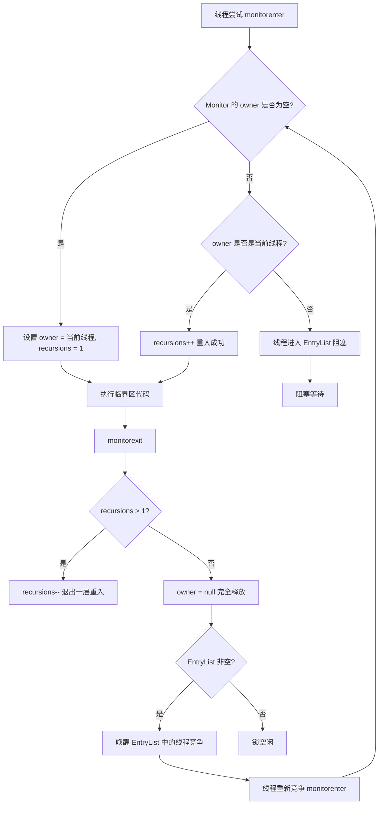
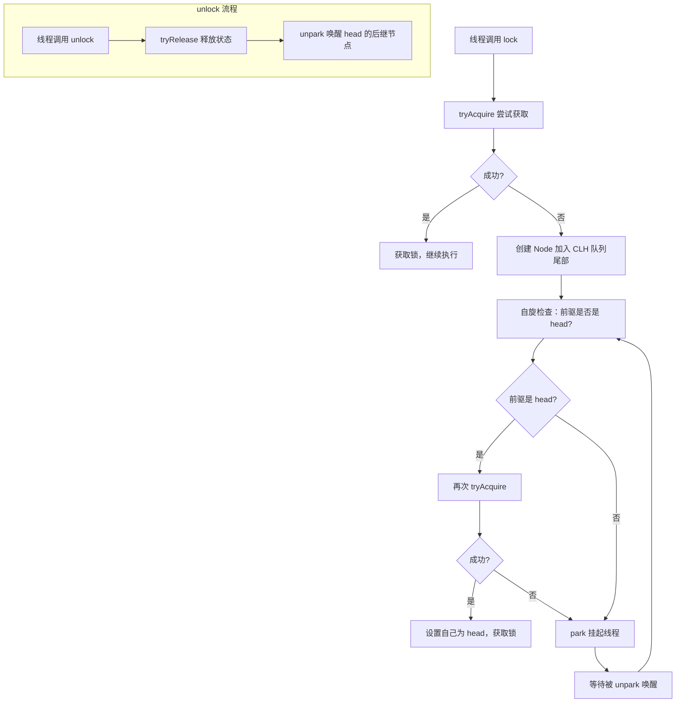

# 锁源码篇

> **目标**：深入 `synchronized` 的 Monitor 机制、JVM 锁升级优化、AQS 框架设计、CAS 原理，从源码层面理解 Java 锁体系的设计哲学。

## 一、synchronized 底层：Monitor 机制

### 1.1 一句话总结

> **每个 Java 对象都可以充当一把监视器锁（Monitor），`synchronized` 本质是对 Monitor 的 enter/exit 操作。**

### 1.2 设计哲学

```
synchronized 的设计权衡：

┌──────────────────────────────────────────────────────────────┐
│                       设计目标                                │
│  ┌──────────────┐    ┌──────────────┐    ┌──────────────┐   │
│  │   使用简单    │    │  自动释放锁   │    │  JVM 原生支持 │   │
│  │  语言级支持   │    │  异常也释放   │    │  无需显式操作 │   │
│  └──────────────┘    └──────────────┘    └──────────────┘   │
│                              │                               │
│                              ▼                               │
│                  ┌────────────────────┐                      │
│                  │  代价：灵活性不足    │                      │
│                  │  不支持超时/中断    │                      │
│                  │  不支持公平策略     │                      │
│                  └────────────────────┘                      │
│                                                              │
│  这个权衡非常合理：                                           │
│  绝大多数同步场景不需要「超时/中断/公平」                       │
│  简单可靠比灵活强大更重要                                      │
└──────────────────────────────────────────────────────────────┘
```

### 1.3 字节码层面

```kotlin
// Kotlin 代码
fun example() {
    synchronized(lock) {
        doWork()
    }
}
```

编译成 JVM 字节码后的核心指令：

```text
monitorenter   // 尝试获取 lock 对象的 Monitor
    // 临界区代码
monitorexit    // 释放 Monitor（正常出口）
monitorexit    // 释放 Monitor（异常出口，编译器自动生成）
```

编译器会自动生成两个 `monitorexit`，保证无论正常结束还是抛出异常，都能释放锁。这就是 `synchronized` 不会忘记释放锁的原因。

### 1.4 Monitor 结构

```
Java 对象的 Monitor 内部结构：

┌──────────────────────────────────────────────────────────────┐
│                        Monitor                               │
│                                                              │
│  owner: Thread1          ← 当前持有锁的线程                   │
│  recursions: 2           ← 重入次数（可重入锁的关键）          │
│                                                              │
│  EntryList:              ← 等待获取锁的线程队列               │
│  ┌──────┐  ┌──────┐  ┌──────┐                               │
│  │ T2   │→ │ T3   │→ │ T4   │                               │
│  └──────┘  └──────┘  └──────┘                               │
│                                                              │
│  WaitSet:                ← 调用 wait() 后等待的线程           │
│  ┌──────┐  ┌──────┐                                         │
│  │ T5   │→ │ T6   │                                         │
│  └──────┘  └──────┘                                         │
└──────────────────────────────────────────────────────────────┘

流程：
1. Thread2 想获取锁 → owner 不为空 → 进 EntryList 阻塞等待
2. Thread1 调用 wait() → 释放锁，进入 WaitSet
3. Thread1 被 notify() → 从 WaitSet 移到 EntryList，重新竞争
4. Thread1 释放锁 → EntryList 中的线程竞争，winner 成为新 owner
```

### 1.5 核心流程图



---

## 二、JVM 锁升级：synchronized 的性能进化

### 2.1 为什么需要锁升级？

早期 `synchronized` 每次都要向操作系统申请互斥量（Mutex），涉及**用户态和内核态的切换**，开销极大。

JDK 6 开始，JVM 引入了**锁升级**机制：根据竞争程度动态调整锁的实现，尽量避免内核态切换。

### 2.2 四种锁状态

```
锁的升级路径（单向，不可降级）：

无锁 → 偏向锁 → 轻量级锁 → 重量级锁

每种状态都记录在对象头的 Mark Word 里。
```


### 2.3 各状态详解

**偏向锁（Biased Lock）**

```
适用场景：锁只被一个线程使用

核心思想：
第一次获取锁时，把线程 ID 记录在对象头
之后同一线程再进入：只检查线程 ID，无任何 CAS 操作

效果：如果真的只有一个线程访问，几乎零开销

偏向锁撤销：
当另一个线程尝试竞争时，需要等到安全点（Safe Point）
暂停持有偏向锁的线程，检查其是否还在使用这把锁
如果不在用了 → 可以重新偏向
如果还在用    → 升级为轻量级锁
```

**轻量级锁（Lightweight Lock）**

```
适用场景：多线程交替访问（实际上没有竞争）

核心思想：
用 CAS 操作替代互斥量
线程在自己的栈帧里创建 Lock Record
用 CAS 把 Mark Word 替换为指向 Lock Record 的指针

CAS 成功 → 获取锁（不需要进内核！）
CAS 失败 → 说明有竞争，自旋重试
自旋超过阈值 → 升级为重量级锁
```

**重量级锁（Heavyweight Lock）**

```
适用场景：真正的多线程竞争

这就是传统的 Monitor 机制：
- 竞争失败的线程真正阻塞（进入 EntryList）
- 涉及内核态切换，开销大
- 但对 CPU 友好：阻塞的线程不占 CPU
```

### 2.4 对 Android 开发的启示

```kotlin
// 这段代码在不同竞争程度下，JVM 会自动选择不同的锁实现
class Counter {
    var count = 0

    @Synchronized
    fun increment() {
        count++
    }
}

// 场景1：只有主线程调用 → 偏向锁，几乎无开销
// 场景2：IO线程和主线程交替调用 → 轻量级锁，CAS 操作
// 场景3：多个线程激烈竞争 → 重量级锁，内核级阻塞

// 对开发者来说：
// JVM 会自动优化，不需要手动干预
// 但理解这个机制，能帮你理解为什么「少量竞争」的 synchronized 不贵
```

---

## 三、AQS：整个 JUC 锁体系的基石

### 3.1 一句话总结

> **AQS（AbstractQueuedSynchronizer）是一个「排队等锁」的抽象框架，ReentrantLock、Semaphore、CountDownLatch 都建立在它之上。**

### 3.2 设计哲学

```
AQS 的核心抽象：

你只需要告诉我：
  1. 「获取锁」成功的条件是什么？（tryAcquire）
  2. 「释放锁」后需要做什么？（tryRelease）

AQS 帮你处理：
  - 获取失败时的线程排队
  - 唤醒后继线程
  - 线程中断处理
  - 超时处理

这是经典的「模板方法模式」：
父类定义算法骨架，子类实现具体步骤
```

### 3.3 AQS 内部结构

```
AQS 的核心数据结构：

  state（volatile int）
  ├── ReentrantLock 里：0 = 未锁，> 0 = 被持有（值是重入次数）
  ├── Semaphore 里：可用许可证数量
  └── CountDownLatch 里：剩余倒计数

  CLH 变体队列（双向链表）：

  head → ┌─────────┐    ┌─────────┐    ┌─────────┐ ← tail
         │ Thread2 │ ←→ │ Thread3 │ ←→ │ Thread4 │
         └─────────┘    └─────────┘    └─────────┘
         （获取锁失败的线程在这里排队等待）
```

### 3.4 核心流程图



### 3.5 关键源码解析

```java
// AbstractQueuedSynchronizer.java 核心逻辑（简化版）
public abstract class AbstractQueuedSynchronizer {

    // 核心状态：子类赋予不同含义
    private volatile int state;

    // 队列头尾（dummy 节点）
    private transient volatile Node head;
    private transient volatile Node tail;

    // 模板方法：子类实现
    protected boolean tryAcquire(int arg) { throw new UnsupportedOperationException(); }
    protected boolean tryRelease(int arg) { throw new UnsupportedOperationException(); }

    // 获取锁（独占模式）
    public final void acquire(int arg) {
        if (!tryAcquire(arg) &&              // 1. 先尝试获取
            acquireQueued(                    // 3. 排队等待
                addWaiter(Node.EXCLUSIVE),   // 2. 失败则入队
                arg))
            selfInterrupt();                 // 响应中断
    }

    // 线程入队后的等待循环
    final boolean acquireQueued(final Node node, int arg) {
        boolean interrupted = false;
        for (;;) {  // 自旋
            final Node p = node.predecessor();
            // 前驱是 head → 有资格尝试获取锁
            if (p == head && tryAcquire(arg)) {
                setHead(node);     // 获取成功，成为新 head
                p.next = null;     // 帮助 GC
                return interrupted;
            }
            // 检查是否需要 park（挂起）
            if (shouldParkAfterFailedAcquire(p, node))
                interrupted |= parkAndCheckInterrupt();  // 真正挂起
        }
    }

    // 释放锁
    public final boolean release(int arg) {
        if (tryRelease(arg)) {          // 子类实现释放逻辑
            Node h = head;
            if (h != null && h.waitStatus != 0)
                unparkSuccessor(h);     // 唤醒后继线程
            return true;
        }
        return false;
    }
}
```

### 3.6 ReentrantLock 如何实现公平与非公平

```java
// ReentrantLock 内部的公平锁 vs 非公平锁，只有一个方法的差异

// 非公平锁（默认）
static final class NonfairSync extends Sync {
    protected final boolean tryAcquire(int acquires) {
        final Thread current = Thread.currentThread();
        int c = getState();
        if (c == 0) {
            // 关键：直接 CAS 抢锁，不管队列里有没有等待的线程
            // 允许「插队」，吞吐量更高
            if (compareAndSetState(0, acquires)) {
                setExclusiveOwnerThread(current);
                return true;
            }
        } else if (current == getExclusiveOwnerThread()) {
            // 重入：直接增加计数
            setState(c + acquires);
            return true;
        }
        return false;
    }
}

// 公平锁
static final class FairSync extends Sync {
    protected final boolean tryAcquire(int acquires) {
        final Thread current = Thread.currentThread();
        int c = getState();
        if (c == 0) {
            // 关键差异：多了 !hasQueuedPredecessors() 检查
            // 队列里有人在等，就乖乖排队，不允许插队
            if (!hasQueuedPredecessors() &&
                compareAndSetState(0, acquires)) {
                setExclusiveOwnerThread(current);
                return true;
            }
        } else if (current == getExclusiveOwnerThread()) {
            setState(c + acquires);
            return true;
        }
        return false;
    }
}

// 一个方法的差异背后是截然不同的策略：
// 非公平：吞吐量高，但可能有线程长时间等待（饥饿）
// 公平  ：严格先来先服务，但频繁的线程唤醒/挂起导致吞吐量下降
// 默认非公平的原因：实测非公平吞吐量比公平高 5-10 倍
```

---

## 四、CAS：乐观锁的硬件基础

### 4.1 一句话总结

> **CAS（Compare-And-Swap）是 CPU 提供的原子指令，「比较并交换」三步合一，是乐观锁和原子类的硬件基础。**

### 4.2 CAS 的原理

```
CAS(内存地址, 期望值, 新值) 的语义：

if (内存地址的值 == 期望值) {
    内存地址的值 = 新值
    return true
} else {
    return false  // 有其他线程改过了
}

关键：以上操作是「原子的」，CPU 层面保证不可分割
底层对应的 x86 指令是 CMPXCHG（加 LOCK 前缀保证原子性）
```

### 4.3 原子类源码

```java
// AtomicInteger.java（JDK 17 简化版）
public class AtomicInteger extends Number {

    // Unsafe 是 JDK 内部类，可以直接操作内存
    private static final Unsafe U = Unsafe.getUnsafe();
    private static final long VALUE
        = U.objectFieldOffset(AtomicInteger.class, "value");

    // volatile 保证可见性
    private volatile int value;

    // 自增并返回新值
    public final int incrementAndGet() {
        return U.getAndAddInt(this, VALUE, 1) + 1;
    }

    // getAndAddInt 的核心：CAS 自旋
    // 等价于：
    // do {
    //     current = getValue()
    // } while (!CAS(地址, current, current + delta))
    // return current
}
```

### 4.4 CAS 的三大问题

**问题1：ABA 问题**

```
线程1 读到值为 A
线程2 把 A 改成 B，再改回 A
线程1 执行 CAS，发现还是 A，成功了

但实际上值已经被改过了！

解决：AtomicStampedReference，附带版本号
CAS(地址, 期望值, 新值, 期望版本号, 新版本号)
版本号每次修改都递增，即使值相同，版本不同也会失败
```

**问题2：自旋开销**

```
CAS 失败后会自旋重试
如果竞争激烈，大量线程一直自旋 → CPU 空转，浪费资源

适用场景：锁持有时间很短、竞争不激烈
不适用：持锁时间长、竞争激烈（这时候阻塞锁更省 CPU）
```

**问题3：只能保证单个变量**

```
CAS 一次只能操作一个内存地址
如果需要同时更新多个变量保持一致，CAS 搞不定

解决：
- 把多个变量封装成一个对象，用 AtomicReference
- 或者退回到互斥锁
```

---

## 五、Android 源码中的锁

### 5.1 LruCache 的 synchronized

```java
// Android LruCache 源码（简化版）
public class LruCache<K, V> {

    // 整个类用 synchronized 方法保护
    // 为什么不用 ReadWriteLock？
    // 因为 get() 不只是读 —— 它会移动链表节点（LRU 顺序更新）
    // 读写都有写操作，读写锁优势不大

    @Nullable
    public final V get(@NonNull K key) {
        // get 也是 synchronized，因为要更新 LRU 顺序
        synchronized (this) {
            V mapValue = map.get(key);
            if (mapValue != null) {
                hitCount++;
                return mapValue;
            }
            missCount++;
        }
        // 缓存未命中，在锁外调用 create（可能很耗时）
        V createdValue = create(key);
        if (createdValue == null) return null;

        // 把创建的值放入缓存（再次加锁）
        synchronized (this) {
            createCount++;
            V mapValue = map.put(key, createdValue);
            if (mapValue != null) {
                // 有并发：别的线程也 create 了，放回去
                map.put(key, mapValue);
            } else {
                size += safeSizeOf(key, createdValue);
            }
        }
        // ...
        return createdValue;
    }
}
// 设计亮点：耗时的 create() 在锁外执行，只对状态修改加锁
// 和我们在进阶篇说的「缩小锁范围」一致
```

### 5.2 Handler/MessageQueue 中的锁

```java
// MessageQueue.java（简化版）
class MessageQueue {

    // next() 是核心消费方法
    // 用 synchronized(this) 而不是 ReentrantLock
    // 原因：逻辑足够简单，不需要 ReentrantLock 的高级特性
    Message next() {
        for (;;) {
            synchronized (this) {
                // 取队列头部消息
                Message msg = mMessages;
                if (msg != null) {
                    long now = SystemClock.uptimeMillis();
                    if (now >= msg.when) {
                        mMessages = msg.next;  // 出队
                        return msg;
                    }
                }
                // 队列为空或未到时间：设置等待标志
                mBlocked = true;
            }
            // 锁外等待（nativePollOnce 底层用 epoll，不是 Java 锁）
            nativePollOnce(ptr, nextPollTimeoutMillis);
        }
    }

    // enqueueMessage() 也用 synchronized(this)
    // 保证入队和出队的线程安全
    boolean enqueueMessage(Message msg, long when) {
        synchronized (this) {
            // 按时间顺序插入链表
            msg.when = when;
            Message p = mMessages;
            if (p == null || when == 0 || when < p.when) {
                msg.next = p;
                mMessages = msg;
            } else {
                // 找到合适位置插入
                Message prev;
                for (;;) {
                    prev = p;
                    p = p.next;
                    if (p == null || when < p.when) break;
                }
                msg.next = p;
                prev.next = msg;
            }
            // 如果 Looper 正在等待，唤醒它
            if (needWake) nativeWake(mPtr);
        }
        return true;
    }
}
// 设计亮点：synchronized(this) 足够简单
// Looper 的真正等待是 nativePollOnce（epoll），不是 Java 层的 wait()
// 避免了 Java 锁和 native 等待的复杂交互
```

---

## 六、延伸思考

### 6.1 如果让你设计一个锁框架，你会怎么做？

```
思考维度：

1. 核心需求
   - 互斥：同一时刻只有一个线程进入临界区
   - 可见性：释放锁前的写对后续获取锁的线程可见
   - 等待与唤醒：拿不到锁的线程要能等，释放时要能唤醒

2. 实现选择
   - 纯 Java 实现：用 volatile 状态 + CAS 操作
   - 线程等待：LockSupport.park / unpark（比 wait/notify 更灵活）
   - 队列管理：CLH 队列（AQS 的选择），避免大量线程同时竞争

3. 可扩展性
   - 模板方法：框架处理排队，子类只实现「什么时候获取成功」
   - 这正是 AQS 的做法

4. Android 场景的特殊考虑
   - 不能让主线程无限等锁
   - 挂起函数需要协程感知的锁（Mutex）
   - 内存压力大，锁对象本身要轻量
```

### 6.2 synchronized vs ReentrantLock 性能演进

```
JDK 5 及之前：
  synchronized 性能很差（每次都是重量级锁）
  ReentrantLock 性能更好，很多项目刻意避免 synchronized

JDK 6 之后：
  synchronized 引入偏向锁、轻量级锁优化
  性能已与 ReentrantLock 相差无几（甚至更好）

JDK 15+：
  偏向锁被标记为废弃（维护成本高，收益减少）
  现代 JVM 的 synchronized 已经非常高效

对 Android 开发者的影响：
  不要因为「synchronized 慢」而刻意用 ReentrantLock
  选择依据应该是「功能需求」而不是「性能偏见」
```

---

## 七、面试检验

**Q1：`synchronized` 底层是怎么实现的？**

> **结论**：基于 JVM 的 Monitor（监视器）机制，字节码层面是 `monitorenter` / `monitorexit` 指令。
> **原理**：每个对象关联一个 Monitor，内含 owner（持有线程）、EntryList（等待队列）、WaitSet（wait 后的队列）。获取锁就是抢占 Monitor 的 owner 位置，失败则进 EntryList 阻塞。
> **Android 实例**：Android 源码里大量 `synchronized(this)` 和 `@Synchronized` 都走这套机制，LruCache、MessageQueue 都是典型例子。

**Q2：JVM 的锁升级是怎么回事？为什么要这么设计？**

> **结论**：JDK 6 引入偏向锁→轻量级锁→重量级锁的升级路径，根据竞争程度动态选择实现，避免不必要的内核态切换。
> **原理**：无竞争用偏向锁（只检查线程 ID，几乎零开销）；交替访问用轻量级锁（CAS，不进内核）；真正竞争才升为重量级锁（OS 互斥量）。
> **Android 实例**：一个只在主线程访问的 LruCache，synchronized 实际上走的是偏向锁，开销极低。

**Q3：AQS 是什么？它解决了什么问题？**

> **结论**：AQS 是 JUC 锁的抽象框架，用模板方法模式把「排队等锁」的通用逻辑抽出来，子类只需实现「何时获取成功」。
> **原理**：内部维护 volatile state 和 CLH 双向队列。获取失败的线程入队并 park，释放时 unpark 后继线程。ReentrantLock、Semaphore、CountDownLatch 都是 AQS 的子类实现。
> **Android 实例**：启动优化用的 CountDownLatch、限流用的 Semaphore，底层都是 AQS 在管线程排队。

**Q4：CAS 有什么局限性？ABA 问题怎么解决？**

> **结论**：CAS 存在 ABA 问题、自旋开销大、只能操作单变量三个局限。ABA 用 `AtomicStampedReference` 加版本号解决。
> **原理**：ABA 问题：值从 A 改为 B 再改回 A，CAS 检查通过但数据实际已被修改。版本号方案：每次修改版本号递增，CAS 同时比较值和版本号。
> **Android 实例**：引用计数、上传进度等简单场景用 AtomicInteger 足够；涉及对象引用替换且关心中间状态时，用 AtomicStampedReference。

**Q5：公平锁和非公平锁源码上有什么差异？为什么默认非公平？**

> **结论**：差异只在 `tryAcquire` 里的一行：公平锁多了 `hasQueuedPredecessors()` 检查，有人排队就不插队。默认非公平因为吞吐量高 5-10 倍。
> **原理**：非公平锁允许新线程在 CAS 时直接抢锁，减少了线程唤醒/挂起的次数（唤醒一个阻塞线程开销很大）。代价是可能有线程长时间等待（饥饿）。
> **Android 实例**：下载队列如果需要严格按请求顺序处理，可以用 `ReentrantLock(true)` 公平锁；普通缓存保护用默认非公平即可。

---

_本篇完。回顾：[README](./README.md) | [1-基础篇](./1-基础篇.md) | [2-进阶篇](./2-进阶篇.md)_
 