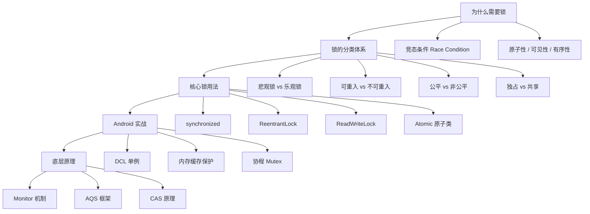

# Java 锁（Lock）

> 从 Android 开发者视角，系统掌握 Java 并发锁的体系：为什么需要锁、有哪些锁、怎么用好锁、底层如何工作。

## 为什么要学锁？

作为 Android 开发者，锁是**绕不过去的必修课**：

```
学 synchronized  → 理解 Android 源码里大量同步保护的设计意图
学 ReentrantLock → 理解下载队列、任务调度等复杂并发场景
学 ReadWriteLock → 理解内存缓存的读多写少优化方案
学 AQS           → 理解 ReentrantLock/CountDownLatch/Semaphore 的共同底座
学 CAS/原子类    → 理解为什么计数器不一定需要重锁
学协程 Mutex     → 理解现代 Android 的推荐并发实践
```

## Android 中的锁应用场景

| Java 锁技术 | Android 关联 | 学了能理解什么 |
|------------|-------------|---------------|
| **synchronized** | DCL 单例、LruCache 保护 | Android 源码里的同步为何这样写 |
| **ReentrantLock** | 下载调度、任务队列 | 复杂同步场景为何不够用 synchronized |
| **ReadWriteLock** | 内存缓存读写分离 | 读多写少场景如何提升并发度 |
| **AtomicInteger** | 引用计数、上传进度 | 轻量计数为什么不需要加锁 |
| **volatile + DCL** | 单例初始化 | 为什么单例必须加 @Volatile |
| **Semaphore** | 限流、连接池 | OkHttp 并发连接数如何限制 |
| **CountDownLatch** | 启动优化等待 | 多任务初始化完成后才启动 |
| **协程 Mutex** | 挂起函数保护共享状态 | 协程世界里的锁是什么 |

## 学习路线



## 核心问题预览

学完本系列，你应该能回答以下问题：

### 基础篇
- 为什么多线程下 `count++` 会出问题？
- `synchronized` 和 `ReentrantLock` 分别适合什么场景？
- 什么是可重入锁？为什么 Java 的锁大多是可重入的？
- `volatile` 能替代锁吗？
- Android 里的 `WakeLock` 和 Java 锁是一回事吗？

### 进阶篇
- `ReentrantReadWriteLock` 什么时候值得用？有什么坑？
- `StampedLock` 比读写锁强在哪？又有什么代价？
- 死锁是怎么产生的？怎么避免？
- `Semaphore` 和 `CountDownLatch` 分别解决什么问题？
- 协程里的 `Mutex` 和 Java 锁有什么本质区别？

### 源码篇
- `synchronized` 底层的 Monitor 机制是什么？
- JVM 对 synchronized 做了哪些锁升级优化？
- AQS 是什么？它如何支撑整个 JUC 锁体系？
- CAS 的原理是什么？它有什么局限性？
- `ReentrantLock` 的公平锁和非公平锁源码上有什么差异？

## 文档导航

| 文档 | 内容 | 适合人群 |
|-----|------|----------|
| [1-基础篇](./1-基础篇.md) | 为什么要锁、锁的分类、核心锁用法、Android 实战、最佳实践 | 想系统了解锁体系的开发者 |
| [2-进阶篇](./2-进阶篇.md) | 读写锁、StampedLock、死锁、并发工具类、协程 Mutex | 想深入理解复杂并发场景的开发者 |
| [3-源码篇](./3-源码篇.md) | Monitor 原理、锁升级、AQS 框架、CAS、ReentrantLock 源码 | 想理解锁底层设计哲学的开发者 |

## 与 Kotlin 协程的关系

很多人问："有了协程，还需要学锁吗？"

**必须学，原因有三：**

```kotlin
// 原因1：协程底层还是线程，线程安全问题依然存在
viewModelScope.launch(Dispatchers.IO) {
    // 这里跑在线程池，多个协程并发访问共享状态，照样有竞态条件
    sharedCache[key] = value  // 如果是 HashMap，仍然不安全
}

// 原因2：协程有自己的锁 —— Mutex，原理和 Java 锁一脉相承
val mutex = Mutex()
suspend fun safeUpdate() {
    mutex.withLock {
        // 和 synchronized 同样的互斥语义，但不阻塞线程
    }
}

// 原因3：Android 框架源码大量用锁，读源码绕不开
// LruCache、ThreadPoolExecutor、Handler 里都有 synchronized
```

| 维度 | Java 锁 | 协程 Mutex |
|-----|---------|------------|
| 阻塞方式 | 阻塞线程 | 挂起协程，线程可复用 |
| 适用上下文 | 普通函数 | 挂起函数 |
| 性能 | 有线程切换开销 | 更轻量 |
| 可重入 | 支持（ReentrantLock） | 不支持（协程 Mutex） |
| Android 推荐 | 理解原理、维护老代码 | 新代码优先 |

**学习建议**：先把 Java 锁的体系吃透，再用协程 Mutex 时才能真正理解它在做什么。

---

_开始学习：[1-基础篇](./1-基础篇.md) - 锁的概念、分类与核心用法 →_
