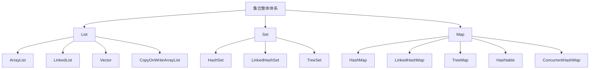

# Java 集合框架（Java Collections Framework）

> 从纯 Java 视角，系统梳理集合体系：先看整体地图，再分别吃透 `List`、`Set`、`Map`。这一组文档的目标不是只会背 API，而是搞明白它们为什么这样设计、底层靠什么工作、遇到业务场景该怎么选。

## 为什么要学集合？

集合是 Java 里最常用的一组基础能力。你几乎每天都在用：

- 存用户列表，用 `List`
- 做去重标签，用 `Set`
- 做缓存、索引、映射关系，用 `Map`
- 做队列、栈、优先级调度，用各种线性结构和变体

很多人写业务时会用集合，但一问到底层：

- `ArrayList` 为什么查得快、插入慢？
- `LinkedList` 真有想象中那么好用吗？
- `HashSet` 为什么能去重？
- `HashMap` 为什么会发生哈希碰撞？
- 为什么有的集合允许 `null`，有的不允许？

如果这些点没串起来，集合知识就会变成“零散记忆点”；一旦串起来，它其实是一整套非常有逻辑的数据结构体系。

## 学习路线

## 这一组文档会解决什么问题？

### 1-集合总览篇
- Java 集合框架整体是怎么分层的？
- 数组、链表、哈希表、红黑树分别有什么优缺点？
- 为什么集合体系要拆成 `Collection` 和 `Map` 两大阵营？
- 真实开发中，选型时到底在比较什么？

### 2-List 篇
- `ArrayList`、`LinkedList`、`Vector` 的底层实现分别是什么？
- `ArrayList` 是怎么扩容的？为什么不是每次只加 1？
- 为什么很多场景下 `LinkedList` 没有想象中那么香？
- 哪些 `List` 线程安全，代价又是什么？

### 3-Set 篇
- `Set` 为什么能做到“去重”？
- `HashSet`、`LinkedHashSet`、`TreeSet` 的判重依据分别是什么？
- 哪些 `Set` 允许 `null`，哪些不允许？
- 如果重写了 `equals` 却没重写 `hashCode`，会出什么问题？

### 4-Map 篇
- `HashMap` 的底层结构是怎样一步步演化的？
- 为什么会有哈希碰撞？Java 是怎么处理的？
- `HashMap`、`LinkedHashMap`、`TreeMap`、`Hashtable`、`ConcurrentHashMap` 怎么选？
- 哪些 `Map` 允许 `null key` / `null value`？

## 文档导航

| 文档 | 内容 | 适合人群 |
|---|---|---|
| [1-集合总览篇](./1-集合总览篇.md) | 整体体系、底层数据结构、选型思维 | 想先建立集合全景图的人 |
| [2-List详解篇](./2-List详解篇.md) | 各种 List 的底层实现、扩容、性能差异 | 想把线性表吃透的人 |
| [3-Set详解篇](./3-Set详解篇.md) | 去重原理、判重规则、null 与排序问题 | 想真正理解 Set 的人 |
| [4-Map详解篇](./4-Map详解篇.md) | HashMap 原理、哈希碰撞、红黑树、各类 Map 选型 | 想把 Map 一次性搞明白的人 |

## 学完之后你应该具备的能力

- 能从“底层结构”解释集合的性能差异，而不是死记复杂度
- 能说清数组、链表、哈希表、红黑树之间的关系
- 能在开发中合理选择 `ArrayList` / `HashSet` / `HashMap` 等集合
- 能判断哪些集合允许 `null`，哪些会排序，哪些线程安全
- 能理解 `HashMap`、`HashSet`、`TreeMap`、`TreeSet` 背后的设计思想

---

_开始学习：[1-集合总览篇](./1-集合总览篇.md) - 先把 Java 集合的整体地图建立起来 →_
