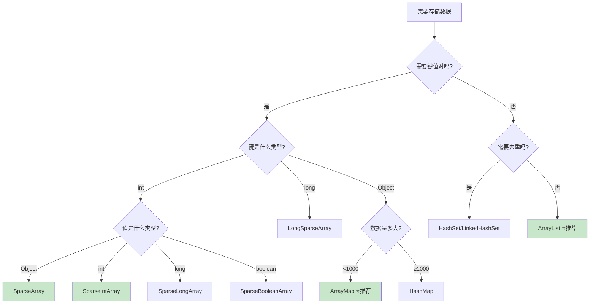

# 集合框架基础篇

> **目标**：理解集合框架的核心概念，掌握基本用法，知道在 Android 中哪里会用到。

## 一、为什么需要集合框架？

### 技术演进：从数组到集合

想象一下，你在做一个 **RecyclerView 列表**，需要存储一堆文章数据：

```kotlin
// 😰 用数组的痛苦
val articles = Array<Article>(100) { Article() }  // 必须指定大小！

// 问题1：不知道有多少文章怎么办？
// 问题2：想在中间插入一篇文章怎么办？
// 问题3：想删除某篇文章怎么办？
```

数组就像是**固定车位的停车场**：
- 车位数量建场时就定死了（固定大小）
- 想在中间加个车位？拆了重建吧（不支持动态扩容）
- 有辆车走了，车位空着也不能给别人（删除麻烦）

所以 Java 发明了**集合框架**——一个"智能停车场"：

```kotlin
// 😊 用集合的快乐
val articles = mutableListOf<Article>()  // 不用指定大小！

articles.add(Article())           // 随便加
articles.add(0, Article())        // 想插哪插哪
articles.removeAt(5)              // 想删就删
```

### Android 中到处都是集合

打开任何一个 Android 项目，你会发现集合无处不在：

| Android 场景 | 使用的集合 | 为什么用这个 |
|-------------|----------|-------------|
| RecyclerView 数据源 | `List<T>` | 有序、支持索引访问 |
| Bundle 传参 | 内部用 `ArrayMap` | 轻量、省内存 |
| SharedPreferences | 内部用 `HashMap` | 键值对存储 |
| Intent extras | 内部用 `ArrayMap` | Android 优化过 |
| LiveData 观察者 | `SafeIterableMap` | 支持遍历时修改 |

## 二、集合框架三大家族

集合框架就像一个大家族，有三个主要分支：

```
                    ┌─────────────┐
                    │   集合框架   │
                    └──────┬──────┘
                           │
        ┌──────────────────┼──────────────────┐
        │                  │                  │
   ┌────┴────┐        ┌────┴────┐        ┌────┴────┐
   │  List   │        │   Set   │        │   Map   │
   │ 有序列表 │        │ 无重复集 │        │ 键值对  │
   └─────────┘        └─────────┘        └─────────┘
   
   像排队        像签到表          像字典
   可以插队      来过就不记了      用名字查电话
```

### 2.1 List：有序列表

**生活类比**：就像电影院的座位，每个位置有编号（索引），可以根据编号找到座位。

```kotlin
// Android 场景：RecyclerView 的数据源
data class Article(
    val id: Long,
    val title: String,
    val content: String
)

class ArticleRepository {
    // List 最常见的用法：作为列表数据源
    private val _articles = mutableListOf<Article>()
    
    fun addArticle(article: Article) {
        _articles.add(article)  // 添加到末尾
    }
    
    fun insertAtTop(article: Article) {
        _articles.add(0, article)  // 插入到开头（置顶）
    }
    
    fun getArticle(position: Int): Article {
        return _articles[position]  // O(1) 随机访问，RecyclerView 就靠这个
    }
    
    fun removeArticle(position: Int) {
        _articles.removeAt(position)
    }
    
    fun getAllArticles(): List<Article> = _articles.toList()
}
```

**List 的两个实现**：

| 特性 | ArrayList | LinkedList |
|-----|-----------|------------|
| 底层结构 | 数组 | 双向链表 |
| 随机访问 | **O(1) 超快** | O(n) 很慢 |
| 头部插入 | O(n) 要移动元素 | **O(1) 超快** |
| 尾部插入 | O(1) | O(1) |
| 内存占用 | 较少 | 较多（每个节点有前后指针） |
| **Android 推荐** | ⭐⭐⭐⭐⭐ | ⭐ |

**为什么 Android 几乎只用 ArrayList？**

```kotlin
// RecyclerView.Adapter 中的 onBindViewHolder
override fun onBindViewHolder(holder: ViewHolder, position: Int) {
    // 这里需要根据 position 获取数据
    // ArrayList: O(1)，直接用数组下标
    // LinkedList: O(n)，要从头遍历到 position
    val item = dataList[position]  // ← 如果用 LinkedList，列表滑动会卡爆！
    holder.bind(item)
}
```

RecyclerView 会频繁调用 `onBindViewHolder`，如果每次都要 O(n) 查找，用户滑动列表时会明显卡顿。所以 **Android 开发中 99% 的场景都用 ArrayList**。

### 2.2 Set：无重复集合

**生活类比**：就像签到表，同一个人签过到了就不用再签，自动去重。

```kotlin
// Android 场景：记录已读消息 ID，避免重复提醒
class NotificationManager {
    // 用 Set 存储已读消息 ID，自动去重
    private val readMessageIds = mutableSetOf<Long>()
    
    fun markAsRead(messageId: Long) {
        readMessageIds.add(messageId)  // 重复添加也没关系，Set 会自动去重
    }
    
    fun isRead(messageId: Long): Boolean {
        return messageId in readMessageIds  // O(1) 查找
    }
    
    fun shouldShowNotification(messageId: Long): Boolean {
        // 如果已读，就不弹通知了
        return !isRead(messageId)
    }
}
```

**Set 的常见实现**：

| 实现 | 特点 | 适用场景 |
|-----|------|---------|
| HashSet | 无序，查找 O(1) | 只关心"有没有"，不关心顺序 |
| LinkedHashSet | 保持插入顺序 | 需要去重但保持顺序 |
| TreeSet | 自动排序 | 需要去重且排序 |

```kotlin
// Android 场景：收集用户选择的标签（去重 + 保持选择顺序）
class TagSelector {
    // LinkedHashSet：去重 + 保持用户选择的顺序
    private val selectedTags = linkedSetOf<String>()
    
    fun toggleTag(tag: String) {
        if (tag in selectedTags) {
            selectedTags.remove(tag)
        } else {
            selectedTags.add(tag)
        }
    }
    
    // 返回用户选择的标签，顺序与选择顺序一致
    fun getSelectedTags(): List<String> = selectedTags.toList()
}
```

### 2.3 Map：键值对映射

**生活类比**：就像字典，用"单词"（键）查找"释义"（值）。

```kotlin
// Android 场景：缓存网络请求结果
class ImageCache {
    // 用 URL 作为键，Bitmap 作为值
    private val cache = mutableMapOf<String, Bitmap>()
    
    fun put(url: String, bitmap: Bitmap) {
        cache[url] = bitmap
    }
    
    fun get(url: String): Bitmap? {
        return cache[url]  // O(1) 查找
    }
    
    fun contains(url: String): Boolean {
        return url in cache
    }
    
    fun remove(url: String) {
        cache.remove(url)
    }
    
    fun clear() {
        cache.clear()
    }
}
```

**Map 的常见实现**：

| 实现 | 特点 | Android 中的应用 |
|-----|------|-----------------|
| HashMap | 无序，查找 O(1) | 通用缓存 |
| LinkedHashMap | 保持插入顺序 | LRU 缓存（如 LruCache） |
| TreeMap | 按键排序 | 需要有序遍历的场景 |
| **ArrayMap** | Android 优化版 | Bundle、Intent 内部使用 |

```kotlin
// Android 场景：LRU 缓存（Least Recently Used）
// LinkedHashMap 可以实现"最近最少使用"的淘汰策略
class SimpleLruCache<K, V>(private val maxSize: Int) {
    
    // accessOrder = true：按访问顺序排列，最近访问的放最后
    private val map = object : LinkedHashMap<K, V>(16, 0.75f, true) {
        override fun removeEldestEntry(eldest: MutableMap.MutableEntry<K, V>?): Boolean {
            // 超过最大容量时，自动删除最老的（最久没访问的）
            return size > maxSize
        }
    }
    
    fun put(key: K, value: V) {
        map[key] = value
    }
    
    fun get(key: K): V? {
        return map[key]  // 每次 get 都会把这个 key 移到最后（最近访问）
    }
}
```

## 三、集合的基本操作

### 3.1 创建集合

```kotlin
// Kotlin 创建集合的方式（Android 开发推荐）

// 不可变集合（只读）
val readOnlyList = listOf("A", "B", "C")
val readOnlySet = setOf(1, 2, 3)
val readOnlyMap = mapOf("key1" to "value1", "key2" to "value2")

// 可变集合
val mutableList = mutableListOf("A", "B", "C")
val mutableSet = mutableSetOf(1, 2, 3)
val mutableMap = mutableMapOf("key1" to "value1")

// 空集合
val emptyList = emptyList<String>()
val emptySet = emptySet<Int>()
val emptyMap = emptyMap<String, Any>()

// Android 优化集合
val arrayMap = ArrayMap<String, Any>()           // 替代 HashMap
val sparseArray = SparseArray<String>()          // int → Object
val sparseIntArray = SparseIntArray()            // int → int
```

### 3.2 遍历集合

```kotlin
// Android 场景：遍历列表数据

val articles = listOf(
    Article(1, "标题1", "内容1"),
    Article(2, "标题2", "内容2"),
    Article(3, "标题3", "内容3")
)

// 方式1：for-each（最常用）
for (article in articles) {
    Log.d("TAG", "文章: ${article.title}")
}

// 方式2：带索引遍历（需要知道位置时用）
for ((index, article) in articles.withIndex()) {
    Log.d("TAG", "第 $index 篇: ${article.title}")
}

// 方式3：forEach 高阶函数
articles.forEach { article ->
    Log.d("TAG", "文章: ${article.title}")
}

// 方式4：forEachIndexed
articles.forEachIndexed { index, article ->
    Log.d("TAG", "第 $index 篇: ${article.title}")
}

// 遍历 Map
val userCache = mapOf("user1" to "张三", "user2" to "李四")
for ((key, value) in userCache) {
    Log.d("TAG", "用户ID: $key, 姓名: $value")
}
```

### 3.3 常用操作符（Kotlin 集合操作）

```kotlin
// Android 场景：处理列表数据

data class User(val id: Long, val name: String, val age: Int, val isVip: Boolean)

val users = listOf(
    User(1, "张三", 25, true),
    User(2, "李四", 30, false),
    User(3, "王五", 28, true),
    User(4, "赵六", 22, false)
)

// filter：过滤
val vipUsers = users.filter { it.isVip }  // 只保留 VIP 用户

// map：转换
val userNames = users.map { it.name }  // 提取所有用户名

// find：查找第一个符合条件的
val firstVip = users.find { it.isVip }  // 找到第一个 VIP

// any/all/none：判断
val hasVip = users.any { it.isVip }      // 是否有 VIP
val allAdult = users.all { it.age >= 18 } // 是否全是成年人
val noSenior = users.none { it.age > 60 } // 是否没有老年人

// sortedBy：排序
val sortedByAge = users.sortedBy { it.age }  // 按年龄升序
val sortedByAgeDesc = users.sortedByDescending { it.age }  // 按年龄降序

// groupBy：分组
val groupedByVip = users.groupBy { it.isVip }  // 按是否 VIP 分组
// 结果: {true=[张三, 王五], false=[李四, 赵六]}

// distinctBy：去重
val distinctByAge = users.distinctBy { it.age }  // 按年龄去重

// take/drop：取前几个/跳过前几个
val firstTwo = users.take(2)   // 取前 2 个
val skipTwo = users.drop(2)    // 跳过前 2 个

// 链式调用（实际开发中很常用）
val result = users
    .filter { it.isVip }           // 1. 过滤 VIP
    .sortedBy { it.age }           // 2. 按年龄排序
    .map { it.name }               // 3. 提取名字
    .take(3)                       // 4. 取前 3 个
// 一行代码完成复杂的数据处理！
```

## 四、遍历时修改的陷阱（fail-fast）

这是 Android 开发中最容易踩的坑之一：

```kotlin
// ❌ 错误：遍历时直接删除，会抛出 ConcurrentModificationException
val list = mutableListOf("A", "B", "C", "D")
for (item in list) {
    if (item == "B") {
        list.remove(item)  // 💥 崩溃！
    }
}

// 为什么会崩溃？
// for-each 内部用 Iterator 遍历，Iterator 会检查集合是否被修改
// 如果发现被修改了，就抛异常——这就是 fail-fast 机制
```

**正确的做法**：

```kotlin
// ✅ 方法1：使用 Iterator 的 remove 方法
val list1 = mutableListOf("A", "B", "C", "D")
val iterator = list1.iterator()
while (iterator.hasNext()) {
    if (iterator.next() == "B") {
        iterator.remove()  // 用 Iterator 的 remove，不会崩溃
    }
}

// ✅ 方法2：使用 removeIf（Java 8+，推荐）
val list2 = mutableListOf("A", "B", "C", "D")
list2.removeIf { it == "B" }

// ✅ 方法3：使用 Kotlin 的 removeAll
val list3 = mutableListOf("A", "B", "C", "D")
list3.removeAll { it == "B" }

// ✅ 方法4：创建新集合（函数式，最推荐）
val list4 = mutableListOf("A", "B", "C", "D")
val filtered = list4.filter { it != "B" }  // 创建新集合，原集合不变
```

**Android 真实场景**：

```kotlin
// Android 场景：处理 RecyclerView 数据源

class ArticleAdapter : ListAdapter<Article, ArticleViewHolder>(ArticleDiffCallback()) {
    
    // ❌ 错误做法：直接在遍历中删除
    fun removeReadArticles() {
        for (article in currentList) {
            if (article.isRead) {
                // 这样会崩溃！而且不应该直接修改 ListAdapter 的数据源
            }
        }
    }
    
    // ✅ 正确做法：创建新列表，通过 submitList 更新
    fun removeReadArticles() {
        // 过滤掉已读文章，创建新列表
        val unreadArticles = currentList.filter { !it.isRead }
        
        // submitList 内部会用 DiffUtil 计算差异，自动更新 UI
        // 这是 Android 官方推荐的做法
        submitList(unreadArticles)
    }
}

class ArticleDiffCallback : DiffUtil.ItemCallback<Article>() {
    override fun areItemsTheSame(oldItem: Article, newItem: Article): Boolean {
        return oldItem.id == newItem.id
    }
    
    override fun areContentsTheSame(oldItem: Article, newItem: Article): Boolean {
        return oldItem == newItem
    }
}
```

## 五、Android 中的集合选择

### 决策流程图



### 实际选择建议

```kotlin
// Android 集合选择实战

class CollectionChooser {
    
    // 场景1：RecyclerView 数据源 → ArrayList
    private val articleList = mutableListOf<Article>()
    
    // 场景2：存储配置项（数据量小） → ArrayMap
    // ArrayMap 比 HashMap 省约 30% 内存
    private val config = ArrayMap<String, Any>().apply {
        put("theme", "dark")
        put("fontSize", 16)
        put("showNotification", true)
    }
    
    // 场景3：ID → 数据的映射（ID 是 int） → SparseArray
    // 避免 Integer 装箱，省内存
    private val userCache = SparseArray<User>()
    
    fun cacheUser(user: User) {
        userCache.put(user.id.toInt(), user)  // key 直接用 int，无装箱
    }
    
    // 场景4：记录已处理的 ID（int） → SparseBooleanArray
    private val processedIds = SparseBooleanArray()
    
    fun markProcessed(id: Int) {
        processedIds.put(id, true)
    }
    
    fun isProcessed(id: Int): Boolean {
        return processedIds.get(id, false)
    }
    
    // 场景5：去重收藏列表 → LinkedHashSet（保持顺序）
    private val favorites = linkedSetOf<Long>()
    
    fun toggleFavorite(articleId: Long) {
        if (articleId in favorites) {
            favorites.remove(articleId)
        } else {
            favorites.add(articleId)
        }
    }
}
```

## 六、面试检验

### 基础题

**Q1：List、Set、Map 有什么区别？**

> **结论**：List 有序可重复，Set 无序不重复，Map 是键值对映射。
> 
> **原理**：
> - List：基于数组或链表，通过索引访问，允许重复元素
> - Set：基于 Hash 或树，不允许重复（用 equals/hashCode 判断）
> - Map：键值对存储，键不能重复
> 
> **Android 实例**：
> - RecyclerView 数据源用 List（需要索引访问）
> - 记录已读消息 ID 用 Set（自动去重）
> - 缓存用户信息用 Map（根据 userId 查找）

**Q2：ArrayList 和 LinkedList 怎么选？**

> **结论**：Android 开发几乎只用 ArrayList。
> 
> **原理**：
> - ArrayList 随机访问 O(1)，LinkedList 随机访问 O(n)
> - RecyclerView 频繁调用 get(position)，用 LinkedList 会卡顿
> - ArrayList 内存更紧凑，对 CPU 缓存更友好
> 
> **Android 实例**：RecyclerView、ViewPager 的数据源都必须支持快速索引访问，所以用 ArrayList。只有在频繁头部插入且几乎不随机访问的场景（几乎没有）才考虑 LinkedList。

**Q3：为什么遍历时不能直接删除元素？**

> **结论**：因为 fail-fast 机制会抛出 ConcurrentModificationException。
> 
> **原理**：Iterator 内部维护一个 modCount，每次集合修改都会 +1。遍历时会检查 modCount 是否变化，变化就抛异常，防止并发修改导致的数据不一致。
> 
> **Android 实例**：
> ```kotlin
> // ❌ 错误
> for (item in list) { list.remove(item) }
> 
> // ✅ 正确：使用 removeAll 或 filter 创建新集合
> list.removeAll { it.shouldRemove }
> ```

**Q4：HashMap 和 ArrayMap 怎么选？**

> **结论**：数据量小于 1000 用 ArrayMap，大于 1000 用 HashMap。
> 
> **原理**：
> - HashMap 用数组+链表+红黑树，每个 Entry 都是对象，内存开销大
> - ArrayMap 用两个数组（哈希数组+键值数组），内存更紧凑
> - ArrayMap 查找是 O(log n) 二分查找，数据量大时比 HashMap 慢
> 
> **Android 实例**：Bundle、Intent 内部都用 ArrayMap，因为传递的参数通常很少。

---

_下一篇：[2-进阶篇](./2-进阶篇.md) - 深入 Android 优化集合，掌握性能调优技巧 →_
