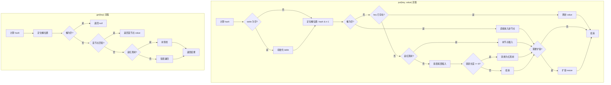
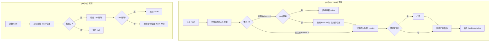

# 集合框架源码篇

> **目标**：深入 HashMap 和 ArrayMap 源码，理解设计哲学，从源码角度理解为什么 Android 要优化集合。

## 一、HashMap 源码解析

### 1.1 一句话总结

> **HashMap 是"空间换时间"的典型代表**：用额外的内存（Entry 对象、较大的数组）换取 O(1) 的查找速度。

### 1.2 设计哲学

```
HashMap 的核心权衡：

┌────────────────────────────────────────────────────────────────┐
│                        设计目标                                 │
│  ┌──────────────┐      ┌──────────────┐      ┌──────────────┐  │
│  │   查找快速    │      │  插入快速     │      │  删除快速     │  │
│  │    O(1)      │      │    O(1)      │      │    O(1)      │  │
│  └──────────────┘      └──────────────┘      └──────────────┘  │
│                              │                                 │
│                              ▼                                 │
│                     ┌────────────────┐                         │
│                     │   代价：内存     │                         │
│                     │  Entry 对象开销  │                         │
│                     │  数组空槽浪费    │                         │
│                     └────────────────┘                         │
│                                                                │
│  在服务端（内存充足）：这个权衡非常值得                            │
│  在 Android（内存紧张）：这个代价有点高                           │
└────────────────────────────────────────────────────────────────┘
```

**为什么选择"数组 + 链表 + 红黑树"？**

| 结构 | 作用 | 权衡 |
|-----|------|------|
| 数组（桶） | 通过 hash 直接定位，O(1) | 需要预分配空间 |
| 链表 | 解决哈希冲突 | 冲突多时性能下降为 O(n) |
| 红黑树 | 链表过长时优化查找 | 额外的树节点开销 |

### 1.3 核心流程图



### 1.4 关键源码解析

**put 方法核心逻辑**（JDK 17）：

```java
// HashMap.java 核心逻辑（简化版，保留关键部分）
public V put(K key, V value) {
    return putVal(hash(key), key, value, false, true);
}

// 计算 hash：高位参与运算，减少冲突
static final int hash(Object key) {
    int h;
    // 为什么要 h ^ (h >>> 16)？
    // 因为 table 大小通常较小，只有低位参与索引计算
    // 让高 16 位也参与，减少哈希冲突
    return (key == null) ? 0 : (h = key.hashCode()) ^ (h >>> 16);
}

final V putVal(int hash, K key, V value, boolean onlyIfAbsent, boolean evict) {
    Node<K,V>[] tab; Node<K,V> p; int n, i;
    
    // 1. 懒加载：首次 put 时才初始化 table
    if ((tab = table) == null || (n = tab.length) == 0)
        n = (tab = resize()).length;
    
    // 2. 定位桶：(n - 1) & hash，比取模更快
    // 为什么用 & 而不是 %？因为位运算更快
    // 前提：n 是 2 的幂次方
    if ((p = tab[i = (n - 1) & hash]) == null)
        // 3. 桶为空，直接放入
        tab[i] = newNode(hash, key, value, null);
    else {
        // 4. 桶不为空，处理冲突
        Node<K,V> e; K k;
        if (p.hash == hash && ((k = p.key) == key || (key != null && key.equals(k))))
            // key 已存在，准备更新
            e = p;
        else if (p instanceof TreeNode)
            // 红黑树节点
            e = ((TreeNode<K,V>)p).putTreeVal(this, tab, hash, key, value);
        else {
            // 链表遍历
            for (int binCount = 0; ; ++binCount) {
                if ((e = p.next) == null) {
                    p.next = newNode(hash, key, value, null);
                    // 链表长度 >= 8，转红黑树
                    if (binCount >= TREEIFY_THRESHOLD - 1)
                        treeifyBin(tab, hash);
                    break;
                }
                if (e.hash == hash && ((k = e.key) == key || (key != null && key.equals(k))))
                    break;
                p = e;
            }
        }
        // 更新已存在的 key
        if (e != null) {
            V oldValue = e.value;
            if (!onlyIfAbsent || oldValue == null)
                e.value = value;
            return oldValue;
        }
    }
    
    // 5. 检查是否需要扩容
    if (++size > threshold)
        resize();
    return null;
}
```

### 1.5 为什么链表转红黑树的阈值是 8？

```
这是 JDK 工程师经过概率计算得出的：

假设 hash 函数足够好，节点在各个桶的分布服从泊松分布：
P(k) = (λ^k * e^-λ) / k!

当 load factor = 0.75 时，λ = 0.5：
- P(0) = 0.607  (空桶概率 60.7%)
- P(1) = 0.303  (1个节点)
- P(2) = 0.076  (2个节点)
- P(3) = 0.013  (3个节点)
- ...
- P(8) = 0.00000006  (8个节点的概率只有千万分之六！)

结论：正常情况下，链表长度几乎不可能达到 8
如果达到了，说明要么：
1. hash 函数很差
2. 有人在恶意攻击（哈希碰撞攻击）

转成红黑树可以将查找复杂度从 O(n) 降到 O(log n)，防止性能退化
```

## 二、ArrayMap 源码解析

### 2.1 一句话总结

> **ArrayMap 是"时间换空间"的典型代表**：用 O(log n) 的二分查找换取更紧凑的内存布局。

### 2.2 设计哲学

```
ArrayMap 的核心权衡：

┌────────────────────────────────────────────────────────────────┐
│                        设计目标                                 │
│  ┌──────────────┐      ┌──────────────┐      ┌──────────────┐  │
│  │   内存紧凑    │      │  GC 友好      │      │  小数据量快   │  │
│  │  无对象开销   │      │  数组连续内存  │      │  省略树开销   │  │
│  └──────────────┘      └──────────────┘      └──────────────┘  │
│                              │                                 │
│                              ▼                                 │
│                     ┌────────────────┐                         │
│                     │  代价：查找速度  │                         │
│                     │   O(log n)      │                         │
│                     │  二分查找       │                         │
│                     └────────────────┘                         │
│                                                                │
│  适用场景：数据量 < 1000，查找速度差异可忽略                      │
│  Android 中：Bundle、Intent、SharedPreferences 的数据量都很小    │
└────────────────────────────────────────────────────────────────┘
```

### 2.3 内部结构图

```
ArrayMap 内部只有两个数组：

┌─────────────────────────────────────────────────────────────────────┐
│                                                                     │
│  mHashes[] - 存储 hash 值（已排序！）                                │
│  ┌─────┬─────┬─────┬─────┬─────┬─────┬─────┬─────┐                  │
│  │ 102 │ 305 │ 518 │ 721 │ 933 │  -  │  -  │  -  │  size = 5       │
│  └──┬──┴──┬──┴──┬──┴──┬──┴──┬──┴─────┴─────┴─────┘                  │
│     │     │     │     │     │                                       │
│     │     │     │     │     └─────────────────┐                     │
│     │     │     │     └───────────────┐       │                     │
│     │     │     └───────────────┐     │       │                     │
│     │     └───────────────┐     │     │       │                     │
│     └───────────────┐     │     │     │       │                     │
│                     │     │     │     │       │                     │
│  mArray[] - 交替存储 key 和 value                                    │
│  ┌─────┬─────┬─────┬─────┬─────┬─────┬─────┬─────┬─────┬─────┬─────┐│
│  │key0 │val0 │key1 │val1 │key2 │val2 │key3 │val3 │key4 │val4 │ ... ││
│  └─────┴─────┴─────┴─────┴─────┴─────┴─────┴─────┴─────┴─────┴─────┘│
│    ▲     ▲                                                          │
│    │     │                                                          │
│    │     └── mArray[index * 2 + 1] 是 value                         │
│    └──────── mArray[index * 2] 是 key                               │
│                                                                     │
│  查找过程：                                                          │
│  1. 计算 key 的 hash                                                │
│  2. 在 mHashes 中二分查找，得到 index                                │
│  3. mArray[index * 2] 是 key，mArray[index * 2 + 1] 是 value        │
└─────────────────────────────────────────────────────────────────────┘
```

### 2.4 核心流程图



### 2.5 关键源码解析

**ArrayMap 的核心方法**（Android 14 源码简化版）：

```java
// ArrayMap.java 核心逻辑

public final class ArrayMap<K, V> implements Map<K, V> {
    
    int[] mHashes;      // 存储 hash 值（有序）
    Object[] mArray;    // 交替存储 key 和 value
    int mSize;          // 当前大小
    
    // 二分查找：ArrayMap 的核心
    // 返回值：>= 0 表示找到，< 0 表示没找到（取反得到插入位置）
    int indexOf(Object key, int hash) {
        final int N = mSize;
        if (N == 0) {
            return ~0;  // 空的，返回 ~0 = -1，插入位置 0
        }
        
        // 二分查找 hash 值
        int index = binarySearchHashes(mHashes, N, hash);
        
        if (index < 0) {
            return index;  // 没找到这个 hash
        }
        
        // 找到 hash 了，但要验证 key 是否真的相等
        // （因为不同的 key 可能有相同的 hash）
        if (key.equals(mArray[index << 1])) {
            return index;  // key 相等，找到了！
        }
        
        // hash 冲突：向后搜索
        int end;
        for (end = index + 1; end < N && mHashes[end] == hash; end++) {
            if (key.equals(mArray[end << 1])) {
                return end;
            }
        }
        
        // hash 冲突：向前搜索
        for (int i = index - 1; i >= 0 && mHashes[i] == hash; i--) {
            if (key.equals(mArray[i << 1])) {
                return i;
            }
        }
        
        // 确实没有这个 key，返回应该插入的位置
        return ~end;
    }
    
    public V get(Object key) {
        final int index = indexOfKey(key);
        // index >= 0 表示找到了
        // value 在 mArray[index * 2 + 1] 位置
        return index >= 0 ? (V) mArray[(index << 1) + 1] : null;
    }
    
    public V put(K key, V value) {
        final int hash;
        int index;
        
        // 特殊处理 null key
        if (key == null) {
            hash = 0;
            index = indexOfNull();
        } else {
            hash = key.hashCode();
            index = indexOf(key, hash);
        }
        
        // key 已存在，更新 value
        if (index >= 0) {
            index = (index << 1) + 1;  // value 的位置
            final V old = (V) mArray[index];
            mArray[index] = value;
            return old;
        }
        
        // key 不存在，需要插入
        index = ~index;  // 计算插入位置
        
        // 检查是否需要扩容
        if (mSize >= mHashes.length) {
            final int n = mSize >= 8 ? (mSize + (mSize >> 1))  // 扩容 1.5 倍
                    : (mSize >= 4 ? 8 : 4);
            
            final int[] ohashes = mHashes;
            final Object[] oarray = mArray;
            allocArrays(n);  // 分配新数组
            
            // 复制旧数据
            if (mHashes.length > 0) {
                System.arraycopy(ohashes, 0, mHashes, 0, ohashes.length);
                System.arraycopy(oarray, 0, mArray, 0, oarray.length);
            }
            freeArrays(ohashes, oarray, mSize);  // 回收旧数组到缓存池
        }
        
        // 在插入位置后面的元素往后移
        if (index < mSize) {
            System.arraycopy(mHashes, index, mHashes, index + 1, mSize - index);
            System.arraycopy(mArray, index << 1, mArray, (index + 1) << 1,
                    (mSize - index) << 1);
        }
        
        // 插入新元素
        mHashes[index] = hash;
        mArray[index << 1] = key;
        mArray[(index << 1) + 1] = value;
        mSize++;
        
        return null;
    }
}
```

### 2.6 ArrayMap 的精妙设计

**设计亮点1：数组缓存池**

```java
// ArrayMap 的数组缓存池机制

// 问题：频繁创建/销毁 ArrayMap 会产生大量临时数组，增加 GC 压力
// 解决：用缓存池复用数组

static Object[] mBaseCache;      // 缓存大小为 4 的数组
static Object[] mTwiceBaseCache; // 缓存大小为 8 的数组

// 分配数组时优先从缓存池获取
private void allocArrays(final int size) {
    if (size == 8) {
        synchronized (ArrayMap.class) {
            if (mTwiceBaseCache != null) {
                // 从缓存池取出
                final Object[] array = mTwiceBaseCache;
                mArray = array;
                mTwiceBaseCache = (Object[]) array[0];  // 链表结构
                mHashes = (int[]) array[1];
                array[0] = array[1] = null;
                return;
            }
        }
    } else if (size == 4) {
        // 类似逻辑...
    }
    
    // 缓存池没有，才创建新数组
    mHashes = new int[size];
    mArray = new Object[size << 1];
}

// 释放数组时放回缓存池
private static void freeArrays(final int[] hashes, final Object[] array, final int size) {
    if (hashes.length == 8) {
        synchronized (ArrayMap.class) {
            // 放入缓存池（链表头插法）
            if (mTwiceBaseCacheSize < 10) {  // 最多缓存 10 个
                array[0] = mTwiceBaseCache;
                array[1] = hashes;
                // 清空其他位置，帮助 GC
                for (int i = (size << 1) - 1; i >= 2; i--) {
                    array[i] = null;
                }
                mTwiceBaseCache = array;
                mTwiceBaseCacheSize++;
            }
        }
    }
    // 类似处理大小为 4 的数组...
}
```

**设计亮点2：位运算优化**

```java
// ArrayMap 大量使用位运算替代乘除法

// index << 1 等价于 index * 2
// index >> 1 等价于 index / 2

// 为什么用位运算？
// 1. 位运算比乘除法快得多
// 2. mArray 的 key 在偶数位置，value 在奇数位置
//    key 位置 = index * 2 = index << 1
//    value 位置 = index * 2 + 1 = (index << 1) + 1

public V get(Object key) {
    final int index = indexOfKey(key);
    return index >= 0 ? (V) mArray[(index << 1) + 1] : null;
    //                              ↑ 等价于 index * 2 + 1
}
```

## 三、HashMap vs ArrayMap 深度对比

### 3.1 内存占用对比

```
假设存储 100 个 String → String 的键值对：

HashMap 内存占用估算：
┌────────────────────────────────────────────────────────────┐
│ 组件                          │ 大小                        │
├────────────────────────────────────────────────────────────┤
│ table[] 数组                  │ 128 * 4 = 512 bytes        │
│ (默认容量 128，load factor 0.75)                            │
├────────────────────────────────────────────────────────────┤
│ 100 个 Node 对象              │ 100 * 32 = 3200 bytes      │
│ (hash + key ref + value ref + next ref + 对象头)           │
├────────────────────────────────────────────────────────────┤
│ 总计（不含 key/value 本身）   │ ≈ 3712 bytes               │
└────────────────────────────────────────────────────────────┘

ArrayMap 内存占用估算：
┌────────────────────────────────────────────────────────────┐
│ 组件                          │ 大小                        │
├────────────────────────────────────────────────────────────┤
│ mHashes[] int 数组            │ 100 * 4 = 400 bytes        │
├────────────────────────────────────────────────────────────┤
│ mArray[] Object 数组          │ 200 * 4 = 800 bytes        │
│ (100 个 key ref + 100 个 value ref)                        │
├────────────────────────────────────────────────────────────┤
│ 总计（不含 key/value 本身）   │ ≈ 1200 bytes               │
└────────────────────────────────────────────────────────────┘

节省内存：3712 - 1200 = 2512 bytes ≈ 68%！
```

### 3.2 性能对比

```kotlin
// 性能对比测试代码

fun benchmarkComparison() {
    val sizes = listOf(10, 100, 500, 1000, 5000)
    
    sizes.forEach { size ->
        val hashMap = HashMap<String, String>()
        val arrayMap = ArrayMap<String, String>()
        
        // 准备测试数据
        val keys = (0 until size).map { "key_$it" }
        val values = (0 until size).map { "value_$it" }
        
        // 测试 put 性能
        val hashMapPutTime = measureTimeMillis {
            repeat(1000) {
                hashMap.clear()
                keys.forEachIndexed { i, key -> hashMap[key] = values[i] }
            }
        }
        
        val arrayMapPutTime = measureTimeMillis {
            repeat(1000) {
                arrayMap.clear()
                keys.forEachIndexed { i, key -> arrayMap[key] = values[i] }
            }
        }
        
        // 测试 get 性能
        keys.forEachIndexed { i, key -> 
            hashMap[key] = values[i]
            arrayMap[key] = values[i]
        }
        
        val hashMapGetTime = measureTimeMillis {
            repeat(10000) {
                keys.forEach { hashMap[it] }
            }
        }
        
        val arrayMapGetTime = measureTimeMillis {
            repeat(10000) {
                keys.forEach { arrayMap[it] }
            }
        }
        
        println("""
            Size: $size
            Put - HashMap: ${hashMapPutTime}ms, ArrayMap: ${arrayMapPutTime}ms
            Get - HashMap: ${hashMapGetTime}ms, ArrayMap: ${arrayMapGetTime}ms
        """.trimIndent())
    }
}

/*
典型结果（数值仅供参考）：

Size: 10
Put - HashMap: 15ms, ArrayMap: 12ms   ← ArrayMap 更快
Get - HashMap: 8ms, ArrayMap: 6ms     ← ArrayMap 更快

Size: 100
Put - HashMap: 45ms, ArrayMap: 52ms   ← 接近
Get - HashMap: 25ms, ArrayMap: 38ms   ← HashMap 开始领先

Size: 1000
Put - HashMap: 120ms, ArrayMap: 380ms ← HashMap 明显更快
Get - HashMap: 85ms, ArrayMap: 210ms  ← HashMap 明显更快

结论：
- 数据量 < 100：ArrayMap 性能更好或相当
- 数据量 100-500：性能接近，ArrayMap 省内存
- 数据量 > 1000：HashMap 性能优势明显
*/
```

### 3.3 选择决策表

| 场景 | 推荐 | 原因 |
|-----|------|------|
| Bundle 传参 | ArrayMap | 数据量小，Android 内部就是用的 ArrayMap |
| Intent extras | ArrayMap | 同上 |
| 配置项存储 | ArrayMap | 配置项通常很少 |
| 全局缓存（大量数据） | HashMap | 数据量大，需要 O(1) 查找 |
| SharedPreferences | HashMap | 系统内部用的 HashMap，为了兼容 |
| 数据库查询结果 | HashMap | 可能有大量数据 |
| 临时的小规模映射 | ArrayMap | 省内存，用完即弃 |

## 四、SparseArray 源码解析

### 4.1 一句话总结

> **SparseArray 是专门为 int 键优化的 Map**：避免装箱开销，用二分查找换取更紧凑的内存。

### 4.2 核心源码

```java
// SparseArray.java 核心逻辑

public class SparseArray<E> implements Cloneable {
    
    // 标记"已删除"的特殊值
    private static final Object DELETED = new Object();
    
    private boolean mGarbage = false;  // 是否有待清理的垃圾
    
    private int[] mKeys;      // 存储 int 键（有序）
    private Object[] mValues; // 存储值
    private int mSize;        // 当前大小
    
    public E get(int key) {
        return get(key, null);
    }
    
    public E get(int key, E valueIfKeyNotFound) {
        // 二分查找 key
        int i = binarySearch(mKeys, mSize, key);
        
        if (i < 0 || mValues[i] == DELETED) {
            return valueIfKeyNotFound;
        } else {
            return (E) mValues[i];
        }
    }
    
    public void put(int key, E value) {
        // 二分查找插入位置
        int i = binarySearch(mKeys, mSize, key);
        
        if (i >= 0) {
            // key 已存在，直接更新
            mValues[i] = value;
        } else {
            // key 不存在
            i = ~i;  // 计算插入位置
            
            // 如果该位置是"已删除"的，可以直接复用
            if (i < mSize && mValues[i] == DELETED) {
                mKeys[i] = key;
                mValues[i] = value;
                return;
            }
            
            // 如果有垃圾且快满了，先清理
            if (mGarbage && mSize >= mKeys.length) {
                gc();  // 压缩数组，清理 DELETED 标记
                i = ~binarySearch(mKeys, mSize, key);  // 重新定位
            }
            
            // 扩容
            if (mSize >= mKeys.length) {
                int n = idealIntArraySize(mSize + 1);
                int[] nkeys = new int[n];
                Object[] nvalues = new Object[n];
                System.arraycopy(mKeys, 0, nkeys, 0, mKeys.length);
                System.arraycopy(mValues, 0, nvalues, 0, mValues.length);
                mKeys = nkeys;
                mValues = nvalues;
            }
            
            // 后移元素，腾出位置
            if (mSize - i != 0) {
                System.arraycopy(mKeys, i, mKeys, i + 1, mSize - i);
                System.arraycopy(mValues, i, mValues, i + 1, mSize - i);
            }
            
            // 插入
            mKeys[i] = key;
            mValues[i] = value;
            mSize++;
        }
    }
    
    public void delete(int key) {
        // 二分查找
        int i = binarySearch(mKeys, mSize, key);
        
        if (i >= 0) {
            if (mValues[i] != DELETED) {
                // 不真正删除，只是标记
                // 延迟压缩，提高删除性能
                mValues[i] = DELETED;
                mGarbage = true;
            }
        }
    }
    
    // 压缩数组，清理 DELETED 标记
    private void gc() {
        int n = mSize;
        int o = 0;
        int[] keys = mKeys;
        Object[] values = mValues;
        
        for (int i = 0; i < n; i++) {
            Object val = values[i];
            if (val != DELETED) {
                if (i != o) {
                    keys[o] = keys[i];
                    values[o] = val;
                    values[i] = null;  // 帮助 GC
                }
                o++;
            }
        }
        
        mGarbage = false;
        mSize = o;
    }
}
```

### 4.3 设计亮点

**延迟删除（Lazy Deletion）**：

```
普通做法：删除时立即移动数组元素，O(n) 复杂度
SparseArray：删除只做标记，真正需要空间时才压缩

优势：
- 单次删除 O(log n)，而不是 O(n)
- 批量删除后只需压缩一次
- 如果删除后又 put 到同位置，直接复用，无需移动

缺点：
- 可能有"脏数据"占用空间
- 遍历时需要跳过 DELETED
```

## 五、Android 框架中的集合使用

### 5.1 Bundle 内部实现

```java
// Bundle 内部使用 ArrayMap
public final class Bundle extends BaseBundle {
    // 实际存储数据的地方
    ArrayMap<String, Object> mMap;
    
    public void putString(String key, String value) {
        mMap.put(key, value);
    }
    
    public String getString(String key) {
        Object o = mMap.get(key);
        return (String) o;
    }
}

// 为什么用 ArrayMap？
// 1. Bundle 传递的数据通常很少（< 100 个）
// 2. Activity/Fragment 之间传参，内存敏感
// 3. ArrayMap 在小数据量时性能不差，且更省内存
```

### 5.2 LiveData 观察者管理

```java
// LiveData 内部使用 SafeIterableMap
public abstract class LiveData<T> {
    
    // 存储观察者的特殊 Map
    // 支持在遍历时修改（迭代安全）
    private SafeIterableMap<Observer<? super T>, ObserverWrapper> mObservers =
            new SafeIterableMap<>();
    
    // 为什么不用 HashMap？
    // 1. LiveData 可能在遍历观察者时，观察者自己注销
    // 2. 普通 HashMap 遍历时修改会抛 ConcurrentModificationException
    // 3. SafeIterableMap 用链表实现，支持遍历时安全修改
}
```

### 5.3 RecyclerView 缓存

```java
// RecyclerView 的 ViewHolder 缓存使用 SparseArray
public class RecyclerView {
    
    // 按 viewType 缓存 ViewHolder
    // key 是 viewType（int），value 是 ViewHolder 列表
    SparseArray<ScrapData> mScrap = new SparseArray<>();
    
    // 为什么用 SparseArray？
    // 1. viewType 是 int 类型
    // 2. 避免装箱成 Integer
    // 3. viewType 种类通常很少
}
```

## 六、延伸思考

### 如果让你设计 Android 集合，你会怎么做？

```
思考维度：

1. 目标场景
   - 移动设备内存有限
   - 大部分场景数据量小（< 1000）
   - 频繁创建/销毁对象会增加 GC 压力

2. 可能的优化方向
   - 减少对象数量（ArrayMap 用数组替代 Entry）
   - 避免装箱（SparseArray 直接用 int）
   - 复用数组（ArrayMap 的缓存池）
   - 延迟操作（SparseArray 的延迟删除）

3. 权衡取舍
   - 查找速度 vs 内存占用
   - 实现复杂度 vs 使用简单性
   - 通用性 vs 特定优化

4. Google 工程师的选择
   - 针对最常见场景优化（小数据量）
   - 保持 API 兼容（实现 Map 接口）
   - 提供多种选择（ArrayMap、SparseArray 等）
```

## 七、面试检验

### 源码题

**Q1：HashMap 为什么要用红黑树？阈值为什么是 8？**

> **结论**：红黑树将最坏情况从 O(n) 优化到 O(log n)；8 是根据泊松分布计算的，正常情况下链表几乎不可能达到 8。
> 
> **原理**：
> - 哈希冲突严重时，链表查找退化为 O(n)
> - 红黑树是自平衡二叉搜索树，查找 O(log n)
> - 根据泊松分布，链表长度达到 8 的概率只有千万分之六
> - 所以转换阈值设为 8，基本上只有哈希攻击时才会触发
> 
> **Android 关联**：ArrayMap 不用红黑树，因为目标场景数据量小，O(log n) 的二分查找足够快。

**Q2：ArrayMap 是如何做到比 HashMap 省内存的？**

> **结论**：用两个数组替代 Entry 对象，省去了对象头开销。
> 
> **原理**：
> - HashMap 每个键值对需要一个 Entry 对象（约 32 bytes）
> - ArrayMap 用 mHashes[] 存 hash，mArray[] 交替存 key/value
> - 没有 Entry 对象，没有对象头开销
> - 数组连续内存，对 CPU 缓存友好
> 
> **Android 实例**：Bundle 内部用 ArrayMap，Activity 传参时省内存。

**Q3：SparseArray 的延迟删除有什么好处？**

> **结论**：提高删除性能，减少数组移动次数。
> 
> **原理**：
> - 直接删除需要移动后面所有元素，O(n)
> - 延迟删除只做标记（DELETED），O(log n)
> - 真正需要空间时才压缩（gc）
> - 批量删除只需压缩一次
> 
> **Android 实例**：RecyclerView 批量删除 ViewHolder 时，不需要每次都移动数组。

**Q4：为什么 Android 的 Bundle 用 ArrayMap 而不是 HashMap？**

> **结论**：Bundle 传递的数据通常很少，ArrayMap 更省内存且性能足够。
> 
> **原理**：
> - Activity/Fragment 之间传参，通常只有几个到几十个键值对
> - 这个数据量下，ArrayMap 的 O(log n) 查找与 HashMap 的 O(1) 差异很小
> - 但 ArrayMap 能省约 30%-50% 的内存
> - Android 系统创建大量 Bundle，累积起来很可观
> 
> **延伸**：Intent 的 extras 也是用 ArrayMap，SharedPreferences 用 HashMap（兼容历史原因）。

---

_本篇完。回顾：[README](./README.md) | [基础篇](./1-基础篇.md) | [进阶篇](./2-进阶篇.md)_
