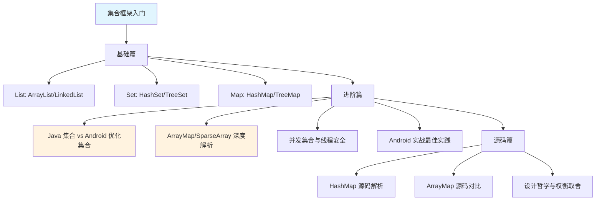

# Java 集合框架（Collection Framework）

> **Android 开发者视角**：学习 Java 集合的核心目的是理解为什么 Android 要"重新发明轮子"——ArrayMap、SparseArray 这些 Android 专属集合，究竟比 Java 原生集合好在哪里？

## 为什么 Android 开发者要学集合框架？

```
你可能会问：Android 都有自己的 ArrayMap 了，我还学 HashMap 干嘛？

答案是：不理解 HashMap 的"臃肿"，就不会明白 ArrayMap 的"精妙"。
```

| 学习内容 | Android 中能理解什么 |
|---------|---------------------|
| HashMap 原理 | 为什么 Android 官方推荐用 ArrayMap 替代？省了多少内存？ |
| ArrayList vs LinkedList | RecyclerView 为什么用 ArrayList 而不是 LinkedList？ |
| ConcurrentHashMap | 多线程访问 SharedPreferences 时为什么会 ANR？ |
| 集合遍历 | 为什么 for-each 遍历时删除元素会崩溃？ |

## 学习路线图



## 核心问题预览

在学习过程中，我们会回答这些问题：

### 基础篇问题
1. **List、Set、Map 有什么区别？** 分别适合什么场景？
2. **ArrayList 和 LinkedList 怎么选？** 为什么 Android 几乎只用 ArrayList？
3. **HashMap 的工作原理是什么？** 为什么说它"空间换时间"？
4. **为什么遍历集合时不能直接删除元素？** 什么是 fail-fast 机制？

### 进阶篇问题
5. **ArrayMap 比 HashMap 省多少内存？** 什么时候该用哪个？
6. **SparseArray 家族有哪些？** 为什么能避免装箱开销？
7. **RecyclerView 的数据源为什么用 List？** DiffUtil 对集合有什么要求？
8. **多线程访问集合要注意什么？** ConcurrentHashMap vs Collections.synchronizedMap？

### 源码篇问题
9. **HashMap 为什么要用红黑树？** 链表转红黑树的阈值为什么是 8？
10. **ArrayMap 的二分查找有多快？** 为什么官方说"千条数据以下用 ArrayMap"？
11. **Android 工程师是如何优化内存的？** 从源码看设计哲学

## 集合框架全景图

```
                        ┌─────────────────────────────────────────────────────┐
                        │                  Collection 接口                      │
                        └─────────────────────────────────────────────────────┘
                                    │                           │
                        ┌───────────┴───────────┐   ┌───────────┴───────────┐
                        │      List 接口         │   │       Set 接口         │
                        │    (有序、可重复)       │   │    (无序、不重复)       │
                        └───────────────────────┘   └───────────────────────┘
                                    │                           │
            ┌───────────────────────┼───────────────────────┐   │
            │                       │                       │   │
    ┌───────┴───────┐       ┌───────┴───────┐       ┌───────┴───────┐
    │   ArrayList   │       │  LinkedList   │       │    HashSet    │
    │  (Android 首选) │       │   (少用)      │       │   (基于HashMap) │
    └───────────────┘       └───────────────┘       └───────────────┘

                        ┌─────────────────────────────────────────────────────┐
                        │                    Map 接口                          │
                        │              (键值对、键不重复)                        │
                        └─────────────────────────────────────────────────────┘
                                    │
            ┌───────────────────────┼───────────────────────┐
            │                       │                       │
    ┌───────┴───────┐       ┌───────┴───────┐       ┌───────┴───────┐
    │    HashMap    │       │   TreeMap     │       │  LinkedHashMap │
    │   (Java 默认)  │       │  (有序遍历)    │       │  (保持插入顺序) │
    └───────────────┘       └───────────────┘       └───────────────┘

    ═══════════════════════════════════════════════════════════════════════════
                            Android 优化集合（重点！）
    ═══════════════════════════════════════════════════════════════════════════

    ┌───────────────┐       ┌───────────────┐       ┌───────────────┐
    │   ArrayMap    │       │  SparseArray  │       │SparseBoolArray│
    │ (替代 HashMap) │       │ (int→Object)  │       │ (int→boolean) │
    └───────────────┘       └───────────────┘       └───────────────┘
            │                       │                       │
            └───────────────────────┴───────────────────────┘
                                    │
                        ┌───────────┴───────────┐
                        │  Android 专为移动设备   │
                        │  优化的集合，更省内存    │
                        └───────────────────────┘
```

## 快速对比：Java 集合 vs Android 优化集合

| 对比项 | Java HashMap | Android ArrayMap |
|-------|-------------|------------------|
| 内存占用 | 较大（Entry 对象开销） | 较小（两个数组存储） |
| 查找速度 | O(1) 哈希查找 | O(log n) 二分查找 |
| 适用场景 | 数据量大（>1000） | 数据量小（<1000） |
| Android 推荐度 | ⭐⭐ | ⭐⭐⭐⭐⭐ |

| 对比项 | Java HashMap<Integer, Object> | Android SparseArray |
|-------|------------------------------|---------------------|
| 键类型 | Integer（装箱） | int（原始类型） |
| 内存占用 | Integer 对象 + Entry 开销 | 无装箱开销 |
| GC 压力 | 较大 | 很小 |
| Android 推荐度 | ⭐ | ⭐⭐⭐⭐⭐ |

## 文档导航

| 文档 | 内容 | 适合谁 |
|-----|------|-------|
| [1-基础篇](./1-基础篇.md) | 集合框架入门、核心概念、基本用法 | 刚接触集合的开发者 |
| [2-进阶篇](./2-进阶篇.md) | Android 优化集合、性能对比、实战经验 | 想写出高性能代码的开发者 |
| [3-源码篇](./3-源码篇.md) | HashMap/ArrayMap 源码分析、设计哲学 | 想深入理解原理的开发者 |

## Android 开发中的集合选择速查

```kotlin
// 🎯 Android 集合选择决策树

when {
    // 场景1：键是 int 类型
    键是Int -> {
        when (值类型) {
            Object -> SparseArray<V>()      // int → Object
            Int -> SparseIntArray()          // int → int
            Long -> SparseLongArray()        // int → long
            Boolean -> SparseBooleanArray()  // int → boolean
        }
    }
    
    // 场景2：键是 Long 类型
    键是Long -> LongSparseArray<V>()         // long → Object
    
    // 场景3：键是 Object 类型
    键是Object -> {
        when {
            数据量 < 1000 -> ArrayMap<K, V>()    // 小数据量首选
            数据量 >= 1000 -> HashMap<K, V>()    // 大数据量用 HashMap
            需要保持顺序 -> LinkedHashMap<K, V>()
            需要排序 -> TreeMap<K, V>()
        }
    }
    
    // 场景4：列表
    需要List -> ArrayList<T>()  // Android 几乎只用 ArrayList
}
```

---

_开始学习：[1-基础篇](./1-基础篇.md) →_
