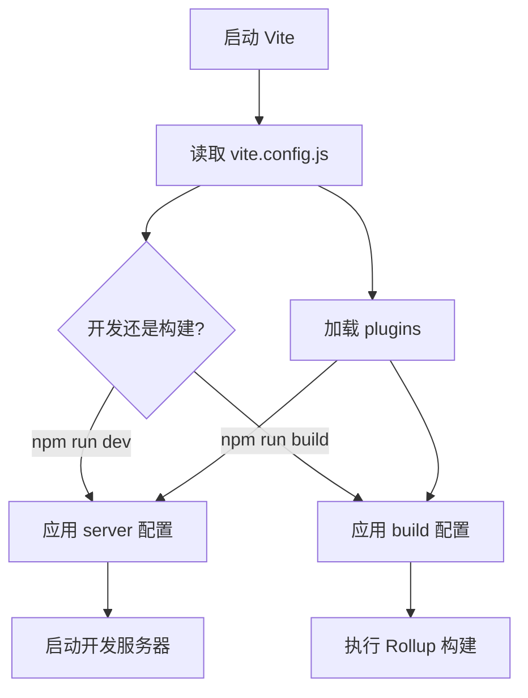

# vite.config.js 完整配置 (Vite Configuration)

## 1. 解决什么问题？
> 一个配置文件，掌控整个项目的构建行为

* **痛点**：项目需要自定义开发服务器端口、配置路径别名、设置代理、调整构建选项，但不知道如何配置
* **作用**：vite.config.js 是 Vite 的核心配置文件，通过它可以定制开发和构建的各种行为

## 2. 通俗理解

### 核心定义
`vite.config.js` 是 Vite 项目的配置中心，采用 ES Module 格式导出配置对象。它决定了开发服务器如何运行、代码如何构建、模块如何解析等核心行为。

### 生活化比喻
把 `vite.config.js` 想象成汽车的控制面板：
- `server` 配置 = 驾驶模式设置（运动模式、经济模式）
- `build` 配置 = 车辆性能参数（最高速度、油耗）
- `resolve.alias` = 导航快捷方式（回家、去公司）
- `plugins` = 车载配件（行车记录仪、倒车雷达）

## 3. 工作原理



## 4. 核心代码实战

### 业务场景：企业级 Vue 3 项目配置

```javascript
// vite.config.js
import { defineConfig, loadEnv } from 'vite'
import vue from '@vitejs/plugin-vue'
import { resolve } from 'path'

// defineConfig 提供类型提示，开发体验更好
export default defineConfig(({ command, mode }) => {
  // 加载环境变量
  const env = loadEnv(mode, process.cwd())

  return {
    // 项目根目录，默认为 process.cwd()
    root: './',

    // 部署的基础路径，类似 webpack 的 publicPath
    // 开发环境用 '/'，生产环境可能部署在子目录
    base: command === 'serve' ? '/' : '/my-app/',

    // 插件配置
    plugins: [vue()],

    // 模块解析配置
    resolve: {
      // 路径别名，告别 '../../../' 地狱
      alias: {
        '@': resolve(__dirname, 'src'),
        '@components': resolve(__dirname, 'src/components'),
        '@utils': resolve(__dirname, 'src/utils'),
      },
      // 导入时可省略的扩展名
      extensions: ['.js', '.ts', '.jsx', '.tsx', '.json', '.vue']
    }
  }
})
```

### 开发服务器配置

```javascript
// vite.config.js - server 配置部分
export default defineConfig({
  server: {
    // 服务器监听的端口
    port: 3000,

    // 端口被占用时是否自动尝试下一个
    strictPort: false,

    // 启动时自动打开浏览器
    open: true,

    // 允许的来源，解决跨域问题
    cors: true,

    // API 代理配置，解决开发环境跨域
    proxy: {
      // 字符串简写
      '/foo': 'http://localhost:4567',

      // 完整配置
      '/api': {
        target: 'http://api.example.com',
        changeOrigin: true,  // 修改请求头中的 origin
        rewrite: (path) => path.replace(/^\/api/, ''),
        // 如果是 https 接口，需要配置
        // secure: false
      },

      // 正则匹配多个路径
      '^/api/.*': {
        target: 'http://api.example.com',
        changeOrigin: true,
      }
    },

    // 预热常用文件，加快首次访问速度
    warmup: {
      clientFiles: ['./src/main.ts', './src/App.vue']
    }
  }
})
```

### 构建配置

```javascript
// vite.config.js - build 配置部分
export default defineConfig({
  build: {
    // 输出目录
    outDir: 'dist',

    // 静态资源目录（相对于 outDir）
    assetsDir: 'assets',

    // 小于此大小的资源将内联为 base64
    assetsInlineLimit: 4096,  // 4kb

    // 是否生成 sourcemap
    sourcemap: false,  // 生产环境建议关闭

    // 压缩方式：'esbuild'（快）或 'terser'（小）
    minify: 'esbuild',

    // 构建后是否自动清空 outDir
    emptyOutDir: true,

    // Rollup 配置
    rollupOptions: {
      // 多入口配置
      input: {
        main: resolve(__dirname, 'index.html'),
        // admin: resolve(__dirname, 'admin.html'),
      },

      // 输出配置
      output: {
        // 手动分包策略
        manualChunks: {
          // 将 vue 相关包打包到 vue-vendor
          'vue-vendor': ['vue', 'vue-router', 'pinia'],
          // UI 组件库单独打包
          'ui-vendor': ['element-plus'],
        },
        // 自定义 chunk 文件名
        chunkFileNames: 'js/[name]-[hash].js',
        // 入口文件名
        entryFileNames: 'js/[name]-[hash].js',
        // 静态资源文件名
        assetFileNames: '[ext]/[name]-[hash].[ext]'
      }
    },

    // 触发警告的 chunk 大小阈值（kb）
    chunkSizeWarningLimit: 500
  }
})
```

## 5. 最佳实践

### 性能考虑
- **开发环境**：不要过度配置，保持 Vite 默认的高速体验
- **生产环境**：合理配置分包策略，避免单个 chunk 过大
- **代理配置**：只配置必要的代理路径，避免全量代理

### 注意事项
- **路径别名**：配置 alias 后，记得同步修改 `tsconfig.json` 的 `paths`
- **base 路径**：生产环境的 base 要与实际部署路径一致
- **sourcemap**：生产环境建议关闭，或使用 `'hidden'` 模式

### 边界情况
```javascript
// 条件配置：根据命令和模式返回不同配置
export default defineConfig(({ command, mode }) => {
  if (command === 'serve') {
    // 开发环境特有配置
    return { /* dev config */ }
  } else {
    // 构建环境特有配置
    return { /* build config */ }
  }
})
```

## 6. 常见错误与解决方案

### 错误 1：路径别名不生效
```javascript
// ❌ 错误：使用相对路径
alias: {
  '@': './src'
}

// ✅ 正确：使用绝对路径
alias: {
  '@': resolve(__dirname, 'src')
}
```

### 错误 2：代理配置无效
```javascript
// ❌ 错误：target 末尾带斜杠导致路径问题
proxy: {
  '/api': {
    target: 'http://api.example.com/',  // 末尾斜杠可能导致问题
  }
}

// ✅ 正确：target 末尾不带斜杠
proxy: {
  '/api': {
    target: 'http://api.example.com',
    changeOrigin: true
  }
}
```

### 错误 3：TypeScript 路径提示失效
```json
// tsconfig.json 需要同步配置
{
  "compilerOptions": {
    "baseUrl": ".",
    "paths": {
      "@/*": ["src/*"],
      "@components/*": ["src/components/*"]
    }
  }
}
```

## 7. 扩展思考

### 配置文件格式
Vite 支持多种配置文件格式：
- `vite.config.js` - 标准 JavaScript
- `vite.config.ts` - TypeScript（推荐，有类型提示）
- `vite.config.mjs` - ES Module 格式
- `vite.config.cjs` - CommonJS 格式

### 相关 API
- `defineConfig()` - 提供类型提示的辅助函数
- `loadEnv()` - 加载环境变量
- `mergeConfig()` - 合并多个配置
- `searchForWorkspaceRoot()` - 查找工作区根目录

### 进阶资源
- [Vite 配置文档](https://cn.vitejs.dev/config/)
- [Rollup 输出选项](https://rollupjs.org/configuration-options/)
- [esbuild 选项](https://esbuild.github.io/api/)

---
_本文档基于 Vite 5.x 版本编写，将持续更新_
