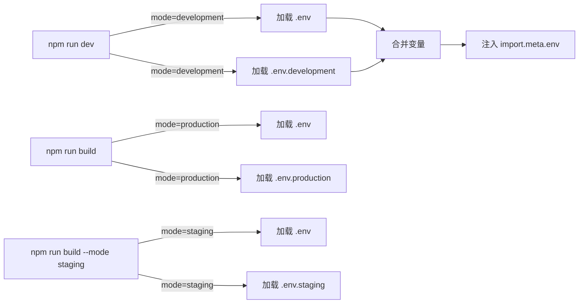

# 环境变量与模式 (Environment Variables and Modes)

## 1. 解决什么问题？
> 一套机制，让同一份代码在不同环境下表现不同

* **痛点**：开发环境用本地 API，测试环境用测试服务器，生产环境用正式服务器，如何优雅切换？
* **作用**：通过环境变量和模式机制，实现配置与代码分离，不同环境自动加载不同配置

## 2. 通俗理解

### 核心定义
环境变量是运行时可访问的配置值，模式（Mode）决定了加载哪组环境变量。Vite 通过 `.env` 文件管理环境变量，通过 `--mode` 参数切换模式。

### 生活化比喻
把环境变量想象成手机的情景模式：
- **开发模式** = 普通模式（声音大、屏幕亮）
- **生产模式** = 会议模式（静音、省电）
- **测试模式** = 勿扰模式（只接收重要通知）

切换模式时，相关设置自动改变，无需手动一个个调整。

## 3. 工作原理



### 加载优先级（后者覆盖前者）
1. `.env` - 所有模式都加载
2. `.env.local` - 所有模式都加载，被 git 忽略
3. `.env.[mode]` - 特定模式加载
4. `.env.[mode].local` - 特定模式加载，被 git 忽略

## 4. 核心代码实战

### 业务场景：多环境 API 配置

#### 环境变量文件

```bash
# .env（所有环境的公共配置）
VITE_APP_TITLE=我的应用
VITE_APP_VERSION=1.0.0
```

```bash
# .env.development（开发环境）
VITE_API_BASE_URL=http://localhost:3000/api
VITE_DEBUG_MODE=true
VITE_MOCK_ENABLED=true
```

```bash
# .env.production（生产环境）
VITE_API_BASE_URL=https://api.example.com
VITE_DEBUG_MODE=false
VITE_MOCK_ENABLED=false
```

```bash
# .env.staging（测试环境 - 自定义模式）
VITE_API_BASE_URL=https://staging-api.example.com
VITE_DEBUG_MODE=true
VITE_MOCK_ENABLED=false
```

#### 代码中使用

```typescript
// src/config/index.ts
// 所有 VITE_ 开头的变量都可以通过 import.meta.env 访问
export const config = {
  apiBaseUrl: import.meta.env.VITE_API_BASE_URL,
  appTitle: import.meta.env.VITE_APP_TITLE,
  isDebug: import.meta.env.VITE_DEBUG_MODE === 'true',
  isMockEnabled: import.meta.env.VITE_MOCK_ENABLED === 'true',

  // 内置环境变量
  mode: import.meta.env.MODE,           // 当前模式
  isDev: import.meta.env.DEV,           // 是否开发环境
  isProd: import.meta.env.PROD,         // 是否生产环境
  baseUrl: import.meta.env.BASE_URL,    // 部署的基础路径
}
```

```typescript
// src/utils/request.ts
import { config } from '@/config'

// 根据环境自动切换 API 地址
const request = axios.create({
  baseURL: config.apiBaseUrl,
  timeout: config.isDev ? 30000 : 10000,  // 开发环境超时时间长一点
})

// 只在开发环境打印日志
if (config.isDebug) {
  request.interceptors.response.use(
    response => {
      console.log('[Response]', response.config.url, response.data)
      return response
    }
  )
}
```

### package.json 脚本配置

```json
{
  "scripts": {
    "dev": "vite",
    "build": "vite build",
    "build:staging": "vite build --mode staging",
    "build:test": "vite build --mode test",
    "preview": "vite preview"
  }
}
```

### TypeScript 类型支持

```typescript
// src/env.d.ts
/// <reference types="vite/client" />

interface ImportMetaEnv {
  readonly VITE_API_BASE_URL: string
  readonly VITE_APP_TITLE: string
  readonly VITE_DEBUG_MODE: string
  readonly VITE_MOCK_ENABLED: string
}

interface ImportMeta {
  readonly env: ImportMetaEnv
}
```

## 5. 最佳实践

### 性能考虑
- **编译时替换**：`import.meta.env.VITE_*` 在构建时会被静态替换，不会增加运行时开销
- **Tree Shaking**：基于环境变量的条件代码，在生产构建时会被正确移除

```javascript
// 这段代码在生产环境会被完全移除
if (import.meta.env.DEV) {
  console.log('开发环境调试信息')
}
```

### 注意事项
- **必须 VITE_ 前缀**：只有 `VITE_` 开头的变量才会暴露给客户端
- **字符串类型**：所有环境变量的值都是字符串，需要手动转换类型
- **不要存敏感信息**：客户端代码会暴露环境变量，密钥等敏感信息要放服务端

### 边界情况

```javascript
// vite.config.js 中访问环境变量
import { defineConfig, loadEnv } from 'vite'

export default defineConfig(({ mode }) => {
  // 配置文件中不能直接用 import.meta.env
  // 需要用 loadEnv 手动加载
  const env = loadEnv(mode, process.cwd(), '')

  return {
    define: {
      // 注入自定义全局常量
      __APP_VERSION__: JSON.stringify(env.npm_package_version),
    }
  }
})
```

## 6. 常见错误与解决方案

### 错误 1：环境变量未定义

```javascript
// ❌ 错误：忘记 VITE_ 前缀
// .env
API_URL=http://localhost:3000
// 代码中访问 import.meta.env.API_URL 是 undefined

// ✅ 正确：添加 VITE_ 前缀
// .env
VITE_API_URL=http://localhost:3000
```

### 错误 2：布尔值比较错误

```javascript
// ❌ 错误：直接当布尔值用
if (import.meta.env.VITE_DEBUG_MODE) {
  // 'false' 字符串也是 truthy！
}

// ✅ 正确：显式比较字符串
if (import.meta.env.VITE_DEBUG_MODE === 'true') {
  // ...
}
```

### 错误 3：.env.local 被提交到 Git

```gitignore
# .gitignore
# 本地环境变量不应该提交
.env.local
.env.*.local
```

## 7. 扩展思考

### 内置环境变量

| 变量 | 类型 | 说明 |
|------|------|------|
| `import.meta.env.MODE` | string | 当前运行模式 |
| `import.meta.env.BASE_URL` | string | 部署的基础 URL |
| `import.meta.env.PROD` | boolean | 是否生产环境 |
| `import.meta.env.DEV` | boolean | 是否开发环境 |
| `import.meta.env.SSR` | boolean | 是否服务端渲染 |

### HTML 中使用环境变量

```html
<!-- index.html -->
<title>%VITE_APP_TITLE%</title>
<link rel="icon" href="%BASE_URL%favicon.ico" />
```

### 进阶：动态环境变量

```javascript
// vite.config.js
export default defineConfig({
  define: {
    // 注入构建时间
    __BUILD_TIME__: JSON.stringify(new Date().toISOString()),
    // 注入 Git 版本
    __GIT_HASH__: JSON.stringify(
      process.env.GIT_HASH || 'development'
    ),
  }
})
```

### 相关资源
- [Vite 环境变量文档](https://cn.vitejs.dev/guide/env-and-mode.html)
- [dotenv 规范](https://github.com/motdotla/dotenv)

---
_本文档基于 Vite 5.x 版本编写，将持续更新_
