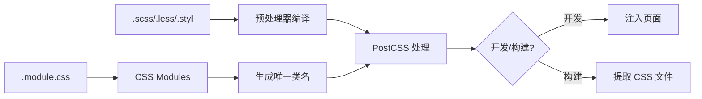

# CSS 预处理器与模块化 (CSS Pre-processors and Modules)

## 1. 解决什么问题？
> 让 CSS 开发更高效、更模块化、更易维护

* **痛点**：原生 CSS 缺乏变量、嵌套、函数等特性；全局样式容易冲突；样式难以复用
* **作用**：Vite 原生支持 CSS 预处理器，提供 CSS Modules 实现样式隔离，自动处理 PostCSS

## 2. 通俗理解

### 核心定义
CSS 预处理器（Sass/Less/Stylus）为 CSS 添加编程特性，CSS Modules 实现类名局部作用域。Vite 对这些功能提供开箱即用的支持，只需安装对应依赖即可。

### 生活化比喻
- **原生 CSS** = 手写信件，每封都要重新写地址
- **CSS 预处理器** = 有模板的信纸，常用内容可以预设
- **CSS Modules** = 给每封信编号的信封，确保不会送错人

## 3. 工作原理



## 4. 核心代码实战

### 业务场景：企业级管理系统样式架构

#### 安装预处理器

```bash
# 安装 Sass（推荐）
npm install -D sass

# 或安装 Less
npm install -D less

# 或安装 Stylus
npm install -D stylus
```

#### 全局样式变量

```scss
// src/styles/variables.scss
// 颜色系统
$primary-color: #409eff;
$success-color: #67c23a;
$warning-color: #e6a23c;
$danger-color: #f56c6c;
$text-color: #303133;

// 间距系统
$spacing-xs: 4px;
$spacing-sm: 8px;
$spacing-md: 16px;
$spacing-lg: 24px;
$spacing-xl: 32px;

// 圆角
$border-radius-sm: 4px;
$border-radius-md: 8px;
$border-radius-lg: 16px;

// 阴影
$shadow-sm: 0 2px 4px rgba(0, 0, 0, 0.1);
$shadow-md: 0 4px 12px rgba(0, 0, 0, 0.15);
```

```scss
// src/styles/mixins.scss
// 常用混入
@mixin flex-center {
  display: flex;
  justify-content: center;
  align-items: center;
}

@mixin text-ellipsis($lines: 1) {
  @if $lines == 1 {
    overflow: hidden;
    text-overflow: ellipsis;
    white-space: nowrap;
  } @else {
    display: -webkit-box;
    -webkit-line-clamp: $lines;
    -webkit-box-orient: vertical;
    overflow: hidden;
  }
}

// 响应式断点
@mixin respond-to($breakpoint) {
  @if $breakpoint == 'mobile' {
    @media (max-width: 768px) { @content; }
  } @else if $breakpoint == 'tablet' {
    @media (max-width: 1024px) { @content; }
  } @else if $breakpoint == 'desktop' {
    @media (min-width: 1025px) { @content; }
  }
}
```

#### vite.config.js 配置

```javascript
// vite.config.js
export default defineConfig({
  css: {
    // 预处理器配置
    preprocessorOptions: {
      scss: {
        // 自动导入全局变量和混入
        // 每个 scss 文件都会自动包含这些内容
        additionalData: `
          @use "@/styles/variables" as *;
          @use "@/styles/mixins" as *;
        `,
        // Sass API 选择（新版推荐 modern-compiler）
        api: 'modern-compiler'
      },
      less: {
        // Less 变量
        modifyVars: {
          'primary-color': '#409eff',
        },
        javascriptEnabled: true,
      }
    },

    // CSS Modules 配置
    modules: {
      // 类名生成规则
      generateScopedName: '[name]__[local]___[hash:base64:5]',
      // 类名转换：camelCase 允许用驼峰访问
      localsConvention: 'camelCaseOnly'
    },

    // PostCSS 配置（也可以用 postcss.config.js）
    postcss: {
      plugins: [
        // 自动添加浏览器前缀
        require('autoprefixer')({
          overrideBrowserslist: ['> 1%', 'last 2 versions']
        })
      ]
    },

    // 开发时启用 sourcemap
    devSourcemap: true
  }
})
```

### CSS Modules 使用

```js
<!-- src/components/UserCard.vue -->
<script setup lang="ts">
// 导入 CSS Modules
import styles from './UserCard.module.scss'

defineProps<{
  name: string
  avatar: string
}>()
</script>

<template>
  <!-- 使用 $style 或导入的 styles -->
  <div :class="styles.card">
    
    <span :class="styles.userName">{{ name }}</span>

    <!-- 多个类名 -->
    <button :class="[styles.btn, styles.btnPrimary]">
      关注
    </button>

    <!-- 条件类名 -->
    <span :class="{ [styles.active]: isActive }">状态</span>
  </div>
</template>

<style module lang="scss">
/* 使用 <style module> 可以通过 $style 访问 */
.card {
  padding: $spacing-md;
  border-radius: $border-radius-md;
  box-shadow: $shadow-sm;
  @include flex-center;
  flex-direction: column;
}

.avatar {
  width: 80px;
  height: 80px;
  border-radius: 50%;
}

.userName {
  color: $text-color;
  font-size: 16px;
  @include text-ellipsis;
}

.btn {
  padding: $spacing-sm $spacing-md;
  border-radius: $border-radius-sm;
  cursor: pointer;

  &Primary {
    background: $primary-color;
    color: white;
  }
}
</style>
```

```scss
// src/components/UserCard.module.scss（独立文件方式）
.card {
  // 局部类名，编译后变成 UserCard_card_xxx
  padding: 16px;

  // 使用 :global 定义全局类名
  :global(.icon) {
    margin-right: 8px;
  }

  // 组合其他模块的类
  composes: flexCenter from '@/styles/common.module.scss';
}
```

### PostCSS 配置

```javascript
// postcss.config.js
export default {
  plugins: {
    // 自动前缀
    autoprefixer: {},

    // CSS 嵌套（原生 CSS 也能用嵌套语法）
    'postcss-nesting': {},

    // px 转 rem（移动端适配）
    'postcss-pxtorem': {
      rootValue: 16,
      propList: ['*'],
      selectorBlackList: ['.norem']  // 忽略 .norem 类
    },

    // 生产环境压缩
    ...(process.env.NODE_ENV === 'production'
      ? { cssnano: {} }
      : {})
  }
}
```

## 5. 最佳实践

### 性能考虑
- **避免过深嵌套**：Sass 嵌套不超过 3 层，生成的选择器更简洁
- **按需导入变量**：使用 `@use` 而非 `@import`，避免重复编译
- **代码分割**：路由组件的样式会自动与组件一起懒加载

### 注意事项
- **CSS Modules 命名**：文件必须是 `.module.css` 或 `.module.scss` 后缀
- **全局样式**：在 `main.ts` 中导入全局样式，或使用 `:global` 选择器
- **Sass 新 API**：Vite 5.4+ 默认使用 `sass` 而非 `sass-embedded`

### 样式架构建议

```
src/styles/
├── variables.scss    # 变量定义
├── mixins.scss       # 混入函数
├── reset.scss        # 重置样式
├── global.scss       # 全局样式（导入其他文件）
└── common.module.scss # 公共可组合的模块化类
```

## 6. 常见错误与解决方案

### 错误 1：全局变量未生效

```javascript
// ❌ 错误：旧版 @import 语法在某些情况下有问题
additionalData: `@import "@/styles/variables.scss";`

// ✅ 正确：使用 @use 语法
additionalData: `@use "@/styles/variables" as *;`
```

### 错误 2：CSS Modules 类名访问失败

```js
<!-- ❌ 错误：直接使用类名字符串 -->
<div class="card">

<!-- ✅ 正确：通过 styles 对象访问 -->
<div :class="styles.card">

<!-- ✅ 或使用 <style module> -->
<div :class="$style.card">
```

### 错误 3：预处理器未安装

```bash
# 报错：[plugin:vite:css] Preprocessor dependency "sass" not found

# 解决：安装对应预处理器
npm install -D sass
```

## 7. 扩展思考

### CSS 与 CSS Modules 对比

| 特性 | 普通 CSS | CSS Modules |
|------|----------|-------------|
| 作用域 | 全局 | 局部 |
| 类名 | 原样输出 | 哈希处理 |
| 引用方式 | 字符串 | 对象属性 |
| 样式冲突 | 可能 | 避免 |
| IDE 支持 | 好 | 需要插件 |

### Tailwind CSS 集成

```javascript
// vite.config.js
export default defineConfig({
  css: {
    postcss: {
      plugins: [
        require('tailwindcss'),
        require('autoprefixer'),
      ]
    }
  }
})
```

### 相关资源
- [Vite CSS 功能](https://cn.vitejs.dev/guide/features.html#css)
- [CSS Modules 规范](https://github.com/css-modules/css-modules)
- [Sass 官方文档](https://sass-lang.com/)
- [PostCSS 插件](https://www.postcss.parts/)

---
_本文档基于 Vite 5.x 版本编写，将持续更新_
