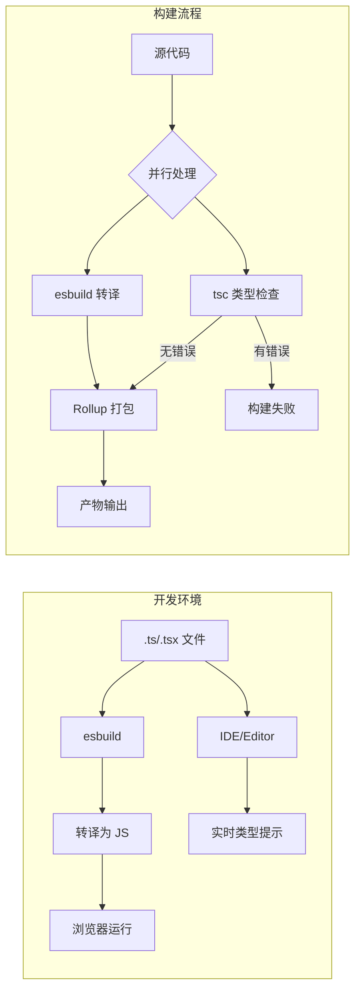

# TypeScript 集成 (TypeScript Integration)

## 1. 解决什么问题？
> 让 TypeScript 在 Vite 项目中既快又准：开发时极速编译，构建时严格类型检查。

* **痛点**：传统 TypeScript 编译慢，类型检查阻塞构建流程
* **作用**：Vite 使用 esbuild 转译 TS（快），独立运行类型检查（准），两全其美

## 2. 通俗理解

### 核心定义
Vite 对 TypeScript 的处理分为两步：
1. **转译**（Transpile）：使用 esbuild 将 TS 转为 JS，极速但不检查类型
2. **类型检查**（Type Check）：使用 tsc / vue-tsc 独立检查类型，确保代码正确

### 生活化比喻
想象你在写作业：
- **esbuild** 是一个只管抄写不管对错的快速打字员（转译快）
- **tsc** 是一个仔细检查每道题的老师（类型检查准）

Vite 的策略是：让打字员先快速完成，老师在旁边同时检查，不互相阻塞。

## 3. 工作原理



## 4. 核心代码实战

### 4.1 基础 tsconfig.json 配置

**tsconfig.json（项目根目录）：**

```json
{
  "compilerOptions": {
    // 编译目标
    "target": "ES2020",
    "useDefineForClassFields": true,
    "lib": ["ES2020", "DOM", "DOM.Iterable"],

    // 模块系统
    "module": "ESNext",
    "moduleResolution": "bundler",
    "allowImportingTsExtensions": true,
    "resolveJsonModule": true,
    "isolatedModules": true,
    "noEmit": true,

    // 严格模式（推荐全部开启）
    "strict": true,
    "noUnusedLocals": true,
    "noUnusedParameters": true,
    "noFallthroughCasesInSwitch": true,

    // 路径别名
    "baseUrl": ".",
    "paths": {
      "@/*": ["src/*"],
      "@components/*": ["src/components/*"],
      "@utils/*": ["src/utils/*"]
    },

    // 跳过库的类型检查（加速）
    "skipLibCheck": true
  },
  "include": ["src/**/*.ts", "src/**/*.tsx", "src/**/*.vue"],
  "exclude": ["node_modules", "dist"]
}
```

**tsconfig.node.json（Node 环境配置文件）：**

```json
{
  "compilerOptions": {
    "composite": true,
    "skipLibCheck": true,
    "module": "ESNext",
    "moduleResolution": "bundler",
    "allowSyntheticDefaultImports": true,
    "strict": true
  },
  "include": ["vite.config.ts"]
}
```

### 4.2 Vue 项目 TypeScript 配置

**tsconfig.json：**

```json
{
  "compilerOptions": {
    "target": "ES2020",
    "useDefineForClassFields": true,
    "module": "ESNext",
    "lib": ["ES2020", "DOM", "DOM.Iterable"],
    "skipLibCheck": true,

    "moduleResolution": "bundler",
    "allowImportingTsExtensions": true,
    "resolveJsonModule": true,
    "isolatedModules": true,
    "noEmit": true,
    "jsx": "preserve",  // Vue 使用 preserve

    "strict": true,
    "noUnusedLocals": true,
    "noUnusedParameters": true,
    "noFallthroughCasesInSwitch": true,

    "baseUrl": ".",
    "paths": {
      "@/*": ["src/*"]
    }
  },
  "include": ["src/**/*.ts", "src/**/*.tsx", "src/**/*.vue"],
  "references": [{ "path": "./tsconfig.node.json" }]
}
```

**Vue 类型检查脚本（package.json）：**

```json
{
  "scripts": {
    "dev": "vite",
    "build": "vue-tsc -b && vite build",
    "type-check": "vue-tsc --noEmit",
    "preview": "vite preview"
  }
}
```

### 4.3 React 项目 TypeScript 配置

**tsconfig.json：**

```json
{
  "compilerOptions": {
    "target": "ES2020",
    "useDefineForClassFields": true,
    "lib": ["ES2020", "DOM", "DOM.Iterable"],
    "module": "ESNext",
    "skipLibCheck": true,

    "moduleResolution": "bundler",
    "allowImportingTsExtensions": true,
    "resolveJsonModule": true,
    "isolatedModules": true,
    "noEmit": true,
    "jsx": "react-jsx",  // React 17+ 使用新的 JSX 转换

    "strict": true,
    "noUnusedLocals": true,
    "noUnusedParameters": true,
    "noFallthroughCasesInSwitch": true,

    "baseUrl": ".",
    "paths": {
      "@/*": ["src/*"]
    }
  },
  "include": ["src"],
  "references": [{ "path": "./tsconfig.node.json" }]
}
```

### 4.4 Vite 环境类型声明

**src/vite-env.d.ts：**

```typescript
/// <reference types="vite/client" />

// 环境变量类型
interface ImportMetaEnv {
  readonly VITE_APP_TITLE: string
  readonly VITE_API_URL: string
  readonly VITE_APP_VERSION: string
  // 更多环境变量...
}

interface ImportMeta {
  readonly env: ImportMetaEnv
}

// 静态资源导入类型
declare module '*.svg' {
  const content: string
  export default content
}

declare module '*.png' {
  const content: string
  export default content
}

declare module '*.jpg' {
  const content: string
  export default content
}

// CSS Modules 类型
declare module '*.module.css' {
  const classes: { readonly [key: string]: string }
  export default classes
}

declare module '*.module.scss' {
  const classes: { readonly [key: string]: string }
  export default classes
}

// Vue 组件类型（Vue 项目需要）
declare module '*.vue' {
  import type { DefineComponent } from 'vue'
  const component: DefineComponent<{}, {}, any>
  export default component
}
```

### 4.5 路径别名类型支持

**问题：Vite 和 TypeScript 都需要配置路径别名**

**vite.config.ts：**

```typescript
import { defineConfig } from 'vite'
import { resolve } from 'path'

export default defineConfig({
  resolve: {
    alias: {
      '@': resolve(__dirname, 'src'),
      '@components': resolve(__dirname, 'src/components'),
      '@hooks': resolve(__dirname, 'src/hooks'),
      '@utils': resolve(__dirname, 'src/utils'),
      '@types': resolve(__dirname, 'src/types'),
    }
  }
})
```

**tsconfig.json 同步配置：**

```json
{
  "compilerOptions": {
    "baseUrl": ".",
    "paths": {
      "@/*": ["src/*"],
      "@components/*": ["src/components/*"],
      "@hooks/*": ["src/hooks/*"],
      "@utils/*": ["src/utils/*"],
      "@types/*": ["src/types/*"]
    }
  }
}
```

### 4.6 类型检查集成到构建流程

**方案一：构建前检查（推荐）**

```json
{
  "scripts": {
    "build": "tsc --noEmit && vite build",
    "build:vue": "vue-tsc -b && vite build"
  }
}
```

**方案二：使用 vite-plugin-checker 实时检查**

```bash
npm install -D vite-plugin-checker
```

```typescript
import { defineConfig } from 'vite'
import checker from 'vite-plugin-checker'

export default defineConfig({
  plugins: [
    checker({
      typescript: true,  // 启用 TypeScript 检查
      // vueTsc: true,    // Vue 项目使用这个
      overlay: {
        initialIsOpen: false,  // 错误浮层默认关闭
      }
    })
  ]
})
```

### 4.7 类型定义最佳实践

**src/types/index.ts：**

```typescript
// API 响应类型
export interface ApiResponse<T = any> {
  code: number
  data: T
  message: string
}

// 分页参数
export interface PaginationParams {
  page: number
  pageSize: number
}

// 分页响应
export interface PaginatedData<T> {
  list: T[]
  total: number
  page: number
  pageSize: number
}

// 用户类型
export interface User {
  id: string
  name: string
  email: string
  avatar?: string
  role: 'admin' | 'user' | 'guest'
  createdAt: string
}

// 表单状态
export interface FormState<T> {
  values: T
  errors: Partial<Record<keyof T, string>>
  touched: Partial<Record<keyof T, boolean>>
  isSubmitting: boolean
  isValid: boolean
}
```

**在组件中使用：**

```typescript
// Vue 组件
<script setup lang="ts">
import type { User, ApiResponse } from '@/types'

const user = ref<User | null>(null)

async function fetchUser(id: string) {
  const res = await fetch(`/api/users/${id}`)
  const data: ApiResponse<User> = await res.json()
  user.value = data.data
}
</script>

// React 组件
import type { User, ApiResponse } from '@/types'

function UserProfile({ userId }: { userId: string }) {
  const [user, setUser] = useState<User | null>(null)

  useEffect(() => {
    fetch(`/api/users/${userId}`)
      .then(res => res.json())
      .then((data: ApiResponse<User>) => setUser(data.data))
  }, [userId])

  return <div>{user?.name}</div>
}
```

### 4.8 严格模式配置详解

```json
{
  "compilerOptions": {
    // 启用所有严格检查
    "strict": true,

    // 严格 null 检查（防止 null/undefined 错误）
    "strictNullChecks": true,

    // 严格函数类型检查
    "strictFunctionTypes": true,

    // 严格绑定检查（this 类型）
    "strictBindCallApply": true,

    // 严格属性初始化检查
    "strictPropertyInitialization": true,

    // 不允许隐式 any
    "noImplicitAny": true,

    // 不允许隐式 this
    "noImplicitThis": true,

    // 额外检查（建议开启）
    "noUnusedLocals": true,           // 不允许未使用的局部变量
    "noUnusedParameters": true,       // 不允许未使用的参数
    "noFallthroughCasesInSwitch": true, // switch 必须有 break
    "noImplicitReturns": true,        // 函数必须有明确返回值
    "noImplicitOverride": true,       // 覆盖方法必须用 override
    "exactOptionalPropertyTypes": true // 严格可选属性类型
  }
}
```

## 5. 最佳实践

### 性能考虑
- **skipLibCheck: true**：跳过 node_modules 中的类型检查，大幅提升速度
- **独立类型检查**：开发时只转译，构建时才检查类型
- **增量编译**：使用 `incremental: true` 启用增量编译

### 注意事项
- **isolatedModules: true**：必须开启，因为 esbuild 是单文件转译
- **路径别名同步**：vite.config.ts 和 tsconfig.json 必须保持一致
- **类型只导入**：使用 `import type` 避免运行时副作用

### 边界情况
- **动态导入类型**：`const module = await import('./module')` 需要类型断言
- **第三方库无类型**：使用 `@types/*` 或创建声明文件

## 6. 常见错误与解决方案

### 错误 1：Cannot find module 'xxx'

```typescript
// ❌ 错误：路径别名只在 Vite 配置，TypeScript 不认识
import { utils } from '@/utils'  // TS 报错

// ✅ 解决：确保 tsconfig.json 也配置了相同的 paths
{
  "compilerOptions": {
    "baseUrl": ".",
    "paths": {
      "@/*": ["src/*"]
    }
  }
}
```

### 错误 2：esbuild 不支持的语法

```typescript
// ❌ 错误：esbuild 不支持 const enum
const enum Direction {
  Up,
  Down
}

// ✅ 解决方案1：使用普通 enum
enum Direction {
  Up,
  Down
}

// ✅ 解决方案2：使用对象常量
const Direction = {
  Up: 0,
  Down: 1
} as const
```

### 错误 3：类型检查通过但运行时报错

```typescript
// ❌ 问题：开发时不检查类型，错误到运行时才发现
function add(a: number, b: number) {
  return a + b
}
add('1', '2')  // esbuild 不报错，但逻辑错误

// ✅ 解决：使用 vite-plugin-checker 开发时实时检查
import checker from 'vite-plugin-checker'

export default defineConfig({
  plugins: [
    checker({ typescript: true })
  ]
})
```

### 错误 4：找不到全局类型声明

```typescript
// ❌ 错误：使用了全局类型但 TypeScript 找不到
const user: User = { ... }  // Error: Cannot find name 'User'

// ✅ 解决：创建全局类型声明文件
// src/types/global.d.ts
declare global {
  interface User {
    id: string
    name: string
  }
}
export {}  // 确保这是一个模块
```

## 7. 扩展思考

### 进阶配置

**1. 使用 Project References（大型项目）：**

```json
// tsconfig.json
{
  "files": [],
  "references": [
    { "path": "./tsconfig.app.json" },
    { "path": "./tsconfig.node.json" }
  ]
}

// tsconfig.app.json
{
  "compilerOptions": {
    "composite": true,
    // ...应用配置
  },
  "include": ["src/**/*"]
}
```

**2. 自动生成类型声明（库开发）：**

```typescript
// vite.config.ts
import { defineConfig } from 'vite'
import dts from 'vite-plugin-dts'

export default defineConfig({
  plugins: [
    dts({
      include: ['src/**/*'],
      outDir: 'dist/types'
    })
  ],
  build: {
    lib: {
      entry: 'src/index.ts',
      formats: ['es', 'cjs']
    }
  }
})
```

**3. 类型覆盖率检查：**

```bash
# 安装 type-coverage
npm install -D type-coverage

# 检查类型覆盖率
npx type-coverage --detail
```

### 相关资源
- [TypeScript 官方文档](https://www.typescriptlang.org/docs/)
- [Vite TypeScript 指南](https://cn.vitejs.dev/guide/features.html#typescript)
- [tsconfig 配置详解](https://www.typescriptlang.org/tsconfig)
- [vite-plugin-checker](https://github.com/fi3ework/vite-plugin-checker)

---

_本文档将持续更新，添加更多 TypeScript 集成技巧_
