# Vue 学习路线（Vue Learning Path）

## 什么是 Vue？

### 定义

Vue（Vue.js）是一款用于构建用户界面的**渐进式 JavaScript 框架**，以其易用性、灵活性和高效性著称。它专注于视图层，采用响应式数据绑定和组件化开发模式。

### 通俗理解

可以把 Vue 想象成"乐高积木"，你可以用它拼装出各种网页界面，每个组件就像一块积木，组合起来就是完整的应用。

---

## Vue 知识图谱

```mermaid
graph TD
  A["Vue.js 核心"]
  A1["基础语法"]
  A2["组件系统"]
  A3["响应式原理"]
  A4["指令系统"]
  A5["生命周期"]
  A6["计算属性与侦听器"]
  A7["事件处理"]
  A8["表单处理"]
  A9["条件与列表渲染"]
  A10["插槽（Slot）"]
  A11["自定义指令"]
  A12["过渡与动画"]
  A13["Vue Router"]
  A14["Vuex/Pinia"]
  A15["Composition API"]
  A16["生态工具"]
  A17["SSR/Nuxt"]
  A18["TypeScript 支持"]
  A19["测试与调试"]
  A20["最佳实践与性能优化"]

  A --> A1
  A --> A2
  A --> A3
  A --> A4
  A --> A5
  A --> A6
  A --> A7
  A --> A8
  A --> A9
  A --> A10
  A --> A11
  A --> A12
  A --> A13
  A --> A14
  A --> A15
  A --> A16
  A --> A17
  A --> A18
  A --> A19
  A --> A20
```

---

## 学习路线分阶段

### 1. 入门阶段

- 了解 Vue 的定位与优势
- 学习 Vue 的基础语法（模板语法、指令、数据绑定）
- 理解响应式原理
- 掌握组件化开发
- 熟悉生命周期钩子

### 2. 进阶阶段

- 深入组件通信（props、emit、自定义事件、provide/inject、ref）
- 理解插槽（Slot）和作用域插槽
- 学习 Vue Router 实现单页应用
- 状态管理（Vuex 或 Pinia）
- 过渡与动画效果
- 使用 Composition API（Vue 3）

### 3. 实战阶段

- 项目结构设计与模块化
- 使用 Vue CLI/Vite 构建项目
- 集成 TypeScript
- 服务端渲染（SSR）与 Nuxt.js
- 单元测试与调试（Jest、Vue Test Utils）
- 性能优化与最佳实践

### 4. 生态与扩展

- 常用 UI 组件库（Element Plus、Ant Design Vue、Vuetify）
- 移动端适配（Vant、NutUI）
- 国际化（vue-i18n）
- 与后端 API 交互（axios、fetch）
- 插件开发与生态扩展

---

## 应用场景

- 企业级后台管理系统
- 移动端 H5 应用
- 电商网站
- 内容管理系统（CMS）
- 个人博客/作品集
- 小程序（通过 uni-app、Taro 等）

---

## 优缺点分析

**优点：**

- 学习曲线平滑，文档完善
- 组件化开发，易于维护
- 响应式数据驱动，开发效率高
- 丰富的生态系统

**缺点：**

- 仅关注视图层，需配合其他库实现完整功能
- 大型项目需注意性能优化
- 生态更新较快，需持续学习

---

## 总结

Vue 是一款非常适合前端开发者入门和进阶的框架，拥有完善的生态和社区支持。建议循序渐进，理论结合实战，逐步掌握 Vue 的核心知识和最佳实践。

---

_本文档将持续更新，添加更多相关内容_
