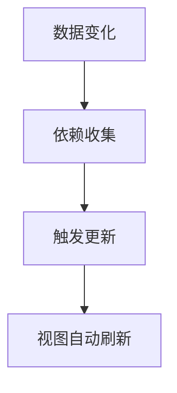

# 响应式原理（Reactivity Principle）

## 什么是响应式原理？

### 定义

响应式原理（Reactivity Principle）是指 Vue 通过特定的技术手段，使数据变化能够自动驱动视图更新的机制。英文原文：Reactivity。

### 通俗理解

可以把响应式系统想象成"自动感应灯"：当你改变数据（开关），灯（界面）会自动亮起或熄灭，无需手动操作 DOM。

## 核心特征/组成部分

- 数据驱动视图：数据变化自动反映到界面
- 依赖收集与追踪：自动追踪哪些地方用到了数据
- 变更侦测：数据变动时自动通知相关视图更新
- 响应式 API：如 Vue 3 的 `ref`、`reactive`、`computed`、`watch`

## 工作原理/实现方式

### Vue 2.x

- 采用 `Object.defineProperty` 劫持对象属性的 getter/setter，实现数据劫持和依赖收集。
- 通过"观察者模式"实现数据与视图的自动同步。
- 局限：无法直接监听数组索引和对象新增属性。

#### 简化原理示例（Vue 2.x）

```js
// 简化版的响应式实现
function defineReactive(obj, key, val) {
  Object.defineProperty(obj, key, {
    get() {
      // 依赖收集（如将当前 watcher 记录下来）
      return val;
    },
    set(newVal) {
      if (newVal !== val) {
        val = newVal;
        // 触发更新（如通知 watcher 执行更新）
        console.log("视图更新:", newVal);
      }
    },
  });
}
const data = {};
defineReactive(data, "msg", "hello");
data.msg = "hi"; // 控制台输出：视图更新: hi
```

### Vue 3.x

- 采用 `Proxy` 实现更彻底的数据劫持，支持对象、数组、Map、Set 等多种数据结构。
- 性能更优，支持更灵活的响应式场景。
- 响应式核心 API：`reactive`（深层响应式）、`ref`（基本类型响应式）、`computed`（计算属性）、`watch`（侦听器）。

#### 更深入的原理说明（Vue 3.x）

- Vue 3 利用 `Proxy` 拦截对象的所有操作（get/set），在读取属性时进行依赖收集，在设置属性时触发依赖更新。
- 依赖收集通过"副作用函数"与"依赖集合"实现，确保只有用到数据的地方才会被更新。

#### 简化原理示例（Vue 3.x）

```js
// 简化版的 Proxy 响应式实现
let activeEffect = null;
function reactive(obj) {
  const depsMap = new Map();
  return new Proxy(obj, {
    get(target, key) {
      if (activeEffect) {
        let deps = depsMap.get(key) || new Set();
        deps.add(activeEffect);
        depsMap.set(key, deps);
      }
      return target[key];
    },
    set(target, key, value) {
      target[key] = value;
      let deps = depsMap.get(key);
      if (deps) {
        deps.forEach((fn) => fn());
      }
      return true;
    },
  });
}
// 使用示例
const state = reactive({ count: 0 });
function effect(fn) {
  activeEffect = fn;
  fn();
  activeEffect = null;
}
effect(() => {
  console.log("视图渲染:", state.count);
});
state.count = 1; // 控制台输出：视图渲染: 1
```

#### 响应式流程简图



## 典型应用场景

- 表单输入与数据联动
- 动态渲染列表、条件内容
- 复杂交互逻辑（如购物车、数据仪表盘）
- 组件间状态共享

## 代码示例

### 1. Vue 3 响应式对象

```vue
<script setup>
import { reactive } from "vue";
const state = reactive({ count: 0 });
function increment() {
  state.count++;
}
</script>
<template>
  <button @click="increment">点击：{{ state.count }}</button>
</template>
```

### 2. ref 与 watch

```vue
<script setup>
import { ref, watch } from "vue";
const name = ref("");
watch(name, (newVal, oldVal) => {
  console.log(`名字从${oldVal}变为${newVal}`);
});
</script>
<template>
  <input v-model="name" placeholder="输入名字" />
</template>
```

## 优缺点分析

**优点：**

- 自动化数据驱动视图，开发效率高
- 代码简洁，易于维护
- 支持复杂数据结构和多层嵌套
- 便于实现响应式编程范式

**缺点：**

- 响应式原理较为抽象，初学者理解有门槛
- 某些边界场景（如深层对象、数组变动）需注意
- 过度依赖响应式可能导致调试困难

## 总结与扩展阅读

Vue 的响应式原理是其高效开发体验的核心。理解其机制有助于编写更健壮、可维护的前端代码。建议结合官方文档和源码深入学习。

- [Vue 官方文档 - 响应式基础](https://cn.vuejs.org/guide/essentials/reactivity-fundamentals.html)
- [Vue 官方文档 - 响应式 API](https://cn.vuejs.org/guide/extras/reactivity-in-depth.html)

---

_本文档将持续更新，添加更多相关内容_
