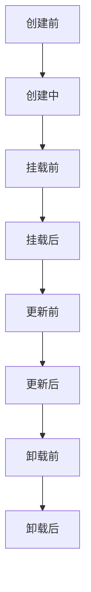

# 生命周期钩子（Lifecycle Hooks）

## 什么是生命周期钩子？

### 定义

生命周期钩子（Lifecycle Hooks）是指 Vue 组件在创建、更新和销毁等不同阶段自动调用的特殊函数，允许开发者在特定时机执行自定义逻辑。英文原文：Lifecycle Hooks。

### 通俗理解

可以把生命周期钩子想象成"成长日记"：每个组件从出生到消亡都会经历一系列重要时刻，开发者可以在这些时刻"插入笔记"或"做点事情"。

## 核心特征/组成部分

- 钩子函数自动触发，无需手动调用
- 覆盖组件的整个生命周期（创建、挂载、更新、卸载）
- 支持组合式 API 和选项式 API
- 常用钩子如：`onMounted`、`onUpdated`、`onUnmounted`、`onBeforeMount`、`onBeforeUpdate`、`onBeforeUnmount` 等

## 工作原理/实现方式

- Vue 在组件实例的不同阶段自动调用对应的生命周期钩子
- 组合式 API（Vue 3）：通过 `onXxx` 函数注册钩子
- 选项式 API（Vue 2/3）：通过组件选项对象中的钩子方法（如 `mounted()`）注册
- 钩子函数内可执行副作用操作，如数据请求、事件监听、定时器等

### 生命周期流程图



## 典型应用场景

- 组件初始化时请求数据
- 组件挂载后操作 DOM
- 组件卸载前清理定时器或事件监听
- 组件更新时执行副作用逻辑

## 代码示例

### 1. 组合式 API 生命周期钩子（Vue 3）

```vue
<script setup>
import { ref, onMounted, onUnmounted } from "vue";
const count = ref(0);
let timer = null;
onMounted(() => {
  timer = setInterval(() => {
    count.value++;
  }, 1000);
});
onUnmounted(() => {
  clearInterval(timer);
});
</script>
<template>
  <div>计数：{{ count }}</div>
</template>
```

### 2. 选项式 API 生命周期钩子（Vue 2/3）

```vue
<template>
  <div>窗口宽度：{{ width }}</div>
</template>
<script>
export default {
  data() {
    return { width: window.innerWidth };
  },
  mounted() {
    window.addEventListener("resize", this.handleResize);
  },
  beforeUnmount() {
    window.removeEventListener("resize", this.handleResize);
  },
  methods: {
    handleResize() {
      this.width = window.innerWidth;
    },
  },
};
</script>
```

## 优缺点分析

**优点：**

- 便于管理副作用和资源释放
- 让组件行为更可控、可维护
- 支持多种注册方式，灵活适配不同开发风格

**缺点：**

- 滥用钩子可能导致逻辑分散、难以维护
- 复杂组件中钩子过多，需注意职责划分

## 总结与扩展阅读

生命周期钩子是 Vue 组件开发的重要机制。合理利用钩子可以提升代码的健壮性和可维护性。建议结合实际项目多加实践。

- [Vue 官方文档 - 生命周期钩子](https://cn.vuejs.org/guide/essentials/lifecycle.html)
- [Vue 官方文档 - 组合式 API 生命周期](https://cn.vuejs.org/guide/essentials/lifecycle.html#lifecycle-hooks)

---

_本文档将持续更新，添加更多相关内容_
