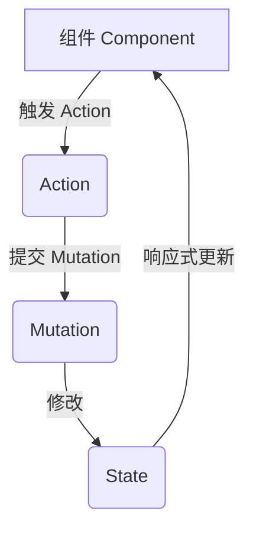

# 状态管理（State Management）——以 Vuex 为例

## 什么是状态管理？

### 定义

状态管理是指在前端应用中，将多个组件间需要共享和同步的数据（状态）集中存储和管理的机制。Vuex 是 Vue 官方提供的专用状态管理库，适用于中大型项目。
英文原文：State Management

### 通俗理解

可以把状态管理比作"公司账本"：每个部门（组件）都能查账、记账，账本（状态）集中管理，避免信息混乱和重复记录。

## 核心特征/组成部分

- **集中式存储**：所有组件共享同一个状态源（Store）
- **单向数据流**：状态的变更有严格流程，数据流动清晰
- **模块化**：支持将状态拆分为多个模块，便于维护
- **插件机制**：支持扩展功能，如持久化、日志等
- **与 Vue 深度集成**：支持响应式、Devtools 调试

## 工作原理/实现方式

Vuex 通过以下几个核心概念组织和管理状态：

- **State**：存储应用的共享数据
- **Getter**：对 State 的派生状态进行计算（类似计算属性）
- **Mutation**：唯一允许修改 State 的方法，必须是同步函数
- **Action**：用于处理异步操作，最终通过提交 Mutation 修改 State
- **Module**：将 Store 拆分为多个子模块，便于大型项目管理

### 数据流动示意图



## 详细使用方法

### 1. 安装与引入

```bash
npm install vuex@next
```

在 Vue 3 项目中创建并注册 Store：

```js
// store/index.js
import { createStore } from "vuex";

const store = createStore({
  state: { count: 0 },
  mutations: {
    increment(state) {
      state.count++;
    },
  },
});

export default store;
```

在 main.js 注册：

```js
import { createApp } from "vue";
import App from "./App.vue";
import store from "./store";

const app = createApp(App);
app.use(store);
app.mount("#app");
```

### 2. State 的使用

```js
// store/index.js
state: {
  count: 0,
  user: { name: '张三', age: 18 }
}
```

组件中访问 State：

```vue
<script setup>
import { useStore } from "vuex";
const store = useStore();
</script>
<template>
  <div>计数：{{ store.state.count }}</div>
  <div>用户名：{{ store.state.user.name }}</div>
</template>
```

### 3. Getter 的使用

```js
// store/index.js
getters: {
  doubleCount(state) {
    return state.count * 2
  }
}
```

组件中访问 Getter：

```vue
<template>
  <div>双倍计数：{{ store.getters.doubleCount }}</div>
</template>
```

### 4. Mutation 的使用

```js
// store/index.js
mutations: {
  increment(state) {
    state.count++
  },
  setUser(state, payload) {
    state.user = payload
  }
}
```

组件中提交 Mutation：

```vue
<template>
  <button @click="store.commit('increment')">加一</button>
  <button @click="updateUser">修改用户</button>
</template>
<script setup>
import { useStore } from "vuex";
const store = useStore();
function updateUser() {
  store.commit("setUser", { name: "李四", age: 20 });
}
</script>
```

### 5. Action 的使用（处理异步）

```js
// store/index.js
actions: {
  asyncIncrement({ commit }) {
    setTimeout(() => {
      commit('increment')
    }, 1000)
  }
}
```

组件中分发 Action：

```vue
<template>
  <button @click="store.dispatch('asyncIncrement')">异步加一</button>
</template>
```

### 6. Module 的使用（模块化）

```js
// store/modules/user.js
export default {
  namespaced: true,
  state: () => ({ name: "张三" }),
  mutations: {
    setName(state, name) {
      state.name = name;
    },
  },
};
```

```js
// store/index.js
import { createStore } from "vuex";
import user from "./modules/user";

const store = createStore({
  modules: { user },
});
export default store;
```

组件中访问模块：

```vue
<template>
  <div>{{ store.state.user.name }}</div>
  <button @click="store.commit('user/setName', '王五')">改名</button>
</template>
```

### 7. 辅助函数（mapState、mapGetters、mapMutations、mapActions）

```vue
<script setup>
import { computed } from "vue";
import { useStore, mapState, mapGetters, mapMutations, mapActions } from "vuex";
const store = useStore();
const { count } = mapState(["count"]);
const { doubleCount } = mapGetters(["doubleCount"]);
const { increment } = mapMutations(["increment"]);
const { asyncIncrement } = mapActions(["asyncIncrement"]);
</script>
```

---

### 多模块 Store 中辅助函数的用法

在多模块（modules）store 中，辅助函数需要结合命名空间（namespaced）来正确访问各模块的状态、getter、mutation 和 action。

#### 1. 基本用法

- 每个模块建议设置 `namespaced: true`，这样 getter、mutation、action 都有自己的命名空间，避免冲突。
- 辅助函数需指定模块名（命名空间），才能正确映射到对应模块。

#### 2. mapState/mapGetters 用法

```js
import { mapState, mapGetters } from "vuex";

computed: {
  // 根 store
  ...mapState(["count"]),
  ...mapGetters(["doubleCount"]),

  // 多模块（带命名空间）
  ...mapState("user", ["name"]),
  ...mapGetters("user", ["userInfo"]),
}
```

#### 3. mapMutations/mapActions 用法

```js
import { mapMutations, mapActions } from "vuex";

methods: {
  // 根 store
  ...mapMutations(["increment"]),
  ...mapActions(["asyncIncrement"]),

  // 多模块（带命名空间）
  ...mapMutations("user", ["setName"]),
  ...mapActions("user", ["login"]),
}
```

#### 4. 组合式 API 下的用法

Vuex 4.x 推荐在组合式 API 下直接用 `store.state.模块名.属性` 或 `store.getters["模块名/xxx"]`，也可以自己封装辅助函数。

```js
import { useStore } from "vuex";
import { computed } from "vue";

const store = useStore();
const userName = computed(() => store.state.user.name);
const userInfo = computed(() => store.getters["user/userInfo"]);

function setName(newName) {
  store.commit("user/setName", newName);
}
function login(name) {
  store.dispatch("user/login", name);
}
```

#### 5. 实战代码示例

**store/modules/user.js**

```js
export default {
  namespaced: true,
  state: () => ({ name: "张三" }),
  getters: {
    userInfo(state) {
      return `用户：${state.name}`;
    },
  },
  mutations: {
    setName(state, name) {
      state.name = name;
    },
  },
  actions: {
    login({ commit }, name) {
      setTimeout(() => {
        commit("setName", name);
      }, 1000);
    },
  },
};
```

**组件中使用（选项式 API）**

```js
<script>
import { mapState, mapGetters, mapMutations, mapActions } from "vuex";
export default {
  computed: {
    ...mapState("user", ["name"]),
    ...mapGetters("user", ["userInfo"])
  },
  methods: {
    ...mapMutations("user", ["setName"]),
    ...mapActions("user", ["login"])
  }
}
</script>
```

**组件中使用（组合式 API）**

```js
<script setup>
import { useStore } from "vuex";
import { computed } from "vue";

const store = useStore();
const name = computed(() => store.state.user.name);
const userInfo = computed(() => store.getters["user/userInfo"]);

function setName(newName) {
  store.commit("user/setName", newName);
}
function login(name) {
  store.dispatch("user/login", name);
}
</script>
```

---

## 典型应用场景

- 多组件间共享数据（如用户信息、购物车、权限等）
- 跨页面数据同步
- 复杂业务流程的状态流转
- 需要统一管理和追踪状态变化的中大型项目

## 优缺点分析

**优点：**

- 状态集中管理，数据流动清晰
- 易于调试和维护，支持时间旅行、快照等调试工具
- 支持插件和模块化扩展，适合大型项目

**缺点：**

- 小型项目引入成本较高，可能显得冗余
- 滥用全局状态会导致复杂度上升
- Mutation 必须同步，异步操作需通过 Action 间接实现

## 总结

Vuex 是 Vue 官方推荐的状态管理方案，适合中大型项目。它通过集中式存储、单向数据流和模块化设计，使得状态管理变得清晰、可维护。对于小型项目，可以考虑更轻量的方案如 Pinia 或直接使用组件通信。

---

_本文档将持续更新，添加更多相关内容_

**扩展阅读：**

- [Vuex 官方文档](https://vuex.vuejs.org/zh/)
- [Vuex 4.x API 文档](https://next.vuex.vuejs.org/zh/)
- [Pinia 官方文档](https://pinia.vuejs.org/zh/)
