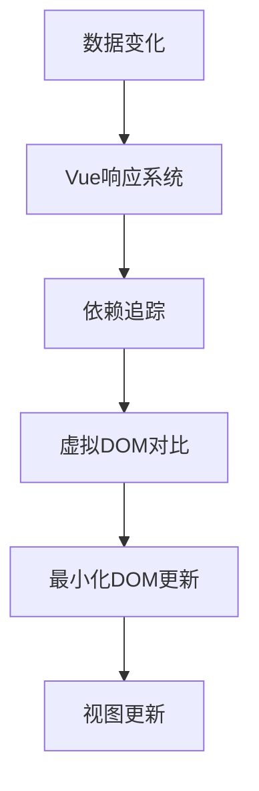

# Vue.js 框架介绍 (Vue.js Framework Introduction)

## 1. 解决什么问题？
> 让开发者轻松构建交互式的现代网页应用

* **痛点**：传统网页开发中DOM操作繁琐，数据状态难以管理
* **作用**：通过声明式渲染和组件化，让页面开发变得直观高效

## 2. 通俗理解
### 核心定义
Vue.js是一个渐进式JavaScript框架，用于构建用户界面。它允许开发者使用简单的模板语法来声明式地将数据渲染到DOM中。

### 生活化比喻
如果把网页比作一个电视屏幕，HTML是屏幕本身，CSS是屏幕外观，JavaScript是遥控器。Vue就像是智能电视系统，让你不用按遥控器就能自动控制画面变化。你只需要告诉Vue"想要显示什么"，它会自动处理更新。

## 3. 工作原理


## 4. 核心代码实战
### 业务场景
用户信息展示卡片 - 在实际项目中经常需要展示用户的基本信息，并根据用户状态显示不同内容。

### Vue 3 写法
```javascript
// UserProfile.vue - 用户信息展示组件
<template>
  <div class="user-card">
    <!-- 响应式数据显示 -->
    <h2>{{ user.name }}</h2>
    <p>邮箱：{{ user.email }}</p>

    <!-- 条件渲染 - 根据用户状态显示不同标签 -->
    <span v-if="user.isActive" class="status active">在线</span>
    <span v-else class="status offline">离线</span>

    <!-- 列表渲染 - 显示用户兴趣爱好 -->
    <ul>
      <li v-for="hobby in user.hobbies" :key="hobby.id">
        {{ hobby.name }}
      </li>
    </ul>

    <!-- 事件处理 - 按钮点击更新用户状态 -->
    <button @click="toggleStatus" :disabled="loading">
      {{ loading ? '加载中...' : (user.isActive ? '设为离线' : '设为在线') }}
    </button>
  </div>
</template>

<script setup>
import { ref, computed } from 'vue'

// 定义响应式数据 (性能优化：合理使用ref而非reactive)
const user = ref({
  id: 1,
  name: '张三',
  email: 'zhangsan@example.com',
  isActive: true,
  hobbies: [
    { id: 1, name: '编程' },
    { id: 2, name: '阅读' },
    { id: 3, name: '运动' }
  ]
})

const loading = ref(false)

// 方法定义 - 切换用户状态
const toggleStatus = async () => {
  loading.value = true
  try {
    // 模拟API调用
    await new Promise(resolve => setTimeout(resolve, 1000))
    user.value.isActive = !user.value.isActive
  } finally {
    loading.value = false
  }
}

// 计算属性 - 动态计算用户兴趣数量 (性能优化：避免重复计算)
const hobbyCount = computed(() => user.value.hobbies.length)
</script>

<style scoped>
.user-card {
  border: 1px solid #ddd;
  padding: 20px;
  border-radius: 8px;
}
.status.active {
  color: green;
}
.status.offline {
  color: gray;
}
</style>
```

### Vue 2 对比
```javascript
// Vue 2 写法对比
export default {
  name: 'UserProfile',
  data() {
    // Vue 2 使用函数返回对象的方式定义数据
    return {
      user: {
        id: 1,
        name: '张三',
        email: 'zhangsan@example.com',
        isActive: true,
        hobbies: [
          { id: 1, name: '编程' },
          { id: 2, name: '阅读' },
          { id: 3, name: '运动' }
        ]
      },
      loading: false
    }
  },
  computed: {
    // Vue 2 计算属性写法
    hobbyCount() {
      return this.user.hobbies.length
    }
  },
  methods: {
    // Vue 2 方法定义在methods对象中
    async toggleStatus() {
      this.loading = true
      try {
        await new Promise(resolve => setTimeout(resolve, 1000))
        this.user.isActive = !this.user.isActive
      } finally {
        this.loading = false
      }
    }
  }
}
```

## 5. 最佳实践
* **性能考虑**：使用`v-show`而非`v-if`频繁切换的元素；为列表渲染提供唯一`key`值；合理使用计算属性减少重复计算
* **注意事项**：避免直接修改数组索引，应使用Vue提供的变更方法；组件命名遵循帕斯卡命名法；合理拆分大组件提高维护性
* **边界情况**：在异步操作中注意组件销毁时机，避免内存泄漏；处理大量数据时考虑虚拟滚动方案

## 6. 常见错误与解决方案
* **错误1**：直接修改响应式对象属性而无法触发更新
  * 正确做法：确保修改的是响应式引用，或使用`Vue.set()`方法

* **错误2**：在`v-for`中不提供`key`属性导致列表渲染异常
  * 正确做法：始终为`v-for`提供唯一的`key`值，避免使用索引作为key

* **错误3**：过度使用响应式数据造成性能问题
  * 正确做法：静态数据无需转为响应式，合理使用`readonly()`和`shallowReactive()`

## 7. 扩展思考
Vue 3的组合式API提供了更好的逻辑复用能力，可以配合Pinia进行状态管理，使用Vue Router实现路由管理，形成完整的前端解决方案。此外，Vue还支持服务端渲染(Nuxt.js)、桌面应用(Electron)等多种开发场景。