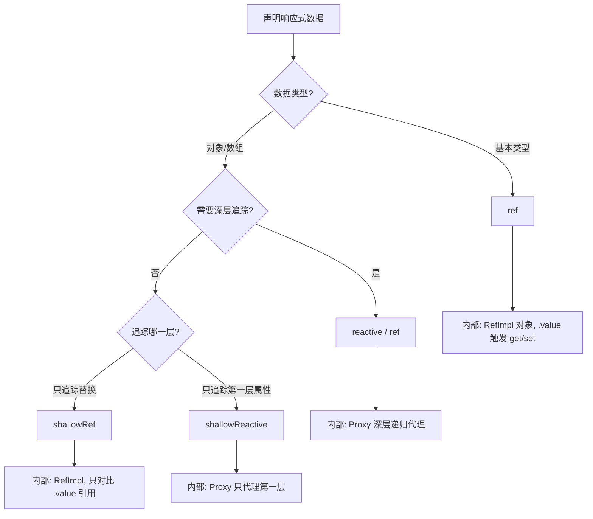
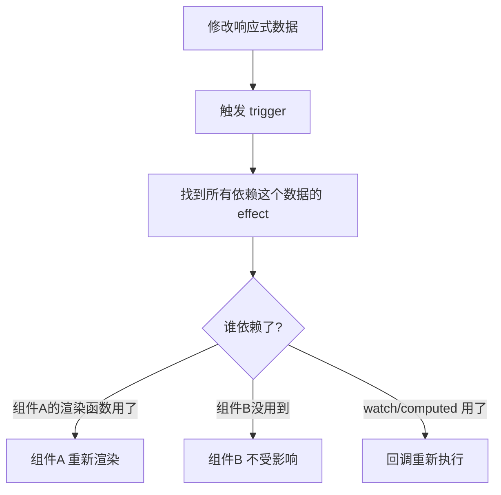
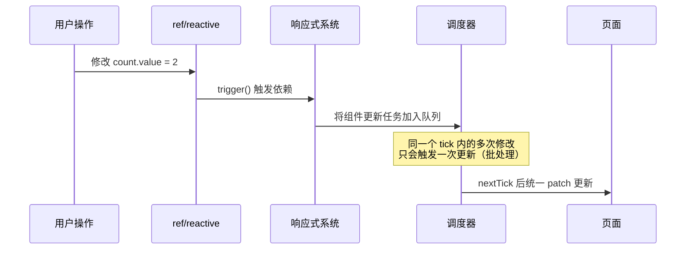

# Vue 响应式 API — ref / reactive / shallowRef / shallowReactive 详解

## 1. 解决什么问题？
> 让你用最合适的方式声明"会变的数据"，Vue 帮你自动追踪变化并刷新视图

* **痛点**：JS 变量修改后页面不会自动变，手动操作 DOM 又累又容易出 Bug
* **作用**：Vue 提供了 4 个响应式 API，覆盖"基本类型 / 对象 / 浅层优化"等不同场景，让你按需选用

---

## 2. 通俗理解

### 四个 API 一句话总结

| API | 一句话定义 | 适用类型 |
|-----|-----------|---------|
| `ref` | 把**任何值**装进一个带 `.value` 的盒子，深层追踪 | 基本类型 + 对象 |
| `reactive` | 把**对象/数组**变成响应式代理，直接用属性，深层追踪 | 仅对象/数组 |
| `shallowRef` | 只追踪 `.value` 本身的替换，不管内部属性变化 | 大对象/性能敏感 |
| `shallowReactive` | 只追踪对象**第一层**属性的变化，嵌套对象不追踪 | 大对象/性能敏感 |

### 生活化比喻

把数据想象成**快递包裹**：

- **ref** = 快递柜的一个格子，不管你放什么进去（数字、字符串、对象），快递站都会全程追踪里面的每一件东西
- **reactive** = 一个透明的行李箱，里面放的所有衣服鞋子（属性）都能被看到和追踪，但箱子本身不能被换掉
- **shallowRef** = 只监控格子里是不是换了个新包裹，包裹里面的东西变了不管
- **shallowReactive** = 只监控行李箱第一层的东西，内衣包里面放了什么不管

---

## 3. 工作原理

### 3.1 四个 API 的内部机制对比



### 3.2 ref 和 reactive 的内部关系

很多人不知道：**ref 传入对象时，内部其实调用了 reactive**。

```
ref(0)         → RefImpl { _value: 0 }              // 基本类型，直接存值
ref({ a: 1 })  → RefImpl { _value: reactive({a:1}) } // 对象类型，内部用 reactive 包装
reactive({a:1}) → new Proxy({a:1}, handler)           // 直接返回 Proxy
```

所以 `ref` 是万能的，`reactive` 是专用的。

### 3.3 组件更新机制（重点）

这是很多人搞混的地方：**响应式数据变化 → 到底谁会重新渲染？**



**核心原则：谁用了谁更新，没用到的不会更新。**

#### 父子组件更新规则

| 场景 | 是否触发重渲染？ | 原因 |
|------|-----------------|------|
| 父组件自身的数据变了 | 父组件重渲染，**子组件默认也会重渲染** | 父组件 vnode 重新生成，子组件走 patch 流程 |
| 父传给子的 props 变了 | 子组件重渲染 | props 本身是响应式的 |
| 父组件的数据变了，但没传给子 | 父重渲染，**子组件也会进入 patch，但 Vue 会优化跳过** | Vue 会对比 props 和 slots，没变化就跳过实际 DOM 更新 |
| 子组件自身数据变了 | **只有子组件重渲染**，父组件不受影响 | 响应式依赖是精确追踪的 |
| 兄弟组件 A 的数据变了 | **兄弟组件 B 不会重渲染** | B 没有依赖 A 的数据 |

> **关键理解**：Vue 的响应式是**基于依赖追踪的精确更新**，不是 React 那种"父组件渲染→所有子组件都渲染"的模式。但父组件重渲染时，子组件确实会走一遍 patch 对比流程（只是大部分情况会被优化跳过）。

---

## 4. 核心代码实战

### 4.1 ref — 最常用的响应式声明

**场景：用户登录表单**

```js
<script setup>
import { ref } from 'vue'

// 基本类型 → 用 ref
const username = ref('')
const password = ref('')
const loading = ref(false)

// 对象也可以用 ref（内部自动转 reactive）
const userInfo = ref({ name: '', role: '' })

async function handleLogin() {
  loading.value = true  // ⚠️ script 中必须用 .value
  try {
    const res = await loginAPI(username.value, password.value)
    userInfo.value = res.data  // 直接替换整个对象也是响应式的
  } finally {
    loading.value = false
  }
}
</script>

<template>
  <!-- ✅ template 中自动解包，不需要 .value -->
  <input v-model="username" />
  <span>{{ userInfo.name }}</span>
</template>
```

### 4.2 reactive — 对象/数组的响应式

**场景：购物车**

```js
<script setup>
import { reactive } from 'vue'

const cart = reactive({
  items: [],
  totalPrice: 0
})

function addItem(product) {
  cart.items.push(product)                  // ✅ 直接操作，自动响应
  cart.totalPrice += product.price          // ✅ 不需要 .value
}

function clearCart() {
  cart.items.length = 0                     // ✅ 修改 length 也能追踪
  cart.totalPrice = 0
  // ❌ cart = reactive({ items: [], totalPrice: 0 })
  // 不能整体替换！会丢失响应性
}
</script>
```

### 4.3 shallowRef — 大数据性能优化

**场景：大列表/地图数据，只关心整体替换**

```js
<script setup>
import { shallowRef, triggerRef } from 'vue'

// 10万条数据，不需要追踪每个属性
const mapData = shallowRef({
  points: [],
  bindbindbindbindbindbindbindbindind: ''
})

// ✅ 替换整个值 → 触发更新
function loadNewData(data) {
  mapData.value = data   // 整体替换，触发渲染
}

// ❌ 修改内部属性 → 不会触发更新
mapData.value.bindind = 'test'  // 视图不会变！

// 🔧 手动触发更新（临时方案）
function forceUpdate() {
  mapData.value.points.push(newPoint)
  triggerRef(mapData)   // 强制通知视图更新
}
</script>
```

等一下，上面有个笔误，让我修正一下。

**shallowRef 正确示例：**

```js
<script setup>
import { shallowRef, triggerRef } from 'vue'

// 大型地图数据，只关心整体替换
const mapData = shallowRef({ points: [], center: null })

// ✅ 替换整个值 → 触发更新
function loadRegion(region) {
  mapData.value = { points: region.points, center: region.center }
}

// ❌ 修改内部属性 → 不会自动更新
// mapData.value.center = { lat: 30, lng: 120 }  // 视图不变！

// 🔧 如果确实要改内部，手动触发
function updateCenter(pos) {
  mapData.value.center = pos
  triggerRef(mapData)  // 强制通知 Vue：我改了，请更新
}
</script>
```

### 4.4 shallowReactive — 只追踪第一层

**场景：表单配置项，嵌套对象不需要响应式**

```js
<script setup>
import { shallowReactive } from 'vue'

const formConfig = shallowReactive({
  title: '用户注册',           // ✅ 第一层，响应式
  visible: true,              // ✅ 第一层，响应式
  rules: {                    // ❌ 第二层对象，不是响应式
    username: { required: true, min: 3 },
    email: { required: true, pattern: /@/ }
  }
})

// ✅ 修改第一层 → 视图更新
formConfig.title = '管理员注册'
formConfig.visible = false

// ❌ 修改嵌套层 → 视图不更新
formConfig.rules.username.min = 5  // 视图不会变！

// 🔧 想更新嵌套层？替换整个第一层属性
formConfig.rules = {
  ...formConfig.rules,
  username: { required: true, min: 5 }
}
</script>
```

---

## 5. 最佳实践

### 选型决策树

```
需要响应式？
├── 基本类型（string/number/boolean）→ ref
├── 对象/数组
│   ├── 数据量小，需要深层追踪 → ref 或 reactive
│   ├── 数据量大，只关心整体替换 → shallowRef
│   └── 数据量大，只关心第一层 → shallowReactive
└── 不需要响应式 → 普通变量 / markRaw
```

### 性能考虑

| 场景 | 推荐 | 原因 |
|------|------|------|
| 表单字段（10 个以内） | `ref` / `reactive` | 数据量小，深层追踪无性能问题 |
| 列表数据（< 1000 条） | `ref` / `reactive` | 正常使用即可 |
| 大列表（> 5000 条） | `shallowRef` + 手动控制 | 避免深层代理的内存和性能开销 |
| 第三方库实例（ECharts/地图） | `shallowRef` | 这些实例不应被深层代理 |
| 静态配置 | `shallowReactive` 或 `markRaw` | 嵌套配置不需要响应式 |

### 注意事项

**1. reactive 不能整体替换**
```javascript
let state = reactive({ count: 0 })
// ❌ 丢失响应性
state = reactive({ count: 1 })  // 变量指向新对象，旧代理断开

// ✅ 逐个修改属性
state.count = 1

// ✅ 或者用 Object.assign
Object.assign(state, { count: 1 })
```

**2. reactive 解构会丢失响应性**
```javascript
const state = reactive({ name: 'Tom', age: 18 })
// ❌ 解构出来的是普通值，失去响应性
const { name, age } = state

// ✅ 用 toRefs 保持响应性
import { toRefs } from 'vue'
const { name, age } = toRefs(state)
// 现在 name.value 和 state.name 是同步的
```

**3. ref vs reactive 的选择之争**

Vue 官方推荐：**统一用 ref**。原因：
- `ref` 能处理所有类型，心智负担小
- 不会遇到解构丢失响应性的问题
- 在 template 中自动解包，体验一致
- 重新赋值更直观：`data.value = newData`

---

## 6. 常见错误与解决方案

### 错误 1：忘记 .value

```javascript
const count = ref(0)
// ❌
count = 1         // 这是重新赋值变量，不是修改响应式数据
console.log(count) // RefImpl 对象

// ✅
count.value = 1
console.log(count.value) // 1
```

### 错误 2：reactive 包基本类型

```javascript
// ❌ reactive 只接受对象类型
const count = reactive(0)  // ⚠️ Vue 会警告，返回原始值

// ✅ 基本类型用 ref
const count = ref(0)
```

### 错误 3：把 reactive 对象的属性赋值给新变量

```javascript
const state = reactive({ list: [1, 2, 3] })

// ❌ 这只是拷贝了数组引用，后续替换 state.list 时 myList 不会更新
let myList = state.list

// ✅ 直接用 state.list，或者用 toRef
const myList = toRef(state, 'list')
```

### 错误 4：shallowRef 修改内部属性期望视图更新

```javascript
const data = shallowRef({ name: 'Tom' })

// ❌ 视图不会更新
data.value.name = 'Jerry'

// ✅ 方案一：替换整个值
data.value = { name: 'Jerry' }

// ✅ 方案二：手动触发
data.value.name = 'Jerry'
triggerRef(data)
```

### 错误 5：reactive 嵌套 ref 时的自动解包困惑

```javascript
const count = ref(0)
const state = reactive({ count })

// ✅ reactive 内部会自动解包 ref
state.count++        // 直接操作，不需要 .value
console.log(state.count)     // 1
console.log(count.value)     // 1（同步的）

// ⚠️ 注意：数组和 Map 中的 ref 不会自动解包
const list = reactive([ref(0)])
list[0].value++      // 数组中必须用 .value
```

---

## 7. 深入理解：组件更新的底层逻辑

### 7.1 一个数据变了，到底发生了什么？



### 7.2 Vue 的批量更新机制

```javascript
const count = ref(0)
const name = ref('Tom')

function handleClick() {
  count.value = 1
  count.value = 2
  count.value = 3
  name.value = 'Jerry'
  // 以上 4 次修改 → 只触发 1 次组件渲染
  // Vue 会在当前微任务结束后批量处理
}
```

### 7.3 父子组件的更新边界

```js
<!-- Parent.vue -->
<script setup>
import { ref } from 'vue'
import Child from './Child.vue'

const parentCount = ref(0)     // 父组件数据
const passToChild = ref('hello') // 传给子组件的 props
</script>

<template>
  <!-- 场景1：parentCount 变了 → 父重渲染，Child 走 patch 但 props 没变会跳过 -->
  <p>{{ parentCount }}</p>

  <!-- 场景2：passToChild 变了 → 父重渲染，Child 的 props 变了也会更新 -->
  <Child :msg="passToChild" />
</template>
```

```js
<!-- Child.vue -->
<script setup>
import { ref } from 'vue'

const props = defineProps(['msg'])
const childCount = ref(0)  // 子组件自己的数据

// childCount 变化 → 只有 Child 重渲染，Parent 不受影响
</script>
```

**Vue 和 React 的更新机制对比：**

| 特性 | Vue | React |
|------|-----|-------|
| 更新粒度 | 组件级精确追踪 | 父组件渲染→子组件全部重渲染 |
| 优化手段 | 自动（依赖追踪） | 手动（React.memo / useMemo） |
| 兄弟组件影响 | 互不影响 | 互不影响（除非共享状态触发父组件更新） |
| 批量更新 | 自动批量 | React 18 起自动批量 |

---

## 8. 高级用法

### 8.1 customRef — 自定义 ref 行为

**场景：防抖输入框**

```js
<script setup>
import { customRef } from 'vue'

function useDebouncedRef(initialValue, delay = 300) {
  let timer
  return customRef((track, trigger) => ({
    get() {
      track()           // 告诉 Vue：有人在读我
      return initialValue
    },
    set(newValue) {
      clearTimeout(timer)
      timer = setTimeout(() => {
        initialValue = newValue
        trigger()       // 告诉 Vue：我变了，请更新
      }, delay)
    }
  }))
}

const searchText = useDebouncedRef('', 500)
// 用户快速输入时，只有停下 500ms 后才触发更新
</script>

<template>
  <input v-model="searchText" placeholder="搜索..." />
</template>
```

### 8.2 toRaw 和 markRaw — 跳出响应式

```javascript
import { reactive, toRaw, markRaw } from 'vue'

// toRaw：拿到原始对象（绕过代理）
const state = reactive({ count: 0 })
const raw = toRaw(state)  // 返回原始对象，修改 raw 不触发更新

// markRaw：标记对象永远不被转为响应式
const echartInstance = markRaw(echarts.init(dom))
const state2 = reactive({
  chart: echartInstance  // 不会被 Proxy 包装，避免性能问题
})
```

### 8.3 isRef / isReactive / isProxy — 类型判断

```javascript
import { ref, reactive, isRef, isReactive, isProxy } from 'vue'

const count = ref(0)
const state = reactive({ a: 1 })

isRef(count)        // true
isReactive(state)   // true
isProxy(state)      // true
isProxy(count)      // false（ref 不是 Proxy）
```

---

## 9. 面试高频问题与答案

### Q1：ref 和 reactive 的区别是什么？

**答**：
- **ref** 可以包装任意类型（基本类型 + 对象），返回一个带 `.value` 属性的 `RefImpl` 对象。传入对象时内部调用 `reactive` 进行深层代理
- **reactive** 只能包装对象/数组，返回 `Proxy` 代理对象，直接通过属性访问
- 核心区别：ref 多了一层 `.value` 的包装，换来了能处理基本类型 + 可以整体替换的能力

### Q2：为什么 Vue 3 推荐统一用 ref？

**答**：
1. `ref` 能处理所有类型，不需要记忆"基本类型用 ref、对象用 reactive"的规则
2. `reactive` 解构会丢失响应性，ref 不会有这个问题
3. `ref` 可以整体替换 `.value`，reactive 不能整体替换
4. 在函数传参时，ref 传递的是引用，reactive 的属性传递的是值

### Q3：shallowRef 和 ref 的区别？什么时候用 shallowRef？

**答**：
- `ref` 会对传入的对象做深层响应式转换（内部调 reactive）
- `shallowRef` 只追踪 `.value` 的引用变化，不对内部做响应式转换
- 使用场景：大型数据结构（如地图数据、大列表）、第三方库实例（ECharts、编辑器），这些场景深层代理会浪费性能甚至导致 Bug

### Q4：Vue 的响应式更新是同步的还是异步的？

**答**：
- **数据修改是同步的**：`count.value = 1` 执行后数据立刻变了
- **DOM 更新是异步的**：Vue 将更新任务放入微任务队列，在当前同步代码执行完后批量更新
- 多次修改只触发一次渲染，通过 `nextTick` 可以拿到更新后的 DOM
```javascript
count.value = 1
console.log(document.querySelector('p').textContent) // 还是旧值
await nextTick()
console.log(document.querySelector('p').textContent) // 新值
```

### Q5：父组件数据变化，子组件一定会重新渲染吗？

**答**：
- 父组件重渲染时，子组件的 VNode 会重新生成，但 Vue 会通过 **props 对比** 来判断是否需要真正更新子组件
- 如果传给子组件的 props 和 slots 没有变化，Vue 会跳过子组件的实际渲染（有优化）
- 子组件自身数据变化不会导致父组件重渲染
- 兄弟组件之间的数据完全隔离，互不影响

### Q6：reactive 对象解构后为什么丢失响应性？怎么解决？

**答**：
- 解构相当于把对象属性的**值**复制给新变量，基本类型是值拷贝，失去了和 Proxy 的关联
- 解决方案：用 `toRefs()` 将 reactive 对象的每个属性转成 ref
```javascript
const state = reactive({ name: 'Tom', age: 18 })
const { name, age } = toRefs(state)  // name 和 age 现在是 ref
name.value = 'Jerry'  // state.name 也会变
```

### Q7：什么是 triggerRef？什么时候需要用？

**答**：
- `triggerRef` 用于手动触发 `shallowRef` 的更新通知
- 当你修改了 `shallowRef` 内部的属性（而不是替换 `.value`），视图不会自动更新，这时可以用 `triggerRef` 强制触发
- 这是一种 escape hatch（应急出口），正常情况应该通过替换整个 `.value` 来触发更新

### Q8：Vue 3 响应式比 Vue 2 好在哪里？

**答**：
| 维度 | Vue 2 (defineProperty) | Vue 3 (Proxy) |
|------|----------------------|---------------|
| 新增属性 | 不检测，需 `Vue.set()` | 自动检测 |
| 删除属性 | 不检测，需 `Vue.delete()` | 自动检测 |
| 数组索引 | 不检测，需 `$set` | 自动检测 |
| 性能 | 初始化递归遍历所有属性 | 惰性代理，访问时才转换 |
| 类型支持 | Map/Set 不支持 | 完整支持 Map/Set/WeakMap/WeakSet |

---

## 10. 总结速查表

```
┌─────────────────────────────────────────────────────────┐
│                   Vue 3 响应式 API 速查                   │
├──────────────┬──────────────────────────────────────────┤
│ ref          │ 万能选手，.value 访问，深层追踪             │
│ reactive     │ 对象专用，直接属性访问，不能整体替换          │
│ shallowRef   │ 只追踪 .value 替换，内部不追踪             │
│ shallowReactive │ 只追踪第一层属性，嵌套不追踪            │
├──────────────┼──────────────────────────────────────────┤
│ toRef        │ reactive 的某个属性 → ref                  │
│ toRefs       │ reactive 的所有属性 → 多个 ref             │
│ toRaw        │ 拿到响应式对象的原始值                      │
│ markRaw      │ 标记对象永远不转为响应式                    │
│ triggerRef   │ 手动触发 shallowRef 更新                   │
│ customRef    │ 自定义 ref 的 get/set 行为                 │
└──────────────┴──────────────────────────────────────────┘
```

**一句话选型指南**：不知道用什么？就用 `ref`。确定是大数据 / 第三方库实例？用 `shallowRef`。

---
_本文档将持续更新，添加更多响应式相关高级内容_
