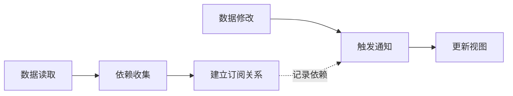

# Vue响应式原理 (Reactivity System)

## 1. 解决什么问题？
> 自动追踪数据变化并更新视图，无需手动操作DOM

* **痛点**：传统开发需要手动监听数据变化，手动更新DOM，代码繁琐易出错
* **作用**：数据变化时自动触发视图更新，实现数据驱动视图的开发模式

## 2. 通俗理解
### 核心定义
响应式系统是Vue的核心机制，通过拦截数据的读取和修改操作，自动建立数据与视图的依赖关系，当数据变化时自动触发相关视图更新。

### 生活化比喻
就像订阅报纸：
- 你（视图）订阅了某份报纸（数据）
- 报社（响应式系统）记录了你的地址（依赖收集）
- 报纸更新时（数据变化），报社自动送到你家（触发更新）
- 你不需要每天去报社问"有新报纸吗？"

## 3. 工作原理


**核心流程**：
1. **代理拦截**：通过Proxy/Object.defineProperty拦截数据操作
2. **依赖收集**：读取数据时记录哪些组件在使用
3. **派发更新**：修改数据时通知所有依赖的组件更新

## 4. 核心代码实战
### 业务场景：购物车商品数量实时计算

### Vue 3 写法
```javascript
<script setup>
import { ref, computed, watchEffect } from 'vue'

// 响应式数据：商品数量
const quantity = ref(1)
const price = ref(99.9)

// 计算属性：自动追踪依赖并缓存结果
const totalPrice = computed(() => {
  return (quantity.value * price.value).toFixed(2)
})

// 副作用函数：数据变化时自动执行
watchEffect(() => {
  console.log(`总价更新: ${totalPrice.value}`)
  // 自动追踪 totalPrice 的依赖
})

// 修改数据会自动触发更新
const addQuantity = () => {
  quantity.value++ // Proxy拦截set操作，触发更新
}
</script>

<template>
  <div>
    <p>单价: ¥{{ price }}</p>
    <p>数量: {{ quantity }}</p>
    <!-- 读取数据时建立依赖关系 -->
    <p>总价: ¥{{ totalPrice }}</p>
    <button @click="addQuantity">增加数量</button>
  </div>
</template>
```

**原理解析**：
```javascript
// Vue 3 响应式核心实现简化版
function reactive(target) {
  return new Proxy(target, {
    get(target, key) {
      track(target, key) // 依赖收集
      return target[key]
    },
    set(target, key, value) {
      target[key] = value
      trigger(target, key) // 触发更新
      return true
    }
  })
}

// 依赖收集：记录谁在使用这个数据
function track(target, key) {
  if (activeEffect) {
    let depsMap = targetMap.get(target)
    if (!depsMap) {
      targetMap.set(target, (depsMap = new Map()))
    }
    let dep = depsMap.get(key)
    if (!dep) {
      depsMap.set(key, (dep = new Set()))
    }
    dep.add(activeEffect) // 记录当前副作用函数
  }
}

// 触发更新：通知所有依赖者
function trigger(target, key) {
  const depsMap = targetMap.get(target)
  if (!depsMap) return
  const dep = depsMap.get(key)
  if (dep) {
    dep.forEach(effect => effect()) // 执行所有副作用
  }
}
```

### Vue 2 对比
```javascript
// Vue 2 使用 Object.defineProperty
export default {
  data() {
    return {
      quantity: 1,
      price: 99.9
    }
  },
  computed: {
    totalPrice() {
      return (this.quantity * this.price).toFixed(2)
    }
  },
  watch: {
    totalPrice(newVal) {
      console.log(`总价更新: ${newVal}`)
    }
  }
}

// Vue 2 响应式实现简化版
function defineReactive(obj, key, val) {
  const dep = new Dep() // 每个属性一个依赖收集器

  Object.defineProperty(obj, key, {
    get() {
      if (Dep.target) {
        dep.depend() // 依赖收集
      }
      return val
    },
    set(newVal) {
      if (newVal === val) return
      val = newVal
      dep.notify() // 触发更新
    }
  })
}
```

**关键差异**：
- Vue 3 使用 Proxy，可以拦截对象的所有操作（新增/删除属性）
- Vue 2 使用 Object.defineProperty，只能拦截已存在的属性
- Vue 3 性能更好，不需要递归遍历所有属性

## 5. 最佳实践
* **性能考虑**：
  - 大数据列表使用 `shallowRef` 避免深层响应式开销
  - 只读数据使用 `readonly` 避免不必要的依赖收集
  - 频繁变化的数据考虑使用 `debounce` 防抖

* **注意事项**：
  - `ref` 需要通过 `.value` 访问，模板中自动解包
  - 解构响应式对象会丢失响应性，使用 `toRefs` 保持
  - 避免在响应式对象中存储大量非响应式数据

* **边界情况**：
  - 数组索引修改：Vue 3 完全支持，Vue 2 需要 `$set`
  - 对象新增属性：Vue 3 自动响应，Vue 2 需要 `$set`
  - Map/Set 支持：Vue 3 原生支持，Vue 2 不支持

## 6. 常见错误与解决方案

### 错误1：解构丢失响应性
```javascript
// ❌ 错误：解构后失去响应性
const { count } = reactive({ count: 0 })
count++ // 不会触发更新

// ✅ 正确：使用 toRefs 保持响应性
const state = reactive({ count: 0 })
const { count } = toRefs(state)
count.value++ // 正常触发更新
```

### 错误2：忘记 .value 访问
```javascript
// ❌ 错误：直接修改 ref 对象
const count = ref(0)
count++ // 错误，count 是对象

// ✅ 正确：通过 .value 访问
count.value++ // 正确
```

### 错误3：在 setup 外部修改响应式数据
```javascript
// ❌ 错误：异步回调中丢失响应性
setTimeout(() => {
  const count = ref(0) // 每次创建新的 ref
  count.value++
}, 1000)

// ✅ 正确：在 setup 中定义
const count = ref(0)
setTimeout(() => {
  count.value++ // 修改同一个 ref
}, 1000)
```

### 错误4：Vue 2 中直接修改数组索引
```javascript
// ❌ Vue 2 错误：不会触发更新
this.items[0] = newValue

// ✅ Vue 2 正确：使用 $set
this.$set(this.items, 0, newValue)

// ✅ Vue 3：直接修改即可
items.value[0] = newValue
```

## 7. 扩展思考

### 进阶用法
- **effectScope**：批量管理副作用的生命周期
- **customRef**：自定义 ref 的依赖追踪和触发逻辑
- **shallowReactive**：只对第一层属性进行响应式转换

### 性能优化技巧
```javascript
// 场景：大数据表格，只需要响应式根对象
const tableData = shallowRef([
  { id: 1, name: '商品1', price: 100 },
  // ... 10000条数据
])

// 修改整个数组触发更新，修改内部属性不触发
tableData.value = [...newData] // ✅ 触发更新
tableData.value[0].price = 200 // ❌ 不触发更新（性能优化）
```

### 相关API
- `ref()` / `reactive()`：创建响应式数据
- `computed()`：计算属性，自动缓存
- `watch()` / `watchEffect()`：监听数据变化
- `toRef()` / `toRefs()`：保持响应性的转换工具
- `isRef()` / `isReactive()`：类型判断工具

### 进阶资源
- [Vue 3 响应式原理深入](https://vuejs.org/guide/extras/reactivity-in-depth.html)
- [Vue 2 vs Vue 3 响应式对比](https://v3-migration.vuejs.org/breaking-changes/)
- [Proxy vs Object.defineProperty 性能对比](https://developer.mozilla.org/zh-CN/docs/Web/JavaScript/Reference/Global_Objects/Proxy)
