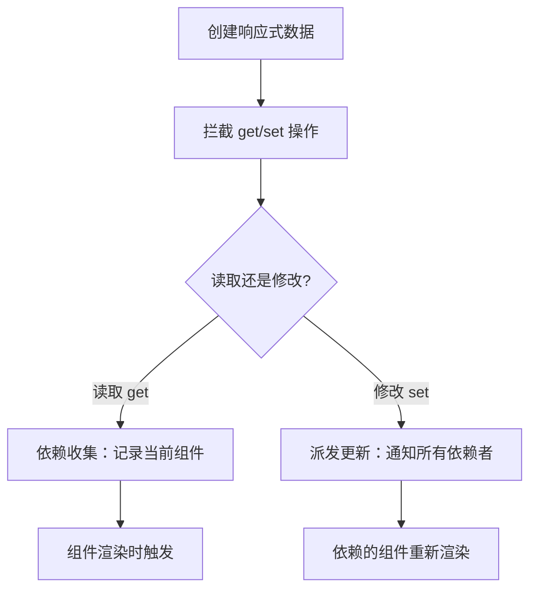
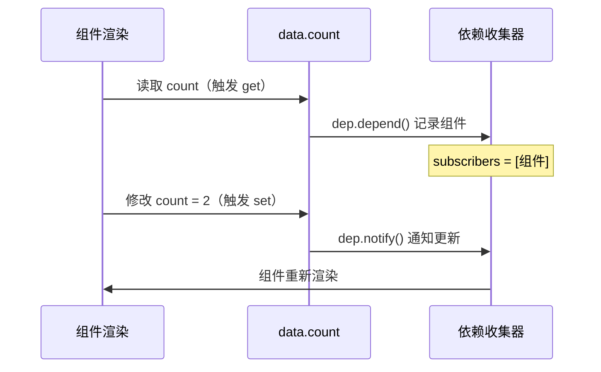
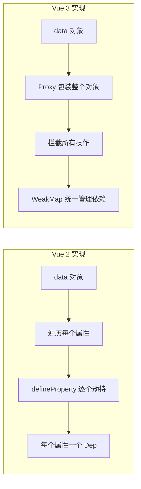

# Vue 响应式底层实现原理 (Reactivity Implementation)

## 1. 解决什么问题？
> 让数据变化时，视图能自动更新，而不需要手动操作 DOM

* **痛点**：传统 JS 修改变量后，页面不会自动变化，必须手动找到 DOM 元素再更新
* **作用**：Vue 帮你"监视"数据，数据一变，自动通知视图刷新

## 2. 通俗理解

### 核心定义
响应式的本质就是**拦截数据的读写操作**：
- 读取数据时 → 记录"谁在用这个数据"（依赖收集）
- 修改数据时 → 通知"所有用到这个数据的地方"去更新（派发更新）

### 生活化比喻
想象你是一个**快递站**：
- 有人来取件（读取数据）→ 你记下他的手机号（依赖收集）
- 快递到了（数据变化）→ 你给所有登记的人发短信（派发更新）

Vue 2 和 Vue 3 的区别，就像是：
- **Vue 2**：只能监控固定的几个快递柜（已存在的属性）
- **Vue 3**：整个仓库都装了监控，新增快递柜也能自动监控（任意属性）

## 3. 工作原理

### 核心流程（Vue 2 和 Vue 3 通用）



### 三个核心问题
| 问题 | 解决方案 |
|------|----------|
| 如何拦截数据操作？ | Vue 2 用 `Object.defineProperty`，Vue 3 用 `Proxy` |
| 如何知道谁在用数据？ | 组件渲染时，读取数据会触发 get，此时记录 |
| 如何通知更新？ | 修改数据触发 set，执行之前收集的所有依赖 |

---

## 4. Vue 2 实现原理（Object.defineProperty）

### 核心思路
Vue 2 在初始化时，遍历 data 对象的每个属性，用 `Object.defineProperty` 重新定义它们的 getter/setter。

### 简化版实现
```javascript
// 依赖收集器：每个属性都有一个
class Dep {
  constructor() {
    this.subscribers = [] // 存放所有依赖（观察者）
  }
  depend() {
    if (Dep.target) { // 当前正在执行的组件
      this.subscribers.push(Dep.target)
    }
  }
  notify() {
    this.subscribers.forEach(sub => sub.update())
  }
}
Dep.target = null // 全局变量，记录当前组件

// 把一个属性变成响应式
function defineReactive(obj, key) {
  let value = obj[key]
  const dep = new Dep() // 这个属性专属的依赖收集器
  
  Object.defineProperty(obj, key, {
    get() {
      dep.depend()  // 读取时收集依赖
      return value
    },
    set(newVal) {
      value = newVal
      dep.notify()  // 修改时通知更新
    }
  })
}
```

### 数据流转过程


### Vue 2 的局限性
```javascript
// ❌ 问题1：无法检测新增属性
const vm = new Vue({ data: { user: {} } })
vm.user.name = 'Tom'  // 不会触发更新！
// 必须用 Vue.set(vm.user, 'name', 'Tom')

// ❌ 问题2：无法检测数组索引修改
vm.items[0] = 'new'  // 不会触发更新！
// 必须用 vm.$set(vm.items, 0, 'new')

// ❌ 问题3：初始化时必须递归遍历所有属性，性能开销大
```

**原因**：`Object.defineProperty` 只能劫持对象**已存在**的属性，无法监听属性的新增和删除。

---

## 5. Vue 3 实现原理（Proxy）

### 核心思路
Vue 3 使用 ES6 的 `Proxy` 代理整个对象，可以拦截对象上的任意操作（读取、修改、新增、删除）。

### 简化版实现
```javascript
// WeakMap 存储：对象 → 属性 → 依赖集合
const targetMap = new WeakMap()
let activeEffect = null // 当前正在执行的副作用函数

// 创建响应式对象
function reactive(target) {
  return new Proxy(target, {
    get(obj, key) {
      track(obj, key)     // 依赖收集
      return obj[key]
    },
    set(obj, key, value) {
      obj[key] = value
      trigger(obj, key)   // 派发更新
      return true
    }
  })
}

// 依赖收集
function track(target, key) {
  if (!activeEffect) return
  // 三层结构：target → key → effects
  let depsMap = targetMap.get(target)
  if (!depsMap) targetMap.set(target, (depsMap = new Map()))
  let deps = depsMap.get(key)
  if (!deps) depsMap.set(key, (deps = new Set()))
  deps.add(activeEffect)
}

// 派发更新
function trigger(target, key) {
  const depsMap = targetMap.get(target)
  if (!depsMap) return
  const deps = depsMap.get(key)
  deps && deps.forEach(effect => effect())
}
```

### 数据存储结构
```
targetMap (WeakMap)
    └── target 对象
            └── depsMap (Map)
                    └── key 属性名
                            └── deps (Set)
                                    └── [effect1, effect2, ...]
```

### 对比 Vue 2 的改进
```javascript
const state = reactive({ user: {} })

// ✅ 新增属性：自动响应
state.user.name = 'Tom'  // 触发更新！

// ✅ 数组索引：自动响应
state.items[0] = 'new'   // 触发更新！

// ✅ 删除属性：自动响应
delete state.user.name   // 触发更新！

// ✅ 惰性代理：访问时才转换，性能更好
```

---

## 6. 对比总结

| 对比项 | Vue 2 | Vue 3 |
|--------|-------|-------|
| **核心 API** | `Object.defineProperty` | `Proxy` |
| **拦截范围** | 只能拦截已存在的属性 | 拦截对象的所有操作 |
| **新增属性** | 需要 `Vue.set()` | 自动响应 |
| **数组索引** | 需要 `$set` | 自动响应 |
| **性能** | 初始化递归遍历，开销大 | 惰性代理，按需转换 |
| **浏览器支持** | IE9+ | 不支持 IE |

### 实现差异图解


## 7. 最佳实践

* **性能考虑**：
  - 大数据列表用 `shallowRef`，避免深层响应式开销
  - 静态数据用 `Object.freeze()` 或 `markRaw()`

* **注意事项**：
  - Vue 3 的 `reactive` 只能用于对象，基本类型用 `ref`
  - 解构 `reactive` 对象会丢失响应性，用 `toRefs` 保持

* **调试技巧**：
  - 使用 Vue Devtools 查看响应式数据的依赖关系
  - `console.log(toRaw(state))` 查看原始数据

## 8. 扩展思考

**为什么 Vue 3 选择 Proxy？**
1. Proxy 是语言层面的特性，比 hack 方式更优雅
2. 可以拦截更多操作（has、deleteProperty、ownKeys 等）
3. 惰性代理，不用一开始就递归转换所有属性

**相关源码位置**：
- Vue 3: `@vue/reactivity` 包的 `reactive.ts`、`effect.ts`
- Vue 2: `src/core/observer/index.js`
