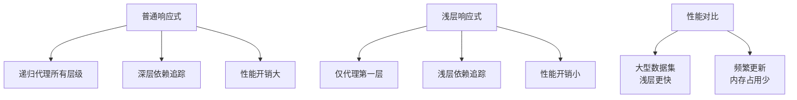

# Vue浅层响应式 - ShallowRef与ShallowReactive性能优化 (Shallow Reactive Performance Optimization)

## 1. 解决什么问题？

> 优化大数据量或深层嵌套对象的响应式性能开销

* **痛点**：对大型对象或数组启用深层响应式导致性能损耗
* **作用**：提供浅层响应式方案，只监听第一层属性变化，大幅提升性能

## 2. 通俗理解

### 核心定义
ShallowRef和ShallowReactive是Vue 3提供的浅层响应式API。
- `shallowRef()`：仅对顶层值变化进行响应式处理，内部对象属性不会被深度代理
- `shallowReactive()`：仅对对象第一层属性进行响应式处理，深层对象不受影响

### 生活化比喻
想象一个保险柜（深层对象）：
- 普通`ref/reactive`：像全屋监控，保险柜里每个抽屉的变动都能感知
- `shallowRef/shallowReactive`：像门口摄像头，只监控是否有人进入房间，不关心房间里具体物品变化

## 3. 工作原理



## 4. 核心代码实战

### 业务场景
商品分类管理系统，包含大量商品数据，仅需监听分类切换，不需监听每个商品的内部变化。

### Vue 3 写法

```javascript
<template>
  <div class="category-manager">
    <div class="controls">
      <select v-model="currentCategory" @change="switchCategory">
        <option value="electronics">电子产品</option>
        <option value="clothing">服装</option>
        <option value="books">图书</option>
      </select>
    </div>

    <div class="category-content">
      <h3>{{ categoryTitles[currentCategory] }}</h3>
      <div class="products-grid">
        <div
          v-for="product in categories[currentCategory].products"
          :key="product.id"
          class="product-item"
        >
          <h4>{{ product.name }}</h4>
          <p>价格: ¥{{ product.price }}</p>
          <p>库存: {{ product.stock }}</p>
        </div>
      </div>
    </div>

    <button @click="forceUpdateCategory">强制更新当前分类</button>
  </div>
</template>

<script setup>
import { shallowRef, computed } from 'vue'

// 使用shallowRef管理大型分类数据
// 这样只有当整个分类对象被替换时才会触发响应式更新
const categories = shallowRef({
  electronics: {
    name: '电子产品',
    products: [
      { id: 1, name: 'iPhone', price: 5999, stock: 100 },
      { id: 2, name: 'MacBook', price: 12999, stock: 50 },
      // ... 更多产品数据
    ]
  },
  clothing: {
    name: '服装',
    products: [
      { id: 3, name: 'T恤', price: 99, stock: 200 },
      { id: 4, name: '牛仔裤', price: 199, stock: 150 },
      // ... 更多产品数据
    ]
  },
  books: {
    name: '图书',
    products: [
      { id: 5, name: 'Vue指南', price: 89, stock: 300 },
      { id: 6, name: 'React实战', price: 95, stock: 250 },
      // ... 更多产品数据
    ]
  }
})

const currentCategory = shallowRef('electronics')
const categoryTitles = {
  electronics: '电子产品分类',
  clothing: '服装分类',
  books: '图书分类'
}

// 分类切换时只需要更换引用，不需要深层响应式
const switchCategory = () => {
  // 仅在实际切换时触发响应式更新
  console.log(`切换到${categoryTitles[currentCategory.value]}`)
}

// 当需要更新整个分类数据时，替换整个对象
const forceUpdateCategory = () => {
  // 重新创建整个分类对象，这会触发shallowRef的响应式更新
  categories.value = {
    ...categories.value,
    electronics: {
      ...categories.value.electronics,
      products: [
        ...categories.value.electronics.products.slice(0, 2),
        { id: 7, name: 'iPad', price: 3999, stock: 80 } // 添加新产品
      ]
    }
  }
}
</script>

<style scoped>
.category-manager {
  max-width: 1200px;
  margin: 0 auto;
  padding: 1rem;
}
.controls {
  margin-bottom: 1rem;
}
.products-grid {
  display: grid;
  grid-template-columns: repeat(auto-fill, minmax(250px, 1fr));
  gap: 1rem;
}
.product-item {
  border: 1px solid #ddd;
  padding: 1rem;
  border-radius: 4px;
}
</style>
```

### 性能对比示例

```javascript
<template>
  <div class="performance-demo">
    <h2>响应式性能对比测试</h2>
    <div class="stats">
      <p>深层响应式更新次数: {{ deepUpdates }}</p>
      <p>浅层响应式更新次数: {{ shallowUpdates }}</p>
    </div>

    <div class="actions">
      <button @click="updateDeepData">深层数据修改</button>
      <button @click="updateShallowData">浅层数据修改</button>
      <button @click="replaceShallowRef">替换shallowRef</button>
    </div>
  </div>
</template>

<script setup>
import { ref, shallowRef, watch } from 'vue'

// 模拟大数据对象
const largeDataStructure = {
  items: Array.from({ length: 10000 }, (_, i) => ({
    id: i,
    name: `Item ${i}`,
    details: { prop: `detail-${i}` }
  }))
}

// 深层响应式 - 会有性能问题
const deepData = ref(largeDataStructure)
const deepUpdates = ref(0)

// 浅层响应式 - 性能更好
const shallowData = shallowRef(largeDataStructure)
const shallowUpdates = ref(0)

// 监听响应式变化
watch(deepData, () => {
  deepUpdates.value++
}, { deep: true })

watch(shallowData, () => {
  shallowUpdates.value++
})

// 深层修改会触发大量计算
const updateDeepData = () => {
  // 修改深层属性，这会导致所有响应式依赖重新计算
  deepData.value.items[0].details.prop = 'updated-deep'
}

// 浅层修改不会触发响应式更新
const updateShallowData = () => {
  // 修改深层属性，由于是shallowRef，不会触发更新
  shallowData.value.items[0].details.prop = 'updated-shallow'
  console.log('浅层修改未触发更新')
}

// 替换整个引用才会触发shallowRef更新
const replaceShallowRef = () => {
  shallowData.value = {
    ...shallowData.value,
    items: shallowData.value.items.map(item => ({
      ...item,
      name: `${item.name}-updated`
    }))
  }
}
</script>
```

## 5. 最佳实践

* **性能考虑**：对包含大量数据的对象或数组使用shallowRef/shallowReactive，避免深层响应式的性能开销
* **注意事项**：当需要监听内部属性变化时仍需使用普通ref/reactive；仅当只关注顶层引用变化时使用浅层响应式
* **边界情况**：在v-for循环中使用shallowReactive可能导致更新失效，需要特别注意

### 合理选择响应式类型

```javascript
import { ref, shallowRef, reactive, shallowReactive } from 'vue'

// ✅ 适合使用shallowRef的场景
const routeParams = shallowRef({
  // URL参数对象，通常整块替换而不是修改内部
  query: {},
  params: {}
})

// ✅ 适合使用shallowReactive的场景
const tableData = shallowReactive({
  // 表格数据，只关心是否换了整个数据源
  rows: [],
  columns: []
})

// ❌ 不适合使用shallow的场景
const formState = ref({
  // 表单状态需要监听每个字段变化
  username: '',
  password: ''
})
```

## 6. 常见错误与解决方案

* **错误1**: 在需要监听内部属性变化的场景使用shallowRef
  * **解决方案**: 评估实际需求，若需监听内部变化则使用普通ref

* **错误2**: 误以为shallowRef可以监听对象内部变化
  * **解决方案**: 理解shallowRef只监听.value本身的变化，不监听其内部属性

* **错误3**: 在表格等列表组件中滥用shallowReactive
  ```javascript
  // ❌ 错误：列表项变化不会触发更新
  const items = shallowReactive([
    { id: 1, name: 'item1', edited: false }
  ])

  // 修正方式：对列表项单独使用ref
  import { ref } from 'vue'
  const items = ref([
    { id: 1, name: 'item1', edited: false } // 这样会响应变化
  ])
  ```

## 7. 扩展思考

* **进阶用法**: `triggerRef`可以手动触发shallowRef的更新
* **相关API**: `customRef`允许自定义响应式行为，`markRaw`标记非响应式对象
* **进阶资源**: Vue官方文档的性能优化章节和响应式原理深度解析