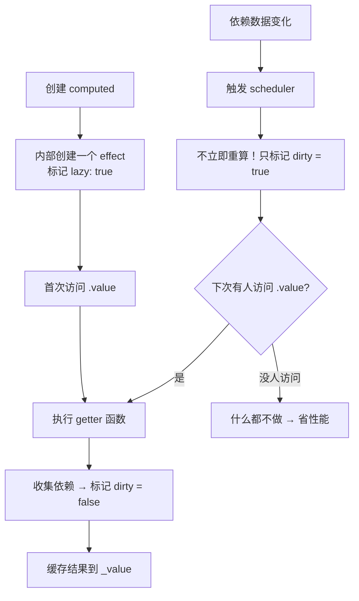
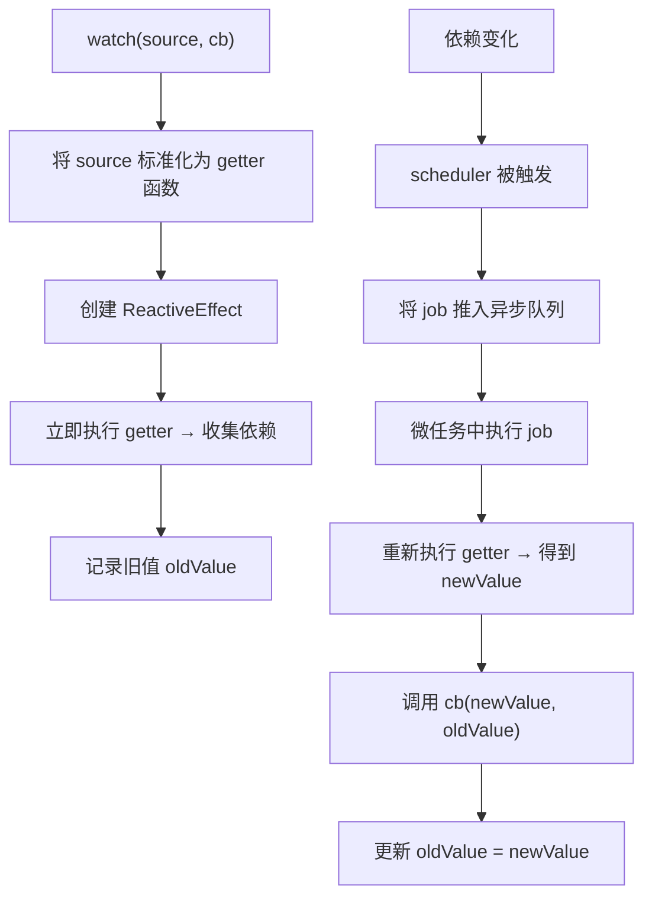
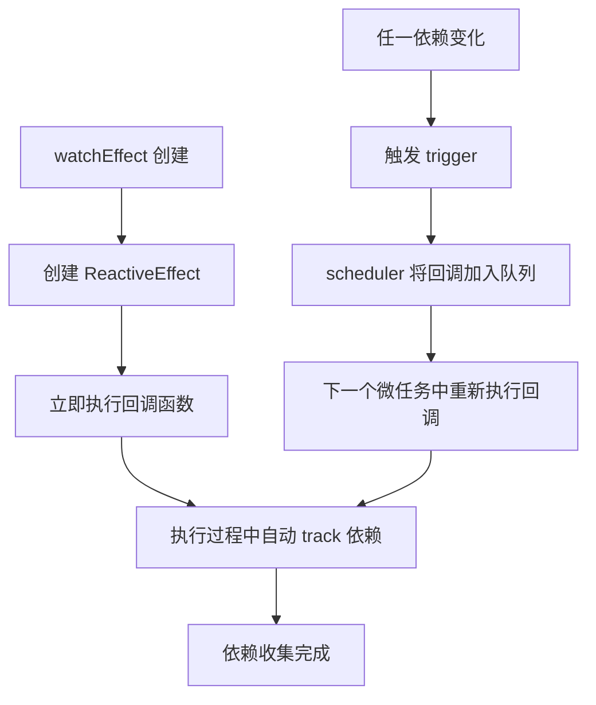
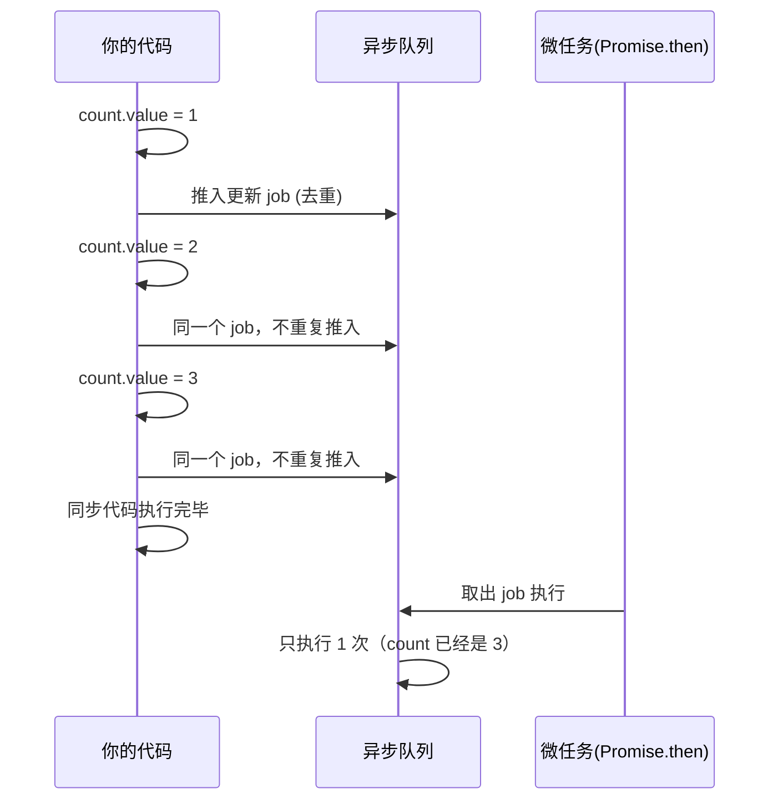
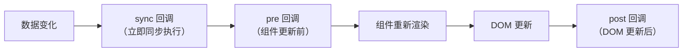

# Vue 计算属性与侦听器 — computed / watch / watchEffect 详解

## 1. 解决什么问题？
> 当数据变化时，自动派生新值或执行副作用，不用你手动盯着数据变没变

* **痛点**：多个数据组合计算（如价格×数量=总价）时，每次修改都要手动重算；数据变化后要发请求、存缓存，容易漏掉
* **作用**：`computed` 自动缓存派生值，`watch/watchEffect` 自动在数据变化时执行副作用，让你专注业务逻辑而非"盯梢"数据

---

## 2. 通俗理解

### 三个 API 一句话总结

| API | 一句话定义 | 核心特征 |
|-----|-----------|---------|
| `computed` | **自动计算 + 缓存结果**，依赖不变就不重算 | 有返回值、惰性求值、自带缓存 |
| `watch` | **精确监听**指定数据源，变化时执行回调 | 可拿到新旧值、可配置 deep/immediate |
| `watchEffect` | **自动追踪**回调里用到的所有响应式数据 | 不用指定监听谁、立即执行一次 |

### 生活化比喻

把响应式系统想象成一个**智能办公室**：

- **computed** = **Excel 公式单元格**。你在 C1 写了 `=A1+B1`，A1 或 B1 一变，C1 自动更新。但如果 A1 和 B1 都没变，你再看 C1 不会重新计算，直接给你上次的结果（缓存）
- **watch** = **安保摄像头**。你指定监控"大门"（具体数据源），有人进出（新旧值）就触发报警（回调），你能精确知道谁进来了谁出去了
- **watchEffect** = **智能感应灯**。不用你告诉它监控谁，你走进房间（回调里用了哪些数据），灯自动亮；你走出去它也知道。但它不告诉你"之前是亮还是暗"（没有旧值）

---

## 3. computed 计算属性

### 3.1 基础用法 — 只读计算属性

**场景：电商购物车总价计算**

```js
<script setup>
import { ref, computed } from 'vue'

const price = ref(99)
const quantity = ref(3)
const discount = ref(0.8)

// ✅ 计算属性：任何依赖变化 → 自动重算 → 结果被缓存
const totalPrice = computed(() => {
  console.log('重新计算了！') // 依赖不变时不会打印
  return price.value * quantity.value * discount.value
})
</script>

<template>
  <p>总价：¥{{ totalPrice.toFixed(2) }}</p>
  <!-- 模板里多次使用 totalPrice，只会计算一次 -->
  <p>折后省了：¥{{ (price * quantity - totalPrice).toFixed(2) }}</p>
</template>
```

**关键点**：模板里用了 2 次 `totalPrice`，但 `console.log` 只打印 1 次 — 这就是**缓存**的威力。

### 3.2 可写计算属性（getter + setter）

**场景：姓名双向绑定拆分**

```js
<script setup>
import { ref, computed } from 'vue'

const firstName = ref('张')
const lastName = ref('三')

const fullName = computed({
  get: () => firstName.value + lastName.value,
  set: (newVal) => {
    // 写入时自动拆分：第一个字是姓，后面是名
    firstName.value = newVal.slice(0, 1)
    lastName.value = newVal.slice(1)
  }
})

// 可以直接赋值！
// fullName.value = '李四'  → firstName='李', lastName='四'
</script>

<template>
  <input v-model="fullName" placeholder="输入全名" />
  <p>姓：{{ firstName }}，名：{{ lastName }}</p>
</template>
```

### 3.3 高级用法 — 带调试的 computed

```javascript
const total = computed(() => price.value * quantity.value, {
  onTrack(e) {
    // 依赖被收集时触发（仅开发环境）
    console.log('追踪了依赖:', e)
  },
  onTrigger(e) {
    // 依赖变化触发重算时
    debugger // 断点调试，精确定位哪个依赖触发了重算
  }
})
```

### 3.4 computed 底层原理

computed 的核心是 **惰性求值 + 脏检查缓存**：



**底层实现的三个关键设计**：

| 设计 | 机制 | 为什么这么做 |
|------|------|-------------|
| **惰性求值** | 首次 `.value` 才计算，不是创建时就算 | 避免无用计算 |
| **dirty 标记** | 依赖变了只标记脏，不立即重算 | 依赖连续变 10 次也只算 1 次 |
| **依赖收集** | getter 执行时自动 track，和渲染 effect 共用机制 | 精准追踪，不多不少 |

**简化的源码逻辑**：

```javascript
// Vue 3 源码简化版 — computed 的核心实现
class ComputedRefImpl {
  constructor(getter) {
    this._dirty = true    // 是否需要重新计算
    this._value = undefined
    // 创建一个 ReactiveEffect，传入 scheduler
    this.effect = new ReactiveEffect(getter, () => {
      // 依赖变化时：不重算，只标脏
      if (!this._dirty) {
        this._dirty = true
        triggerRefValue(this) // 通知依赖 computed 的人
      }
    })
  }
  get value() {
    trackRefValue(this) // 让外部（模板/watch）追踪这个 computed
    if (this._dirty) {
      this._value = this.effect.run() // 真正执行 getter
      this._dirty = false
    }
    return this._value // 不脏就直接返回缓存
  }
}
```

### 3.5 Vue 2 对比

```javascript
// Vue 2 — Options API
export default {
  data() {
    return { price: 99, quantity: 3 }
  },
  computed: {
    // 只读
    totalPrice() {
      return this.price * this.quantity
    },
    // 可写
    fullName: {
      get() { return this.firstName + this.lastName },
      set(val) { /* 拆分逻辑 */ }
    }
  }
}
// 差异：Vue 2 用 Object.defineProperty 实现，Vue 3 用 Proxy + effect
```

---

## 4. watch 侦听器

### 4.1 基础用法 — 监听不同数据源

```js
<script setup>
import { ref, reactive, watch } from 'vue'

const keyword = ref('')
const user = reactive({ name: '张三', age: 25 })
const list = ref([1, 2, 3])

// ✅ 监听 ref
watch(keyword, (newVal, oldVal) => {
  console.log(`搜索词：${oldVal} → ${newVal}`)
  fetchSearchResults(newVal) // 发起搜索请求
})

// ✅ 监听 reactive 的某个属性 → 必须用 getter 函数
watch(
  () => user.name,
  (newName) => { console.log('姓名改了:', newName) }
)

// ✅ 监听多个数据源
watch(
  [keyword, () => user.age],
  ([newKw, newAge], [oldKw, oldAge]) => {
    console.log('搜索词或年龄变了')
  }
)
```

**易错点**：监听 `reactive` 对象的属性，不能直接写 `watch(user.name, ...)`，因为这传的是字符串 `'张三'`，不是响应式引用！

### 4.2 watch 的配置项详解

```javascript
watch(source, callback, {
  immediate: true,  // 创建时立即执行一次（不用等数据变化）
  deep: true,       // 深层监听（对象嵌套属性变化也触发）
  flush: 'post',    // 回调时机：'pre'(默认) | 'post' | 'sync'
  once: true,       // Vue 3.4+ 只触发一次就自动停止
})
```

| 配置项 | 默认值 | 说明 | 典型场景 |
|--------|--------|------|---------|
| `immediate` | `false` | 创建时立即执行 | 页面初始化需要发请求 |
| `deep` | `false` | 深层递归监听 | 监听复杂嵌套对象 |
| `flush` | `'pre'` | 回调执行时机 | `'post'` 用于需要访问更新后 DOM |
| `once` | `false` | 只触发一次 | 等某个条件满足后执行一次 |

### 4.3 高级用法 — 实际业务场景

**场景 1：防抖搜索**

```js
<script setup>
import { ref, watch } from 'vue'

const keyword = ref('')
let timer = null

watch(keyword, (val) => {
  clearTimeout(timer)
  timer = setTimeout(() => {
    if (val.trim()) {
      fetchSearchAPI(val) // 用户停止输入 300ms 后才真正搜索
    }
  }, 300)
})
</script>
```

**场景 2：监听路由参数变化，重新加载数据**

```js
<script setup>
import { watch } from 'vue'
import { useRoute } from 'vue-router'

const route = useRoute()

// 路由参数变了 → 重新拉取文章详情
watch(
  () => route.params.id,
  async (newId) => {
    if (newId) {
      const data = await fetchArticle(newId)
      article.value = data
    }
  },
  { immediate: true } // 首次进入页面也要加载
)
</script>
```

**场景 3：停止监听（手动清理）**

```javascript
const stop = watch(source, callback)

// 某个条件下停止监听（比如用户注销）
stop()
```

**场景 4：清理副作用（onCleanup）**

```javascript
// 竞态处理：上一次请求还没返回，新请求已经发出
watch(keyword, async (newVal, oldVal, onCleanup) => {
  let cancelled = false
  onCleanup(() => { cancelled = true }) // 下次触发前自动调用

  const result = await fetchData(newVal)
  if (!cancelled) {  // 只有没被取消才更新
    list.value = result
  }
})
```

### 4.4 deep 的性能陷阱

```javascript
// ⚠️ 直接 watch reactive 对象，Vue 自动开启 deep: true
watch(user, (newVal) => {
  // user 的任何嵌套属性变化都会触发
  // 性能开销大！每次都要递归遍历整个对象
})

// ✅ 更好的做法：只监听你关心的属性
watch(
  () => user.profile.avatar,
  (newAvatar) => { uploadAvatar(newAvatar) }
)
```

### 4.5 watch 底层原理



**watch 的源码核心逻辑**：

```javascript
// 简化版 watch 实现
function watch(source, cb, options) {
  // 1. 标准化 source 为 getter 函数
  let getter
  if (isRef(source)) {
    getter = () => source.value
  } else if (isReactive(source)) {
    getter = () => traverse(source) // 深度遍历收集依赖
  } else if (isFunction(source)) {
    getter = source
  }

  let oldValue
  // 2. 调度器：依赖变化时不立即执行 cb，而是放入队列
  const job = () => {
    const newValue = effect.run()
    cb(newValue, oldValue)
    oldValue = newValue
  }
  // 3. 创建 effect，依赖变化触发 scheduler
  const effect = new ReactiveEffect(getter, () => {
    queueJob(job) // 放入微任务队列，同一个 tick 多次变化只执行一次
  })
  // 4. 初始执行收集依赖
  oldValue = effect.run()
  if (options?.immediate) job() // immediate 则立即调一次 cb
}
```

### 4.6 Vue 2 对比

```javascript
// Vue 2 — Options API
export default {
  watch: {
    // 简写
    keyword(newVal, oldVal) {
      this.fetchSearch(newVal)
    },
    // 完整写法
    'user.name': {
      handler(newVal) { /* ... */ },
      deep: true,
      immediate: true
    }
  },
  created() {
    // 动态 watch（等同于 Vue 3 的 watch()）
    this.$watch('keyword', (n, o) => { /* ... */ })
  }
}
```

---

## 5. watchEffect 自动追踪侦听器

### 5.1 基础用法

```js
<script setup>
import { ref, watchEffect } from 'vue'

const userId = ref(1)
const userData = ref(null)

// ✅ 不用声明监听谁 — 回调里用了什么就自动追踪什么
watchEffect(async () => {
  const res = await fetch(`/api/user/${userId.value}`)
  userData.value = await res.json()
  // userId 变了 → 自动重新执行
})
</script>
```

### 5.2 watchEffect vs watch 对比

| 对比项 | `watch` | `watchEffect` |
|--------|---------|---------------|
| 监听源 | 必须显式指定 | 自动追踪回调内使用的依赖 |
| 旧值 | 能拿到 `oldValue` | 拿不到 |
| 执行时机 | 默认数据变化后才执行 | **创建时立即执行一次** |
| 惰性 | 默认惰性（除非 immediate） | 非惰性，马上跑一次 |
| 适用场景 | 需要新旧值对比、条件触发 | 只关心"当前状态"，同步多个数据源 |

### 5.3 watchPostEffect 和 watchSyncEffect

```javascript
import { watchPostEffect, watchSyncEffect } from 'vue'

// 等 DOM 更新后再执行（等同于 watchEffect + flush: 'post'）
watchPostEffect(() => {
  // 这里可以安全地访问更新后的 DOM
  const el = document.getElementById('target')
  el?.scrollIntoView()
})

// 同步执行，依赖变化立即触发（慎用！性能差）
watchSyncEffect(() => {
  console.log('同步执行，不走队列')
})
```

### 5.4 watchEffect 底层原理



**核心区别**：watch 分离了"追踪"和"回调"，而 watchEffect 把追踪和回调合二为一。

```javascript
// watchEffect 简化实现
function watchEffect(fn) {
  const effect = new ReactiveEffect(fn, () => {
    queueJob(effect.run.bind(effect)) // 依赖变化 → 重新跑 fn
  })
  effect.run() // 立即执行一次（和 watch 的关键区别）
}
```

---

## 6. 底层调度机制：为什么修改 10 次只更新 1 次？

这是理解 computed/watch/watchEffect 的关键。

### 6.1 异步队列机制



**核心设计**：Vue 把 watch 回调和组件更新都推入微任务队列，利用 `Promise.then` 做批处理。一个 tick 内修改同一个数据 100 次，回调只执行 1 次。

### 6.2 三种 flush 时机的执行顺序

```javascript
// 同一个 tick 内的执行顺序
watch(data, cb, { flush: 'sync' })  // ① 同步：数据一变就跑
watch(data, cb, { flush: 'pre' })   // ② pre（默认）：组件更新前
watch(data, cb, { flush: 'post' })  // ③ post：组件更新+DOM 更新后
```



### 6.3 依赖收集的统一机制

computed、watch、watchEffect 底层都用 `ReactiveEffect`，区别在于配置：

```
                    ┌──────────────────────────────────────────────────┐
                    │         ReactiveEffect (响应式副作用)             │
                    ├──────────────────────────────────────────────────┤
                    │  fn: 要执行的函数                                 │
                    │  scheduler: 依赖变化时的调度策略                   │
                    │  deps: 当前收集到的依赖列表                       │
                    └──────────────────────────────────────────────────┘
                                      ▲
                    ┌─────────────────┼─────────────────┐
                    │                 │                   │
              ┌─────┴─────┐   ┌──────┴──────┐   ┌──────┴──────┐
              │  computed  │   │    watch    │   │ watchEffect │
              ├───────────┤   ├────────────┤   ├────────────┤
              │ lazy: true │   │ lazy: false │   │ lazy: false │
              │ 有 scheduler│   │ 有 scheduler│   │ 有 scheduler│
              │ 标脏不执行  │   │ 推入队列    │   │ 推入队列    │
              │ 访问时才算  │   │ 有新旧值对比│   │ 无新旧值    │
              └───────────┘   └────────────┘   └────────────┘
```

---

## 7. 最佳实践

### 性能考虑

* **computed 比方法好**：模板里 `{{ getTotal() }}` 每次渲染都重新调用；`{{ total }}` 只在依赖变化时重算
* **watch 避免 deep 滥用**：deep 会递归遍历所有属性，大对象性能差。优先用 `() => obj.specificProp` 精准监听
* **watchEffect 注意异步依赖丢失**：`await` 之后的响应式数据不会被追踪（因为依赖收集发生在同步阶段）

### 注意事项

* **computed 里不要有副作用**：不要在 computed 里发请求、修改 DOM、修改其他响应式数据。它应该是**纯函数**
* **watch 的 callback 是异步的**：修改数据后，watch 回调不会立即执行（除非 `flush: 'sync'`）
* **watchEffect 第一次一定会跑**：用它替代 `watch + immediate` 时要注意这一点
* **组件卸载自动清理**：在 `<script setup>` 中创建的 watch/watchEffect 会随组件卸载自动停止，不用手动 `stop()`

### 选择指南

```
需要缓存计算结果？ → computed
需要知道新旧值？ → watch
需要 immediate？ → watch({ immediate: true }) 或 watchEffect
只关心当前值，自动追踪？ → watchEffect
需要操作 DOM？ → watchPostEffect
```

---

## 8. 常见错误与解决方案

### 错误 1：computed 中修改依赖数据（死循环）

```javascript
// ❌ 错误：computed 里修改了自己的依赖
const list = ref([3, 1, 2])
const sorted = computed(() => {
  list.value.sort() // sort() 会修改原数组 → 触发依赖变化 → 重新计算 → 死循环！
  return list.value
})

// ✅ 正确：返回新数组
const sorted = computed(() => [...list.value].sort())
```

### 错误 2：watch 监听 reactive 属性写法错误

```javascript
const user = reactive({ name: '张三' })

// ❌ 错误：传的是字符串 '张三'，不是响应式引用
watch(user.name, (val) => { /* 永远不会触发 */ })

// ✅ 正确：用 getter 函数
watch(() => user.name, (val) => { /* 正常触发 */ })
```

### 错误 3：watchEffect 中 await 后的依赖丢失

```javascript
const id = ref(1)
const type = ref('article')

// ❌ type 变化时不会重新执行！
watchEffect(async () => {
  const data = await fetch(`/api/${id.value}`) // id 被追踪 ✅
  console.log(type.value) // await 之后，type 不会被追踪 ❌
})

// ✅ 解决：把响应式数据的访问放在 await 之前
watchEffect(async () => {
  const currentId = id.value    // 先同步访问
  const currentType = type.value // 先同步访问
  const data = await fetch(`/api/${currentId}?type=${currentType}`)
})
```

### 错误 4：computed 用成了方法

```js
<template>
  <!-- ❌ 加了 ()，每次渲染都重新执行，没有缓存 -->
  <p>{{ totalPrice() }}</p>

  <!-- ✅ 不加 ()，享受缓存 -->
  <p>{{ totalPrice }}</p>
</template>
```

### 错误 5：watch 回调中修改自己监听的数据

```javascript
const count = ref(0)

// ❌ 死循环
watch(count, (val) => {
  count.value = val + 1 // 修改了自己 → 触发 watch → 再修改 → 无限循环
})

// ✅ 如果确实需要，加条件守卫
watch(count, (val) => {
  if (val < 10) count.value = val + 1 // 有终止条件
})
```

---

## 9. 面试高频问题与参考答案

### Q1：computed 和 methods 有什么区别？

> **computed 有缓存，methods 没有。**
>
> computed 基于响应式依赖缓存结果，只有依赖变化才重新计算。methods 每次渲染/调用都会执行。所以对于复杂计算，computed 性能更好。
>
> 但 computed 必须是纯函数、有返回值；methods 可以有副作用、可以无返回值。

### Q2：computed 和 watch 的区别？什么时候用哪个？

> | 对比 | computed | watch |
> |------|----------|-------|
> | 目的 | **派生数据** | **执行副作用** |
> | 返回值 | 必须有 | 没有 |
> | 缓存 | 有 | 没有 |
> | 副作用 | 不应该有 | 专门干这事 |
> | 新旧值 | 不提供 | 提供 |
>
> **经验法则**：能用 computed 解决的就不要用 watch。当你需要在数据变化后"做某事"（发请求、操作 DOM、写日志）时才用 watch。

### Q3：watch 和 watchEffect 的区别？

> 1. **监听源**：watch 需要显式指定，watchEffect 自动追踪
> 2. **旧值**：watch 能拿到 old/new，watchEffect 不能
> 3. **执行时机**：watch 默认惰性（变了才跑），watchEffect 立即执行一次
> 4. **使用场景**：需要对比新旧值或条件触发用 watch，只关心当前状态且依赖多时用 watchEffect

### Q4：computed 的缓存机制是如何实现的？

> 底层用 `dirty` 标记 + `ReactiveEffect` + `scheduler` 实现：
> 1. 创建 computed 时生成一个 `lazy` 的 effect，`dirty = true`
> 2. 首次访问 `.value` → 执行 getter → 缓存结果 → `dirty = false`
> 3. 依赖变化 → scheduler 只将 `dirty` 设为 `true`，不重新计算
> 4. 下次访问 `.value` 时检查 `dirty`：为 `true` 才重算，否则直接返回缓存
>
> 这就是为什么依赖连续变化 10 次，computed 也只重算 1 次（在你真正访问它的时候）。

### Q5：为什么 Vue 要把 watch 回调放入异步队列？

> 为了**批量更新优化**。一个同步代码块里可能修改多个响应式数据，如果每次修改都立即执行回调，会造成不必要的多次执行。放入微任务队列后，同一个 tick 内的多次修改只会触发一次回调，拿到的是最终值。
>
> 这和 React 的 `setState` 批处理是类似的设计理念。

### Q6：watchEffect 中 await 之后的代码为什么不会被追踪？

> 因为 Vue 的依赖收集是**同步**的。`watchEffect` 的回调执行时，遇到 `await` 会暂停函数，控制权交回事件循环。此时依赖收集已经结束（只收集了 `await` 之前访问的响应式数据）。`await` 之后的代码在 Promise resolve 时才执行，已经不在依赖收集的上下文中了。
>
> **解决方案**：在 `await` 之前先把所有响应式数据的值取出来。

### Q7：如何在 watch 中处理竞态条件？

> 使用 `onCleanup`（Vue 3.5+）或第三个参数 `onCleanup`：
> ```javascript
> watch(id, async (newId, oldId, onCleanup) => {
>   let cancelled = false
>   onCleanup(() => { cancelled = true })
>   const data = await fetchData(newId)
>   if (!cancelled) result.value = data
> })
> ```
> 每次回调重新触发前，上一次的 `onCleanup` 会先执行，标记上一次请求为取消。

### Q8：直接 watch 一个 reactive 对象和 watch 一个 ref 有什么区别？

> - watch `reactive` 对象：自动开启 `deep: true`，任何嵌套属性变化都触发，**拿不到旧值**（因为新旧值是同一个引用）
> - watch `ref`：
>   - ref 包装基本类型：正常拿到新旧值
>   - ref 包装对象：需要手动 `{ deep: true }` 才能监听内部变化

---

## 10. 扩展思考

### 10.1 相关 API 一览

| API | 用途 |
|-----|------|
| `computed()` | 声明计算属性 |
| `watch()` | 显式监听数据源 |
| `watchEffect()` | 自动追踪依赖并执行 |
| `watchPostEffect()` | DOM 更新后执行的 watchEffect |
| `watchSyncEffect()` | 同步执行的 watchEffect |
| `effectScope()` | 批量管理和清理多个 effect |
| `onWatcherCleanup()` | Vue 3.5+ 在 watch/watchEffect 内部注册清理函数 |

### 10.2 effectScope — 批量管理 effect

```javascript
import { effectScope, computed, watch, watchEffect } from 'vue'

const scope = effectScope()

scope.run(() => {
  const total = computed(() => price.value * qty.value)
  watch(total, (val) => console.log('总价:', val))
  watchEffect(() => console.log('用户:', user.value))
})

// 一键停止 scope 内所有 effect — 适合插件/组合函数
scope.stop()
```

### 10.3 组合函数中的最佳实践

```javascript
// composables/useDebounceSearch.js
import { ref, watch } from 'vue'

export function useDebounceSearch(fetchFn, delay = 300) {
  const keyword = ref('')
  const results = ref([])
  const loading = ref(false)

  watch(keyword, (val) => {
    loading.value = true
    clearTimeout(timer)
    const timer = setTimeout(async () => {
      results.value = await fetchFn(val)
      loading.value = false
    }, delay)
  })

  return { keyword, results, loading }
}
```

在组件中使用：

```js
<script setup>
import { useDebounceSearch } from '@/composables/useDebounceSearch'

const { keyword, results, loading } = useDebounceSearch(
  (kw) => fetch(`/api/search?q=${kw}`).then(r => r.json())
)
</script>
```

---

_本文档将持续更新，添加更多 computed / watch 相关的进阶内容和实战案例_
