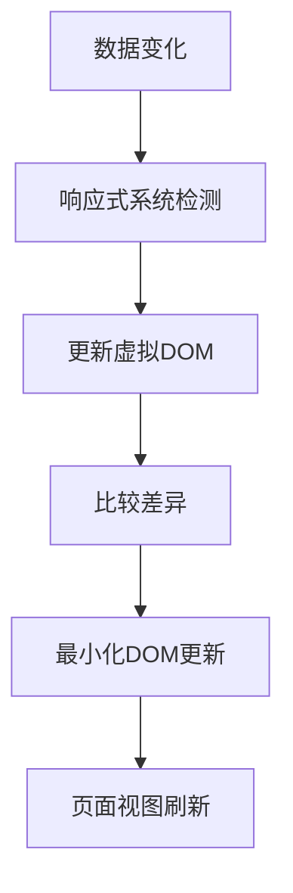

# 模板语法 (Template Syntax)

## 1. 解决什么问题？

> 使用声明式的方式将数据渲染到 DOM

* **痛点**：传统 JavaScript 操作 DOM 需要频繁手动更新元素内容，代码繁琐且容易出错
* **作用**：Vue 模板语法让你可以用简洁的语法将数据动态绑定到 HTML，让开发者专注于业务逻辑而非 DOM 操作

## 2. 通俗理解

### 核心定义

模板语法是 Vue 提供的一套特殊的标记语言。它允许你在 HTML 中嵌入表达式，并使用指令来控制 DOM 的行为和显示。通过模板语法，你可以将应用程序的状态直接映射到用户界面。

### 生活化比喻

如果你知道 Excel 表格，那么 Vue 模板语法类似于 Excel 中的公式。当你在单元格 A1 输入一个值，另一个单元格 B1 通过公式引用 A1 的值时，A1 值变化会自动反映到 B1 上。同样，Vue 模板将数据变化自动反映到页面上。

## 3. 工作原理



## 4. 核心代码实战

### 业务场景

一个用户信息展示页面，包含个人信息展示、条件显示状态、以及好友列表渲染功能。

### Vue 3 写法

```js
<template>
  <!-- 插值语法：文本渲染 -->
  <h1>欢迎 {{ user.name }}</h1>

  <!-- v-bind：动态属性绑定 -->
  

  <!-- v-if：条件渲染 -->
  <div v-if="user.status === 'online'" class="status-indicator online">
    在线
  </div>
  <div v-else-if="user.status === 'away'" class="status-indicator away">
    离开
  </div>
  <div v-else class="status-indicator offline">
    离线
  </div>

  <!-- v-show：条件显示（仅切换CSS） -->
  <p v-show="showDetails">详细信息：{{ user.description }}</p>

  <!-- v-for：列表渲染 -->
  <ul>
    <li
      v-for="(friend, index) in user.friends"
      :key="friend.id"
      @click="selectFriend(friend)"
      :class="{ selected: friend.selected }"
    >
      {{ index + 1 }}. {{ friend.name }}
    </li>
  </ul>

  <!-- v-on：事件绑定 -->
  <button @click="toggleDetails">切换详情显示</button>

  <!-- v-model：双向数据绑定 -->
  <input v-model="user.name" placeholder="修改姓名" />

  <!-- v-text 和 v-html：文本渲染 -->
  <p v-text="summaryText"></p>
  <div v-html="user.bioHtml"></div>

  <!-- Class 与 Style 绑定 -->
  <div
    :class="{ active: isActive, disabled: !isEnabled }"
    :style="{ color: textColor, fontSize: fontSize + 'px' }"
  >
    动态样式内容
  </div>

  <!-- 修饰符使用 -->
  <form @submit.prevent="handleSubmit">
    <input @keyup.enter="submitForm" />
    <button @click.stop="handleClick">点击事件</button>
  </form>
</template>

<script setup>
import { ref, computed } from 'vue'

// 用户数据
const user = ref({
  name: '张三',
  avatar: '/avatar.jpg',
  status: 'online',
  description: '这是一个普通的用户',
  bioHtml: '<strong>热爱前端开发</strong>',
  friends: [
    { id: 1, name: '李四', selected: false },
    { id: 2, name: '王五', selected: true },
    { id: 3, name: '赵六', selected: false }
  ]
})

// 控制变量
const showDetails = ref(true)
const isActive = ref(true)
const isEnabled = ref(true)
const textColor = ref('blue')
const fontSize = ref(16)

// 计算属性
const summaryText = computed(() => {
  return `${user.value.name} 拥有 ${user.value.friends.length} 位好友`
})

// 方法
const toggleDetails = () => {
  showDetails.value = !showDetails.value
}

const selectFriend = (friend) => {
  // 清除之前的选中状态
  user.value.friends.forEach(f => f.selected = false)
  // 设置当前选中状态
  friend.selected = true
}

const handleSubmit = () => {
  console.log('表单提交');
}

const submitForm = () => {
  console.log('回车提交');
}

const handleClick = () => {
  console.log('按钮点击');
}
</script>

<style scoped>
.status-indicator {
  padding: 4px 8px;
  border-radius: 4px;
  font-size: 12px;
}

.online {
  background-color: #42b983;
  color: white;
}

.away {
  background-color: #f0ad4e;
  color: white;
}

.offline {
  background-color: #6c757d;
  color: white;
}

.selected {
  background-color: #f0f8ff;
  font-weight: bold;
}

.active {
  border: 2px solid green;
}

.disabled {
  opacity: 0.5;
  cursor: not-allowed;
}
</style>
```

### Vue 2 对比

```js
<template>
  <div>
    <!-- 插值语法 -->
    <h1>欢迎 {{ user.name }}</h1>

    <!-- v-bind：动态属性绑定 -->
    

    <!-- v-if：条件渲染 -->
    <div v-if="user.status === 'online'" class="status-indicator online">
      在线
    </div>
    <div v-else-if="user.status === 'away'" class="status-indicator away">
      离开
    </div>
    <div v-else class="status-indicator offline">
      离线
    </div>

    <!-- v-for：列表渲染 -->
    <ul>
      <li
        v-for="(friend, index) in user.friends"
        v-bind:key="friend.id"
        v-on:click="selectFriend(friend)"
        v-bind:class="{ selected: friend.selected }"
      >
        {{ index + 1 }}. {{ friend.name }}
      </li>
    </ul>

    <!-- Vue 2 选项式 API -->
    <button v-on:click="toggleDetails">切换详情显示</button>
    <input v-model="user.name" placeholder="修改姓名" />

    <!-- 修饰符使用 -->
    <form v-on:submit.prevent="handleSubmit">
      <input v-on:keyup.enter="submitForm" />
      <button v-on:click.stop="handleClick">点击事件</button>
    </form>
  </div>
</template>

<script>
export default {
  data() {
    return {
      user: {
        name: '张三',
        avatar: '/avatar.jpg',
        status: 'online',
        friends: [
          { id: 1, name: '李四', selected: false },
          { id: 2, name: '王五', selected: true },
          { id: 3, name: '赵六', selected: false }
        ]
      },
      showDetails: true
    }
  },
  computed: {
    summaryText() {
      return `${this.user.name} 拥有 ${this.user.friends.length} 位好友`
    }
  },
  methods: {
    toggleDetails() {
      this.showDetails = !this.showDetails
    },
    selectFriend(friend) {
      // 清除之前的选中状态
      this.user.friends.forEach(f => f.selected = false)
      // 设置当前选中状态
      friend.selected = true
    },
    handleSubmit() {
      console.log('表单提交');
    },
    submitForm() {
      console.log('回车提交');
    },
    handleClick() {
      console.log('按钮点击');
    }
  }
}
</script>
```

## 5. 最佳实践

* **性能考虑**：列表渲染时始终为 v-for 添加 key，以便 Vue 正确识别每个节点，提高渲染效率。对于简单静态列表可以使用索引作为 key，但对动态列表务必使用唯一标识。
* **注意事项**：避免在模板表达式中写复杂的逻辑，应该使用计算属性或方法替代；注意 v-if 和 v-for 的优先级，在同一元素上同时使用可能造成性能问题。
* **边界情况**：使用 v-if 和 v-show 时要区分使用场景，v-if 适合不常切换的情况（条件性渲染），v-show 适合频繁切换的情况（仅切换CSS）；注意 v-show 不支持 `<template>` 元素。

## 6. 常见错误与解决方案

**错误1：列表渲染缺少 key**

```javascript
// 错误写法
<li v-for="item in items">{{ item.name }}</li>

// 正确写法
<li v-for="item in items" :key="item.id">{{ item.name }}</li>
```

**错误2：在模板中使用复杂表达式**

```javascript
<!-- 错误写法 -->
<p>{{ message.split('').reverse().join('') }}</p>

<!-- 正确写法：使用计算属性 -->
<template>
  <p>{{ reversedMessage }}</p>
</template>

<script setup>
import { computed } from 'vue'

const message = ref('hello')

const reversedMessage = computed(() => {
  return message.value.split('').reverse().join('')
})
</script>
```

**错误3：不当使用 v-if 和 v-for**

```javascript
<!-- 错误写法：v-if 和 v-for 在同一元素上 -->
<li v-for="user in users" v-if="user.isActive" :key="user.id">
  {{ user.name }}
</li>

<!-- 正确写法：使用 template 包装 -->
<template v-for="user in users" :key="user.id">
  <li v-if="user.isActive">
    {{ user.name }}
  </li>
</template>
```

**错误4：v-html 安全问题**

```javascript
<!-- 危险写法：可能导致XSS攻击 -->
<div v-html="userInput"></div>

<!-- 安全写法：使用插值并过滤HTML标签 -->
<div>{{ filteredContent }}</div>

<script setup>
import { computed } from 'vue'

const userInput = ref('<script>alert("xss")</script>危险内容')

const filteredContent = computed(() => {
  // 过滤HTML标签
  return userInput.value.replace(/<[^>]*>/g, '')
})
</script>
```

## 7. 扩展思考

* **深入了解**：模板语法的编译过程和内部工作原理，包括模板编译为渲染函数的过程
* **相关API**：熟悉 Render Functions 和 JSX，它们提供了更灵活的模板功能
* **进阶资源**：阅读 Vue 源码中 compiler 模块，理解模板是如何转化为 JavaScript 渲染函数的

### 模板语法进阶技巧

#### 指令修饰符详解
- `.stop` - 调用 event.stopPropagation()
- `.prevent` - 调用 event.preventDefault()
- `.capture` - 添加事件捕获模式
- `.self` - 只当事件在元素本身（而非子元素）触发时触发
- `.once` - 事件只触发一次
- `.passive` - 以被动模式添加事件监听器

#### 动态指令参数
```js
<template>
  <!-- 动态参数 -->
  <div v-bind:[attributeName]="value">动态参数</div>
  <button v-on:[event]="handler">动态事件</button>
</template>

<script setup>
const attributeName = ref('id')
const event = ref('click')
</script>
```