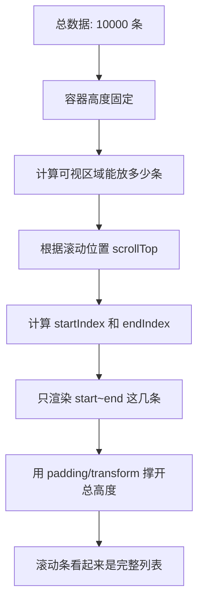
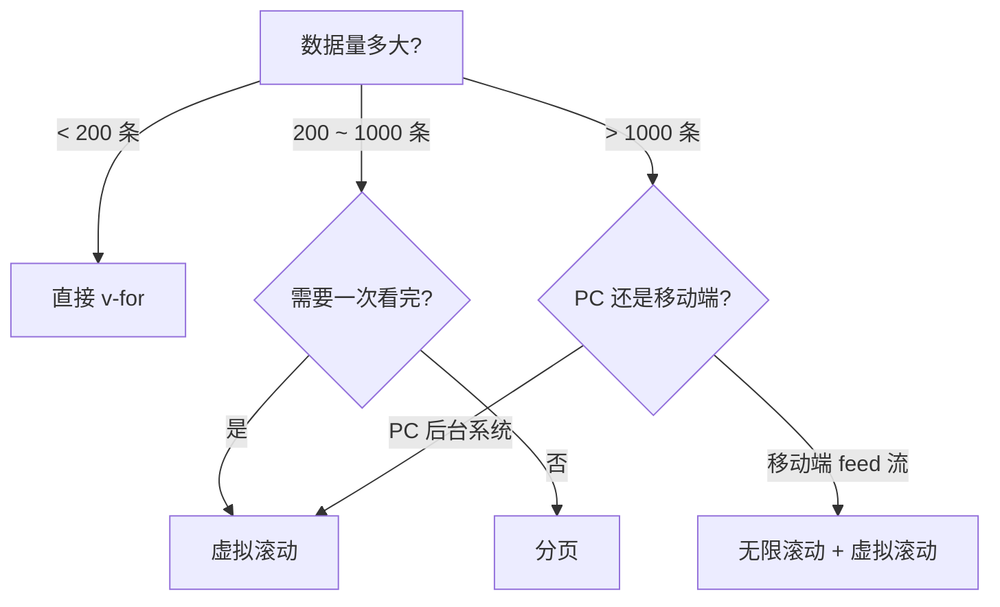

# Vue 大列表性能优化 (Large List Performance Optimization)

## 1. 解决什么问题？
> 几千上万条数据的列表不再卡顿——只渲染用户看得到的那一屏。

* **痛点**：后台管理系统的表格动辄几千行，一次性全部渲染，DOM 节点暴涨，页面卡成幻灯片
* **作用**：通过虚拟滚动只渲染可视区域的少量 DOM，或通过分页/无限滚动控制单次渲染量

## 2. 通俗理解

### 核心定义
大列表优化的核心是**DOM 节点控制**。浏览器渲染 1 万个 DOM 节点和渲染 20 个的性能差距是巨大的。优化方案：
- **虚拟滚动**：列表看起来有 1 万条，实际 DOM 里只有 20-30 个节点在"演戏"
- **分页加载**：数据分批次请求和渲染
- **无限滚动**：滚到底部自动加载下一批

### 生活化比喻
- **不优化** = 一个图书馆把所有书都摆在一张桌子上让你找，桌子直接塌了
- **虚拟滚动** = 图书馆只在你面前放一排书架，你往前走时，后面的书架搬到前面去，永远只有一排书架
- **分页加载** = 一次只给你看第3页的内容，想看下一页再翻

## 3. 工作原理

### 虚拟滚动核心原理



**关键公式**：
- `startIndex = Math.floor(scrollTop / itemHeight)`
- `endIndex = startIndex + visibleCount + buffer`
- `totalHeight = totalCount × itemHeight`（让滚动条正确显示）

## 4. 核心代码实战

### 4.1 使用 vue-virtual-scroller（推荐方案）

**场景**：后台管理系统中展示上万条订单记录。

```bash
npm install vue-virtual-scroller
```

```html
<template>
  <RecycleScroller
    class="order-list"
    :items="orders"
    :item-size="60"
    key-field="id"
    v-slot="{ item }"
  >
    <div class="order-item">
      <span>{{ item.orderNo }}</span>
      <span>{{ item.customerName }}</span>
      <span>¥{{ item.amount }}</span>
      <span :class="statusClass(item.status)">
        {{ item.statusText }}
      </span>
    </div>
  </RecycleScroller>
</template>

<script setup>
import { RecycleScroller } from 'vue-virtual-scroller'
import 'vue-virtual-scroller/dist/vue-virtual-scroller.css'
import { ref } from 'vue'

// 假设从接口拿到了 10000 条订单
const orders = ref([/* ...10000条数据 */])

const statusClass = (status) => ({
  'text-green': status === 'done',
  'text-red': status === 'cancelled'
})
</script>

<style scoped>
.order-list { height: 600px; }
.order-item { height: 60px; display: flex; align-items: center; }
</style>
```

> `RecycleScroller` 会复用 DOM 节点，无论数据有多少条，实际 DOM 只有可视区域 + 少量缓冲。

### 4.2 手写简易虚拟滚动（理解原理）

```html
<template>
  <div
    class="virtual-container"
    ref="containerRef"
    @scroll="onScroll"
    :style="{ height: containerHeight + 'px', overflow: 'auto' }"
  >
    <!-- 撑开总高度，让滚动条正确 -->
    <div :style="{ height: totalHeight + 'px', position: 'relative' }">
      <div
        v-for="item in visibleItems"
        :key="item.id"
        :style="{
          position: 'absolute',
          top: item._top + 'px',
          height: itemHeight + 'px',
          width: '100%'
        }"
      >
        {{ item.name }} - {{ item.value }}
      </div>
    </div>
  </div>
</template>

<script setup>
import { ref, computed } from 'vue'

const props = defineProps({
  items: { type: Array, required: true }  // 全量数据
})

const itemHeight = 50       // 每项固定高度
const containerHeight = 400 // 容器高度
const buffer = 5            // 上下缓冲区

const scrollTop = ref(0)
const containerRef = ref(null)

const totalHeight = computed(() => props.items.length * itemHeight)

const visibleItems = computed(() => {
  const start = Math.max(0,
    Math.floor(scrollTop.value / itemHeight) - buffer)
  const end = Math.min(props.items.length,
    start + Math.ceil(containerHeight / itemHeight) + buffer * 2)

  return props.items.slice(start, end).map((item, i) => ({
    ...item,
    _top: (start + i) * itemHeight
  }))
})

const onScroll = (e) => { scrollTop.value = e.target.scrollTop }
</script>
```

### 4.3 无限滚动（Infinite Scroll）

**场景**：移动端的"下拉加载更多"，比如社交 feed 流。

```html
<template>
  <div class="feed-list">
    <div v-for="post in posts" :key="post.id" class="post-card">
      <h3>{{ post.title }}</h3>
      <p>{{ post.summary }}</p>
    </div>

    <!-- 哨兵元素：被观察到就加载下一页 -->
    <div ref="sentinel" class="loading-trigger">
      <span v-if="loading">加载中...</span>
      <span v-else-if="noMore">没有更多了</span>
    </div>
  </div>
</template>

<script setup>
import { ref, onMounted, onUnmounted } from 'vue'

const posts = ref([])
const page = ref(1)
const loading = ref(false)
const noMore = ref(false)
const sentinel = ref(null)

const loadMore = async () => {
  if (loading.value || noMore.value) return
  loading.value = true

  const res = await fetch(`/api/posts?page=${page.value}`)
  const data = await res.json()

  if (data.length === 0) { noMore.value = true }
  else { posts.value.push(...data); page.value++ }

  loading.value = false
}

let observer
onMounted(() => {
  // IntersectionObserver 监听哨兵元素进入视口
  observer = new IntersectionObserver(([entry]) => {
    if (entry.isIntersecting) loadMore()
  })
  observer.observe(sentinel.value)
})

onUnmounted(() => observer?.disconnect())
</script>
```

## 5. 最佳实践

* **固定高度 vs 动态高度**：虚拟滚动最简单的实现是固定行高。动态高度需要预估或动态计算，复杂度翻倍，建议用成熟库
* **key 的重要性**：虚拟滚动中 `key` 必须用唯一 ID（不能用 index），否则复用时会出现数据错乱
* **搜索 + 虚拟滚动**：前端搜索过滤后，直接替换数据源即可，虚拟滚动自动适配
* **结合 v-memo**：虚拟滚动的列表项如果渲染开销大，再叠加 `v-memo` 进一步减少更新

## 6. 常见错误与解决方案

### 错误 1：不设容器固定高度
```html
<!-- ❌ 错误：没有固定高度，虚拟滚动无法计算可视区域 -->
<RecycleScroller :items="list" :item-size="50">
  ...
</RecycleScroller>

<!-- ✅ 正确：容器必须有固定高度 -->
<RecycleScroller
  class="list"
  style="height: 500px;"
  :items="list"
  :item-size="50"
>
  ...
</RecycleScroller>
```

### 错误 2：大列表直接 v-for 不加任何优化
```html
<!-- ❌ 错误：10000条直接渲染，页面卡死 -->
<div v-for="item in bigList" :key="item.id">
  {{ item.name }}
</div>

<!-- ✅ 方案选择指南 -->
<!-- 数据 < 200 条：直接 v-for 就行 -->
<!-- 200 ~ 1000 条：分页或无限滚动 -->
<!-- > 1000 条：虚拟滚动 -->
```

### 错误 3：无限滚动不做防重复请求
```javascript
// ❌ 错误：滚动事件触发太快，同一页请求了多次
window.addEventListener('scroll', loadMore)

// ✅ 正确：用 loading 锁 + IntersectionObserver
const loadMore = async () => {
  if (loading.value || noMore.value) return  // 锁住
  loading.value = true
  // ... 请求数据
  loading.value = false
}
```

## 7. 扩展思考

### 方案选择决策树



### 常用虚拟滚动库

| 库名 | 特点 | 适合场景 |
|------|------|---------|
| `vue-virtual-scroller` | Vue 官方推荐，支持固定/动态高度 | 通用列表 |
| `@tanstack/vue-virtual` | TanStack 生态，API 灵活 | 需要精细控制 |
| `vueuc` (Naive UI 内置) | 轻量，和 Naive UI 配合好 | 用了 Naive UI 的项目 |

---
_本文档将持续更新，添加更多大列表优化相关内容_
