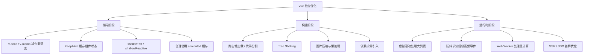

# Vue 性能优化策略总览 (Vue Performance Optimization)

## 1. 解决什么问题？
> 让你的 Vue 项目从"能用"升级到"好用"——更快的首屏、更流畅的交互、更小的包体积。

* **痛点**：项目越来越大，页面加载慢、列表卡顿、打包产物臃肿，用户体验直线下降，但不知道从哪里入手优化
* **作用**：系统梳理 Vue 项目中的性能瓶颈和对应解决方案，让你在实际工作中有章可循

## 2. 通俗理解

### 核心定义
Vue 性能优化不是某一个 API，而是一套**从编码到打包到运行时**的完整策略体系。它覆盖三个阶段：
- **编码阶段**：写出高效的组件和逻辑
- **构建阶段**：让打包产物更小更精
- **运行时阶段**：让页面渲染和交互更流畅

### 生活化比喻
想象你开一家餐厅：
- **编码优化** = 优化后厨动线，厨师不做无用功（组件不做无意义的重新渲染）
- **构建优化** = 精简菜单，去掉没人点的菜（Tree Shaking 去掉没用的代码）
- **运行时优化** = 先上招牌菜，其他菜客人点了再做（懒加载、虚拟滚动）

## 3. 性能优化全景图



## 4. 三个阶段详解

### 4.1 编码阶段——写出高效的代码

这是**成本最低、收益最高**的优化方式，不需要引入任何工具，改几行代码就有效果。

| 技术 | 适用场景 | 核心思路 |
|------|---------|---------|
| `v-once` | 纯静态内容，渲染后不再变化 | 只渲染一次，跳过后续 diff |
| `v-memo` | 列表项依赖少量条件变化 | 缓存 VNode，条件不变就复用 |
| `KeepAlive` | Tab 切换、步骤表单等需要保留状态 | 缓存组件实例，避免销毁重建 |
| `shallowRef` | 大对象 / 嵌套深的数据 | 只追踪 `.value` 引用变化，不深度代理 |
| `computed` | 依赖其他响应式数据的派生值 | 自动缓存，依赖不变不重新计算 |

**一句话原则**：能不重新渲染就不渲染，能缓存就缓存。

### 4.2 构建阶段——让产物更小更精

| 技术 | 效果 | 工具/方法 |
|------|------|----------|
| 路由懒加载 | 首屏只加载当前路由代码 | `() => import('./views/Home.vue')` |
| Tree Shaking | 删除未使用的代码 | Vite / Webpack 生产构建自动执行 |
| 依赖按需引入 | 只打包用到的组件/函数 | `unplugin-vue-components`、`unplugin-auto-import` |
| 图片优化 | 减少资源体积 | WebP 格式、`vite-plugin-imagemin` |
| 分包策略 | 拆分 vendor，利用浏览器缓存 | Vite `manualChunks` 配置 |

**一句话原则**：用户当前不需要的代码，一个字节都不发给他。

### 4.3 运行时阶段——让交互更流畅

| 技术 | 适用场景 | 核心思路 |
|------|---------|---------|
| 虚拟滚动 | 上千条数据的列表/表格 | 只渲染可视区域的 DOM 节点 |
| 防抖/节流 | 搜索输入、滚动监听、窗口 resize | 控制函数执行频率 |
| Web Worker | 大量数据计算、文件解析 | 把重活扔给后台线程，不阻塞 UI |
| SSR / SSG | 首屏速度要求高、SEO 要求高 | 服务端直出 HTML，减少白屏时间 |
| 图片懒加载 | 长页面中有大量图片 | 滚动到可视区域才加载图片 |

**一句话原则**：优先保证用户看得见、摸得到的部分是流畅的。

## 5. 实际项目中的优化优先级

> 不是所有优化都要做，按照**投入产出比**排序：

### 第一梯队：必做（投入小，效果大）
1. **路由懒加载** —— 改一行代码，首屏立竿见影
2. **合理使用 computed** —— 避免模板中重复计算
3. **v-if vs v-show 选对** —— 频繁切换用 `v-show`，少用的用 `v-if`
4. **列表加 key** —— 帮助 Vue diff 算法高效复用 DOM

### 第二梯队：该做（有明确场景时）
5. **KeepAlive 缓存页面** —— Tab 切换、列表-详情来回跳
6. **大列表用虚拟滚动** —— 数据超过 200 条就考虑
7. **图片懒加载 + WebP** —— 图片多的页面必做
8. **依赖按需引入** —— 用了 Element Plus / Ant Design Vue 必做

### 第三梯队：锦上添花（大型项目或有特殊需求时）
9. **v-memo 优化复杂列表** —— 列表项渲染开销大时
10. **shallowRef 处理大数据** —— 数据嵌套深且不需要深度响应
11. **Web Worker** —— 有重计算任务时
12. **SSR / SSG** —— SEO 或极致首屏要求

## 6. 性能问题排查工具

| 工具 | 用途 |
|------|------|
| **Vue DevTools** | 查看组件渲染次数、耗时、事件追踪 |
| **Chrome Performance** | 录制运行时性能，定位长任务和卡顿帧 |
| **Chrome Lighthouse** | 整体性能评分，给出优化建议 |
| **Vite Bundle Analyzer** | `rollup-plugin-visualizer` 可视化打包体积 |
| **Network 面板** | 查看资源加载时序、体积、缓存命中 |

### 快速检测代码示例

```javascript
// 在 main.js 中开启 Vue 性能追踪（仅开发环境）
const app = createApp(App)

// 追踪组件初始化、编译、渲染和更新的性能
app.config.performance = true
```

在 Chrome DevTools → Performance 面板中录制，就能看到每个组件的 `init`、`render`、`patch` 耗时。

## 7. 总结

| 阶段 | 核心思想 | 代表技术 |
|------|---------|---------|
| 编码 | 减少无意义的重渲染和计算 | v-once、v-memo、KeepAlive、computed |
| 构建 | 减少产物体积，拆分按需加载 | 路由懒加载、Tree Shaking、按需引入 |
| 运行时 | 只处理用户能感知的部分 | 虚拟滚动、防抖节流、Web Worker |

**记住一句话**：性能优化的本质就是——**不做多余的事**。

> 详细技术点请查看本目录下的专题文档：
> - [Vue组件渲染优化-v-once-v-memo-KeepAlive详解](./Vue组件渲染优化-v-once-v-memo-KeepAlive详解.md)
> - [Vue大列表性能优化-虚拟滚动与分页加载详解](./Vue大列表性能优化-虚拟滚动与分页加载详解.md)
> - [Vue打包与加载优化-代码分割与TreeShaking详解](./Vue打包与加载优化-代码分割与TreeShaking详解.md)

---
_本文档将持续更新，添加更多性能优化相关内容_
