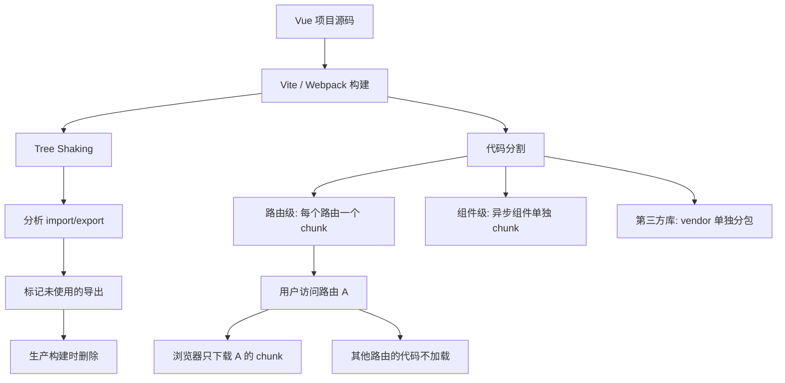

# Vue 打包与加载优化 (Code Splitting & Tree Shaking)

## 1. 解决什么问题？
> 让用户只下载当前需要的代码，首屏加载快，后续按需获取。

* **痛点**：一个 SPA 打包出来一个几 MB 的 JS 文件，用户打开首页要等好几秒白屏，哪怕他只是想看个登录页
* **作用**：通过代码分割把大文件拆成小块，按需加载；通过 Tree Shaking 删掉没用到的代码，包体积直线下降

## 2. 通俗理解

### 核心定义
- **代码分割 (Code Splitting)**：把一个大 JS 文件拆成多个小文件，用到哪个才加载哪个
- **路由懒加载**：代码分割在路由层面的应用——访问哪个页面才加载该页面的代码
- **Tree Shaking**：打包时自动识别并删除未被引用的代码（"摇掉枯叶"）

### 生活化比喻
- **不做代码分割** = 点了一个汉堡，店家把整个后厨搬到你面前
- **代码分割** = 你点什么，店家做什么端什么，后厨按订单出餐
- **Tree Shaking** = 搬家时断舍离，没用的旧东西不往新家搬

## 3. 工作原理



## 4. 核心代码实战

### 4.1 路由懒加载（最关键的一步）

**场景**：后台管理系统有 20 个页面，首页只需要加载 Dashboard。

```javascript
// router/index.js
import { createRouter, createWebHistory } from 'vue-router'

const routes = [
  {
    path: '/',
    // ✅ 动态 import → Vite 自动分割成独立 chunk
    component: () => import('@/views/Dashboard.vue')
  },
  {
    path: '/orders',
    component: () => import('@/views/OrderList.vue')
  },
  {
    path: '/products',
    component: () => import('@/views/ProductList.vue')
  },
  {
    path: '/settings',
    // 还可以用 webpackChunkName（Webpack）或注释命名 chunk
    component: () => import(
      /* webpackChunkName: "settings" */
      '@/views/Settings.vue'
    )
  }
]

export default createRouter({
  history: createWebHistory(),
  routes
})
```

**效果对比**：

| 方式 | 首屏加载 | 文件数 |
|------|---------|--------|
| 全量打包 | 一次加载 2.5MB | 1 个大文件 |
| 路由懒加载 | 首屏只加载 200KB | 按路由拆分成多个小文件 |

### 4.2 异步组件（组件级分割）

**场景**：一个弹窗组件很重（比如富文本编辑器），大部分用户根本不会打开它。

```html
<template>
  <button @click="showEditor = true">打开编辑器</button>

  <!-- 异步组件：只在 showEditor 为 true 时才加载 -->
  <RichEditor v-if="showEditor" @close="showEditor = false" />
</template>

<script setup>
import { defineAsyncComponent, ref } from 'vue'

const showEditor = defineAsyncComponent({
  // 真正点击时才加载这个组件的代码
  loader: () => import('@/components/RichEditor.vue'),
  // 加载中显示的占位组件
  loadingComponent: () => '<div>编辑器加载中...</div>',
  // 超时时间
  timeout: 10000
})

const showEditor = ref(false)
</script>
```

### 4.3 第三方依赖按需引入

**场景**：项目用了 Element Plus，但只用了 Button、Table、Form 三个组件。

```bash
npm install unplugin-vue-components unplugin-auto-import -D
```

```javascript
// vite.config.js
import AutoImport from 'unplugin-auto-import/vite'
import Components from 'unplugin-vue-components/vite'
import { ElementPlusResolver } from 'unplugin-vue-components/resolvers'

export default defineConfig({
  plugins: [
    // 自动按需引入 Element Plus 组件
    AutoImport({ resolvers: [ElementPlusResolver()] }),
    Components({ resolvers: [ElementPlusResolver()] })
  ]
})
```

```html
<template>
  <!-- 直接使用，插件自动按需引入 -->
  <!-- 只有 ElButton 和 ElTable 的代码会被打包 -->
  <el-button type="primary">提交</el-button>
  <el-table :data="tableData">...</el-table>
</template>
```

**效果**：Element Plus 全量引入约 800KB，按需引入可能只有 80KB。

### 4.4 Vite 分包策略

**场景**：希望 `vue`、`vue-router` 这些不常变的库单独打包，利用浏览器缓存。

```javascript
// vite.config.js
export default defineConfig({
  build: {
    rollupOptions: {
      output: {
        manualChunks: {
          // vue 相关库单独打包
          'vue-vendor': ['vue', 'vue-router', 'pinia'],
          // UI 库单独打包
          'ui-vendor': ['element-plus'],
          // 工具库单独打包
          'utils-vendor': ['lodash-es', 'dayjs', 'axios']
        }
      }
    }
  }
})
```

> 业务代码频繁更新，但 vendor chunk 很少变。用户更新时只需重新下载业务代码，vendor 从浏览器缓存读取。

### 4.5 打包体积分析

```bash
npm install rollup-plugin-visualizer -D
```

```javascript
// vite.config.js
import { visualizer } from 'rollup-plugin-visualizer'

export default defineConfig({
  plugins: [
    visualizer({
      open: true,           // 构建后自动打开分析页面
      gzipSize: true,       // 显示 gzip 后的体积
      filename: 'stats.html'
    })
  ]
})
```

运行 `npm run build` 后会自动打开一个可视化页面，清楚看到每个依赖占了多少体积。

## 5. 最佳实践

* **路由必须懒加载**：这是成本最低、收益最高的优化，没有理由不做
* **Tree Shaking 前提**：使用 ES Module 的 `import/export`，不要用 `require`。Lodash 要用 `lodash-es` 而不是 `lodash`
* **图片也要优化**：用 `vite-plugin-imagemin` 压缩图片，大图用 WebP 格式，配合懒加载
* **gzip / brotli 压缩**：服务端开启 gzip 或 brotli，JS/CSS 体积再减 60-70%
* **分包不要过度拆分**：每个 HTTP 请求都有开销，chunk 太多反而变慢。一般 3-5 个 vendor chunk 就够了

## 6. 常见错误与解决方案

### 错误 1：Tree Shaking 失效——用了 CommonJS
```javascript
// ❌ 错误：require 是 CommonJS，无法 Tree Shaking
const _ = require('lodash')
_.get(obj, 'a.b.c')

// ✅ 正确：用 ES Module + 具名引入
import { get } from 'lodash-es'
get(obj, 'a.b.c')
```

### 错误 2：路由不做懒加载
```javascript
// ❌ 错误：静态引入，所有页面代码打包到一起
import Home from '@/views/Home.vue'
import About from '@/views/About.vue'
import Contact from '@/views/Contact.vue'

// ✅ 正确：动态引入，按路由分割
const routes = [
  { path: '/', component: () => import('@/views/Home.vue') },
  { path: '/about', component: () => import('@/views/About.vue') },
  { path: '/contact', component: () => import('@/views/Contact.vue') },
]
```

### 错误 3：全量引入 UI 框架
```javascript
// ❌ 错误：全量引入 800KB+
import ElementPlus from 'element-plus'
import 'element-plus/dist/index.css'
app.use(ElementPlus)

// ✅ 正确：配置按需引入插件（见 4.3 节）
// 或手动按需引入
import { ElButton, ElTable } from 'element-plus'
```

## 7. 扩展思考

### 优化效果量化检查清单

| 检查项 | 目标值 | 检查方式 |
|--------|--------|---------|
| 首屏 JS 体积 | < 200KB (gzip 后) | Network 面板 |
| 最大单个 chunk | < 250KB | `rollup-plugin-visualizer` |
| 首屏加载时间 (FCP) | < 1.5s | Lighthouse |
| 未使用 JS 比例 | < 20% | Chrome Coverage 面板 |

### 进阶：预加载与预获取

```html
<!-- 路由懒加载的组件，用户悬停导航时提前加载 -->
<router-link
  to="/dashboard"
  @mouseenter="preloadDashboard"
>
  Dashboard
</router-link>

<script setup>
// 鼠标悬停时预加载，点击时瞬间切换
const preloadDashboard = () => {
  import('@/views/Dashboard.vue')
}
</script>
```

Vite 生产构建默认会自动给懒加载 chunk 添加 `<link rel="modulepreload">`，但对于低优先级的模块，你可以用 `<link rel="prefetch">` 在浏览器空闲时提前下载。

---
_本文档将持续更新，添加更多打包与加载优化相关内容_
