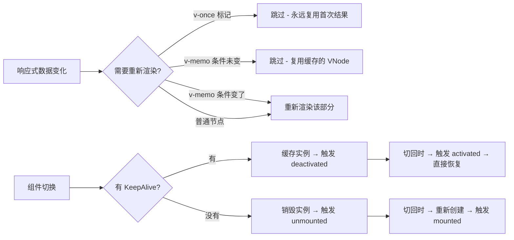

# Vue 组件渲染优化 (Component Rendering Optimization)

## 1. 解决什么问题？
> 减少 Vue 组件不必要的重新渲染，让页面交互更流畅。

* **痛点**：父组件数据一变，所有子组件都跟着重新渲染，即使子组件的内容根本没变化，白白浪费性能
* **作用**：通过 `v-once`、`v-memo`、`KeepAlive` 三个工具，精准控制"什么该重新渲染、什么不该"

## 2. 通俗理解

### 核心定义
Vue 默认机制是"响应式数据变了 → 重新生成 VNode → diff 对比 → 更新 DOM"。优化的本质就是**跳过不必要的步骤**：
- `v-once`：这块内容永远不变，只算一次
- `v-memo`：条件没变就直接复用上次的结果
- `KeepAlive`：组件切走了别销毁，下次切回来直接用

### 生活化比喻
- **v-once** = 刻在石碑上的公告，刻好了就不改了
- **v-memo** = 考试答题卡，题目没变就不用重新写答案
- **KeepAlive** = 餐厅的保温柜，菜做好了先保温，客人要吃直接端上来，不用重新炒

## 3. 工作原理



## 4. 核心代码实战

### 4.1 v-once：静态内容一次渲染

**场景**：页面中有一块不会变化的用户协议、固定标题等。

```html
<template>
  <!-- ✅ 用户协议内容永远不变，用 v-once 跳过后续更新 -->
  <div v-once class="agreement">
    <h2>用户服务协议</h2>
    <p>本协议自2024年1月1日起生效...</p>
    <p>第一条：服务内容...</p>
    <p>第二条：用户义务...</p>
  </div>

  <!-- 这部分正常响应式更新 -->
  <div>当前积分：{{ userPoints }}</div>
</template>
```

### 4.2 v-memo：条件缓存列表项

**场景**：一个商品列表，只有被选中的商品需要重新渲染样式。

```html
<template>
  <div class="product-list">
    <!--
      v-memo 接收依赖数组，只有数组中的值变了才重新渲染
      这里只在"是否选中"状态变化时才重新渲染该项
    -->
    <div
      v-for="item in products"
      :key="item.id"
      v-memo="[item.id === selectedId]"
      :class="{ active: item.id === selectedId }"
      @click="selectedId = item.id"
    >
      
      <span>{{ item.name }}</span>
      <span>¥{{ item.price }}</span>
    </div>
  </div>
</template>

<script setup>
import { ref } from 'vue'

const selectedId = ref(null)
const products = ref([
  { id: 1, name: 'Vue实战', price: 89, image: '/book1.jpg' },
  { id: 2, name: 'React进阶', price: 99, image: '/book2.jpg' },
  // ... 假设有几百个商品
])
</script>
```

> 当 `selectedId` 变化时，只有**之前选中的**和**新选中的**两个商品会重新渲染，其他几百个商品全部跳过。

### 4.3 KeepAlive：缓存组件状态

**场景**：后台管理系统中，用户在"列表页"筛选了条件、翻到了第3页，点进详情再返回，希望列表状态还在。

```html
<template>
  <div class="layout">
    <aside>
      <button @click="currentTab = 'List'">商品列表</button>
      <button @click="currentTab = 'Detail'">商品详情</button>
    </aside>

    <!-- KeepAlive 缓存组件，切走不销毁 -->
    <KeepAlive :include="['ProductList']" :max="5">
      <component :is="tabs[currentTab]" />
    </KeepAlive>
  </div>
</template>

<script setup>
import { ref, shallowRef } from 'vue'
import ProductList from './ProductList.vue'
import ProductDetail from './ProductDetail.vue'

const currentTab = ref('List')
const tabs = { List: ProductList, Detail: ProductDetail }
</script>
```

在被缓存的组件里用 `onActivated` / `onDeactivated` 代替 `onMounted` / `onUnmounted`：

```html
<script setup>
import { onActivated, onDeactivated } from 'vue'

// 每次从缓存恢复时执行（比如刷新数据时效性）
onActivated(() => {
  console.log('页面恢复了，检查数据是否过期')
})

// 被缓存（切走）时执行
onDeactivated(() => {
  console.log('页面被缓存了，暂停轮询')
})
</script>
```

## 5. 最佳实践

* **v-once 的适用边界**：只用在**确定不会变化**的内容上。如果错误地在动态内容上用了 `v-once`，数据更新了但页面不会变，会产生 bug
* **v-memo 的依赖数组**：类似 React 的 `useMemo`，依赖数组要写准。传空数组 `v-memo="[]"` 等同于 `v-once`
* **KeepAlive 的 max 限制**：务必设置 `max` 属性，否则缓存的组件越来越多，内存会爆。一般设 5-10 个
* **KeepAlive 的 include/exclude**：用组件的 `name` 精确控制哪些缓存、哪些不缓存，不要无脑全缓存

## 6. 常见错误与解决方案

### 错误 1：在动态内容上用 v-once
```html
<!-- ❌ 错误：价格会变，但 v-once 导致永远显示第一次的值 -->
<span v-once>价格：{{ product.price }}</span>

<!-- ✅ 正确：动态内容不加 v-once -->
<span>价格：{{ product.price }}</span>
```

### 错误 2：v-memo 依赖写漏了
```html
<!-- ❌ 错误：只监听了选中状态，忽略了 item.stock 也会变 -->
<div v-memo="[item.id === selectedId]">
  {{ item.name }} - 库存：{{ item.stock }}
</div>

<!-- ✅ 正确：把所有会变的依赖都加上 -->
<div v-memo="[item.id === selectedId, item.stock]">
  {{ item.name }} - 库存：{{ item.stock }}
</div>
```

### 错误 3：KeepAlive 不设 max 导致内存泄漏
```html
<!-- ❌ 错误：无限缓存 -->
<KeepAlive>
  <component :is="currentView" />
</KeepAlive>

<!-- ✅ 正确：限制缓存数量 + 指定缓存范围 -->
<KeepAlive :include="['ListView', 'FormView']" :max="5">
  <component :is="currentView" />
</KeepAlive>
```

## 7. 扩展思考

### 什么时候该用、什么时候不用？

| 场景 | 推荐方案 | 不推荐 |
|------|---------|--------|
| 纯静态页头/页脚 | `v-once` | 过度使用 `v-memo` |
| 大列表只有少量项变化 | `v-memo` | 给每项都加 `v-once` |
| Tab 切换保留状态 | `KeepAlive` | 手动把数据存到 Pinia |
| 数据频繁全量变化的列表 | 虚拟滚动 | `v-memo`（条件总在变，缓存无效） |

### 与其他优化手段的配合
- `v-memo` + 虚拟滚动 = 大列表终极方案
- `KeepAlive` + 路由懒加载 = 首屏快 + 切换流畅
- `shallowRef` + `v-once` = 超大静态数据渲染

---
_本文档将持续更新，添加更多渲染优化相关内容_
