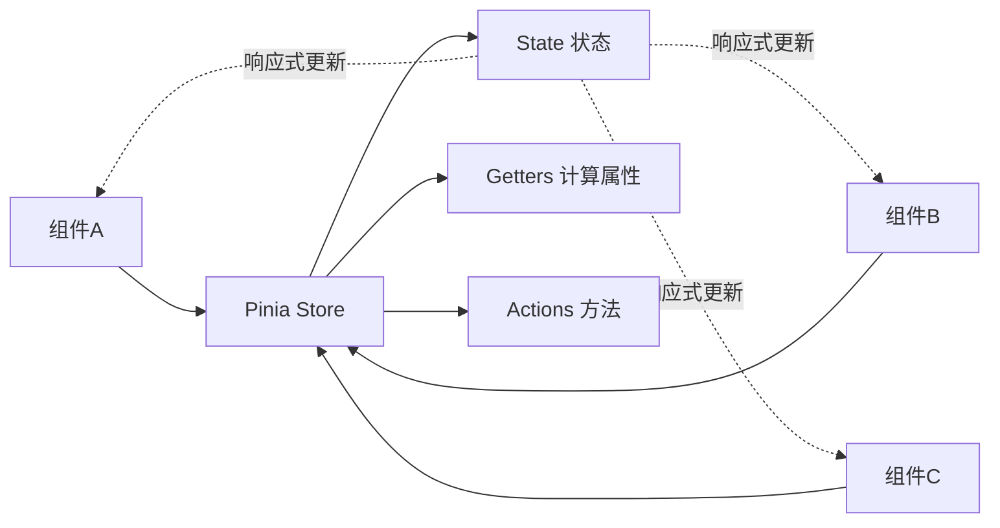

# Pinia 状态管理 (Pinia State Management)

## 1. 解决什么问题？
> 让多个组件共享数据变得简单、类型安全且易于维护

* **痛点**：多层组件传递数据繁琐，兄弟组件通信困难，全局状态难以追踪和调试
* **作用**：提供集中式状态管理，任何组件都能直接访问和修改共享数据，支持 TypeScript，调试友好

## 2. 通俗理解
### 核心定义
Pinia 是 Vue 3 官方推荐的状态管理库，用于在应用中创建全局数据仓库（Store），让所有组件都能访问和修改这些数据。

### 生活化比喻
想象一个公司的共享文件柜：
- **Store** 就是文件柜，存放所有部门共享的文件
- **State** 是文件柜里的文件，存储实际数据
- **Getters** 是文件索引，帮你快速找到处理后的数据
- **Actions** 是文件管理员，负责修改文件内容
- 任何部门（组件）都能直接访问文件柜，无需层层传递

## 3. 工作原理


## 4. 核心代码实战
### 业务场景：用户购物车管理
实现添加商品、删除商品、计算总价等功能。

### Vue 3 写法

**1. 安装 Pinia**
```bash
npm install pinia
```

**2. 创建 Pinia 实例（main.js）**
```javascript
import { createApp } from 'vue'
import { createPinia } from 'pinia'
import App from './App.vue'

const app = createApp(App)
const pinia = createPinia() // 创建 Pinia 实例
app.use(pinia) // 注册到 Vue 应用
app.mount('#app')
```

**3. 定义 Store（stores/cart.js）**
```javascript
import { defineStore } from 'pinia'
import { ref, computed } from 'vue'

// 使用 Composition API 风格（推荐）
export const useCartStore = defineStore('cart', () => {
  // State：响应式数据
  const items = ref([])

  // Getters：计算属性
  const totalPrice = computed(() => {
    return items.value.reduce((sum, item) => {
      return sum + item.price * item.quantity
    }, 0)
  })

  const itemCount = computed(() => {
    return items.value.reduce((sum, item) => sum + item.quantity, 0)
  })

  // Actions：修改状态的方法
  function addItem(product) {
    const existItem = items.value.find(item => item.id === product.id)
    if (existItem) {
      existItem.quantity++ // 已存在则数量+1
    } else {
      items.value.push({ ...product, quantity: 1 }) // 新增商品
    }
  }

  function removeItem(productId) {
    const index = items.value.findIndex(item => item.id === productId)
    if (index > -1) {
      items.value.splice(index, 1) // 删除商品
    }
  }

  function clearCart() {
    items.value = [] // 清空购物车
  }

  // 必须返回所有需要暴露的内容
  return {
    items,
    totalPrice,
    itemCount,
    addItem,
    removeItem,
    clearCart
  }
})
```

**4. 在组件中使用（ProductList.vue）**
```vue
<script setup>
import { useCartStore } from '@/stores/cart'

const cartStore = useCartStore() // 获取 Store 实例

const products = [
  { id: 1, name: 'iPhone 15', price: 5999 },
  { id: 2, name: 'MacBook Pro', price: 12999 }
]

function handleAddToCart(product) {
  cartStore.addItem(product) // 直接调用 Action
}
</script>

<template>
  <div>
    <div v-for="product in products" :key="product.id">
      <span>{{ product.name }} - ¥{{ product.price }}</span>
      <button @click="handleAddToCart(product)">加入购物车</button>
    </div>
  </div>
</template>
```

**5. 购物车组件（Cart.vue）**
```vue
<script setup>
import { useCartStore } from '@/stores/cart'

const cartStore = useCartStore()
</script>

<template>
  <div>
    <h3>购物车 ({{ cartStore.itemCount }})</h3>
    <div v-for="item in cartStore.items" :key="item.id">
      <span>{{ item.name }} x {{ item.quantity }}</span>
      <button @click="cartStore.removeItem(item.id)">删除</button>
    </div>
    <p>总价：¥{{ cartStore.totalPrice }}</p>
    <button @click="cartStore.clearCart">清空购物车</button>
  </div>
</template>
```

### Vue 2 对比（使用 Vuex）
```javascript
// Vuex Store 定义（store/index.js）
export default new Vuex.Store({
  state: {
    items: []
  },
  getters: {
    totalPrice: state => {
      return state.items.reduce((sum, item) => {
        return sum + item.price * item.quantity
      }, 0)
    }
  },
  mutations: {
    ADD_ITEM(state, product) {
      const existItem = state.items.find(item => item.id === product.id)
      if (existItem) {
        existItem.quantity++
      } else {
        state.items.push({ ...product, quantity: 1 })
      }
    }
  },
  actions: {
    addItem({ commit }, product) {
      commit('ADD_ITEM', product) // 必须通过 mutation 修改
    }
  }
})

// 组件中使用
import { mapState, mapGetters, mapActions } from 'vuex'

export default {
  computed: {
    ...mapState(['items']),
    ...mapGetters(['totalPrice'])
  },
  methods: {
    ...mapActions(['addItem'])
  }
}
```

**关键差异**：
- Pinia 无需 mutations，直接在 actions 中修改状态
- Pinia 原生支持 TypeScript，类型推断更好
- Pinia 使用 Composition API，代码更简洁
- Vuex 需要 mutations/actions 分离，代码更冗长

## 5. 最佳实践
* **性能考虑**：
  - 只在需要跨组件共享的数据才放入 Store
  - 组件内部状态用 `ref/reactive`，避免 Store 过度膨胀
  - 使用 `storeToRefs` 解构保持响应式：`const { items } = storeToRefs(cartStore)`

* **注意事项**：
  - 直接解构会失去响应式：`const { items } = cartStore` ❌
  - 正确解构方式：`const { items } = storeToRefs(cartStore)` ✅
  - Actions 可以是异步函数，直接使用 `async/await`

* **边界情况**：
  - 需要重置 Store 时使用 `$reset()`：`cartStore.$reset()`
  - 监听 Store 变化：`cartStore.$subscribe((mutation, state) => {})`

## 6. 常见错误与解决方案

**错误 1：解构后失去响应式**
```javascript
// ❌ 错误：直接解构
const { items, totalPrice } = useCartStore()

// ✅ 正确：使用 storeToRefs
import { storeToRefs } from 'pinia'
const { items, totalPrice } = storeToRefs(useCartStore())
```

**错误 2：在 setup 外部调用 Store**
```javascript
// ❌ 错误：在组件外部调用
const cartStore = useCartStore()
export default {
  setup() {
    // ...
  }
}

// ✅ 正确：在 setup 内部调用
export default {
  setup() {
    const cartStore = useCartStore()
    // ...
  }
}
```

**错误 3：忘记返回 Store 内容**
```javascript
// ❌ 错误：defineStore 中忘记返回
export const useCartStore = defineStore('cart', () => {
  const items = ref([])
  // 忘记 return
})

// ✅ 正确：必须返回所有需要暴露的内容
export const useCartStore = defineStore('cart', () => {
  const items = ref([])
  return { items }
})
```

## 7. 扩展思考

**进阶用法**：
- **持久化插件**：使用 `pinia-plugin-persistedstate` 自动保存到 localStorage
- **Store 组合**：一个 Store 可以使用另一个 Store：`const userStore = useUserStore()`
- **Options API 风格**：也可以用类似 Vuex 的对象写法（不推荐）

**相关 API**：
- `$patch`：批量修改状态，性能更好
- `$subscribe`：监听 Store 变化
- `$onAction`：监听 Action 调用

**进阶资源**：
- [Pinia 官方文档](https://pinia.vuejs.org/)
- [Pinia vs Vuex 对比](https://pinia.vuejs.org/introduction.html#comparison-with-vuex)
- [Pinia 插件生态](https://pinia.vuejs.org/core-concepts/plugins.html)
