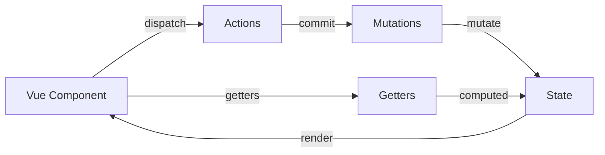

# Vuex 状态管理 (Vuex State Management)

## 1. 解决什么问题？
> 多组件共享数据时，避免层层传递和状态混乱

* **痛点**：跨层级组件通信需要层层传递 props，兄弟组件共享数据困难，状态修改难以追踪
* **作用**：提供集中式状态管理，让任意组件都能访问和修改共享数据，且所有修改可追踪

## 2. 通俗理解
### 核心定义
Vuex 是 Vue 的集中式状态管理库。它将应用的共享状态抽取到全局单例中，通过明确的规则修改状态，确保状态变化可预测。

### 生活化比喻
想象一个银行账户系统：
- **State（状态）**：账户余额，所有人都能查看
- **Getters（计算属性）**：根据余额计算 VIP 等级
- **Mutations（同步修改）**：存款/取款操作，必须通过柜台办理
- **Actions（异步操作）**：网上转账，先验证再调用柜台操作
- **Modules（模块）**：不同类型账户（储蓄、理财），独立管理

## 3. 工作原理


## 4. 核心代码实战
### 业务场景：购物车管理系统

#### Vue 3 写法（Vuex 4）

**Store 定义**
```javascript
// store/index.js
import { createStore } from 'vuex'

export default createStore({
  state: {
    cartItems: [],      // 购物车商品列表
    userInfo: null      // 用户信息
  },

  getters: {
    // 计算购物车总价
    totalPrice: (state) => {
      return state.cartItems.reduce((sum, item) => {
        return sum + item.price * item.quantity
      }, 0)
    },

    // 计算商品总数
    totalCount: (state) => {
      return state.cartItems.reduce((sum, item) => {
        return sum + item.quantity
      }, 0)
    }
  },

  mutations: {
    // 添加商品到购物车（同步操作）
    ADD_TO_CART(state, product) {
      const item = state.cartItems.find(i => i.id === product.id)
      if (item) {
        item.quantity++  // 已存在则数量+1
      } else {
        state.cartItems.push({ ...product, quantity: 1 })
      }
    },

    // 移除商品
    REMOVE_FROM_CART(state, productId) {
      const index = state.cartItems.findIndex(i => i.id === productId)
      if (index > -1) {
        state.cartItems.splice(index, 1)
      }
    },

    // 设置用户信息
    SET_USER(state, user) {
      state.userInfo = user
    }
  },

  actions: {
    // 异步添加商品（可能需要检查库存）
    async addToCart({ commit }, product) {
      // 模拟 API 调用检查库存
      const response = await fetch(`/api/stock/${product.id}`)
      const { inStock } = await response.json()

      if (inStock) {
        commit('ADD_TO_CART', product)
        return { success: true }
      }
      return { success: false, message: '库存不足' }
    },

    // 异步获取用户信息
    async fetchUser({ commit }) {
      const response = await fetch('/api/user')
      const user = await response.json()
      commit('SET_USER', user)
    }
  }
})
```

**组件中使用**
```vue
<script setup>
import { computed } from 'vue'
import { useStore } from 'vuex'

const store = useStore()

// 读取状态
const cartItems = computed(() => store.state.cartItems)
const totalPrice = computed(() => store.getters.totalPrice)

// 调用 mutation（同步）
const removeItem = (id) => {
  store.commit('REMOVE_FROM_CART', id)
}

// 调用 action（异步）
const addProduct = async (product) => {
  const result = await store.dispatch('addToCart', product)
  if (!result.success) {
    alert(result.message)
  }
}
</script>

<template>
  <div class="cart">
    <div v-for="item in cartItems" :key="item.id">
      {{ item.name }} x {{ item.quantity }}
      <button @click="removeItem(item.id)">删除</button>
    </div>
    <p>总价：¥{{ totalPrice }}</p>
  </div>
</template>
```

#### Vue 2 对比（Vuex 3）

```javascript
// Vue 2 组件中使用
export default {
  computed: {
    // 使用 mapState 辅助函数
    ...mapState(['cartItems']),
    // 使用 mapGetters
    ...mapGetters(['totalPrice', 'totalCount'])
  },

  methods: {
    // 使用 mapMutations
    ...mapMutations(['REMOVE_FROM_CART']),
    // 使用 mapActions
    ...mapActions(['addToCart']),

    async handleAdd(product) {
      const result = await this.addToCart(product)
      if (!result.success) {
        alert(result.message)
      }
    }
  }
}
```

**关键差异**：
- Vue 3 使用 `useStore()` 钩子，Vue 2 使用 `this.$store`
- Vue 3 需手动用 `computed` 包装，Vue 2 可用 `mapState/mapGetters`
- Vue 3 推荐 Composition API，代码更灵活

### 模块化管理

```javascript
// store/modules/cart.js
export default {
  namespaced: true,  // 启用命名空间，避免命名冲突

  state: {
    items: []
  },

  mutations: {
    ADD_ITEM(state, item) {
      state.items.push(item)
    }
  },

  actions: {
    addItem({ commit }, item) {
      commit('ADD_ITEM', item)
    }
  }
}

// store/index.js
import cart from './modules/cart'

export default createStore({
  modules: {
    cart  // 使用模块
  }
})

// 组件中访问
store.state.cart.items           // 访问模块状态
store.commit('cart/ADD_ITEM', item)  // 调用模块 mutation
store.dispatch('cart/addItem', item) // 调用模块 action
```

## 5. 最佳实践

* **性能考虑**：
  - State 只存必要的共享数据，组件私有数据用 `ref/reactive`
  - Getters 会缓存结果，依赖变化时才重新计算
  - 避免在 State 中存储大量数据或深层嵌套对象

* **注意事项**：
  - Mutations 必须是同步函数，异步操作放在 Actions
  - 不要直接修改 State，必须通过 Mutations
  - 使用常量定义 Mutation 类型，避免拼写错误

* **边界情况**：
  - 模块命名空间冲突：使用 `namespaced: true`
  - 动态注册模块：`store.registerModule('moduleName', module)`
  - 严格模式：开发环境启用 `strict: true`，生产环境关闭（性能影响）

## 6. 常见错误与解决方案

**错误 1：直接修改 State**
```javascript
// ❌ 错误
store.state.cartItems.push(item)

// ✅ 正确
store.commit('ADD_TO_CART', item)
```

**错误 2：在 Mutation 中执行异步操作**
```javascript
// ❌ 错误
mutations: {
  async ADD_ITEM(state, item) {
    const data = await fetch('/api')  // 异步操作
    state.items.push(data)
  }
}

// ✅ 正确
actions: {
  async addItem({ commit }, item) {
    const data = await fetch('/api')
    commit('ADD_ITEM', data)
  }
}
```

**错误 3：忘记使用命名空间**
```javascript
// ❌ 模块间可能冲突
export default {
  namespaced: false,
  mutations: { UPDATE() {} }
}

// ✅ 启用命名空间
export default {
  namespaced: true,
  mutations: { UPDATE() {} }
}
```

## 7. 扩展思考

### 与 Pinia 对比
Pinia 是 Vue 官方推荐的新状态管理库（Vuex 5 的替代方案）：
- 更简洁的 API，无需 Mutations
- 完整的 TypeScript 支持
- 更好的 DevTools 集成
- 自动代码分割

```javascript
// Pinia 写法（更简洁）
import { defineStore } from 'pinia'

export const useCartStore = defineStore('cart', {
  state: () => ({
    items: []
  }),

  getters: {
    totalPrice: (state) => state.items.reduce(...)
  },

  actions: {
    // 直接支持异步，无需区分 mutation/action
    async addItem(item) {
      const inStock = await checkStock(item.id)
      if (inStock) {
        this.items.push(item)
      }
    }
  }
})
```

### 何时使用 Vuex
- 中大型应用，多个视图依赖同一状态
- 需要严格的状态修改追踪和调试
- 团队已有 Vuex 经验

### 何时不需要 Vuex
- 小型应用，用 Props/Emit 或 Provide/Inject 即可
- 新项目建议直接使用 Pinia
- 只有少量全局状态（可用 `reactive` + `provide`）

### 进阶资源
- [Vuex 官方文档](https://vuex.vuejs.org/zh/)
- [Pinia 官方文档](https://pinia.vuejs.org/zh/)
- [Vue DevTools](https://devtools.vuejs.org/) - 状态调试工具
