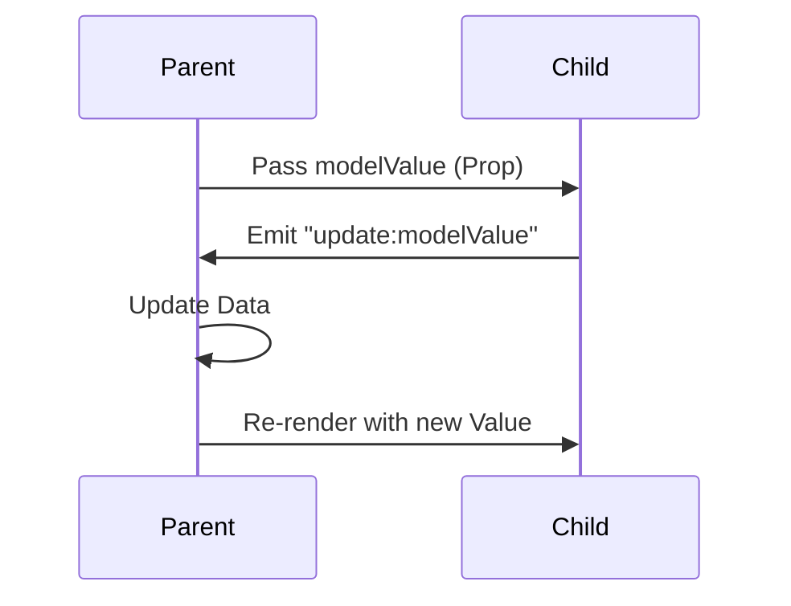

这是一个关于 **Vue 组件通信（内置方案）** 的深度整理文档。根据你的要求，我将按照从基础到进阶的顺序，以 Vue 3 `<script setup>` 为主（最优写法），兼顾 Vue 2 的重要差异。

---

# Vue 组件通信全解 (内置方案篇)

## 1. 基础通信：Props / Emits (父子)

这是 Vue 中最基础、最高频的通信方式。

### 1.1 通俗解释 (Why)

* **Props (父传子):** 就像爸爸给儿子零花钱。钱（数据）掌握在爸爸手里，爸爸给多少，儿子就拿多少。儿子不能自己凭空变出钱来，也不能直接改爸爸钱包里的钱（单向数据流）。
* **Emits (子传父):** 就像儿子在学校闯祸了或者考了满分，需要通过“打电话”（触发事件）告诉爸爸。爸爸听到后，决定怎么处理（更新数据）。

### 1.2 内部机制 (Flow)

```mermaid
graph TD
    Parent[父组件 Parent] -->|Props (数据下行)| Child[子组件 Child]
    Child -- "Emit (事件上行)" --> Parent
    style Parent fill:#f9f,stroke:#333,stroke-width:2px
    style Child fill:#bbf,stroke:#333,stroke-width:2px

```

### 1.3 最优使用场景 (Code)

**Vue 3 (Composition API - script setup)**

*父组件 (Parent.vue)*

```html
<template>
  <ChildComponent
    :title="pageTitle"
    @update-title="handleUpdate"
  />
</template>

<script setup lang="ts">
import { ref } from 'vue';
import ChildComponent from './ChildComponent.vue';

const pageTitle = ref('首页');

const handleUpdate = (newTitle: string) => {
  pageTitle.value = newTitle; // 父组件负责修改数据
};
</script>

```

*子组件 (Child.vue)*

```html
<template>
  <div class="card">
    <h3>{{ title }}</h3>
    <button @click="changeName">修改标题</button>
  </div>
</template>

<script setup lang="ts">
// 1. 定义 Props (推荐使用 TS 泛型写法，自带类型推断)
// 这里的 props 是只读的
const props = withDefaults(defineProps<{
  title: string;
  subTitle?: string; // 可选属性
}>(), {
  subTitle: '默认子标题' // 默认值写法
});

// 2. 定义 Emits
const emit = defineEmits<{
  (e: 'update-title', value: string): void
}>();

const changeName = () => {
  // 触发事件，通知父组件
  emit('update-title', '新标题 - 来自子组件');
};
</script>

```

**Vue 2 差异点：**

* Vue 2 使用 `props: {}` 选项定义。
* Vue 2 触发事件直接用 `this.$emit('event-name', val)`，不需要预先定义 `emits` 选项（但在 Vue 3 选项式 API 中建议定义）。

### 1.4 常见错误与解决方案

| 错误现象 | 原因 | 解决方案 |
| --- | --- | --- |
| **Console 警告:** `Set operation on key "xxx" failed: target is readonly.` | **直接修改 Props**。在子组件中执行了 `props.title = 'xxx'`。Vue 遵循单向数据流。 | **不要改 Props！** 应该 emit 事件让父组件改，或者在子组件基于 props 定义一个 `computed` 或 `ref` 初始值。 |
| **父组件收不到事件** | **事件名大小写问题**。HTML 属性不区分大小写。 | 最佳实践：事件名始终使用 **kebab-case** (如 `update-title`)。 |

---

## 2. 进阶同步：v-model (双向绑定)

当父子组件之间需要频繁同步同一个数据时，Props + Emits 的写法过于繁琐，`v-model` 是其语法糖。

### 2.1 通俗解释 (Why)

就像你和你的老板共享一个 Google 文档。你（子组件）在文档里打字，老板（父组件）屏幕上立马看到更新；老板改了，你也立马看到。表面上是“双向”修改，实际上内部还是遵循“老板授权更新”的机制。

### 2.2 内部机制 (Flow)



### 2.3 最优使用场景 (Code)

**Vue 3.4+ (`defineModel` 宏 - 推荐，最简洁)**

*父组件 (Parent.vue)*

```html
<template>
  <Counter v-model="count" />
  <Counter v-model:title="pageTitle" />
</template>

<script setup lang="ts">
import { ref } from 'vue';
const count = ref(0);
const pageTitle = ref('Vue 3');
</script>

```

*子组件 (Counter.vue)*

```html
<template>
  <button @click="count++">点击增加: {{ count }}</button>
  <input v-model="title" />
</template>

<script setup lang="ts">
// Vue 3.4+ defineModel 返回一个 ref
// 修改这个 ref 会自动 emit 'update:modelValue'
const count = defineModel<number>({ required: true });

// 具名 v-model
const title = defineModel<string>('title');
</script>

```

**Vue 2 / Vue 3 (< 3.4) 差异：**

* **Vue 2:** 默认 Prop 叫 `value`，事件叫 `input`。如需修改，用 `model` 选项。且一个组件只能有一个主 `v-model`，其他的要用 `.sync` 修饰符。
* **Vue 3 (旧写法):** 需要手动写 `props: ['modelValue']` 和 `emit: ['update:modelValue']`。`defineModel` 极大地简化了这一点。

### 2.4 常见错误与解决方案

| 错误现象 | 原因 | 解决方案 |
| --- | --- | --- |
| **Vue 2 迁移到 Vue 3 代码失效** | Vue 3 默认 prop 改为了 `modelValue`，事件改为了 `update:modelValue`。 | 检查子组件接收的 prop 名字是否由 `value` 改为了 `modelValue`。 |
| **多个 v-model 混乱** | 命名冲突。 | 使用具名 v-model，如 `v-model:firstName`，子组件接收 `defineModel('firstName')`。 |

---

## 3. 跨级通信：Provide / Inject (依赖注入)

### 3.1 通俗解释 (Why)

假设你是公司底层员工（孙子组件），你需要公司的“Logo配置”（数据）。如果让 CEO（祖先）一层层传给 VP、总监、经理、组长，最后才到你，这叫“Props Drilling”（透传地狱），太累了。
Provide/Inject 就像 CEO 在公司大厅贴了个公告，你在任何层级只要抬头看（Inject）就能拿到，中间层级的经理根本不需要关心这件事。

### 3.2 内部机制 (Mechanism)

```mermaid
graph TD
    A[Root Component (Provide)] --> B[Parent]
    B --> C[Child]
    C --> D[GrandChild (Inject)]
    A -.->|直接注入数据| D
    style B stroke-dasharray: 5 5
    style C stroke-dasharray: 5 5

```

### 3.3 最优使用场景 (Code)

**Vue 3 (Composition API)**

*祖先组件 (GrandParent.vue)*

```html
<script setup lang="ts">
import { provide, ref, readonly } from 'vue';
import { themeKey } from './keys'; // 最佳实践：使用 Symbol 作为 key

const themeColor = ref('blue');

const updateTheme = (color: string) => {
  themeColor.value = color;
};

// 1. 提供响应式数据 (建议包裹 readonly 防止子组件直接乱改)
// 2. 提供修改数据的方法 (谁提供数据，谁负责提供修改方法)
provide(themeKey, {
  color: readonly(themeColor),
  update: updateTheme
});
</script>

```

*后代组件 (DeepChild.vue)*

```html
<template>
  <div :style="{ color: theme?.color.value }">
    当前主题色: {{ theme?.color.value }}
    <button @click="theme?.update('red')">变红</button>
  </div>
</template>

<script setup lang="ts">
import { inject } from 'vue';
import { themeKey } from './keys';

// 接收注入，建议给个默认值防止报错
const theme = inject(themeKey, {
    color: ref('black'),
    update: () => {}
});
</script>

```

*keys.ts (最佳实践)*

```ts
// 使用 Symbol 避免命名冲突
import type { InjectionKey, Ref } from 'vue';

export interface ThemeContext {
  color: Ref<string>;
  update: (c: string) => void;
}

export const themeKey: InjectionKey<ThemeContext> = Symbol('theme');

```

### 3.4 常见错误与解决方案

| 错误现象 | 原因 | 解决方案 |
| --- | --- | --- |
| **数据失去响应性** | 在 `provide` 时解构了 reactive 对象，或者直接传了 `value` 而不是 ref 对象本身。 | 始终 `provide` ref 对象本身或 reactive 对象。不要写 `provide('val', count.value)`，要写 `provide('val', count)`。 |
| **不知哪里修改了数据** | 任意后代组件都能修改注入的响应式对象，导致数据流混乱。 | 使用 `readonly()` 包装提供的数据，并显式提供一个 `update` 函数给后代调用。 |

---

## 4. 封装透传：$attrs (属性透传)

### 4.1 通俗解释 (Why)

你在写一个 `MyButton` 组件，它内部包了一个原生的 `<button>`。你在父组件写 `<MyButton class="red" disabled />`。
你不想在 `MyButton` 里一个个声明 `props: ['class', 'disabled', 'style'...]`。Vue 默认会把这些“非 Prop 的 Attribute”自动贴到子组件的根元素上。这就是 `$attrs`。

### 4.2 使用场景 (Code)

*子组件 (MyButton.vue)*

```html
<template>
  <div class="btn-wrapper">
    <button class="real-btn" v-bind="$attrs">
      <slot />
    </button>
  </div>
</template>

<script setup lang="ts">
// 默认情况下，Vue 会把 attrs 自动透传给根节点(这里的 div)
// 我们需要禁用这个默认行为
defineOptions({
  inheritAttrs: false
});

// 在 JS 中访问 attrs (可选)
import { useAttrs } from 'vue';
const attrs = useAttrs();
// console.log(attrs.class);
</script>

```

### 4.3 常见错误

* **Vue 2 区别：** Vue 2 中 `$attrs` 不包含 `class` 和 `style`，Vue 3 中包含了所有的属性和事件监听器（包括 `@click` 等）。
* **根节点多于一个：** 如果组件有多个根节点，Vue 不知道该把 attrs 贴给谁，会报警告。必须手动用 `v-bind="$attrs"` 指定一个节点。

---

## 5. 主动暴露/直接访问：ref & defineExpose

这是“逃生舱”机制，通常用于父组件需要直接调用子组件的方法（如聚焦输入框、重置表单）。

### 5.1 机制

Vue 3 的 `<script setup>` 组件默认是**关闭**的（Private）。父组件通过 template ref 拿到的只是一个空对象，必须子组件主动 `expose` 出来的内容才能被访问。

### 5.2 使用场景 (Code)

*子组件 (ChildInput.vue)*

```html
<template>
  <input ref="inputRef" />
</template>

<script setup lang="ts">
import { ref } from 'vue';

const inputRef = ref<HTMLInputElement | null>(null);

const focusInput = () => {
  inputRef.value?.focus();
};

const clearInput = () => {
  if (inputRef.value) inputRef.value.value = '';
};

// 主动暴露给父组件
defineExpose({
  focusInput,
  clearInput
});
</script>

```

*父组件 (Parent.vue)*

```html
<template>
  <ChildInput ref="childRef" />
  <button @click="handleFocus">聚焦子组件</button>
</template>

<script setup lang="ts">
import { ref, onMounted } from 'vue';
import ChildInput from './ChildInput.vue';

// TS 类型技巧：获取组件实例类型
const childRef = ref<InstanceType<typeof ChildInput> | null>(null);

const handleFocus = () => {
  // 调用子组件暴露的方法
  childRef.value?.focusInput();
};
</script>

```

### 5.3 常见错误与解决方案

* **拿不到子组件实例**：试图在 `onMounted` 之前访问 `ref`。
* **拿到是空的**：使用了 `<script setup>` 但忘记 `defineExpose`。
* **滥用**：不要用 `ref` 来进行数据传递！这会破坏单向数据流，使代码难以维护。仅用于操作 DOM 或调用组件方法。

---

## 总结：该用哪一个？

| 场景 | 推荐方案 | 关键词 |
| --- | --- | --- |
| **父传子** | `Props` | 基础、单向 |
| **子传父** | `Emits` | 事件驱动 |
| **父子双向同步** | `v-model` | `defineModel`、表单 |
| **祖先传后代** | `Provide / Inject` | 跨层级、插件开发 |
| **包装UI组件** | `$attrs` | 属性透传 |
| **调用子组件方法** | `ref` + `defineExpose` | 聚焦、重置、命令式操作 |