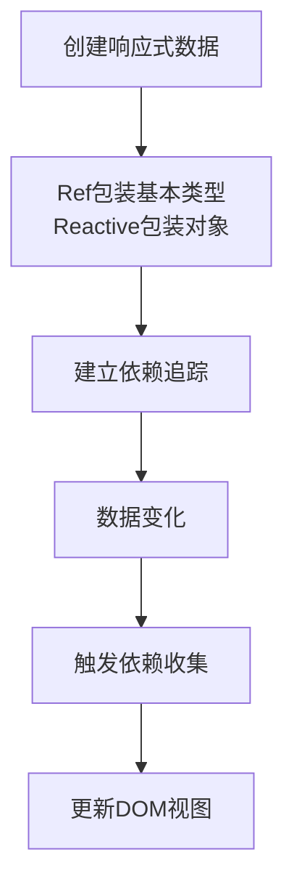

# Vue状态管理 - Ref与Reactive详解 (State Management with Ref & Reactive)

## 1. 解决什么问题？

> 让组件拥有响应式数据，实现数据变化自动更新视图

* **痛点**：传统JavaScript变量无法实现数据驱动视图更新
* **作用**：提供响应式系统，让数据变化自动触发界面重新渲染

## 2. 通俗理解

### 核心定义
Ref和Reactive是Vue 3响应式系统的两个核心API。
- `ref()`：用于包装基本类型值（字符串、数字、布尔值），使其具有响应性
- `reactive()`：用于包装对象，使其整个变为响应式

### 生活化比喻
想象一个智能水杯。当你喝水时（改变数据），水位计（视图）会自动更新显示剩余水量。
- `ref`就像水杯的刻度，每次喝一口水，刻度都会变
- `reactive`就像整个水杯系统，包含水量、温度、位置等多个属性

## 3. 工作原理



## 4. 核心代码实战

### 业务场景
商品数量管理器，用户可以增加减少商品数量，界面实时更新价格。

### Vue 3 写法

```javascript
<template>
  <!-- 使用响应式数据 -->
  <div class="product-card">
    <h3>{{ productName }}</h3>
    <p>单价: ¥{{ price }}</p>
    <div class="quantity-control">
      <button @click="decreaseQuantity">-</button>
      <span class="quantity">{{ quantity }}</span>
      <button @click="increaseQuantity">+</button>
    </div>
    <p class="total-price">总价: ¥{{ totalPrice }}</p>
  </div>
</template>

<script setup>
import { ref, computed } from 'vue'

// 使用ref管理基本类型响应式数据
const productName = ref('iPhone 15')
const price = ref(5999)
const quantity = ref(1) // 使用ref包装数字

// 计算属性自动响应依赖变化
const totalPrice = computed(() => quantity.value * price.value)

// 修改响应式数据的方法
const increaseQuantity = () => {
  quantity.value++ // .value访问和修改ref包装的值
}

const decreaseQuantity = () => {
  if (quantity.value > 1) {
    quantity.value-- // 注意不能小于1
  }
}
</script>

<style scoped>
.product-card {
  border: 1px solid #ddd;
  padding: 1rem;
  border-radius: 8px;
}
.quantity-control {
  display: flex;
  align-items: center;
  gap: 1rem;
  margin: 1rem 0;
}
.quantity {
  font-weight: bold;
  min-width: 2rem;
  text-align: center;
}
.total-price {
  color: #e74c3c;
  font-weight: bold;
}
</style>
```

### 复杂对象状态管理

```javascript
<template>
  <div class="user-profile">
    <h2>{{ user.name }} - {{ user.profile.status }}</h2>
    <p>年龄: {{ user.age }}</p>
    <p>城市: {{ user.profile.location }}</p>
    <p>爱好: {{ user.hobbies.join(', ') }}</p>
    <button @click="updateProfile">更新资料</button>
  </div>
</template>

<script setup>
import { reactive } from 'vue'

// 使用reactive管理复杂对象
const user = reactive({
  name: '张三',
  age: 25,
  hobbies: ['读书', '跑步', '编程'],
  profile: {
    status: '活跃',
    location: '北京',
    avatar: '/avatar.jpg'
  }
})

// 直接修改reactive对象，无需.value
const updateProfile = () => {
  user.age++ // 直接修改，自动触发更新
  user.profile.status = '在线'
  user.hobbies.push('旅游') // 数组方法也自动响应
}
</script>
```

### Vue 2 对比

```javascript
// Vue 2 写法
export default {
  data() {
    return {
      productName: 'iPhone 15', // Vue 2在data中定义响应式数据
      price: 5999,
      quantity: 1
    }
  },
  computed: {
    totalPrice() {
      return this.quantity * this.price // Vue 2计算属性写法
    }
  },
  methods: {
    increaseQuantity() {
      this.quantity++ // Vue 2直接修改this.property
    },
    decreaseQuantity() {
      if (this.quantity > 1) {
        this.quantity--
      }
    }
  }
}
```

## 5. 最佳实践

* **性能考虑**：对于大型数组或对象，谨慎使用深层响应式，考虑使用shallowRef进行优化
* **注意事项**：使用ref时记得用.value获取/设置值；reactive不需要.value
* **边界情况**：解构ref会失去响应性，需要用toRefs保持响应

### 响应式陷阱示例

```javascript
import { ref, toRefs } from 'vue'

const user = ref({ name: 'John', age: 30 })

// ❌ 错误：解构后失去响应性
const { name, age } = user // 这样不会保持响应性

// ✅ 正确：使用toRefs保持响应性
const { name, age } = toRefs(user)

// 或者直接访问user.value.name
console.log(user.value.name)
```

## 6. 常见错误与解决方案

* **错误1**: 忘记使用.value访问ref值
  * **解决方案**: 记住所有ref包装的值都需要通过.value访问

* **错误2**: 在模板中使用.value
  * **解决方案**: 模板中不需要.value，Vue会自动解包

* **错误3**: 在reactive对象中直接赋值新对象
  ```javascript
  // ❌ 会破坏响应性
  state.obj = { new: 'object' }

  // ✅ 保持响应性的做法
  Object.assign(state.obj, { new: 'object' })
  ```

## 7. 扩展思考

* **进阶用法**: `shallowRef`、`shallowReactive`用于优化性能
* **相关API**: `computed`、`watch`、`watchEffect`配合使用
* **进阶资源**: Vue官方文档的响应式深入原理章节