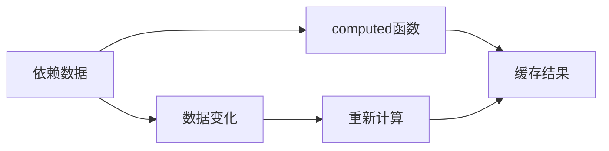

# Vue 状态管理完整指南 (State Management)

## 1. 解决什么问题？
> 让组件数据变化能自动更新视图，实现数据驱动的响应式开发

* **痛点**：手动操作 DOM 更新繁琐易错，数据变化与视图同步困难
* **作用**：提供响应式数据管理方案，数据变化自动触发视图更新

---

## 2. ref - 基础响应式引用

### 核心定义
`ref` 创建一个响应式引用对象，包装基本类型或对象，通过 `.value` 访问和修改。

### 生活化比喻
像给数据装上"监控器"，任何改动都会被 Vue 捕捉并更新页面。

### 工作原理


### 核心代码实战

**业务场景：用户登录状态管理**

```vue
<script setup>
import { ref } from 'vue'

// 基本类型响应式
const username = ref('')  // 用户名
const isLoggedIn = ref(false)  // 登录状态
const loginCount = ref(0)  // 登录次数

// 对象类型也可用ref
const userInfo = ref({
  id: null,
  email: ''
})

// 修改值需要通过.value
const handleLogin = () => {
  username.value = 'admin'
  isLoggedIn.value = true
  loginCount.value++  // 自动触发视图更新

  userInfo.value = {
    id: 1001,
    email: 'admin@example.com'
  }
}
</script>

<template>
  <div>
    <p v-if="isLoggedIn">欢迎, {{ username }}</p>
    <p>登录次数: {{ loginCount }}</p>
    <button @click="handleLogin">登录</button>
  </div>
</template>
```

### 最佳实践
* **性能考虑**：适合基本类型（string、number、boolean），对象用 reactive 更优
* **注意事项**：模板中自动解包不需要 `.value`，JS 中必须用 `.value`
* **边界情况**：解构会失去响应式，需用 `toRefs` 转换

---

## 3. reactive - 对象响应式

### 核心定义
`reactive` 将对象转为深层响应式代理，直接访问属性无需 `.value`。

### 生活化比喻
像给整个文件夹装监控，文件夹内任何文件变动都能被追踪。

### 工作原理


### 核心代码实战

**业务场景：购物车状态管理**

```vue
<script setup>
import { reactive, computed } from 'vue'

// 复杂对象用reactive
const cart = reactive({
  items: [],
  totalPrice: 0,
  discount: 0
})

// 嵌套对象自动深层响应
const addItem = (product) => {
  cart.items.push({  // 直接操作，无需.value
    id: product.id,
    name: product.name,
    price: product.price,
    quantity: 1
  })
  updateTotal()
}

const updateTotal = () => {
  cart.totalPrice = cart.items.reduce(
    (sum, item) => sum + item.price * item.quantity,
    0
  )
}

// 计算属性自动追踪依赖
const finalPrice = computed(() =>
  cart.totalPrice - cart.discount
)
</script>

<template>
  <div>
    <div v-for="item in cart.items" :key="item.id">
      {{ item.name }} - ¥{{ item.price }}
    </div>
    <p>总价: ¥{{ finalPrice }}</p>
  </div>
</template>
```

### Vue 2 对比
```javascript
// Vue 2 - 使用 data 选项
export default {
  data() {
    return {
      cart: {
        items: [],
        totalPrice: 0
      }
    }
  },
  methods: {
    addItem(product) {
      // 数组操作需注意响应式陷阱
      this.cart.items.push(product)
    }
  }
}
```

### 最佳实践
* **性能考虑**：适合复杂对象和数组，避免包装大型数据结构
* **注意事项**：不能解构，会失去响应式；不能替换整个对象
* **边界情况**：只能用于对象类型，基本类型用 ref

---

## 4. shallowRef - 浅层响应式引用

### 核心定义
`shallowRef` 只对 `.value` 的访问是响应式的，内部属性变化不触发更新。

### 生活化比喻
只监控文件夹本身的替换，不关心文件夹内文件的修改。

### 核心代码实战

**业务场景：大型数据列表优化**

```vue
<script setup>
import { shallowRef, triggerRef } from 'vue'

// 大型数据用shallowRef避免深层监听开销
const largeData = shallowRef({
  records: new Array(10000).fill(null).map((_, i) => ({
    id: i,
    value: Math.random()
  }))
})

// 修改内部属性不触发更新（性能优化）
const updateItem = (index, value) => {
  largeData.value.records[index].value = value
  // 手动触发更新
  triggerRef(largeData)
}

// 替换整个对象会触发更新
const replaceData = (newData) => {
  largeData.value = newData  // 触发更新
}
</script>
```

### 最佳实践
* **性能考虑**：处理大型数据结构时显著提升性能
* **注意事项**：需手动调用 `triggerRef` 触发更新
* **边界情况**：适合不常变化的大数据，频繁更新用 ref

---

## 5. shallowReactive - 浅层响应式对象

### 核心定义
`shallowReactive` 只对对象第一层属性响应式，嵌套对象不追踪。

### 核心代码实战

**业务场景：表单配置管理**

```vue
<script setup>
import { shallowReactive } from 'vue'

// 配置对象第一层变化频繁，深层不变
const formConfig = shallowReactive({
  visible: false,  // 响应式
  loading: false,  // 响应式
  schema: {  // 内部属性非响应式
    fields: [...],
    rules: {...}
  }
})

// 第一层修改触发更新
formConfig.visible = true  // ✅ 触发更新

// 深层修改不触发更新
formConfig.schema.fields.push({})  // ❌ 不触发更新
</script>
```

### 最佳实践
* **性能考虑**：减少深层监听开销，适合配置对象
* **注意事项**：明确哪些属性需要响应式
* **边界情况**：深层需响应式时用 reactive

---

## 6. computed - 计算属性

### 核心定义
`computed` 基于响应式依赖进行缓存的计算值，依赖不变时返回缓存结果。

### 生活化比喻
像 Excel 公式，引用的单元格变化时自动重新计算。

### 工作原理


### 核心代码实战

**业务场景：商品筛选与统计**

```vue
<script setup>
import { ref, computed } from 'vue'

const products = ref([
  { id: 1, name: '手机', price: 3999, stock: 10 },
  { id: 2, name: '电脑', price: 8999, stock: 0 },
  { id: 3, name: '耳机', price: 299, stock: 50 }
])

const searchText = ref('')
const minPrice = ref(0)

// 自动追踪 products、searchText、minPrice
const filteredProducts = computed(() => {
  return products.value.filter(p =>
    p.name.includes(searchText.value) &&
    p.price >= minPrice.value &&
    p.stock > 0
  )
})

// 链式计算，依赖 filteredProducts
const totalValue = computed(() =>
  filteredProducts.value.reduce(
    (sum, p) => sum + p.price * p.stock,
    0
  )
)

// 可写计算属性
const fullName = computed({
  get: () => `${firstName.value} ${lastName.value}`,
  set: (val) => {
    [firstName.value, lastName.value] = val.split(' ')
  }
})
</script>

<template>
  <input v-model="searchText" placeholder="搜索商品">
  <div v-for="p in filteredProducts" :key="p.id">
    {{ p.name }} - ¥{{ p.price }}
  </div>
  <p>库存总价值: ¥{{ totalValue }}</p>
</template>
```

### Vue 2 对比
```javascript
// Vue 2 - computed 选项
export default {
  data() {
    return {
      products: [],
      searchText: ''
    }
  },
  computed: {
    filteredProducts() {
      return this.products.filter(p =>
        p.name.includes(this.searchText)
      )
    }
  }
}
```

### 最佳实践
* **性能考虑**：有缓存机制，比方法调用更高效
* **注意事项**：不要有副作用（如异步请求、修改其他状态）
* **边界情况**：依赖的响应式数据必须在函数内访问

---

## 7. watch - 侦听器

### 核心定义
`watch` 侦听响应式数据变化，执行副作用操作（如 API 请求、日志记录）。

### 生活化比喻
像门卫，监视特定目标，发现变化立即执行指定动作。

### 核心代码实战

**业务场景：搜索防抖与数据同步**

```vue
<script setup>
import { ref, watch } from 'vue'

const keyword = ref('')
const searchResults = ref([])
const userId = ref(null)

// 基础侦听
watch(keyword, (newVal, oldVal) => {
  console.log(`搜索词从 ${oldVal} 变为 ${newVal}`)
  fetchResults(newVal)
})

// 侦听多个源
watch([userId, keyword], ([newId, newKeyword]) => {
  fetchUserResults(newId, newKeyword)
})

// 深度侦听对象
const userForm = ref({ name: '', age: 0 })
watch(userForm, (newVal) => {
  saveToLocalStorage(newVal)
}, { deep: true })  // 监听对象内部变化

// 立即执行
watch(userId, (id) => {
  loadUserData(id)
}, { immediate: true })  // 组件挂载时立即执行

// 侦听对象特定属性
watch(
  () => userForm.value.name,  // getter 函数
  (newName) => {
    validateName(newName)
  }
)
</script>
```

### 最佳实践
* **性能考虑**：避免在 watch 中执行耗时操作，使用防抖节流
* **注意事项**：记得清理副作用，组件卸载时自动停止
* **边界情况**：侦听 reactive 对象默认深度侦听

---

## 8. watchEffect - 自动依赖侦听

### 核心定义
`watchEffect` 自动追踪函数内响应式依赖，依赖变化时重新执行。

### 生活化比喻
像智能助手，自动识别你关注的内容并实时更新。

### 核心代码实战

**业务场景：实时数据同步**

```vue
<script setup>
import { ref, watchEffect } from 'vue'

const userId = ref(1)
const postId = ref(100)

// 自动追踪 userId 和 postId
watchEffect(() => {
  console.log(`加载用户 ${userId.value} 的帖子 ${postId.value}`)
  fetchData(userId.value, postId.value)
})

// 清理副作用
watchEffect((onCleanup) => {
  const timer = setInterval(() => {
    syncData()
  }, 1000)

  // 组件卸载或重新执行前清理
  onCleanup(() => {
    clearInterval(timer)
  })
})

// 控制执行时机
watchEffect(
  () => {
    // 访问 DOM
    console.log(document.querySelector('.title').textContent)
  },
  { flush: 'post' }  // DOM 更新后执行
)
</script>
```

### watch vs watchEffect
```javascript
// watch - 明确指定侦听源
watch(userId, (id) => {
  fetchUser(id)
})

// watchEffect - 自动追踪依赖
watchEffect(() => {
  fetchUser(userId.value)  // 自动侦听 userId
})
```

### 最佳实践
* **性能考虑**：适合依赖关系复杂的场景，减少手动声明
* **注意事项**：初始化时立即执行一次
* **边界情况**：需要访问旧值时用 watch

---

## 9. toRef / toRefs - 响应式转换

### 核心定义
将 reactive 对象的属性转为独立的 ref，保持响应式连接。

### 核心代码实战

**业务场景：组件属性解构**

```vue
<script setup>
import { reactive, toRef, toRefs } from 'vue'

const state = reactive({
  count: 0,
  name: 'Vue'
})

// 单个属性转换
const count = toRef(state, 'count')
count.value++  // 同步修改 state.count

// 批量转换（用于解构）
const { name, count: cnt } = toRefs(state)
name.value = 'Vue 3'  // 同步修改 state.name

// 组合式函数返回值
function useUser() {
  const user = reactive({
    id: 1,
    name: 'Admin'
  })

  return toRefs(user)  // 解构后仍保持响应式
}

const { id, name: userName } = useUser()
</script>
```

### 最佳实践
* **性能考虑**：无额外开销，只是创建引用
* **注意事项**：toRef 用于单个属性，toRefs 用于整个对象
* **边界情况**：原对象和转换后的 ref 双向同步

---

## 10. readonly - 只读代理

### 核心定义
创建只读的响应式代理，防止意外修改。

### 核心代码实战

**业务场景：配置保护**

```vue
<script setup>
import { reactive, readonly } from 'vue'

const config = reactive({
  apiUrl: 'https://api.example.com',
  timeout: 5000
})

// 暴露只读版本给子组件
const readonlyConfig = readonly(config)

// 尝试修改会警告
readonlyConfig.apiUrl = 'xxx'  // ⚠️ 警告但不生效

// 原对象仍可修改
config.timeout = 10000  // ✅ 生效
</script>
```

### 最佳实践
* **性能考虑**：适合共享配置和状态保护
* **注意事项**：深层只读，嵌套对象也不可修改
* **边界情况**：开发环境有警告，生产环境静默失败

---

## 11. 常见错误与解决方案

### 错误 1：解构丢失响应式
```javascript
// ❌ 错误
const { count } = reactive({ count: 0 })
count++  // 不会触发更新

// ✅ 正确
const state = reactive({ count: 0 })
state.count++

// ✅ 或使用 toRefs
const { count } = toRefs(reactive({ count: 0 }))
count.value++
```

### 错误 2：忘记 .value
```javascript
// ❌ 错误
const count = ref(0)
count++  // 修改的是 ref 对象本身

// ✅ 正确
count.value++
```

### 错误 3：watch 中访问未追踪的依赖
```javascript
// ❌ 错误
const obj = reactive({ count: 0 })
watch(obj.count, (val) => {  // obj.count 不是响应式引用
  console.log(val)
})

// ✅ 正确
watch(() => obj.count, (val) => {
  console.log(val)
})
```

---

## 12. 性能优化建议

### 1. 选择合适的 API
- 基本类型 → `ref`
- 对象/数组 → `reactive`
- 大型数据 → `shallowRef` / `shallowReactive`
- 派生数据 → `computed`

### 2. 避免过度响应式
```javascript
// ❌ 不必要的响应式
const config = reactive({
  staticData: { /* 大量静态配置 */ }
})

// ✅ 只对需要的部分响应式
const config = {
  staticData: { /* 静态配置 */ },
  dynamic: reactive({ /* 动态数据 */ })
}
```

### 3. 合理使用 computed 缓存
```javascript
// ❌ 每次渲染都计算
<template>
  <div>{{ expensiveCalculation() }}</div>
</template>

// ✅ 使用 computed 缓存
const result = computed(() => expensiveCalculation())
```

---

## 13. 扩展思考

### 进阶用法
- `customRef`：自定义 ref 行为（防抖、节流）
- `effectScope`：手动管理副作用作用域
- `isRef` / `isReactive`：类型判断工具

### 相关 API
- `unref`：获取 ref 的值或返回原值
- `triggerRef`：手动触发 shallowRef 更新
- `proxyRefs`：自动解包 ref（setup 语法糖内部使用）

### 学习资源
- [Vue 3 官方文档 - 响应式基础](https://cn.vuejs.org/guide/essentials/reactivity-fundamentals.html)
- [Vue 3 响应式原理深度解析](https://cn.vuejs.org/guide/extras/reactivity-in-depth.html)
