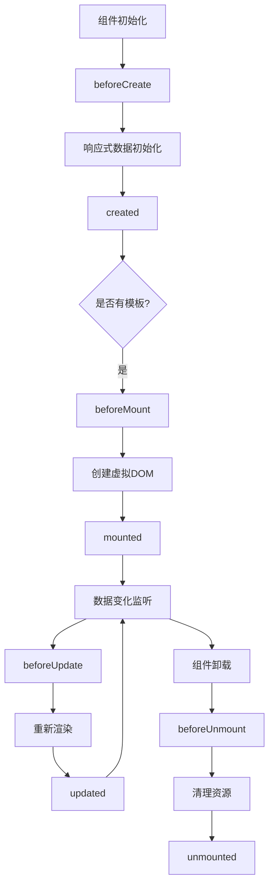

# Vue 生命周期 (Lifecycle Hooks)

## 1. 解决什么问题？
> 让开发者在组件不同阶段精确控制代码执行时机

* **痛点**：不知道何时获取数据、何时操作DOM、何时清理资源
* **作用**：提供标准化的时间节点，让代码在正确的时机执行

## 2. 通俗理解

### 核心定义
生命周期钩子是 Vue 组件从创建到销毁过程中的关键时间节点。在这些节点，Vue 允许你执行自定义逻辑。

### 生活化比喻
想象一个人的一天：
- **起床前** → beforeCreate（还没意识）
- **起床后** → created（有意识，但还在床上）
- **洗漱完毕** → beforeMount（准备出门）
- **到达公司** → mounted（正式开始工作）
- **工作中** → beforeUpdate/updated（处理任务变化）
- **下班回家** → beforeUnmount（准备离开）
- **睡觉** → unmounted（结束一天）

## 3. 工作原理



## 4. 核心代码实战

### 业务场景：用户信息页面
需求：进入页面时加载用户数据，离开时保存草稿，数据变化时自动保存

### Vue 3 写法 (Composition API)

```vue
<script setup>
import { ref, onMounted, onBeforeUnmount, onUpdated, watch } from 'vue'
import { fetchUserInfo, saveDraft } from '@/api/user'

// 响应式数据
const userInfo = ref(null)
const editForm = ref({ name: '', email: '' })
const hasUnsavedChanges = ref(false)

// 组件挂载后：加载数据
onMounted(async () => {
  console.log('DOM已渲染，可以访问$refs')

  // 最佳实践：在mounted中发起API请求
  try {
    userInfo.value = await fetchUserInfo()
    editForm.value = { ...userInfo.value }
  } catch (error) {
    console.error('加载失败', error)
  }

  // 性能优化：添加滚动监听（需要DOM存在）
  window.addEventListener('scroll', handleScroll)
})

// 组件卸载前：清理资源
onBeforeUnmount(() => {
  console.log('组件即将销毁，最后机会保存数据')

  // 关键：清理事件监听，防止内存泄漏
  window.removeEventListener('scroll', handleScroll)

  // 保存未提交的草稿
  if (hasUnsavedChanges.value) {
    saveDraft(editForm.value)
  }
})

// 数据更新后：自动保存
onUpdated(() => {
  // 注意：此钩子触发频繁，避免重操作
  console.log('DOM已更新，反映最新数据')
})

// 更好的做法：使用watch监听特定数据
watch(editForm, (newVal) => {
  hasUnsavedChanges.value = true
  // 防抖保存，避免频繁请求
  debounceSave(newVal)
}, { deep: true })

function handleScroll() {
  // 滚动逻辑
}

function debounceSave(data) {
  // 防抖保存逻辑
}
</script>

<template>
  <div class="user-profile">
    <div v-if="userInfo">
      <input v-model="editForm.name" placeholder="姓名">
      <input v-model="editForm.email" placeholder="邮箱">
    </div>
    <div v-else>加载中...</div>
  </div>
</template>
```

### Vue 2 对比 (Options API)

```vue
<script>
export default {
  data() {
    return {
      userInfo: null,
      editForm: { name: '', email: '' },
      hasUnsavedChanges: false
    }
  },

  // Vue 2: beforeCreate（此时data/methods不可用）
  beforeCreate() {
    console.log('实例初始化，this.$data未定义')
    // 不能访问 this.userInfo
  },

  // Vue 2: created（data已初始化，DOM未生成）
  created() {
    console.log('可以访问data，但DOM不存在')
    // 可以发起API请求，但不能操作DOM
    this.loadUserData()
  },

  // Vue 2: beforeMount（模板编译完成，未挂载）
  beforeMount() {
    console.log('即将挂载DOM')
  },

  // Vue 2: mounted（DOM已挂载）
  mounted() {
    console.log('DOM可访问：', this.$refs)
    window.addEventListener('scroll', this.handleScroll)
  },

  // Vue 2: beforeUpdate（数据变化，DOM未更新）
  beforeUpdate() {
    console.log('新数据：', this.editForm)
    console.log('旧DOM尚未更新')
  },

  // Vue 2: updated（DOM已更新）
  updated() {
    console.log('DOM已同步最新数据')
  },

  // Vue 2: beforeDestroy（Vue 3改名为beforeUnmount）
  beforeDestroy() {
    console.log('组件即将销毁')
    window.removeEventListener('scroll', this.handleScroll)

    if (this.hasUnsavedChanges) {
      this.saveDraft(this.editForm)
    }
  },

  // Vue 2: destroyed（Vue 3改名为unmounted）
  destroyed() {
    console.log('组件已完全销毁')
  },

  methods: {
    async loadUserData() {
      this.userInfo = await fetchUserInfo()
      this.editForm = { ...this.userInfo }
    },
    handleScroll() {
      // 滚动逻辑
    }
  }
}
</script>
```

### 关键差异对比表

| Vue 2 | Vue 3 | 说明 |
|-------|-------|------|
| beforeDestroy | beforeUnmount | 命名更准确（卸载而非销毁） |
| destroyed | unmounted | 同上 |
| Options API | Composition API | 写法完全不同 |
| this.xxx | xxx.value | 响应式访问方式 |

## 5. 最佳实践

### 性能考虑
* **避免在 updated 中执行重操作**：此钩子触发频繁，建议用 watch 替代
* **及时清理副作用**：在 beforeUnmount 中移除事件监听、定时器、第三方库实例
* **异步操作加载态**：mounted 中的异步请求需要配合 loading 状态

### 注意事项
* **不要在 beforeCreate 访问 data**：此时响应式系统未初始化
* **避免在 created 操作 DOM**：此时 DOM 未生成，应在 mounted 中操作
* **watch 优于 updated**：需要监听特定数据时，watch 性能更好

### 边界情况
* **服务端渲染（SSR）**：只会执行 beforeCreate 和 created
* **keep-alive 组件**：会触发 activated 和 deactivated 钩子
* **动态组件切换**：每次切换都会完整执行生命周期

## 6. 常见错误与解决方案

### ❌ 错误1：在 created 中操作 DOM
```javascript
// 错误示例
created() {
  this.$refs.myInput.focus() // ❌ $refs 此时为 undefined
}
```

**正确做法**：
```javascript
mounted() {
  this.$refs.myInput.focus() // ✅ DOM已渲染
}
```

### ❌ 错误2：忘记清理事件监听
```javascript
// 错误示例
mounted() {
  window.addEventListener('resize', this.handleResize)
}
// 未在 beforeUnmount 中移除 ❌
```

**正确做法**：
```javascript
onMounted(() => {
  window.addEventListener('resize', handleResize)
})

onBeforeUnmount(() => {
  window.removeEventListener('resize', handleResize) // ✅ 防止内存泄漏
})
```

### ❌ 错误3：在 updated 中修改数据导致死循环
```javascript
// 错误示例
updated() {
  this.count++ // ❌ 触发新的 updated，无限循环
}
```

**正确做法**：
```javascript
watch(() => someData.value, (newVal) => {
  count.value++ // ✅ 只在特定数据变化时执行
})
```

## 7. 扩展思考

### 进阶用法

#### 1. 动态注册生命周期钩子
```javascript
import { getCurrentInstance, onMounted } from 'vue'

export function useDynamicHook() {
  const instance = getCurrentInstance()

  // 条件注册钩子
  if (instance) {
    onMounted(() => {
      console.log('动态注册的钩子')
    })
  }
}
```

#### 2. 组合式函数中的生命周期
```javascript
// composables/useMousePosition.js
import { ref, onMounted, onBeforeUnmount } from 'vue'

export function useMousePosition() {
  const x = ref(0)
  const y = ref(0)

  function update(event) {
    x.value = event.pageX
    y.value = event.pageY
  }

  // 在组合式函数中使用生命周期
  onMounted(() => {
    window.addEventListener('mousemove', update)
  })

  onBeforeUnmount(() => {
    window.removeEventListener('mousemove', update)
  })

  return { x, y }
}
```

#### 3. keep-alive 专属钩子
```vue
<script setup>
import { onActivated, onDeactivated } from 'vue'

// 组件被缓存激活时
onActivated(() => {
  console.log('从缓存中恢复')
  // 刷新数据、恢复定时器等
})

// 组件被缓存停用时
onDeactivated(() => {
  console.log('进入缓存')
  // 暂停定时器、保存状态等
})
</script>
```

### 相关 API
* **nextTick()**：在下次 DOM 更新后执行回调
* **getCurrentInstance()**：获取当前组件实例
* **watchEffect()**：自动追踪依赖的副作用函数

### 调试技巧
```javascript
// 全局监听所有生命周期（开发环境）
if (import.meta.env.DEV) {
  const hooks = ['onMounted', 'onUpdated', 'onBeforeUnmount']
  hooks.forEach(hook => {
    window[hook] = (cb) => {
      console.log(`[生命周期] ${hook} 触发`)
      return cb()
    }
  })
}
```

### 性能监控
```javascript
onMounted(() => {
  const startTime = performance.now()

  // 执行初始化逻辑

  const endTime = performance.now()
  console.log(`组件挂载耗时: ${endTime - startTime}ms`)
})
```

---
_本文档基于 Vue 3.4 编写，最后更新：2026年2月_
