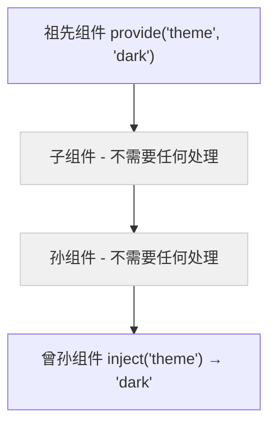

# Vue 依赖注入 (Provide / Inject)

## 1. 解决什么问题？
> 让深层嵌套的组件能直接获取祖先组件的数据，不用一层一层传 props。

* **痛点**：数据要从爷爷组件传到孙子组件，中间隔了好几层，每层都要写 props 转发（"prop 逐级透传"问题）
* **作用**：祖先组件用 `provide` 提供数据，后代组件用 `inject` 直接注入使用，跳过中间层

## 2. 通俗理解
### 核心定义
`provide` 在组件树中"广播"数据，任意深度的后代组件都可以通过 `inject` 接收。是一种跨层级的组件通信方式。

### 生活化比喻
就像**公司的 WiFi**：
- 公司（祖先组件）提供了一个 WiFi（provide）
- 不管你在哪个楼层、哪个办公室（子/孙/曾孙组件），都可以连接使用（inject）
- 不需要每层楼都拉一根网线转发（props 逐级传递）

## 3. 工作原理



## 4. 核心代码实战

### 业务场景：主题切换 —— 顶层提供主题，深层组件消费

### Vue 3 写法 — 基础用法

```vue
<!-- App.vue 祖先组件 -->
<script setup>
import { ref, provide } from 'vue'

const theme = ref('light')
const toggleTheme = () => {
  theme.value = theme.value === 'light' ? 'dark' : 'light'
}

// 提供响应式数据和修改方法
provide('theme', theme)           // 提供响应式 ref
provide('toggleTheme', toggleTheme) // 提供修改方法
</script>

<template>
  <div :class="theme">
    <DeepChild />  <!-- 中间可以嵌套任意多层 -->
  </div>
</template>
```

```vue
<!-- DeepChild.vue 深层后代组件 —— 直接注入使用 -->
<script setup>
import { inject } from 'vue'

// 直接注入，不管隔了几层
const theme = inject('theme')            // 获取响应式主题
const toggleTheme = inject('toggleTheme') // 获取切换方法

// 可以提供默认值，防止祖先没有 provide
const lang = inject('language', 'zh-CN')  // 默认值
</script>

<template>
  <div :class="`card-${theme}`">
    <p>当前主题：{{ theme }}</p>
    <button @click="toggleTheme">切换主题</button>
  </div>
</template>
```

### Vue 3 写法 — 使用 Symbol 键（大型项目推荐）

```typescript
// keys.ts —— 统一管理注入键，避免字符串冲突
import type { InjectionKey, Ref } from 'vue'

export const ThemeKey: InjectionKey<Ref<string>> = Symbol('theme')
export const UserKey: InjectionKey<Ref<User>> = Symbol('user')
```

```vue
<!-- 祖先组件 -->
<script setup lang="ts">
import { ref, provide } from 'vue'
import { ThemeKey } from '@/keys'

const theme = ref('dark')
provide(ThemeKey, theme)  // 类型安全，IDE 有完整提示
</script>
```

```vue
<!-- 后代组件 -->
<script setup lang="ts">
import { inject } from 'vue'
import { ThemeKey } from '@/keys'

const theme = inject(ThemeKey)  // 自动推导类型为 Ref<string>
</script>
```

### Vue 3 写法 — 只读保护（防止后代乱改）

```vue
<!-- 祖先组件 -->
<script setup>
import { ref, provide, readonly } from 'vue'

const count = ref(0)
// 提供只读版本，后代只能读不能改
provide('count', readonly(count))
// 提供修改方法，控制修改逻辑
provide('increment', () => count.value++)
</script>
```

### Vue 2 对比

```javascript
// Vue 2 provide/inject —— 注意：默认不是响应式的！
export default {
  provide() {
    return { theme: this.theme }  // ❌ 不是响应式
  }
}
// Vue 2 要实现响应式，需要 provide 整个对象或用 computed
// Vue 3 直接 provide(key, ref) 就是响应式的
```

## 5. 最佳实践

* **性能考虑**：provide/inject 本身无性能问题，但提供的响应式数据变化会触发所有注入组件更新
* **注意事项**：
  - **始终提供响应式数据**（ref 或 reactive），否则后代拿到的是静态快照
  - **用 `readonly` 保护数据**，防止后代组件直接修改，保持数据流可追踪
  - **修改方法一起 provide**，让数据的"读"和"写"都集中在提供者
  - **提供默认值**，`inject('key', defaultValue)` 防止祖先没有 provide 时报错
* **边界情况**：provide/inject 不限于父子关系，只要在组件树的上下级关系中就能工作

## 6. 常见错误与解决方案

| 错误现象 | 原因 | 解决方案 |
|---------|------|---------|
| inject 拿到 `undefined` | 祖先没有 provide 对应的 key | 检查 key 名一致，或提供默认值 |
| 数据变了但后代没更新 | provide 的不是响应式数据 | 确保 provide 的是 `ref` 或 `reactive` |
| 后代直接修改 inject 数据导致混乱 | 没有用 readonly 保护 | `provide('data', readonly(data))` |
| 字符串 key 冲突 | 多个 provide 用了相同字符串 | 使用 Symbol 作为注入键 |

## 7. 扩展思考

* **vs Props**：少量层级传递用 props（数据流更清晰），深层传递用 provide/inject
* **vs Pinia**：provide/inject 适合组件树局部共享，Pinia 适合全局状态管理
* **应用级 provide**：在 `app.provide('key', value)` 中注册的数据，所有组件都能 inject
* **组合式函数封装**：常把 provide + inject 封装成 `useXxx` 函数（如 `useTheme`），更优雅

---
_本文档将持续更新，添加更多相关内容_
