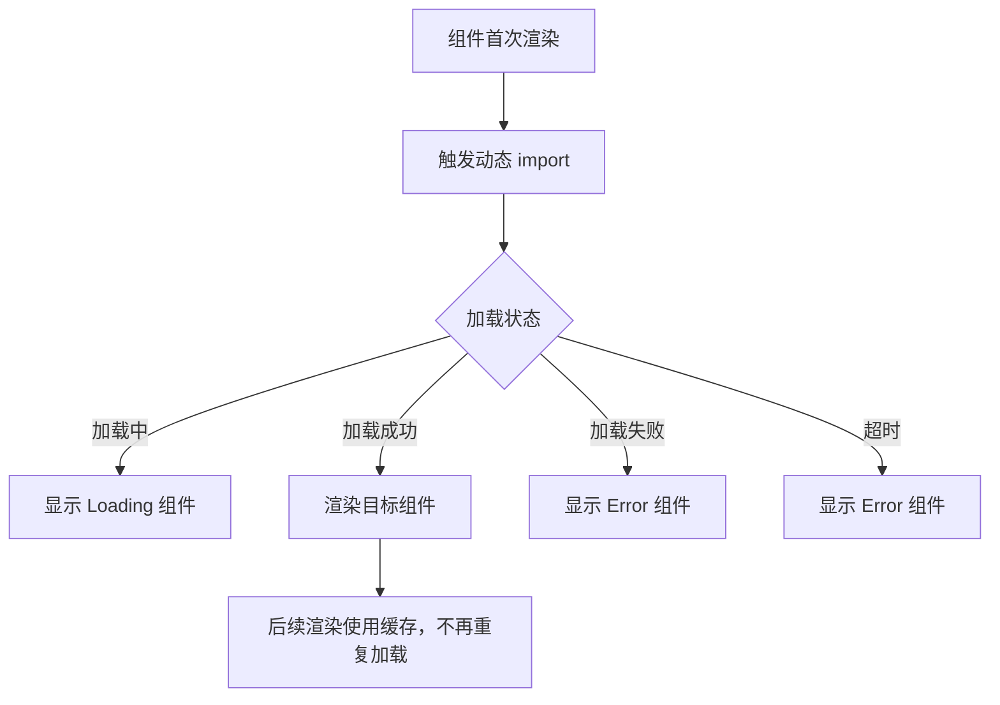

# Vue 异步组件 (Async Components)

## 1. 解决什么问题？
> 把大型组件"拆分"成独立文件，用到时才加载，加速首屏渲染。

* **痛点**：项目越做越大，所有组件打包到一起，首屏加载的 JS 文件巨大，用户等半天才能看到页面
* **作用**：异步组件配合代码分割，让组件在真正需要渲染时才从服务器下载，实现按需加载（懒加载）

## 2. 通俗理解
### 核心定义
异步组件不会在应用初始化时立即加载，而是在组件首次被渲染时才动态导入对应的 JS 文件。Vue 提供 `defineAsyncComponent` 来定义异步组件。

### 生活化比喻
就像**视频网站的预加载**：
- 你打开 B 站首页，不会把所有视频都下载下来
- 只有你点击某个视频（组件需要渲染了），才开始缓冲加载
- 加载中显示转圈（loading 状态），加载失败显示重试按钮（error 状态）

## 3. 工作原理



## 4. 核心代码实战

### 业务场景：后台管理系统中，重型图表组件懒加载

### Vue 3 写法 — 基础用法

```vue
<script setup>
import { defineAsyncComponent } from 'vue'

// 最简写法：传入一个 import 函数
const HeavyChart = defineAsyncComponent(
  () => import('./components/HeavyChart.vue')
)
</script>

<template>
  <!-- 首次渲染时才加载 HeavyChart.vue 对应的 JS 文件 -->
  <HeavyChart v-if="showChart" />
</template>
```

### Vue 3 写法 — 完整配置（推荐）

```vue
<script setup>
import { defineAsyncComponent } from 'vue'
import LoadingSpinner from './LoadingSpinner.vue'
import ErrorDisplay from './ErrorDisplay.vue'

const HeavyChart = defineAsyncComponent({
  loader: () => import('./components/HeavyChart.vue'),
  loadingComponent: LoadingSpinner,  // 加载中显示的组件
  errorComponent: ErrorDisplay,      // 加载失败显示的组件
  delay: 200,        // 延迟 200ms 才显示 loading（避免闪烁）
  timeout: 10000     // 超过 10s 视为加载失败
})
</script>

<template>
  <Suspense>
    <HeavyChart />
  </Suspense>
</template>
```

### Vue 3 写法 — 配合路由懒加载（最常见）

```javascript
// router/index.js
import { createRouter, createWebHistory } from 'vue-router'

const routes = [
  { path: '/', component: () => import('@/views/Home.vue') },
  { path: '/dashboard', component: () => import('@/views/Dashboard.vue') },
  { path: '/settings', component: () => import('@/views/Settings.vue') },
  // 每个路由对应一个独立的 JS 文件，访问时才加载
]

const router = createRouter({
  history: createWebHistory(),
  routes
})
```

### Vue 2 对比

```javascript
// Vue 2 异步组件
const HeavyChart = () => import('./HeavyChart.vue')

// Vue 2 带配置的写法
const HeavyChart = () => ({
  component: import('./HeavyChart.vue'),
  loading: LoadingComp,
  error: ErrorComp,
  delay: 200,
  timeout: 10000
})
```

## 5. 最佳实践

* **性能考虑**：
  - 路由级别组件**必须**懒加载，这是最基本的优化
  - 体积大、不常用的组件适合异步加载（如图表、富文本编辑器、PDF 预览）
  - 小组件（按钮、图标）不需要异步加载，反而增加请求开销
* **注意事项**：
  - 设置 `delay` 避免加载太快时 loading 闪烁（推荐 200ms）
  - 生产环境一定要处理加载失败场景，给用户友好提示
  - 异步组件加载后会被缓存，第二次渲染不再重复请求
* **边界情况**：搭配 `<Suspense>` 可以统一管理多个异步组件的加载状态

## 6. 常见错误与解决方案

| 错误现象 | 原因 | 解决方案 |
|---------|------|---------|
| loading 闪烁一下就消失 | 网络太快，loading 出现又立刻消失 | 设置 `delay: 200` |
| 弱网环境白屏 | 没配置 errorComponent | 添加加载失败的兜底 UI |
| 打包后没有代码分割 | 用了普通 import 而非动态 `import()` | 确保用 `() => import('...')` 箭头函数 |
| Suspense 报警告 | 异步组件外层没包裹 Suspense | 用 `<Suspense>` 包裹或不用 Suspense 特性 |

## 7. 扩展思考

* **预加载**：用 `/* webpackPrefetch: true */` 或 Vite 的预加载策略，在浏览器空闲时提前加载
* **Suspense**：Vue 3 内置的 `<Suspense>` 组件可以优雅地管理异步组件的 loading/fallback 状态
* **打包分析**：用 `rollup-plugin-visualizer`（Vite）或 `webpack-bundle-analyzer` 分析包体积，找出需要懒加载的大组件

---
_本文档将持续更新，添加更多相关内容_
