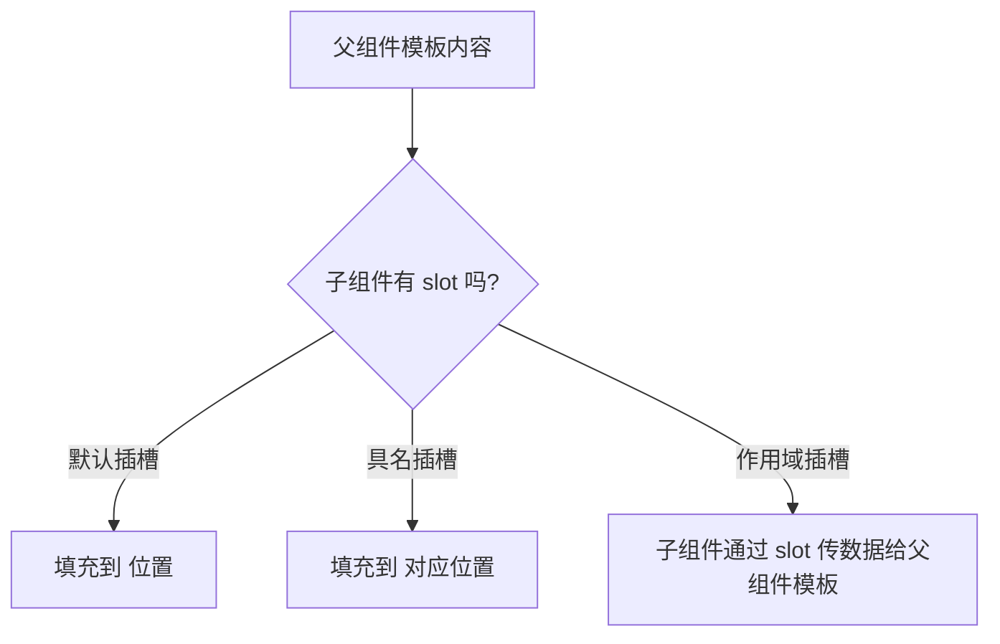

# Vue 插槽 (Slots)

## 1. 解决什么问题？
> 让组件像"容器"一样，不仅能接收数据（props），还能接收一段模板内容（HTML/组件），实现灵活的内容分发。

* **痛点**：封装了一个 Card 组件，但卡片里面的内容每次都不同（有时是文字，有时是图片，有时是表单），用 props 传 HTML 太丑了
* **作用**：插槽让父组件可以往子组件的"预留位置"塞入任意模板内容，极大提升组件的灵活性和复用性

## 2. 通俗理解
### 核心定义
插槽是组件模板中的"占位符"，父组件可以把任意内容填充进去。就像组件挖了一个洞，等着使用者来填。

### 生活化比喻
就像**相框**：
- 相框（子组件）负责样式和边框，中间留了空白区域（`<slot />`）
- 你（父组件）可以放不同的照片（任意内容）进去
- 相框不关心照片内容是什么，照片不关心边框长什么样

## 3. 工作原理



## 4. 核心代码实战

### 业务场景一：通用卡片组件（默认插槽）

```vue
<!-- Card.vue -->
<template>
  <div class="card">
    <div class="card-body">
      <slot>默认内容（没传内容时显示）</slot>
    </div>
  </div>
</template>
```

```vue
<!-- 父组件使用 -->
<template>
  <Card>
    <h2>商品详情</h2>
    <p>这里可以放任意内容</p>
  </Card>
</template>
```

### 业务场景二：页面布局组件（具名插槽）

```vue
<!-- PageLayout.vue -->
<template>
  <div class="page">
    <header><slot name="header" /></header>
    <main><slot /></main>  <!-- 没有 name = 默认插槽 -->
    <footer><slot name="footer" /></footer>
  </div>
</template>
```

```vue
<!-- 父组件使用 —— 用 #name 简写指定内容去哪 -->
<template>
  <PageLayout>
    <template #header>
      <h1>网站标题</h1>
    </template>

    <!-- 默认插槽内容 -->
    <p>页面主体内容</p>

    <template #footer>
      <p>© 2025 版权所有</p>
    </template>
  </PageLayout>
</template>
```

### 业务场景三：列表组件（作用域插槽）

```vue
<!-- UserList.vue —— 子组件有数据，但展示方式由父组件决定 -->
<script setup>
defineProps({ users: Array })
</script>

<template>
  <ul>
    <li v-for="user in users" :key="user.id">
      <!-- 把 user 数据"传回"给父组件的插槽模板 -->
      <slot :user="user" :index="index">
        {{ user.name }}  <!-- 后备内容 -->
      </slot>
    </li>
  </ul>
</template>
```

```vue
<!-- 父组件 —— 拿到子组件传来的数据，自定义渲染方式 -->
<template>
  <UserList :users="users">
    <template #default="{ user }">
      <span>{{ user.name }} - {{ user.email }}</span>
      <button @click="edit(user)">编辑</button>
    </template>
  </UserList>
</template>
```

### Vue 2 对比

```vue
<!-- Vue 2 具名插槽用 slot="name" -->
<template slot="header">
  <h1>标题</h1>
</template>

<!-- Vue 2 作用域插槽用 slot-scope -->
<template slot-scope="{ user }">
  {{ user.name }}
</template>
<!-- Vue 3 统一用 v-slot / # 简写，更简洁 -->
```

## 5. 最佳实践

* **性能考虑**：插槽内容在父组件作用域编译，不会增加子组件渲染负担
* **注意事项**：
  - 默认插槽可以提供后备内容（`<slot>后备</slot>`），没传内容时显示
  - `#default` 可以简写，但具名插槽必须用 `<template #name>`
  - 作用域插槽的数据只在 `<template>` 标签内可用
* **边界情况**：如果只有默认插槽，可以把 `v-slot` 直接写在组件标签上

## 6. 常见错误与解决方案

| 错误现象 | 原因 | 解决方案 |
|---------|------|---------|
| 插槽内容不显示 | 子组件模板里忘了写 `<slot />` | 确认子组件有对应的 slot 占位 |
| 具名插槽内容错位 | `#name` 和 `slot name` 不匹配 | 检查名称拼写一致 |
| 作用域插槽拿不到数据 | 解构写错或子组件没传 slot props | 检查 `:user="user"` 和 `{ user }` 对应关系 |
| 想在插槽里访问子组件数据 | 插槽内容在父组件作用域编译 | 用作用域插槽让子组件主动传出数据 |

## 7. 扩展思考

* **渲染函数中的插槽**：在 `setup()` 返回渲染函数时，通过 `slots.default()` 调用插槽
* **动态插槽名**：`<template v-slot:[dynamicName]>` 可以根据变量动态指定插槽
* **无渲染组件**：组件不渲染自身 DOM，只通过作用域插槽提供数据和方法（Headless Component 模式）

---
_本文档将持续更新，添加更多相关内容_
