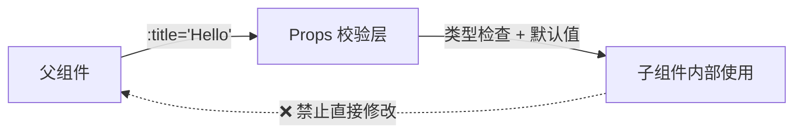

# Vue 组件 Props (Component Props)

## 1. 解决什么问题？
> 让父组件能把数据"传"给子组件，实现组件间的数据流动。

* **痛点**：子组件需要展示的数据在父组件里，怎么传过去？直接访问父组件数据会导致组件高度耦合
* **作用**：Props 提供了一套标准的"父传子"数据通道，让组件既能复用又能接收外部数据

## 2. 通俗理解
### 核心定义
Props 是组件对外声明的"接口参数"，父组件通过属性绑定把数据传入，子组件通过 `defineProps` 声明接收。

### 生活化比喻
Props 就像餐厅的**点菜单**：
- 菜单上写了能点什么菜（Props 声明）、每道菜的规格（类型校验）、默认套餐（默认值）
- 顾客（父组件）按菜单点菜（传值）
- 厨房（子组件）按订单做菜，但**不能擅自改菜单**（Props 是只读的）

## 3. 工作原理



## 4. 核心代码实战

### 业务场景：商品卡片组件接收商品信息

### Vue 3 写法 — 基础用法

```js
<!-- ProductCard.vue -->
<script setup>
// 声明 props，带类型校验和默认值
const props = defineProps({
  title: { type: String, required: true },
  price: { type: Number, default: 0 },
  tags: { type: Array, default: () => [] },  // 引用类型必须用工厂函数
  onSale: { type: Boolean, default: false }
})
</script>

<template>
  <div class="product-card">
    <h3>{{ title }}</h3>
    <span class="price">¥{{ price }}</span>
    <span v-if="onSale" class="badge">促销中</span>
  </div>
</template>
```

```js
<!-- 父组件使用 -->
<script setup>
import ProductCard from './ProductCard.vue'
</script>

<template>
  <!-- 静态字符串直接传，动态数据用 v-bind -->
  <ProductCard
    title="Vue实战指南"
    :price="99.8"
    :tags="['前端', '框架']"
    on-sale
  />
</template>
```

### Vue 3 写法 — TypeScript 类型声明（推荐）

```js
<script setup lang="ts">
// 纯类型声明，更优雅
interface Props {
  title: string
  price?: number       // ? 表示可选
  tags?: string[]
  onSale?: boolean
}

const props = withDefaults(defineProps<Props>(), {
  price: 0,
  tags: () => [],
  onSale: false
})
</script>
```

### Vue 2 对比

```javascript
export default {
  props: {
    title: { type: String, required: true },
    price: { type: Number, default: 0 }
  }
  // 通过 this.title 访问
}
```

## 5. 最佳实践

* **性能考虑**：Props 是响应式的，父组件数据变化会自动触发子组件更新，不要传入不必要的大对象
* **注意事项**：
  - Props 是**单向数据流**（只读），子组件不能直接修改 props
  - 如果需要基于 prop 做变换，用 `computed` 包一层
  - 对象/数组类型的默认值**必须用工厂函数** `() => []`
* **命名规范**：声明时用 `camelCase`（如 `onSale`），模板传值时用 `kebab-case`（如 `on-sale`）
* **边界情况**：传入 `undefined` 会触发默认值，传入 `null` 不会

## 6. 常见错误与解决方案

| 错误现象 | 原因 | 解决方案 |
|---------|------|---------|
| 子组件修改 prop 报警告 | Props 是只读的 | 用 `const localVal = ref(props.xx)` 或 `computed` |
| 传了数字却收到字符串 | 没用 `v-bind`（`:`） | `:price="99"` 而非 `price="99"` |
| 对象默认值报错 | 没用工厂函数 | `default: () => ({})` |
| Prop 校验失败但页面正常 | 校验只在开发环境警告，不阻断运行 | 认真处理控制台警告 |

## 7. 扩展思考

* **Boolean 转换**：`<MyComp disabled />` 等价于 `:disabled="true"`，这是 Vue 对 Boolean 类型 prop 的特殊处理
* **Prop 透传**：如果只是把 prop 往下再传一层，考虑用 `v-bind="$attrs"` 简化
* **响应式解构**：Vue 3.5+ 支持 `const { title } = defineProps<Props>()`，解构后仍保持响应式

---
_本文档将持续更新，添加更多相关内容_
