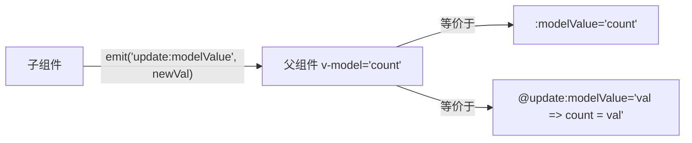

# Vue 组件 v-model (Component v-model)

## 1. 解决什么问题？
> 让父子组件之间的数据"双向同步"变得简洁优雅，一行代码搞定"传值+回传"。

* **痛点**：每次父子通信都要写一对 `:prop` + `@emit`，表单类组件尤其繁琐
* **作用**：`v-model` 是 Props + Emit 的语法糖，一行代码就能实现父子数据的双向绑定

## 2. 通俗理解
### 核心定义
组件上的 `v-model` 会自动将父组件的数据作为 prop 传入，同时监听子组件的更新事件回写数据。本质是 `:modelValue` + `@update:modelValue` 的简写。

### 生活化比喻
就像**共享文档**：
- 你（父组件）和同事（子组件）同时编辑一份在线文档
- 同事改了内容（emit），你这边自动同步（v-model）
- 不用每次改完都发邮件通知，实时同步

## 3. 工作原理



**展开等价写法：**
```
<MyInput v-model="username" />
<!-- 完全等价于 -->
<MyInput :modelValue="username" @update:modelValue="val => username = val" />
```

## 4. 核心代码实战

### 业务场景：封装自定义输入框组件

### Vue 3 写法 — 基础 v-model

```js
<!-- MyInput.vue 子组件 -->
<script setup>
// 声明接收 modelValue
const props = defineProps({ modelValue: String })
const emit = defineEmits(['update:modelValue'])

// 输入时通知父组件更新
const onInput = (e) => {
  emit('update:modelValue', e.target.value)
}
</script>

<template>
  <input :value="modelValue" @input="onInput" placeholder="请输入..." />
</template>
```

```js
<!-- 父组件使用 —— 一行搞定双向绑定 -->
<script setup>
import { ref } from 'vue'
import MyInput from './MyInput.vue'

const username = ref('')
</script>

<template>
  <MyInput v-model="username" />
  <p>实时输入：{{ username }}</p>
</template>
```

### Vue 3 写法 — 多个 v-model（命名 v-model）

```js
<!-- UserForm.vue 子组件 -->
<script setup>
defineProps({ firstName: String, lastName: String })
const emit = defineEmits(['update:firstName', 'update:lastName'])
</script>

<template>
  <input :value="firstName" @input="emit('update:firstName', $event.target.value)" />
  <input :value="lastName" @input="emit('update:lastName', $event.target.value)" />
</template>
```

```js
<!-- 父组件 —— 同时绑定多个值 -->
<template>
  <UserForm v-model:first-name="first" v-model:last-name="last" />
</template>
```

### Vue 3.4+ — defineModel 宏（最简写法）

```js
<!-- MyInput.vue —— 最简洁的写法 -->
<script setup>
// defineModel 自动处理 prop + emit，返回一个可读写的 ref
const model = defineModel()
</script>

<template>
  <input v-model="model" />
</template>
```

### Vue 2 对比

```javascript
// Vue 2 组件 v-model 默认使用 value + input
export default {
  props: ['value'],
  methods: {
    onInput(e) {
      this.$emit('input', e.target.value)  // Vue 2 是 'input' 事件
    }
  }
}
// Vue 2 不支持多个 v-model，需要用 .sync 修饰符
// <Child :title.sync="title" />
```

## 5. 最佳实践

* **性能考虑**：v-model 每次输入都会触发更新，高频输入场景可加 `.lazy` 修饰符（失焦时才更新）
* **注意事项**：
  - 子组件**不要**直接修改 `modelValue` prop，必须通过 emit 回传
  - Vue 3.4+ 推荐用 `defineModel()`，代码量减半
  - 多个 v-model 用命名方式 `v-model:xxx`
* **边界情况**：`v-model` 默认 prop 名是 `modelValue`，可以通过命名改变

## 6. 常见错误与解决方案

| 错误现象 | 原因 | 解决方案 |
|---------|------|---------|
| 双向绑定不生效 | 子组件没有 emit `update:modelValue` | 确保 emit 的事件名格式正确 |
| Vue 2 迁移后 v-model 失效 | Vue 2 用 `value`/`input`，Vue 3 改为 `modelValue`/`update:modelValue` | 更新 prop 和 event 名称 |
| 输入卡顿 | v-model 绑定了复杂计算的响应式数据 | 加 `.lazy` 或用防抖 |

## 7. 扩展思考

* **v-model 修饰符**：`v-model.trim`、`v-model.number`、`v-model.lazy`，还可以自定义修饰符
* **自定义修饰符**：通过 `modelModifiers` prop 获取修饰符，在 emit 前做自定义处理
* **与第三方组件库配合**：Element Plus、Ant Design Vue 的表单组件都基于 v-model 设计

---
_本文档将持续更新，添加更多相关内容_
