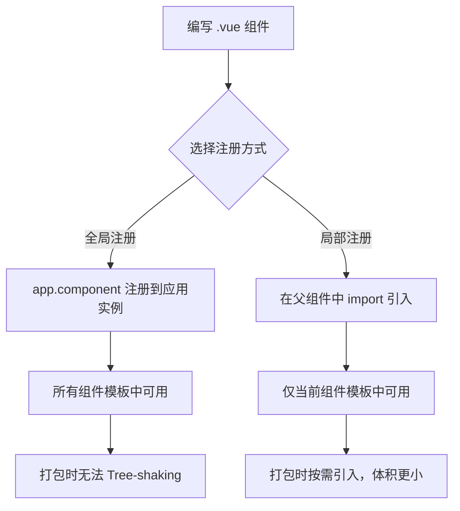

# Vue 组件注册 (Component Registration)

## 1. 解决什么问题？
> 让 Vue 知道你的组件"叫什么名字"、"在哪里能用"，这是使用组件的第一步。

* **痛点**：写好了一个组件，但在模板里用 `<MyButton />` 却报错"未知组件"
* **作用**：通过注册机制，告诉 Vue "这个标签对应哪个组件"，分为全局注册和局部注册两种方式

## 2. 通俗理解
### 核心定义
组件注册就是把你写好的 `.vue` 文件"登记"到 Vue 系统中，让它可以在模板里以标签的形式使用。

### 生活化比喻
- **全局注册** = 把手机号存到通讯录：所有页面都能直接拨打（使用），但通讯录越大，手机越慢
- **局部注册** = 把名片放在办公桌上：只有在这个工位（当前组件）才能看到和使用

## 3. 工作原理



## 4. 核心代码实战

### 业务场景：后台管理系统中注册通用按钮组件

### Vue 3 写法 — 局部注册（推荐）

```js
<!-- src/components/MyButton.vue -->
<script setup>
defineProps({
  type: { type: String, default: 'primary' }
})
</script>

<template>
  <button :class="`btn-${type}`">
    <slot />
  </button>
</template>
```

```js
<!-- 父组件中使用 —— Script Setup 自动注册 -->
<script setup>
// 只需 import，无需手动注册！Script Setup 会自动识别
import MyButton from '@/components/MyButton.vue'
</script>

<template>
  <MyButton type="danger">删除</MyButton>
</template>
```

> **关键点**：在 `<script setup>` 中，import 进来的组件可以**直接在模板使用**，不需要 `components: {}` 手动注册。

### Vue 3 写法 — 全局注册

```javascript
// main.js
import { createApp } from 'vue'
import App from './App.vue'
import MyButton from '@/components/MyButton.vue'

const app = createApp(App)

// 全局注册 —— 所有组件都能用 <MyButton />
app.component('MyButton', MyButton)

app.mount('#app')
```

### Vue 2 对比

```javascript
// Vue 2 全局注册
Vue.component('MyButton', MyButton)

// Vue 2 局部注册
export default {
  components: { MyButton }  // 必须显式声明
}
```

## 5. 最佳实践

* **性能考虑**：优先使用局部注册（`<script setup>` 中直接 import），支持 Tree-shaking，减小打包体积
* **注意事项**：全局注册的组件即使没用到也会被打包进去，不要滥用
* **命名规范**：组件名推荐 `PascalCase`（如 `MyButton`），在模板中也可以用 `<my-button>` kebab-case 形式
* **边界情况**：如果组件确实在 80% 以上的页面都要用（如 Icon、Loading），全局注册是合理的

## 6. 常见错误与解决方案

| 错误现象 | 原因 | 解决方案 |
|---------|------|---------|
| `Unknown custom element: <MyButton>` | 组件未注册 | 确认 import 路径正确，或检查全局注册代码 |
| 全局注册后仍报错 | `app.component()` 写在 `app.mount()` 之后 | 确保注册代码在 mount 之前 |
| 打包体积过大 | 过多组件全局注册 | 改为局部注册 + 按需引入 |

## 7. 扩展思考

* **自动导入**：配合 `unplugin-vue-components` 插件，可以实现组件自动按需导入，既不用手动 import，也不会打包冗余代码
* **递归组件**：组件可以在自己的模板中使用自己（需要有 `name` 选项或文件名作为标识）
* **动态组件**：使用 `<component :is="currentTab" />` 可以动态切换显示的组件

---
_本文档将持续更新，添加更多相关内容_
