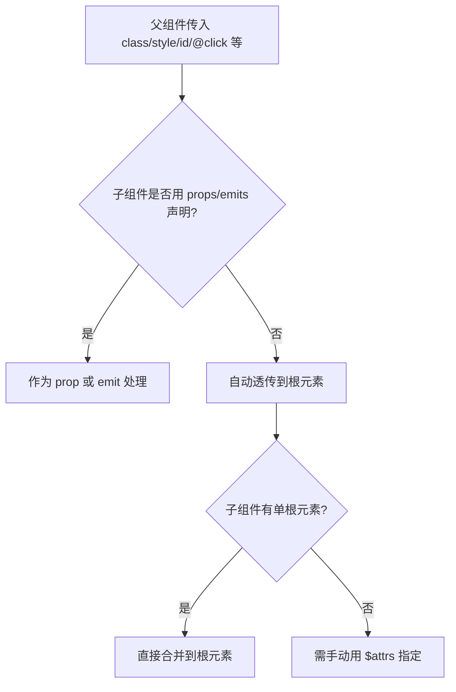

# Vue 透传 Attributes (Fallthrough Attributes)

## 1. 解决什么问题？
> 父组件传给子组件的属性/事件，如果子组件没有用 props/emits 声明接收，Vue 会自动"透传"到子组件的根元素上。

* **痛点**：封装组件时，想让外部能控制内部根元素的 `class`、`style`、`id` 等原生属性，难道每个都要定义 prop 吗？
* **作用**：透传机制让未声明的属性自动落到根元素上，省去大量 prop 中转代码

## 2. 通俗理解
### 核心定义
"透传 Attribute"指的是传递给组件但没有被 `props` 或 `emits` 声明的属性（如 `class`、`style`、`id`、`@click` 等），它们会自动应用到子组件的根元素上。

### 生活化比喻
就像**快递转发**：
- 你（父组件）寄了一个包裹（属性）给公司前台（子组件）
- 如果前台知道这是谁的（props 声明了），就拆开处理
- 如果前台不认识（没声明），就直接转发到办公室里面（根元素）

## 3. 工作原理



## 4. 核心代码实战

### 业务场景：封装按钮组件，外部能控制 class 和原生事件

### Vue 3 写法 — 自动透传

```vue
<!-- MyButton.vue —— 只有一个根元素 -->
<script setup>
defineProps({ label: String })
</script>

<template>
  <button class="btn-base">{{ label }}</button>
</template>
```

```vue
<!-- 父组件 -->
<template>
  <!-- class 和 @click 都没被 props/emits 声明，会自动透传到 <button> 上 -->
  <MyButton label="提交" class="btn-primary" id="submit-btn" @click="handleClick" />
  
  <!-- 最终渲染结果：
  <button class="btn-base btn-primary" id="submit-btn">提交</button>
  注意：class 会合并，不会覆盖！ -->
</template>
```

### Vue 3 写法 — 禁用自动透传 + 手动控制

```vue
<!-- MyInput.vue —— 多根元素或想精确控制透传目标 -->
<script setup>
defineOptions({ inheritAttrs: false })  // 禁用自动透传
defineProps({ label: String })
</script>

<template>
  <div class="input-wrapper">
    <label>{{ label }}</label>
    <!-- 用 $attrs 手动指定透传到 input 而非外层 div -->
    <input v-bind="$attrs" />
  </div>
</template>
```

```vue
<!-- 父组件 -->
<template>
  <!-- placeholder 和 @input 会透传到 <input> 上，而非外层 <div> -->
  <MyInput label="用户名" placeholder="请输入用户名" @input="onInput" />
</template>
```

### Vue 3 写法 — JS 中访问 attrs

```vue
<script setup>
import { useAttrs } from 'vue'

const attrs = useAttrs()
console.log(attrs.class)  // 获取透传的 class
console.log(attrs.id)     // 获取透传的 id
</script>
```

### Vue 2 对比

```javascript
export default {
  inheritAttrs: false,  // 同样可以禁用
  // Vue 2 中通过 this.$attrs 和 this.$listeners 访问
  // Vue 3 把 $listeners 合并到了 $attrs 中
}
```

## 5. 最佳实践

* **性能考虑**：透传机制本身无性能损耗，放心使用
* **注意事项**：
  - `class` 和 `style` 会**合并**（不是覆盖），其他属性是覆盖
  - 多根元素组件**不会自动透传**，必须手动用 `v-bind="$attrs"` 指定目标
  - `inheritAttrs: false` 不影响 `class` 和 `style` 的绑定（Vue 3.3+ 也禁用了）
* **边界情况**：如果子组件的根元素是另一个组件，attrs 会继续向下透传（链式透传）

## 6. 常见错误与解决方案

| 错误现象 | 原因 | 解决方案 |
|---------|------|---------|
| 多根组件警告：attrs 不自动透传 | 多根元素无法确定透传目标 | 设置 `inheritAttrs: false` + `v-bind="$attrs"` |
| 外部传的 class 没生效 | 子组件内部样式用了 scoped + 很强的选择器 | 检查 CSS 优先级 |
| 透传的事件触发了两次 | 子组件既声明了 emits 又没阻止透传 | 用 `defineEmits` 声明后就不会透传了 |

## 7. 扩展思考

* **深层透传**：attrs 可以沿组件链一直往下传，适合高阶组件封装
* **与 props 配合**：先用 props 接收需要处理的属性，剩下的透传给内部元素，是组件封装的常见模式
* **v-bind="$attrs"**：这是组件库开发的核心技巧，Element Plus 大量使用

---
_本文档将持续更新，添加更多相关内容_
