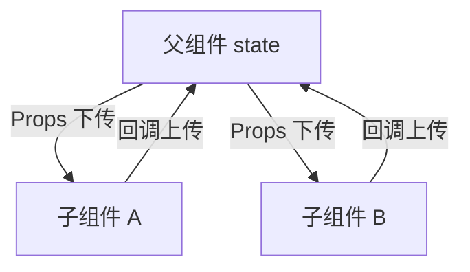

# 组件基础 · 进阶篇

> 组合 vs 继承、组件通信、合成事件、最佳实践与常见坑。

---

## 一、组合 vs 继承

### React 推荐：用组合，不用继承

React 官方建议用**组合**（把子组件/children 当作 props 传进来，或通过 slot 占位）来复用 UI 和行为，而不是用类的继承来扩展组件。

### 通俗理解

- **继承**：像「复印一份父类再改」——子类继承父类，容易导致层级深、关系复杂。
- **组合**：像「拼积木」——把小组件当 props 或 children 传进去，灵活、清晰。

### 组合的常见方式

**1. children 占位**

```typescript
interface CardProps {
  title: string
  children: React.ReactNode
}

function Card({ title, children }: CardProps) {
  return (
    <div className="card">
      <h2>{title}</h2>
      {children}
    </div>
  )
}

// 使用：任意内容放进 Card
<Card title="用户信息">
  <p>姓名：张三</p>
  <p>邮箱：zhang@example.com</p>
</Card>
```

**2. 多个「插槽」用 props 传**

```typescript
interface LayoutProps {
  header: React.ReactNode
  sidebar: React.ReactNode
  main: React.ReactNode
}

function Layout({ header, sidebar, main }: LayoutProps) {
  return (
    <div className="layout">
      <header>{header}</header>
      <aside>{sidebar}</aside>
      <main>{main}</main>
    </div>
  )
}

// 使用
<Layout
  header={<SiteHeader />}
  sidebar={<Sidebar />}
  main={<Content />}
/>
```

**3. render props / 函数 children（需要数据回传时）**

```typescript
interface DataFetcherProps<T> {
  url: string
  children: (data: T | null, loading: boolean, error: Error | null) => React.ReactNode
}

function DataFetcher<T>({ url, children }: DataFetcherProps<T>) {
  const [data, setData] = useState<T | null>(null)
  const [loading, setLoading] = useState(true)
  const [error, setError] = useState<Error | null>(null)

  useEffect(() => {
    fetch(url)
      .then((res) => res.json())
      .then(setData)
      .catch(setError)
      .finally(() => setLoading(false))
  }, [url])

  return <>{children(data, loading, error)}</>
}

// 使用
<DataFetcher<User> url="/api/user/1">
  {(user, loading, error) => {
    if (loading) return <Spinner />
    if (error) return <ErrorMsg error={error} />
    return user ? <UserCard user={user} /> : null
  }}
</DataFetcher>
```

---

## 二、组件通信

### 数据流：单向、自上而下

React 里数据主要**从父到子**通过 Props 传递；子要影响父或兄弟，通过**回调**把事件「上传」到父组件，由父组件改 state 再往下传。



### 父 → 子：Props 下传

父组件用 state 存数据，通过 props 传给子组件（见 [1-基础篇](./1-基础篇.md)）。

### 子 → 父：回调上传

父组件把**函数**通过 props 传给子组件，子组件在合适的时机（点击、提交等）调用这个函数，必要时传参数。

```typescript
// 父组件：持有状态，把「更新状态」的函数传给子
function Parent() {
  const [selectedId, setSelectedId] = useState<string | null>(null)

  return (
    <div>
      <ChildList
        selectedId={selectedId}
        onSelect={setSelectedId}
      />
    </div>
  )
}

// 子组件：收到 onSelect，在用户操作时调用
interface ChildListProps {
  selectedId: string | null
  onSelect: (id: string) => void
}

function ChildList({ selectedId, onSelect }: ChildListProps) {
  const items = [{ id: '1', name: 'A' }, { id: '2', name: 'B' }]
  return (
    <ul>
      {items.map((item) => (
        <li
          key={item.id}
          onClick={() => onSelect(item.id)}
          style={{ fontWeight: selectedId === item.id ? 'bold' : 'normal' }}
        >
          {item.name}
        </li>
      ))}
    </ul>
  )
}
```

### 兄弟组件通信：状态提升

两个兄弟要共享同一份数据时，把 **state 提到共同的父组件**，一个子通过 props 读，另一个子通过 props 收到的回调写。

```typescript
// 状态在父组件，兄弟 A 读、兄弟 B 写
function Parent() {
  const [keyword, setKeyword] = useState('')

  return (
    <div>
      <SearchInput value={keyword} onChange={setKeyword} />
      <SearchResults keyword={keyword} />
    </div>
  )
}
```

### 跨很多层：Context 或状态库

如果层级很深、多分支都要同一份数据，用 **Context API** 或 **Redux/Zustand** 等，避免一层层传 props。详见「Context」「状态管理」主题。

---

## 三、合成事件（SyntheticEvent）简要

### 是什么

React 把原生 DOM 事件包了一层，叫**合成事件**。你在 `onClick`、`onChange` 里拿到的是合成事件对象，API 和原生类似（如 `e.target`、`e.preventDefault()`），但行为上统一委托到 root，便于兼容和优化。

### 常见注意点

| 点 | 说明 |
|----|------|
| 异步里不能用事件对象 | 合成事件在回调执行完会被复用，异步代码里不要再用 `e`，需要的话先 `e.persist()`（React 17+ 已移除）或提前取 `e.target` 等值 |
| 阻止默认行为 | 用 `e.preventDefault()`，例如表单提交 |
| 阻止冒泡 | 用 `e.stopPropagation()`；若和原生事件混用，要注意执行顺序（合成事件在冒泡阶段） |

```typescript
const handleClick = (e: React.MouseEvent) => {
  e.preventDefault()
  const target = e.target as HTMLElement
  // 若在 setTimeout 里用 e，可能已被回收，建议只用已取出的 target
  setTimeout(() => {
    console.log(target)
  }, 100)
}
```

---

## 四、最佳实践与常见坑

### 1. 组件拆分

| 做法 | 说明 |
|------|------|
| 按职责拆 | 展示型组件（只接 props 渲染）和容器型组件（管 state、请求）可分开，便于复用和测试 |
| 单文件别过长 | 一个文件里组件太多或逻辑太多时，拆成多个组件或抽自定义 Hooks |
| 复用先抽 | 同一块 UI 或同一段逻辑出现两次以上，考虑抽成组件或 Hook |

### 2. Props 设计

| 做法 | 说明 |
|------|------|
| 用 TypeScript 定义 Props | `interface XxxProps { ... }`，避免传错、漏传 |
| 避免过多 props | 超过 5～7 个可考虑用 `object` 聚合或 Context |
| 回调命名一致 | `onXxx` 表示「当 xxx 发生时」，如 `onSubmit`、`onChange` |

### 3. 列表与 key

| 坑 | 建议 |
|----|------|
| 用 index 当 key | 列表会增删、重排时不要用 index，用稳定唯一 id |
| key 不稳定 | key 不要用随机数或每次渲染都变的值，否则会丢状态、性能差 |

### 4. 受控 vs 非受控

| 场景 | 建议 |
|------|------|
| 需要校验、联动、统一读值 | 用受控（state + value + onChange） |
| 简单表单、大表单性能敏感 | 可考虑非受控（ref + defaultValue） |
| 同一表单不要混用 | 一个 input 要么受控要么非受控，不要混在一起 |

### 5. 事件与性能

| 做法 | 说明 |
|------|------|
| 避免内联创建函数导致子组件重渲染 | 子组件若用 `React.memo`，回调用 `useCallback` 或提到组件外，避免每次渲染新函数引用 |
| 列表里事件尽量用「传 id + 父组件处理」 | 避免在列表项里闭包大量数据，便于配合 memo |

---

## 五、实用检验（自测）

1. **兄弟组件要共享一个输入框的值，该怎么做？**  
   把 state 提到共同的父组件，一个子用 props 读 value、用 onChange 写；另一个子用同一份 value 做展示或筛选（状态提升）。

2. **组合和继承在 React 里更推荐哪种？**  
   推荐组合：用 children、多个 props 插槽或 render props，而不是用类继承扩展组件。

3. **子组件要通知父组件「用户点了确定」并带上当前选中的 id，怎么设计？**  
   父组件通过 props 传 `onConfirm: (id: string) => void`，子组件在确定按钮的 onClick 里调用 `onConfirm(selectedId)`。

4. **为什么列表项不要用 index 当 key？**  
   增删、排序后 index 会变，和「同一项」对不上，React 会误复用 DOM/状态，导致渲染错乱或状态错位。

5. **合成事件在异步回调里为什么不能继续用事件对象？**  
   合成事件会被复用，回调执行完后对象可能被清空；若要在异步里用，先取出需要的属性（如 `e.target`）再在异步里用。

---

_上一篇：[1-基础篇](./1-基础篇.md) | 主题导航：[组件基础 README](./README.md)_
