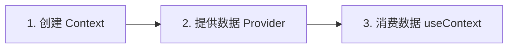

# Context API - 基础篇

## 什么是 Context？

### 定义

Context 是 React 提供的一种**跨层级传递数据**的机制。它允许你在组件树中共享数据，而不需要通过 Props 一层层手动传递。

### 通俗理解

想象一个公司的通知系统：

- **传统方式（Props）**：老板告诉经理，经理告诉主管，主管告诉员工，层层传递很麻烦
- **Context 方式**：老板在公司群里发通知，所有人都能直接看到

Context 就像一个"全局广播"，让需要数据的组件直接订阅，不用通过中间人传递。

### 解决的问题：Props Drilling

```typescript
// ❌ 没有 Context：Props 层层传递（Props Drilling）
function App() {
  const [theme, setTheme] = useState('light')
  return <Layout theme={theme} />
}

function Layout({ theme }: { theme: string }) {
  return <Header theme={theme} />  // Layout 不需要 theme，只是传递
}

function Header({ theme }: { theme: string }) {
  return <UserMenu theme={theme} />  // Header 也不需要，继续传递
}

function UserMenu({ theme }: { theme: string }) {
  return <div className={theme}>...</div>  // 最终使用
}
```

```typescript
// ✅ 使用 Context：直接访问数据
const ThemeContext = createContext('light')

function App() {
  const [theme, setTheme] = useState('light')
  return (
    <ThemeContext.Provider value={theme}>
      <Layout />  {/* 不需要传 theme */}
    </ThemeContext.Provider>
  )
}

function Layout() {
  return <Header />  {/* 不需要传 theme */}
}

function Header() {
  return <UserMenu />  {/* 不需要传 theme */}
}

function UserMenu() {
  const theme = useContext(ThemeContext)  // 直接获取
  return <div className={theme}>...</div>
}
```

## 什么时候用 Context？

### 适用场景

| 场景 | 说明 | 示例 |
|-----|------|------|
| **全局配置** | 应用级别的设置 | 主题、语言、API 地址 |
| **用户信息** | 登录后的用户数据 | 用户名、头像、权限 |
| **跨层级共享** | 多个层级的组件都需要 | 祖父组件 → 孙子组件 |
| **不频繁变化** | 数据相对稳定 | 主题切换、语言切换 |

### 不适用场景

| 场景 | 原因 | 替代方案 |
|-----|------|---------|
| **父子组件通信** | Props 更简单直接 | 直接用 Props |
| **频繁变化的数据** | 会导致大量重渲染 | Redux/Zustand |
| **复杂状态逻辑** | Context 没有调试工具 | Redux DevTools |
| **兄弟组件通信** | 需要状态提升 | 状态提升或状态管理库 |

## 如何使用 Context？

### 三步走



### 步骤 1：创建 Context

```typescript
import { createContext } from 'react'

// 创建 Context，提供默认值
const ThemeContext = createContext<'light' | 'dark'>('light')
```

**要点**：
- 使用 `createContext` 创建
- 提供默认值（当没有 Provider 时使用）
- TypeScript 需要指定类型

### 步骤 2：提供数据（Provider）

```typescript
function App() {
  const [theme, setTheme] = useState<'light' | 'dark'>('light')

  return (
    <ThemeContext.Provider value={theme}>
      <Header />
      <Content />
      <Footer />
    </ThemeContext.Provider>
  )
}
```

**要点**：
- 用 `<Context.Provider>` 包裹需要访问数据的组件
- 通过 `value` 属性传递数据
- Provider 内的所有组件都能访问数据

### 步骤 3：消费数据（useContext）

```typescript
import { useContext } from 'react'

function Header() {
  const theme = useContext(ThemeContext)

  return (
    <header className={theme}>
      <h1>我的网站</h1>
    </header>
  )
}
```

**要点**：
- 使用 `useContext(Context)` 获取数据
- 必须在 Provider 内部使用
- 获取的是最近的 Provider 的值

## 完整示例：主题切换

### 场景说明

实现一个主题切换功能：
- 用户可以在亮色/暗色主题间切换
- 多个组件需要知道当前主题
- 避免 Props 层层传递

### 代码实现

```typescript
import { createContext, useContext, useState, ReactNode } from 'react'

// 1. 定义类型
type Theme = 'light' | 'dark'

interface ThemeContextType {
  theme: Theme
  toggleTheme: () => void
}

// 2. 创建 Context
const ThemeContext = createContext<ThemeContextType | undefined>(undefined)

// 3. 创建 Provider 组件
function ThemeProvider({ children }: { children: ReactNode }) {
  const [theme, setTheme] = useState<Theme>('light')

  const toggleTheme = () => {
    setTheme(prev => prev === 'light' ? 'dark' : 'light')
  }

  return (
    <ThemeContext.Provider value={{ theme, toggleTheme }}>
      {children}
    </ThemeContext.Provider>
  )
}

// 4. 创建自定义 Hook（可选，但推荐）
function useTheme() {
  const context = useContext(ThemeContext)
  if (!context) {
    throw new Error('useTheme 必须在 ThemeProvider 内使用')
  }
  return context
}

// 5. 使用 Provider 包裹应用
function App() {
  return (
    <ThemeProvider>
      <Header />
      <Content />
      <Footer />
    </ThemeProvider>
  )
}

// 6. 在组件中使用
function Header() {
  const { theme, toggleTheme } = useTheme()

  return (
    <header className={`header-${theme}`}>
      <h1>我的网站</h1>
      <button onClick={toggleTheme}>
        切换到 {theme === 'light' ? '暗色' : '亮色'} 模式
      </button>
    </header>
  )
}

function Content() {
  const { theme } = useTheme()

  return (
    <main className={`content-${theme}`}>
      <p>当前主题：{theme}</p>
    </main>
  )
}

function Footer() {
  const { theme } = useTheme()

  return (
    <footer className={`footer-${theme}`}>
      <p>© 2026 我的网站</p>
    </footer>
  )
}
```

### 代码说明

| 步骤 | 说明 |
|-----|------|
| **定义类型** | 明确 Context 的数据结构 |
| **创建 Context** | 使用 `createContext`，初始值为 `undefined` |
| **创建 Provider** | 封装状态逻辑和更新方法 |
| **自定义 Hook** | 简化使用，增加错误检查 |
| **包裹应用** | 用 Provider 包裹需要访问数据的组件 |
| **消费数据** | 用自定义 Hook 获取数据和方法 |

### 为什么要创建自定义 Hook？

```typescript
// ❌ 不好：每次都要写错误检查
function Header() {
  const context = useContext(ThemeContext)
  if (!context) {
    throw new Error('必须在 ThemeProvider 内使用')
  }
  const { theme, toggleTheme } = context
  // ...
}

// ✅ 好：自定义 Hook 封装错误检查
function useTheme() {
  const context = useContext(ThemeContext)
  if (!context) {
    throw new Error('useTheme 必须在 ThemeProvider 内使用')
  }
  return context
}

function Header() {
  const { theme, toggleTheme } = useTheme()  // 简洁
  // ...
}
```

## 完整示例：用户认证

### 场景说明

实现用户登录功能：
- 保存用户信息（用户名、头像、权限）
- 多个组件需要访问用户信息
- 提供登录、登出方法

### 代码实现

```typescript
import { createContext, useContext, useState, ReactNode } from 'react'

// 1. 定义类型
interface User {
  id: string
  name: string
  avatar: string
  role: 'admin' | 'user'
}

interface AuthContextType {
  user: User | null
  login: (user: User) => void
  logout: () => void
  isAdmin: boolean
}

// 2. 创建 Context
const AuthContext = createContext<AuthContextType | undefined>(undefined)

// 3. 创建 Provider
function AuthProvider({ children }: { children: ReactNode }) {
  const [user, setUser] = useState<User | null>(null)

  const login = (user: User) => {
    setUser(user)
    // 实际项目中：保存 token 到 localStorage
    localStorage.setItem('user', JSON.stringify(user))
  }

  const logout = () => {
    setUser(null)
    localStorage.removeItem('user')
  }

  const isAdmin = user?.role === 'admin'

  return (
    <AuthContext.Provider value={{ user, login, logout, isAdmin }}>
      {children}
    </AuthContext.Provider>
  )
}

// 4. 自定义 Hook
function useAuth() {
  const context = useContext(AuthContext)
  if (!context) {
    throw new Error('useAuth 必须在 AuthProvider 内使用')
  }
  return context
}

// 5. 使用示例
function App() {
  return (
    <AuthProvider>
      <Header />
      <Content />
    </AuthProvider>
  )
}

function Header() {
  const { user, logout } = useAuth()

  return (
    <header>
      {user ? (
        <div>
          
          <span>{user.name}</span>
          <button onClick={logout}>登出</button>
        </div>
      ) : (
        <button>登录</button>
      )}
    </header>
  )
}

function AdminPanel() {
  const { isAdmin } = useAuth()

  if (!isAdmin) {
    return <div>无权限访问</div>
  }

  return <div>管理员面板</div>
}
```

## 常见问题

### 1. Context 变化时会重渲染哪些组件？

**问题**：Context 的值变化时，所有使用 `useContext` 的组件都会重新渲染，即使它们只用了部分数据。

```typescript
// ❌ 问题：count 变化时，所有用了 useAppContext 的组件都会重渲染
const AppContext = createContext({ count: 0, user: null })

function Counter() {
  const { count } = useContext(AppContext)  // 只用 count
  return <div>{count}</div>
}

function UserInfo() {
  const { user } = useContext(AppContext)  // 只用 user
  return <div>{user?.name}</div>  // count 变化时也会重渲染
}
```

**解决方案**：拆分成多个 Context

```typescript
// ✅ 好：拆分成独立的 Context
const CountContext = createContext(0)
const UserContext = createContext(null)

function Counter() {
  const count = useContext(CountContext)  // 只订阅 count
  return <div>{count}</div>
}

function UserInfo() {
  const user = useContext(UserContext)  // 只订阅 user
  return <div>{user?.name}</div>
}
```

### 2. 为什么 Context 的默认值不生效？

**问题**：创建 Context 时提供了默认值，但组件获取到的是 `undefined`。

```typescript
// 创建时提供了默认值 'light'
const ThemeContext = createContext('light')

function Header() {
  const theme = useContext(ThemeContext)
  console.log(theme)  // undefined，为什么？
}
```

**原因**：组件在 Provider 外部使用，或者 Provider 的 `value` 是 `undefined`。

```typescript
// ❌ 错误：组件在 Provider 外部
function App() {
  return <Header />  // Header 在 Provider 外，获取不到值
}

// ✅ 正确：组件在 Provider 内部
function App() {
  return (
    <ThemeContext.Provider value="dark">
      <Header />  {/* 现在能获取到 'dark' */}
    </ThemeContext.Provider>
  )
}
```

### 3. 如何避免 Context 导致的性能问题？

**问题**：Context 的值是对象，每次渲染都创建新对象，导致所有消费者重渲染。

```typescript
// ❌ 问题：每次渲染都创建新对象
function App() {
  const [theme, setTheme] = useState('light')

  return (
    <ThemeContext.Provider value={{ theme, setTheme }}>
      {/* value 是新对象，所有消费者都会重渲染 */}
      <Content />
    </ThemeContext.Provider>
  )
}
```

**解决方案**：使用 `useMemo` 缓存对象

```typescript
// ✅ 好：用 useMemo 缓存对象
function App() {
  const [theme, setTheme] = useState('light')

  const value = useMemo(
    () => ({ theme, setTheme }),
    [theme]  // 只有 theme 变化时才创建新对象
  )

  return (
    <ThemeContext.Provider value={value}>
      <Content />
    </ThemeContext.Provider>
  )
}
```

### 4. 可以嵌套多个 Provider 吗？

**可以**，Provider 可以嵌套使用，内层会覆盖外层的值。

```typescript
const ThemeContext = createContext('light')

function App() {
  return (
    <ThemeContext.Provider value="light">
      <Header />  {/* 获取到 'light' */}

      <ThemeContext.Provider value="dark">
        <Content />  {/* 获取到 'dark' */}
      </ThemeContext.Provider>

      <Footer />  {/* 获取到 'light' */}
    </ThemeContext.Provider>
  )
}
```

### 5. Context 和 Redux 有什么区别？

| 特性 | Context | Redux |
|-----|---------|-------|
| **用途** | 跨层级传递数据 | 全局状态管理 |
| **复杂度** | 简单，React 内置 | 复杂，需要额外学习 |
| **性能** | 值变化时所有消费者重渲染 | 只有订阅的部分重渲染 |
| **调试** | 无专门工具 | Redux DevTools |
| **适用场景** | 主题、用户信息等配置 | 复杂的状态逻辑 |

**建议**：
- 简单的全局配置用 Context
- 复杂的状态管理用 Redux/Zustand

## 实用检验

### 问题 1：什么时候应该用 Context？

<details>
<summary>点击查看答案</summary>

**应该用 Context 的场景**：
1. 多个层级的组件需要访问同一数据（避免 Props Drilling）
2. 数据相对稳定，不频繁变化（如主题、语言、用户信息）
3. 数据是全局配置性质的（如 API 地址、应用设置）

**不应该用 Context 的场景**：
1. 只有父子组件通信（直接用 Props 更简单）
2. 数据频繁变化（会导致大量重渲染，用状态管理库）
3. 需要复杂的状态逻辑和调试工具（用 Redux）

</details>

### 问题 2：如何创建和使用 Context？

<details>
<summary>点击查看答案</summary>

**三步走**：

```typescript
// 1. 创建 Context
const ThemeContext = createContext<'light' | 'dark'>('light')

// 2. 提供数据（Provider）
function App() {
  const [theme, setTheme] = useState<'light' | 'dark'>('light')
  return (
    <ThemeContext.Provider value={theme}>
      <Content />
    </ThemeContext.Provider>
  )
}

// 3. 消费数据（useContext）
function Content() {
  const theme = useContext(ThemeContext)
  return <div className={theme}>...</div>
}
```

**推荐做法**：
- 创建自定义 Hook 封装 `useContext`
- 在自定义 Hook 中添加错误检查
- 将 Provider 封装成独立组件

</details>

### 问题 3：Context 变化时会重渲染哪些组件？

<details>
<summary>点击查看答案</summary>

**会重渲染的组件**：
- 所有使用 `useContext` 订阅该 Context 的组件
- 即使组件只用了 Context 中的部分数据，也会重渲染

**示例**：

```typescript
const AppContext = createContext({ count: 0, user: null })

function Counter() {
  const { count } = useContext(AppContext)  // 只用 count
  return <div>{count}</div>
}

function UserInfo() {
  const { user } = useContext(AppContext)  // 只用 user
  return <div>{user?.name}</div>
  // count 变化时，UserInfo 也会重渲染
}
```

**优化方法**：
1. 拆分成多个独立的 Context
2. 使用 `useMemo` 缓存 Provider 的 value
3. 用 `React.memo` 包裹消费组件

</details>

### 问题 4：为什么要创建自定义 Hook？

<details>
<summary>点击查看答案</summary>

**原因**：
1. **简化使用**：不用每次都写 `useContext(Context)`
2. **错误检查**：确保在 Provider 内使用
3. **类型安全**：避免 `undefined` 的类型问题
4. **易于维护**：修改 Context 时只需改一处

**示例**：

```typescript
// 创建自定义 Hook
function useTheme() {
  const context = useContext(ThemeContext)
  if (!context) {
    throw new Error('useTheme 必须在 ThemeProvider 内使用')
  }
  return context
}

// 使用时更简洁
function Header() {
  const { theme, toggleTheme } = useTheme()  // 简洁且安全
  // ...
}
```

</details>

### 问题 5：如何避免 Context 导致的性能问题？

<details>
<summary>点击查看答案</summary>

**常见性能问题**：
- Provider 的 `value` 每次渲染都是新对象，导致所有消费者重渲染

**解决方案**：

```typescript
// ❌ 问题：每次渲染都创建新对象
function App() {
  const [theme, setTheme] = useState('light')
  return (
    <ThemeContext.Provider value={{ theme, setTheme }}>
      <Content />
    </ThemeContext.Provider>
  )
}

// ✅ 方案 1：用 useMemo 缓存
function App() {
  const [theme, setTheme] = useState('light')
  const value = useMemo(() => ({ theme, setTheme }), [theme])
  return (
    <ThemeContext.Provider value={value}>
      <Content />
    </ThemeContext.Provider>
  )
}

// ✅ 方案 2：拆分成多个 Context
const ThemeContext = createContext('light')
const ThemeUpdaterContext = createContext(() => {})

function App() {
  const [theme, setTheme] = useState('light')
  return (
    <ThemeContext.Provider value={theme}>
      <ThemeUpdaterContext.Provider value={setTheme}>
        <Content />
      </ThemeUpdaterContext.Provider>
    </ThemeContext.Provider>
  )
}
```

</details>

---

## 下一步

学完基础篇后，你已经掌握了 Context 的基本使用。接下来可以：

1. **学习 [2-进阶篇](./2-进阶篇.md)**：了解多个 Context 组合、性能优化、最佳实践
2. **学习 [Router](../Router/README.md)**：学习 React Router 实现页面跳转
3. **学习 [状态管理](../StateManagement/README.md)**：了解何时用 Context、何时用状态管理库

---

_本文档持续更新，欢迎反馈和建议。_
