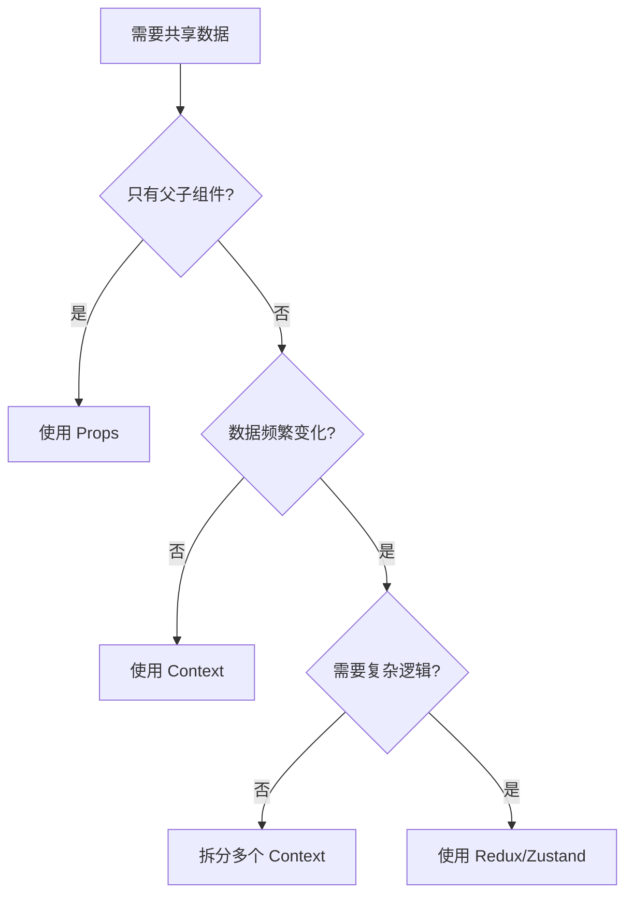

# Context API - 进阶篇

## 多个 Context 组合使用

### 为什么要拆分 Context？

**问题**：一个 Context 包含多个数据，任何一个数据变化都会导致所有消费者重渲染。

```typescript
// ❌ 问题：count 变化时，UserInfo 也会重渲染
const AppContext = createContext({
  count: 0,
  user: null,
  theme: 'light'
})

function Counter() {
  const { count } = useContext(AppContext)
  return <div>{count}</div>
}

function UserInfo() {
  const { user } = useContext(AppContext)
  // count 变化时，这里也会重渲染，即使不需要
  return <div>{user?.name}</div>
}
```

**解决方案**：拆分成多个独立的 Context

```typescript
// ✅ 好：拆分成独立的 Context
const CountContext = createContext(0)
const UserContext = createContext(null)
const ThemeContext = createContext('light')

function Counter() {
  const count = useContext(CountContext)  // 只订阅 count
  return <div>{count}</div>
}

function UserInfo() {
  const user = useContext(UserContext)  // 只订阅 user
  return <div>{user?.name}</div>  // count 变化时不会重渲染
}
```

### 组合多个 Provider

**方式 1：嵌套 Provider**

```typescript
function App() {
  return (
    <ThemeProvider>
      <AuthProvider>
        <LanguageProvider>
          <Content />
        </LanguageProvider>
      </AuthProvider>
    </ThemeProvider>
  )
}
```

**缺点**：嵌套太多，代码不美观

**方式 2：创建组合 Provider**

```typescript
// 创建组合 Provider
function AppProviders({ children }: { children: ReactNode }) {
  return (
    <ThemeProvider>
      <AuthProvider>
        <LanguageProvider>
          {children}
        </LanguageProvider>
      </AuthProvider>
    </ThemeProvider>
  )
}

// 使用
function App() {
  return (
    <AppProviders>
      <Content />
    </AppProviders>
  )
}
```

**方式 3：使用工具函数组合**

```typescript
// 工具函数：组合多个 Provider
function composeProviders(...providers: React.FC<{ children: ReactNode }>[]) {
  return ({ children }: { children: ReactNode }) => {
    return providers.reduceRight(
      (acc, Provider) => <Provider>{acc}</Provider>,
      children
    )
  }
}

// 使用
const AppProviders = composeProviders(
  ThemeProvider,
  AuthProvider,
  LanguageProvider
)

function App() {
  return (
    <AppProviders>
      <Content />
    </AppProviders>
  )
}
```

### 完整示例：多个 Context 组合

```typescript
import { createContext, useContext, useState, ReactNode, useMemo } from 'react'

// 1. 主题 Context
interface ThemeContextType {
  theme: 'light' | 'dark'
  toggleTheme: () => void
}

const ThemeContext = createContext<ThemeContextType | undefined>(undefined)

function ThemeProvider({ children }: { children: ReactNode }) {
  const [theme, setTheme] = useState<'light' | 'dark'>('light')

  const value = useMemo(
    () => ({
      theme,
      toggleTheme: () => setTheme(prev => prev === 'light' ? 'dark' : 'light')
    }),
    [theme]
  )

  return <ThemeContext.Provider value={value}>{children}</ThemeContext.Provider>
}

function useTheme() {
  const context = useContext(ThemeContext)
  if (!context) throw new Error('useTheme 必须在 ThemeProvider 内使用')
  return context
}

// 2. 用户 Context
interface User {
  id: string
  name: string
  avatar: string
}

interface AuthContextType {
  user: User | null
  login: (user: User) => void
  logout: () => void
}

const AuthContext = createContext<AuthContextType | undefined>(undefined)

function AuthProvider({ children }: { children: ReactNode }) {
  const [user, setUser] = useState<User | null>(null)

  const value = useMemo(
    () => ({
      user,
      login: setUser,
      logout: () => setUser(null)
    }),
    [user]
  )

  return <AuthContext.Provider value={value}>{children}</AuthContext.Provider>
}

function useAuth() {
  const context = useContext(AuthContext)
  if (!context) throw new Error('useAuth 必须在 AuthProvider 内使用')
  return context
}

// 3. 语言 Context
type Language = 'zh' | 'en'

interface LanguageContextType {
  language: Language
  setLanguage: (lang: Language) => void
  t: (key: string) => string
}

const LanguageContext = createContext<LanguageContextType | undefined>(undefined)

const translations = {
  zh: { hello: '你好', goodbye: '再见' },
  en: { hello: 'Hello', goodbye: 'Goodbye' }
}

function LanguageProvider({ children }: { children: ReactNode }) {
  const [language, setLanguage] = useState<Language>('zh')

  const value = useMemo(
    () => ({
      language,
      setLanguage,
      t: (key: string) => translations[language][key] || key
    }),
    [language]
  )

  return <LanguageContext.Provider value={value}>{children}</LanguageContext.Provider>
}

function useLanguage() {
  const context = useContext(LanguageContext)
  if (!context) throw new Error('useLanguage 必须在 LanguageProvider 内使用')
  return context
}

// 4. 组合所有 Provider
function AppProviders({ children }: { children: ReactNode }) {
  return (
    <ThemeProvider>
      <AuthProvider>
        <LanguageProvider>
          {children}
        </LanguageProvider>
      </AuthProvider>
    </ThemeProvider>
  )
}

// 5. 使用示例
function App() {
  return (
    <AppProviders>
      <Header />
      <Content />
    </AppProviders>
  )
}

function Header() {
  const { theme, toggleTheme } = useTheme()
  const { user, logout } = useAuth()
  const { language, setLanguage, t } = useLanguage()

  return (
    <header className={`header-${theme}`}>
      <h1>{t('hello')}</h1>

      {user && (
        <div>
          <span>{user.name}</span>
          <button onClick={logout}>登出</button>
        </div>
      )}

      <button onClick={toggleTheme}>切换主题</button>
      <button onClick={() => setLanguage(language === 'zh' ? 'en' : 'zh')}>
        切换语言
      </button>
    </header>
  )
}
```

## Context 性能优化

### 优化 1：拆分 Context

**原则**：按变化频率拆分

```typescript
// ❌ 不好：所有数据放在一起
const AppContext = createContext({
  theme: 'light',        // 很少变化
  user: null,            // 偶尔变化
  notifications: []      // 频繁变化
})

// ✅ 好：按变化频率拆分
const ThemeContext = createContext('light')           // 很少变化
const UserContext = createContext(null)               // 偶尔变化
const NotificationsContext = createContext([])        // 频繁变化
```

### 优化 2：拆分 Provider 的值

**问题**：状态和更新函数放在一起，状态变化时所有消费者都重渲染

```typescript
// ❌ 问题：count 变化时，SetCountButton 也会重渲染
const CountContext = createContext({ count: 0, setCount: () => {} })

function CountDisplay() {
  const { count } = useContext(CountContext)
  return <div>{count}</div>
}

function SetCountButton() {
  const { setCount } = useContext(CountContext)
  // count 变化时，这里也会重渲染，即使只用了 setCount
  return <button onClick={() => setCount(10)}>设置为 10</button>
}
```

**解决方案**：拆分成两个 Context

```typescript
// ✅ 好：拆分成两个 Context
const CountContext = createContext(0)
const CountUpdaterContext = createContext(() => {})

function CountProvider({ children }: { children: ReactNode }) {
  const [count, setCount] = useState(0)

  return (
    <CountContext.Provider value={count}>
      <CountUpdaterContext.Provider value={setCount}>
        {children}
      </CountUpdaterContext.Provider>
    </CountContext.Provider>
  )
}

function CountDisplay() {
  const count = useContext(CountContext)
  return <div>{count}</div>
}

function SetCountButton() {
  const setCount = useContext(CountUpdaterContext)
  // count 变化时，这里不会重渲染
  return <button onClick={() => setCount(10)}>设置为 10</button>
}
```

### 优化 3：使用 useMemo 缓存 Provider 的值

**问题**：Provider 的值是对象，每次渲染都创建新对象

```typescript
// ❌ 问题：每次渲染都创建新对象
function ThemeProvider({ children }: { children: ReactNode }) {
  const [theme, setTheme] = useState('light')

  return (
    <ThemeContext.Provider value={{ theme, setTheme }}>
      {children}
    </ThemeContext.Provider>
  )
}
```

**解决方案**：用 `useMemo` 缓存对象

```typescript
// ✅ 好：用 useMemo 缓存
function ThemeProvider({ children }: { children: ReactNode }) {
  const [theme, setTheme] = useState('light')

  const value = useMemo(
    () => ({ theme, setTheme }),
    [theme]  // 只有 theme 变化时才创建新对象
  )

  return (
    <ThemeContext.Provider value={value}>
      {children}
    </ThemeContext.Provider>
  )
}
```

### 优化 4：使用 React.memo 包裹消费组件

```typescript
// 用 React.memo 包裹，避免父组件重渲染时子组件也重渲染
const Header = React.memo(function Header() {
  const { theme } = useTheme()
  return <header className={theme}>...</header>
})
```

### 优化 5：选择性订阅（使用 use-context-selector）

**问题**：React 的 Context 不支持选择性订阅，订阅了就会在任何变化时重渲染

**解决方案**：使用第三方库 `use-context-selector`

```bash
npm install use-context-selector
```

```typescript
import { createContext, useContextSelector } from 'use-context-selector'

const AppContext = createContext({ count: 0, user: null })

function Counter() {
  // 只订阅 count，user 变化时不会重渲染
  const count = useContextSelector(AppContext, state => state.count)
  return <div>{count}</div>
}

function UserInfo() {
  // 只订阅 user，count 变化时不会重渲染
  const user = useContextSelector(AppContext, state => state.user)
  return <div>{user?.name}</div>
}
```

## Context vs Props vs 状态管理库

### 对比表格

| 特性 | Props | Context | Redux/Zustand |
|-----|-------|---------|---------------|
| **使用场景** | 父子组件通信 | 跨层级共享配置 | 复杂状态管理 |
| **数据流向** | 单向下传 | 跨层级访问 | 全局状态 |
| **性能** | 最好 | 中等（所有消费者重渲染） | 好（选择性订阅） |
| **复杂度** | 简单 | 简单 | 中等 |
| **调试工具** | React DevTools | React DevTools | Redux DevTools |
| **类型安全** | 容易 | 容易 | 容易 |
| **学习成本** | 低 | 低 | 中 |

### 选择指南



### 使用建议

| 场景 | 推荐方案 | 原因 |
|-----|---------|------|
| **父子组件通信** | Props | 简单直接，性能最好 |
| **主题、语言、用户信息** | Context | 全局配置，变化不频繁 |
| **表单状态、UI 状态** | 本地 useState | 只在当前组件使用 |
| **购物车、订单列表** | Redux/Zustand | 跨页面共享，逻辑复杂 |
| **服务端数据（接口）** | React Query/SWR | 专门管理服务端状态 |

## 最佳实践

### 1. 为 Context 创建独立文件

```
src/
├── contexts/
│   ├── ThemeContext.tsx      # 主题 Context
│   ├── AuthContext.tsx       # 用户认证 Context
│   └── LanguageContext.tsx   # 语言 Context
├── components/
└── App.tsx
```

**ThemeContext.tsx**：

```typescript
import { createContext, useContext, useState, ReactNode, useMemo } from 'react'

type Theme = 'light' | 'dark'

interface ThemeContextType {
  theme: Theme
  toggleTheme: () => void
}

const ThemeContext = createContext<ThemeContextType | undefined>(undefined)

export function ThemeProvider({ children }: { children: ReactNode }) {
  const [theme, setTheme] = useState<Theme>('light')

  const value = useMemo(
    () => ({
      theme,
      toggleTheme: () => setTheme(prev => prev === 'light' ? 'dark' : 'light')
    }),
    [theme]
  )

  return <ThemeContext.Provider value={value}>{children}</ThemeContext.Provider>
}

export function useTheme() {
  const context = useContext(ThemeContext)
  if (!context) {
    throw new Error('useTheme 必须在 ThemeProvider 内使用')
  }
  return context
}
```

### 2. 总是创建自定义 Hook

```typescript
// ❌ 不好：直接导出 Context
export const ThemeContext = createContext(...)

// 组件中使用
function Header() {
  const theme = useContext(ThemeContext)  // 需要导入 Context
  // ...
}

// ✅ 好：导出自定义 Hook
export function useTheme() {
  const context = useContext(ThemeContext)
  if (!context) {
    throw new Error('useTheme 必须在 ThemeProvider 内使用')
  }
  return context
}

// 组件中使用
function Header() {
  const { theme } = useTheme()  // 更简洁，有错误检查
  // ...
}
```

### 3. 使用 TypeScript 提供类型安全

```typescript
// ✅ 好：明确的类型定义
interface User {
  id: string
  name: string
  email: string
  role: 'admin' | 'user'
}

interface AuthContextType {
  user: User | null
  login: (user: User) => Promise<void>
  logout: () => void
  isAdmin: boolean
}

const AuthContext = createContext<AuthContextType | undefined>(undefined)
```

### 4. 在 Provider 中处理副作用

```typescript
// ✅ 好：在 Provider 中处理持久化
function AuthProvider({ children }: { children: ReactNode }) {
  const [user, setUser] = useState<User | null>(() => {
    // 初始化时从 localStorage 读取
    const saved = localStorage.getItem('user')
    return saved ? JSON.parse(saved) : null
  })

  useEffect(() => {
    // 用户变化时保存到 localStorage
    if (user) {
      localStorage.setItem('user', JSON.stringify(user))
    } else {
      localStorage.removeItem('user')
    }
  }, [user])

  const value = useMemo(
    () => ({
      user,
      login: setUser,
      logout: () => setUser(null)
    }),
    [user]
  )

  return <AuthContext.Provider value={value}>{children}</AuthContext.Provider>
}
```

### 5. 按功能拆分 Context

```typescript
// ❌ 不好：一个大 Context 包含所有数据
const AppContext = createContext({
  theme: 'light',
  user: null,
  language: 'zh',
  notifications: [],
  settings: {}
})

// ✅ 好：按功能拆分
const ThemeContext = createContext('light')
const AuthContext = createContext(null)
const LanguageContext = createContext('zh')
const NotificationsContext = createContext([])
const SettingsContext = createContext({})
```

### 6. 提供合理的默认值

```typescript
// ✅ 好：提供合理的默认值
const ThemeContext = createContext<'light' | 'dark'>('light')

// 或者提供 undefined，强制使用 Provider
const AuthContext = createContext<AuthContextType | undefined>(undefined)

function useAuth() {
  const context = useContext(AuthContext)
  if (!context) {
    throw new Error('useAuth 必须在 AuthProvider 内使用')
  }
  return context
}
```

## 实战案例：多语言国际化

### 需求

- 支持中文和英文切换
- 提供翻译函数 `t(key)`
- 自动保存用户的语言偏好

### 实现

```typescript
import { createContext, useContext, useState, useEffect, ReactNode, useMemo } from 'react'

// 1. 定义类型
type Language = 'zh' | 'en'

interface Translations {
  [key: string]: string
}

interface LanguageContextType {
  language: Language
  setLanguage: (lang: Language) => void
  t: (key: string) => string
}

// 2. 翻译数据
const translations: Record<Language, Translations> = {
  zh: {
    'app.title': '我的应用',
    'nav.home': '首页',
    'nav.about': '关于',
    'user.login': '登录',
    'user.logout': '登出',
    'button.submit': '提交',
    'button.cancel': '取消'
  },
  en: {
    'app.title': 'My App',
    'nav.home': 'Home',
    'nav.about': 'About',
    'user.login': 'Login',
    'user.logout': 'Logout',
    'button.submit': 'Submit',
    'button.cancel': 'Cancel'
  }
}

// 3. 创建 Context
const LanguageContext = createContext<LanguageContextType | undefined>(undefined)

// 4. Provider
export function LanguageProvider({ children }: { children: ReactNode }) {
  // 从 localStorage 读取保存的语言，默认中文
  const [language, setLanguage] = useState<Language>(() => {
    const saved = localStorage.getItem('language')
    return (saved === 'zh' || saved === 'en') ? saved : 'zh'
  })

  // 保存语言偏好到 localStorage
  useEffect(() => {
    localStorage.setItem('language', language)
    // 更新 HTML lang 属性
    document.documentElement.lang = language
  }, [language])

  // 翻译函数
  const t = (key: string): string => {
    return translations[language][key] || key
  }

  const value = useMemo(
    () => ({ language, setLanguage, t }),
    [language]
  )

  return (
    <LanguageContext.Provider value={value}>
      {children}
    </LanguageContext.Provider>
  )
}

// 5. 自定义 Hook
export function useLanguage() {
  const context = useContext(LanguageContext)
  if (!context) {
    throw new Error('useLanguage 必须在 LanguageProvider 内使用')
  }
  return context
}

// 6. 使用示例
function App() {
  return (
    <LanguageProvider>
      <Header />
      <Content />
    </LanguageProvider>
  )
}

function Header() {
  const { t, language, setLanguage } = useLanguage()

  return (
    <header>
      <h1>{t('app.title')}</h1>
      <nav>
        <a href="/">{t('nav.home')}</a>
        <a href="/about">{t('nav.about')}</a>
      </nav>
      <button onClick={() => setLanguage(language === 'zh' ? 'en' : 'zh')}>
        {language === 'zh' ? 'English' : '中文'}
      </button>
    </header>
  )
}

function LoginButton() {
  const { t } = useLanguage()
  return <button>{t('user.login')}</button>
}
```

## 实用检验

### 问题 1：如何优化 Context 的性能？

<details>
<summary>点击查看答案</summary>

**优化方法**：

1. **拆分 Context**：按变化频率拆分成多个独立的 Context
2. **拆分值和更新函数**：将状态和更新函数放在不同的 Context
3. **使用 useMemo**：缓存 Provider 的 value 对象
4. **使用 React.memo**：包裹消费组件，避免不必要的重渲染
5. **选择性订阅**：使用 `use-context-selector` 库

**示例**：

```typescript
// 拆分成两个 Context
const CountContext = createContext(0)
const CountUpdaterContext = createContext(() => {})

// 使用 useMemo 缓存
const value = useMemo(() => ({ theme, setTheme }), [theme])

// 使用 React.memo
const Header = React.memo(function Header() {
  const { theme } = useTheme()
  return <header className={theme}>...</header>
})
```

</details>

### 问题 2：什么时候用 Context，什么时候用 Redux？

<details>
<summary>点击查看答案</summary>

**使用 Context**：
- 全局配置（主题、语言、用户信息）
- 数据不频繁变化
- 不需要复杂的状态逻辑
- 不需要调试工具

**使用 Redux/Zustand**：
- 复杂的状态管理（购物车、订单列表）
- 数据频繁变化
- 需要时间旅行调试
- 跨页面共享状态
- 需要中间件（如异步处理）

**建议**：
- 简单的全局配置用 Context
- 复杂的业务状态用 Redux/Zustand
- 可以同时使用：Context 管理配置，Redux 管理业务状态

</details>

### 问题 3：如何组合多个 Context？

<details>
<summary>点击查看答案</summary>

**方式 1：嵌套 Provider**

```typescript
function App() {
  return (
    <ThemeProvider>
      <AuthProvider>
        <LanguageProvider>
          <Content />
        </LanguageProvider>
      </AuthProvider>
    </ThemeProvider>
  )
}
```

**方式 2：创建组合 Provider**

```typescript
function AppProviders({ children }: { children: ReactNode }) {
  return (
    <ThemeProvider>
      <AuthProvider>
        <LanguageProvider>
          {children}
        </LanguageProvider>
      </AuthProvider>
    </ThemeProvider>
  )
}

function App() {
  return (
    <AppProviders>
      <Content />
    </AppProviders>
  )
}
```

**方式 3：使用工具函数**

```typescript
function composeProviders(...providers: React.FC<{ children: ReactNode }>[]) {
  return ({ children }: { children: ReactNode }) => {
    return providers.reduceRight(
      (acc, Provider) => <Provider>{acc}</Provider>,
      children
    )
  }
}

const AppProviders = composeProviders(
  ThemeProvider,
  AuthProvider,
  LanguageProvider
)
```

</details>

### 问题 4：Context 的最佳实践有哪些？

<details>
<summary>点击查看答案</summary>

**最佳实践**：

1. **独立文件**：每个 Context 放在独立文件中
2. **自定义 Hook**：总是创建自定义 Hook，包含错误检查
3. **类型安全**：使用 TypeScript 定义明确的类型
4. **按功能拆分**：不要把所有数据放在一个 Context
5. **合理默认值**：提供合理的默认值或 undefined + 错误检查
6. **副作用处理**：在 Provider 中处理持久化等副作用
7. **性能优化**：使用 useMemo 缓存 Provider 的 value

**示例结构**：

```typescript
// contexts/ThemeContext.tsx
export function ThemeProvider({ children }) { ... }
export function useTheme() { ... }

// 使用
import { ThemeProvider, useTheme } from '@/contexts/ThemeContext'
```

</details>

### 问题 5：如何实现多语言国际化？

<details>
<summary>点击查看答案</summary>

**实现步骤**：

1. **定义翻译数据**：创建多语言的键值对
2. **创建 Context**：保存当前语言和翻译函数
3. **持久化**：保存用户的语言偏好到 localStorage
4. **提供翻译函数**：`t(key)` 根据当前语言返回翻译

**示例**：

```typescript
const translations = {
  zh: { 'app.title': '我的应用' },
  en: { 'app.title': 'My App' }
}

function LanguageProvider({ children }) {
  const [language, setLanguage] = useState('zh')

  const t = (key: string) => translations[language][key] || key

  const value = useMemo(() => ({ language, setLanguage, t }), [language])

  return <LanguageContext.Provider value={value}>{children}</LanguageContext.Provider>
}

// 使用
function Header() {
  const { t } = useLanguage()
  return <h1>{t('app.title')}</h1>
}
```

</details>

---

## 总结

Context API 是 React 提供的跨层级数据传递机制，适合管理全局配置和不频繁变化的数据。

**核心要点**：
- 拆分 Context 避免不必要的重渲染
- 使用 useMemo 缓存 Provider 的值
- 创建自定义 Hook 简化使用
- 按功能拆分，不要把所有数据放在一起
- 简单配置用 Context，复杂状态用 Redux/Zustand

**下一步**：
- 学习 [Router](../Router/README.md)：实现页面跳转和路由管理
- 学习 [状态管理](../StateManagement/README.md)：了解 Redux/Zustand 等状态管理方案

---

_本文档持续更新，欢迎反馈和建议。_
