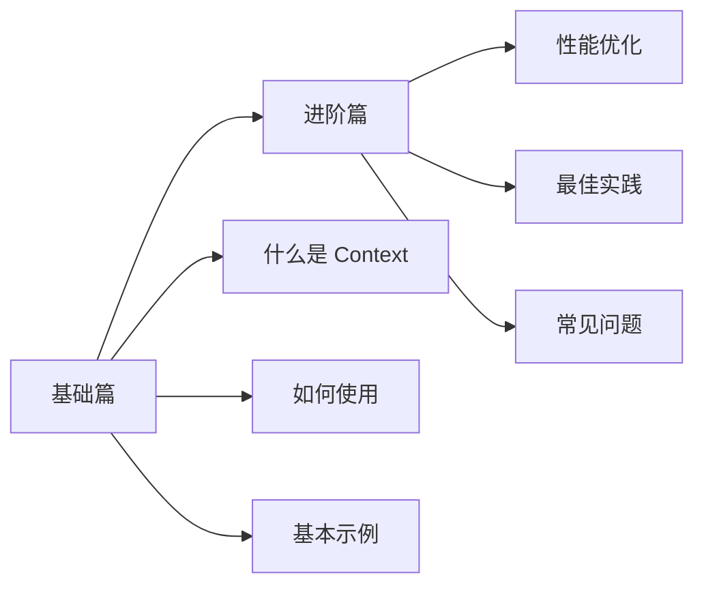

# Context API

## 快速了解

**Context API 是什么？**

Context 是 React 提供的一种跨层级传递数据的方式，让你不用通过 Props 层层传递，就能在组件树的任何地方访问共享数据。

**什么时候用 Context？**

- 需要在多个层级的组件间共享数据（如主题、用户信息、语言设置）
- 避免 Props 层层传递（Props Drilling）
- 数据不需要频繁更新（频繁更新建议用状态管理库）

**典型使用场景**

```
主题切换（亮色/暗色模式）
用户登录信息（用户名、头像、权限）
国际化语言设置（中文/英文）
全局配置（API 地址、应用设置）
```

## 学习路线



## 文档导航

### [1-基础篇](./1-基础篇.md)
- Context 是什么
- 什么时候用 Context
- 如何创建和使用 Context
- 完整示例：主题切换
- 常见问题

### [2-进阶篇](./2-进阶篇.md)
- 多个 Context 组合使用
- Context 性能优化
- Context vs Props vs 状态管理库
- 最佳实践
- 实战案例

## 核心要点

| 维度 | 说明 |
|-----|------|
| **核心概念** | 跨层级传递数据，避免 Props Drilling |
| **使用场景** | 主题、用户信息、语言等全局配置 |
| **注意事项** | Context 变化会导致所有消费组件重渲染 |
| **性能考虑** | 不适合频繁变化的数据，可拆分多个 Context |

## 与其他方案对比

| 方案 | 适用场景 | 优点 | 缺点 |
|-----|---------|------|------|
| **Props** | 父子组件通信 | 简单直接 | 层级深时麻烦 |
| **Context** | 跨层级共享配置 | 避免层层传递 | 所有消费者都会重渲染 |
| **Redux/Zustand** | 复杂状态管理 | 可预测、工具完善 | 引入额外依赖 |

## 快速开始

```typescript
// 1. 创建 Context
const ThemeContext = createContext<'light' | 'dark'>('light')

// 2. 提供数据
function App() {
  const [theme, setTheme] = useState<'light' | 'dark'>('light')
  return (
    <ThemeContext.Provider value={theme}>
      <Header />
      <Content />
    </ThemeContext.Provider>
  )
}

// 3. 消费数据
function Header() {
  const theme = useContext(ThemeContext)
  return <header className={theme}>...</header>
}
```

---

_建议先学习基础篇，掌握 Context 的基本使用，再学习进阶篇了解性能优化和最佳实践。_
