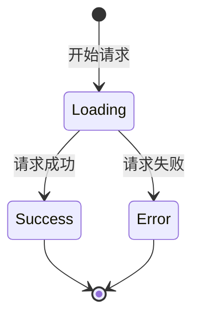

# 数据请求 - 基础篇

## 什么是数据请求？

### 定义

数据请求是指在 React 应用中通过 HTTP 协议从服务器获取数据或向服务器发送数据的过程。常见的操作包括获取列表、查询详情、提交表单等。

### 通俗理解

想象你在餐厅点餐：

- **GET 请求**：问服务员"今天有什么菜？"（获取数据）
- **POST 请求**：告诉服务员"我要一份宫保鸡丁"（提交数据）
- **PUT 请求**：告诉服务员"把我的菜改成麻婆豆腐"（更新数据）
- **DELETE 请求**：告诉服务员"取消我的订单"（删除数据）

数据请求就是你的应用和服务器之间的"对话"。

### 为什么需要数据请求？

```typescript
// ❌ 没有数据请求：数据写死在代码里
function UserList() {
  const users = [
    { id: 1, name: '张三' },
    { id: 2, name: '李四' }
  ]
  // 问题：数据无法更新，无法添加新用户
  return <ul>{users.map(u => <li key={u.id}>{u.name}</li>)}</ul>
}

// ✅ 使用数据请求：从服务器获取最新数据
function UserList() {
  const [users, setUsers] = useState([])

  useEffect(() => {
    fetch('/api/users')
      .then(res => res.json())
      .then(setUsers)
  }, [])

  // 数据来自服务器，可以实时更新
  return <ul>{users.map(u => <li key={u.id}>{u.name}</li>)}</ul>
}
```

## 使用 fetch 请求数据

### 基本用法

```typescript
// GET 请求
fetch('/api/users')
  .then(response => response.json())
  .then(data => console.log(data))
  .catch(error => console.error(error))
```

### 完整示例：用户列表

```typescript
import { useState, useEffect } from 'react'

interface User {
  id: string
  name: string
  email: string
}

function UserList() {
  const [users, setUsers] = useState<User[]>([])
  const [loading, setLoading] = useState(true)
  const [error, setError] = useState<Error | null>(null)

  useEffect(() => {
    // 1. 开始请求，设置 loading
    setLoading(true)

    // 2. 发送请求
    fetch('/api/users')
      .then(response => {
        // 检查响应状态
        if (!response.ok) {
          throw new Error('请求失败')
        }
        return response.json()
      })
      .then(data => {
        // 3. 请求成功，更新数据
        setUsers(data)
        setLoading(false)
      })
      .catch(error => {
        // 4. 请求失败，更新错误
        setError(error)
        setLoading(false)
      })
  }, [])  // 空数组表示只在组件挂载时请求一次

  // 5. 根据状态渲染不同内容
  if (loading) {
    return <div>加载中...</div>
  }

  if (error) {
    return <div>错误: {error.message}</div>
  }

  return (
    <ul>
      {users.map(user => (
        <li key={user.id}>
          <h3>{user.name}</h3>
          <p>{user.email}</p>
        </li>
      ))}
    </ul>
  )
}
```

### fetch 的各种请求方法

```typescript
// GET 请求（获取数据）
fetch('/api/users')
  .then(res => res.json())

// POST 请求（创建数据）
fetch('/api/users', {
  method: 'POST',
  headers: {
    'Content-Type': 'application/json'
  },
  body: JSON.stringify({
    name: '张三',
    email: 'zhangsan@example.com'
  })
})
  .then(res => res.json())

// PUT 请求（更新数据）
fetch('/api/users/123', {
  method: 'PUT',
  headers: {
    'Content-Type': 'application/json'
  },
  body: JSON.stringify({
    name: '李四'
  })
})
  .then(res => res.json())

// DELETE 请求（删除数据）
fetch('/api/users/123', {
  method: 'DELETE'
})
  .then(res => res.json())
```

## 使用 axios 请求数据

### 安装

```bash
npm install axios
```

### 基本用法

```typescript
import axios from 'axios'

// GET 请求
axios.get('/api/users')
  .then(response => console.log(response.data))
  .catch(error => console.error(error))
```

### 完整示例：用户列表

```typescript
import { useState, useEffect } from 'react'
import axios from 'axios'

interface User {
  id: string
  name: string
  email: string
}

function UserList() {
  const [users, setUsers] = useState<User[]>([])
  const [loading, setLoading] = useState(true)
  const [error, setError] = useState<Error | null>(null)

  useEffect(() => {
    setLoading(true)

    axios.get<User[]>('/api/users')
      .then(response => {
        setUsers(response.data)  // axios 自动解析 JSON
        setLoading(false)
      })
      .catch(error => {
        setError(error)
        setLoading(false)
      })
  }, [])

  if (loading) return <div>加载中...</div>
  if (error) return <div>错误: {error.message}</div>

  return (
    <ul>
      {users.map(user => (
        <li key={user.id}>{user.name}</li>
      ))}
    </ul>
  )
}
```

### axios 的各种请求方法

```typescript
// GET 请求
axios.get('/api/users')
  .then(res => console.log(res.data))

// POST 请求
axios.post('/api/users', {
  name: '张三',
  email: 'zhangsan@example.com'
})
  .then(res => console.log(res.data))

// PUT 请求
axios.put('/api/users/123', {
  name: '李四'
})
  .then(res => console.log(res.data))

// DELETE 请求
axios.delete('/api/users/123')
  .then(res => console.log(res.data))

// 带查询参数
axios.get('/api/users', {
  params: {
    page: 1,
    limit: 10
  }
})
// 实际请求: /api/users?page=1&limit=10
```

### fetch vs axios 对比

```typescript
// fetch：需要手动检查状态和解析 JSON
fetch('/api/users')
  .then(response => {
    if (!response.ok) {
      throw new Error('请求失败')
    }
    return response.json()  // 需要手动调用 .json()
  })
  .then(data => console.log(data))

// axios：自动检查状态和解析 JSON
axios.get('/api/users')
  .then(response => console.log(response.data))  // 自动解析
```

## 处理 loading 和 error 状态

### 三种状态

```typescript
const [data, setData] = useState(null)        // 数据
const [loading, setLoading] = useState(true)  // 加载中
const [error, setError] = useState(null)      // 错误
```

### 状态流转图



### 完整的状态处理

```typescript
function UserList() {
  const [users, setUsers] = useState<User[]>([])
  const [loading, setLoading] = useState(true)
  const [error, setError] = useState<Error | null>(null)

  useEffect(() => {
    const fetchUsers = async () => {
      try {
        setLoading(true)
        setError(null)  // 清除之前的错误

        const response = await fetch('/api/users')
        if (!response.ok) {
          throw new Error(`HTTP error! status: ${response.status}`)
        }

        const data = await response.json()
        setUsers(data)
      } catch (err) {
        setError(err as Error)
      } finally {
        setLoading(false)  // 无论成功失败都要关闭 loading
      }
    }

    fetchUsers()
  }, [])

  // 渲染 loading 状态
  if (loading) {
    return (
      <div className="loading">
        <div className="spinner"></div>
        <p>加载中...</p>
      </div>
    )
  }

  // 渲染 error 状态
  if (error) {
    return (
      <div className="error">
        <h3>出错了</h3>
        <p>{error.message}</p>
        <button onClick={() => window.location.reload()}>
          重试
        </button>
      </div>
    )
  }

  // 渲染数据
  return (
    <ul>
      {users.map(user => (
        <li key={user.id}>{user.name}</li>
      ))}
    </ul>
  )
}
```

### 优化：创建自定义 Hook

```typescript
// hooks/useFetch.ts
function useFetch<T>(url: string) {
  const [data, setData] = useState<T | null>(null)
  const [loading, setLoading] = useState(true)
  const [error, setError] = useState<Error | null>(null)

  useEffect(() => {
    const fetchData = async () => {
      try {
        setLoading(true)
        setError(null)

        const response = await fetch(url)
        if (!response.ok) {
          throw new Error('请求失败')
        }

        const result = await response.json()
        setData(result)
      } catch (err) {
        setError(err as Error)
      } finally {
        setLoading(false)
      }
    }

    fetchData()
  }, [url])

  return { data, loading, error }
}

// 使用
function UserList() {
  const { data: users, loading, error } = useFetch<User[]>('/api/users')

  if (loading) return <div>加载中...</div>
  if (error) return <div>错误: {error.message}</div>

  return (
    <ul>
      {users?.map(user => (
        <li key={user.id}>{user.name}</li>
      ))}
    </ul>
  )
}
```

## 在 useEffect 中请求数据

### 基本模式

```typescript
useEffect(() => {
  // 请求数据
  fetchData()
}, [])  // 依赖数组
```

### 依赖数组的作用

```typescript
// 1. 空数组：只在组件挂载时请求一次
useEffect(() => {
  fetchUsers()
}, [])

// 2. 有依赖：依赖变化时重新请求
useEffect(() => {
  fetchUser(userId)
}, [userId])  // userId 变化时重新请求

// 3. 无依赖数组：每次渲染都请求（不推荐）
useEffect(() => {
  fetchUsers()
})  // 会导致无限循环
```

### 取消请求（避免内存泄漏）

**问题**：组件卸载后，请求还在进行，导致内存泄漏

```typescript
// ❌ 问题：组件卸载后仍然更新状态
useEffect(() => {
  fetch('/api/users')
    .then(res => res.json())
    .then(data => setUsers(data))  // 组件已卸载，报错
}, [])
```

**解决方案**：使用 AbortController 取消请求

```typescript
// ✅ 好：组件卸载时取消请求
useEffect(() => {
  const controller = new AbortController()

  fetch('/api/users', { signal: controller.signal })
    .then(res => res.json())
    .then(data => setUsers(data))
    .catch(error => {
      if (error.name === 'AbortError') {
        console.log('请求已取消')
      } else {
        setError(error)
      }
    })

  // 清理函数：组件卸载时取消请求
  return () => {
    controller.abort()
  }
}, [])
```

### 使用 async/await

```typescript
useEffect(() => {
  // 不能直接在 useEffect 中使用 async
  // ❌ useEffect(async () => { ... }, [])

  // ✅ 正确：在内部定义 async 函数
  const fetchUsers = async () => {
    try {
      const response = await fetch('/api/users')
      const data = await response.json()
      setUsers(data)
    } catch (error) {
      setError(error)
    }
  }

  fetchUsers()
}, [])
```

## 完整示例：博客文章列表

### 需求

- 显示文章列表
- 支持搜索功能
- 显示 loading 和 error 状态
- 点击文章查看详情

### 代码实现

```typescript
import { useState, useEffect } from 'react'
import axios from 'axios'

// 1. 定义类型
interface Post {
  id: string
  title: string
  content: string
  author: string
  createdAt: string
}

// 2. 文章列表组件
function PostList() {
  const [posts, setPosts] = useState<Post[]>([])
  const [loading, setLoading] = useState(true)
  const [error, setError] = useState<Error | null>(null)
  const [searchKeyword, setSearchKeyword] = useState('')

  // 3. 请求文章列表
  useEffect(() => {
    const fetchPosts = async () => {
      try {
        setLoading(true)
        setError(null)

        const response = await axios.get<Post[]>('/api/posts', {
          params: {
            keyword: searchKeyword || undefined  // 搜索关键词
          }
        })

        setPosts(response.data)
      } catch (err) {
        setError(err as Error)
      } finally {
        setLoading(false)
      }
    }

    fetchPosts()
  }, [searchKeyword])  // 搜索关键词变化时重新请求

  // 4. 渲染
  return (
    <div className="post-list">
      {/* 搜索框 */}
      <div className="search">
        <input
          type="text"
          placeholder="搜索文章..."
          value={searchKeyword}
          onChange={e => setSearchKeyword(e.target.value)}
        />
      </div>

      {/* Loading 状态 */}
      {loading && (
        <div className="loading">
          <div className="spinner"></div>
          <p>加载中...</p>
        </div>
      )}

      {/* Error 状态 */}
      {error && (
        <div className="error">
          <h3>加载失败</h3>
          <p>{error.message}</p>
          <button onClick={() => setSearchKeyword('')}>
            重试
          </button>
        </div>
      )}

      {/* 文章列表 */}
      {!loading && !error && (
        <div className="posts">
          {posts.length === 0 ? (
            <p>没有找到文章</p>
          ) : (
            posts.map(post => (
              <PostCard key={post.id} post={post} />
            ))
          )}
        </div>
      )}
    </div>
  )
}

// 5. 文章卡片组件
function PostCard({ post }: { post: Post }) {
  return (
    <div className="post-card">
      <h3>{post.title}</h3>
      <p className="author">作者: {post.author}</p>
      <p className="date">{new Date(post.createdAt).toLocaleDateString()}</p>
      <p className="content">{post.content.slice(0, 100)}...</p>
      <button>查看详情</button>
    </div>
  )
}
```

## 完整示例：创建文章

### 需求

- 表单输入标题和内容
- 提交时显示 loading
- 提交成功后跳转到文章列表
- 提交失败显示错误

### 代码实现

```typescript
import { useState } from 'react'
import { useNavigate } from 'react-router-dom'
import axios from 'axios'

interface PostFormData {
  title: string
  content: string
}

function CreatePost() {
  const navigate = useNavigate()
  const [formData, setFormData] = useState<PostFormData>({
    title: '',
    content: ''
  })
  const [loading, setLoading] = useState(false)
  const [error, setError] = useState<string | null>(null)

  const handleSubmit = async (e: React.FormEvent) => {
    e.preventDefault()

    // 验证
    if (!formData.title || !formData.content) {
      setError('标题和内容不能为空')
      return
    }

    try {
      setLoading(true)
      setError(null)

      // 发送 POST 请求
      await axios.post('/api/posts', formData)

      // 成功：跳转到文章列表
      navigate('/posts')
    } catch (err) {
      setError('发布失败，请重试')
    } finally {
      setLoading(false)
    }
  }

  return (
    <div className="create-post">
      <h1>发布文章</h1>

      <form onSubmit={handleSubmit}>
        {/* 标题 */}
        <div className="form-group">
          <label>标题</label>
          <input
            type="text"
            value={formData.title}
            onChange={e => setFormData({ ...formData, title: e.target.value })}
            disabled={loading}
          />
        </div>

        {/* 内容 */}
        <div className="form-group">
          <label>内容</label>
          <textarea
            value={formData.content}
            onChange={e => setFormData({ ...formData, content: e.target.value })}
            disabled={loading}
            rows={10}
          />
        </div>

        {/* 错误提示 */}
        {error && (
          <div className="error-message">
            {error}
          </div>
        )}

        {/* 提交按钮 */}
        <div className="form-actions">
          <button type="submit" disabled={loading}>
            {loading ? '发布中...' : '发布'}
          </button>
          <button
            type="button"
            onClick={() => navigate('/posts')}
            disabled={loading}
          >
            取消
          </button>
        </div>
      </form>
    </div>
  )
}
```

## 常见问题

### 1. 为什么不能在 useEffect 中直接使用 async？

**问题**：

```typescript
// ❌ 错误：useEffect 不能返回 Promise
useEffect(async () => {
  const data = await fetchData()
  setData(data)
}, [])
```

**原因**：useEffect 的清理函数必须是同步的，不能返回 Promise

**解决方案**：

```typescript
// ✅ 正确：在内部定义 async 函数
useEffect(() => {
  const fetchData = async () => {
    const data = await fetch('/api/data')
    setData(data)
  }

  fetchData()
}, [])
```

### 2. 如何避免组件卸载后更新状态？

**问题**：组件卸载后，请求完成并尝试更新状态，导致内存泄漏警告

**解决方案 1**：使用 AbortController 取消请求

```typescript
useEffect(() => {
  const controller = new AbortController()

  fetch('/api/data', { signal: controller.signal })
    .then(res => res.json())
    .then(setData)
    .catch(err => {
      if (err.name !== 'AbortError') {
        setError(err)
      }
    })

  return () => controller.abort()
}, [])
```

**解决方案 2**：使用标志位

```typescript
useEffect(() => {
  let isMounted = true

  fetch('/api/data')
    .then(res => res.json())
    .then(data => {
      if (isMounted) {  // 只有组件还在时才更新
        setData(data)
      }
    })

  return () => {
    isMounted = false
  }
}, [])
```

### 3. 如何处理请求竞态问题？

**问题**：快速切换 userId，先发出的请求后返回，导致显示错误的数据

```typescript
// ❌ 问题：请求 1 后返回，覆盖了请求 2 的结果
useEffect(() => {
  fetchUser(userId).then(setUser)
}, [userId])

// 用户快速点击：userId 1 → 2
// 请求顺序：请求 1 → 请求 2
// 返回顺序：请求 2 → 请求 1（慢）
// 结果：显示的是用户 1，但 userId 是 2
```

**解决方案**：使用 AbortController 或标志位

```typescript
// ✅ 好：取消之前的请求
useEffect(() => {
  const controller = new AbortController()

  fetch(`/api/users/${userId}`, { signal: controller.signal })
    .then(res => res.json())
    .then(setUser)
    .catch(err => {
      if (err.name !== 'AbortError') {
        setError(err)
      }
    })

  return () => controller.abort()  // userId 变化时取消之前的请求
}, [userId])
```

### 4. 如何统一处理错误？

**方案 1**：创建 axios 拦截器

```typescript
// api/axios.ts
import axios from 'axios'

const api = axios.create({
  baseURL: '/api'
})

// 响应拦截器
api.interceptors.response.use(
  response => response,
  error => {
    // 统一错误处理
    if (error.response?.status === 401) {
      // 未登录，跳转到登录页
      window.location.href = '/login'
    } else if (error.response?.status === 500) {
      alert('服务器错误')
    }
    return Promise.reject(error)
  }
)

export default api

// 使用
import api from './api/axios'

api.get('/users').then(res => console.log(res.data))
```

### 5. 如何添加 loading 延迟？

**问题**：请求很快完成时，loading 闪烁，体验不好

**解决方案**：添加最小 loading 时间

```typescript
useEffect(() => {
  const fetchData = async () => {
    setLoading(true)

    const [data] = await Promise.all([
      fetch('/api/data').then(res => res.json()),
      new Promise(resolve => setTimeout(resolve, 500))  // 最少显示 500ms
    ])

    setData(data)
    setLoading(false)
  }

  fetchData()
}, [])
```

## 实用检验

### 问题 1：如何使用 fetch 请求数据？

<details>
<summary>点击查看答案</summary>

**步骤**：

1. 在 useEffect 中发送请求
2. 处理 loading、error、data 三种状态
3. 根据状态渲染不同内容

```typescript
function UserList() {
  const [users, setUsers] = useState([])
  const [loading, setLoading] = useState(true)
  const [error, setError] = useState(null)

  useEffect(() => {
    fetch('/api/users')
      .then(res => {
        if (!res.ok) throw new Error('请求失败')
        return res.json()
      })
      .then(data => {
        setUsers(data)
        setLoading(false)
      })
      .catch(err => {
        setError(err)
        setLoading(false)
      })
  }, [])

  if (loading) return <div>加载中...</div>
  if (error) return <div>错误: {error.message}</div>
  return <ul>{users.map(u => <li key={u.id}>{u.name}</li>)}</ul>
}
```

</details>

### 问题 2：fetch 和 axios 有什么区别？

<details>
<summary>点击查看答案</summary>

**主要区别**：

1. **自动解析 JSON**：
   - fetch 需要手动调用 `.json()`
   - axios 自动解析，直接用 `response.data`

2. **错误处理**：
   - fetch 只有网络错误才 reject，HTTP 错误（如 404）不会
   - axios HTTP 错误也会 reject

3. **请求取消**：
   - fetch 用 AbortController
   - axios 用 CancelToken

**建议**：简单项目用 fetch，复杂项目用 axios

</details>

### 问题 3：如何处理 loading 和 error 状态？

<details>
<summary>点击查看答案</summary>

**三种状态**：

```typescript
const [data, setData] = useState(null)        // 数据
const [loading, setLoading] = useState(true)  // 加载中
const [error, setError] = useState(null)      // 错误
```

**处理流程**：

1. 开始请求：`setLoading(true)`
2. 请求成功：`setData(data)`, `setLoading(false)`
3. 请求失败：`setError(error)`, `setLoading(false)`

**渲染**：

```typescript
if (loading) return <div>加载中...</div>
if (error) return <div>错误: {error.message}</div>
return <div>{/* 渲染数据 */}</div>
```

</details>

### 问题 4：为什么不能在 useEffect 中直接使用 async？

<details>
<summary>点击查看答案</summary>

**原因**：useEffect 的清理函数必须是同步的，不能返回 Promise

```typescript
// ❌ 错误
useEffect(async () => {
  const data = await fetchData()
  setData(data)
}, [])

// ✅ 正确：在内部定义 async 函数
useEffect(() => {
  const fetchData = async () => {
    const data = await fetch('/api/data')
    setData(data)
  }

  fetchData()
}, [])
```

</details>

### 问题 5：如何避免组件卸载后更新状态？

<details>
<summary>点击查看答案</summary>

**问题**：组件卸载后，请求完成并尝试更新状态，导致内存泄漏

**解决方案**：使用 AbortController 取消请求

```typescript
useEffect(() => {
  const controller = new AbortController()

  fetch('/api/data', { signal: controller.signal })
    .then(res => res.json())
    .then(setData)
    .catch(err => {
      if (err.name !== 'AbortError') {
        setError(err)
      }
    })

  // 组件卸载时取消请求
  return () => controller.abort()
}, [])
```

</details>

---

## 下一步

学完基础篇后，你已经掌握了基本的数据请求方式。接下来可以：

1. **学习 [2-进阶篇](./2-进阶篇.md)**：了解 React Query、缓存策略、乐观更新
2. **学习 [性能优化](../Performance/README.md)**：优化数据请求性能
3. **学习 [状态管理](../StateManagement/README.md)**：管理复杂的数据状态

---

_本文档持续更新，欢迎反馈和建议。_
